# Create the application

## Introduction

In this lab, you build an application based on the data structures you built in previous labs.

Estimated Time: 15 minutes

<!--
Watch the video below for a quick walk through of the lab.

-->

Watch the video below for a quick walk-through of the lab.
[Create the Application](videohub:1_4qg90epw)

### Objectives
In this lab, you will:
- Create an application using the tables and data that you already have installed.

## Task 1: Create an Application

1. In the App Builder menu, click **App Builder** and then, click **Create**.

    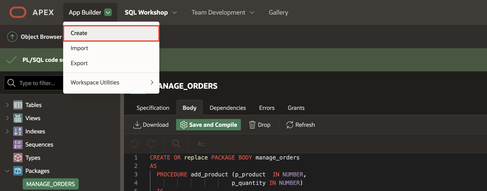

2.  Click **New Application**.

    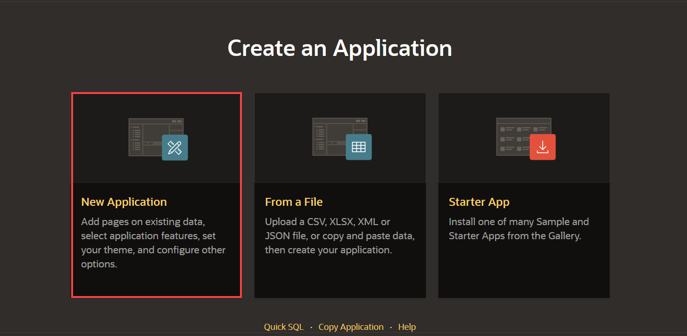

## Task 2: Add a Name and Icon to the Application

1. In the Create Application wizard, for Name, enter **ACME Shop** and click the application icon.

    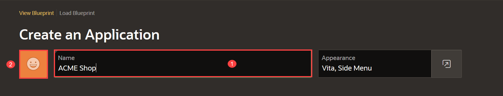

2. Click **Upload your own icon** to select an icon or simply drag and drop the image. Download a sample icon [here](./images/shopping-cart.png).

    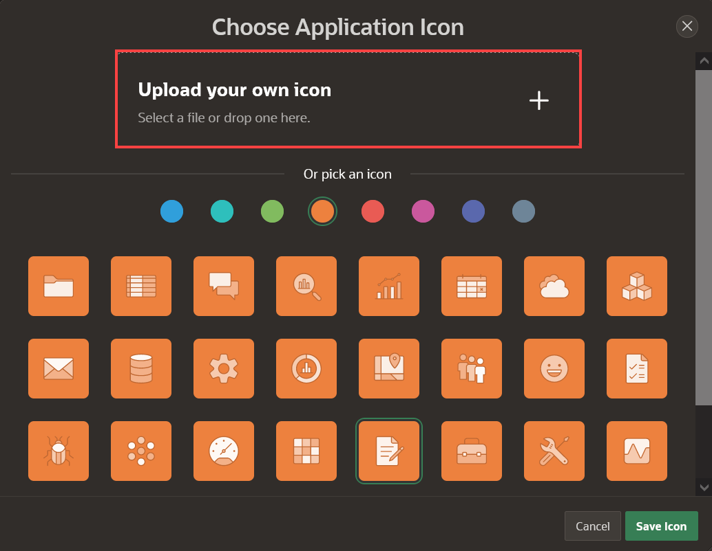

3. Adjust the icon if needed and click **Save Icon**.

    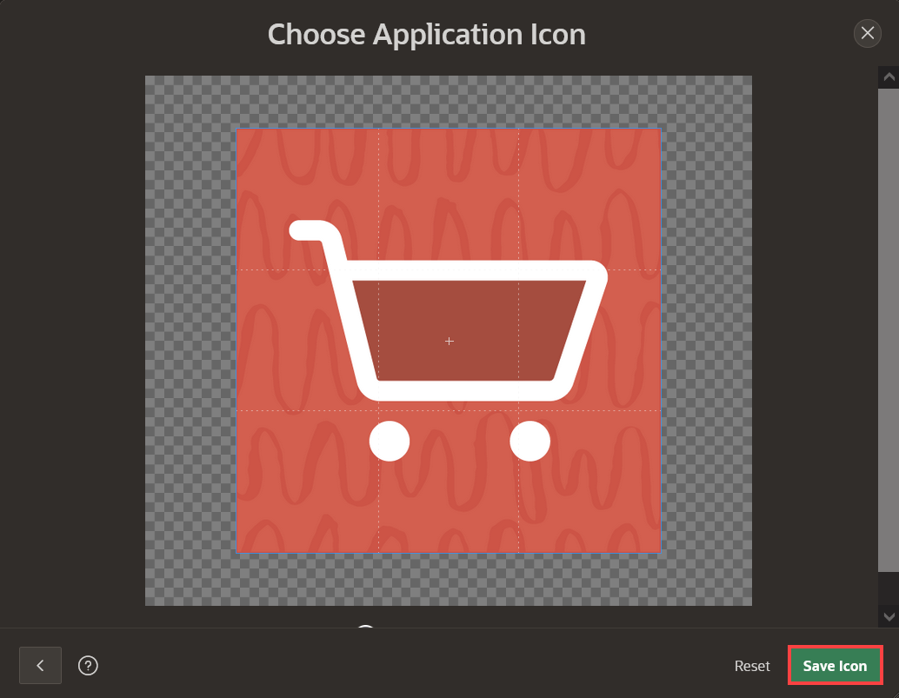

## Task 3: Add the Dashboard Page

A dashboard page is a great way to show important information using various charts. When you installed the Sample Dataset, it also created a number of views, which join data from various tables. These views are ideal as the basis for the dashboard charts.

1. In the Create Application wizard, click **Add Page**.

2. Click **Dashboard**.

    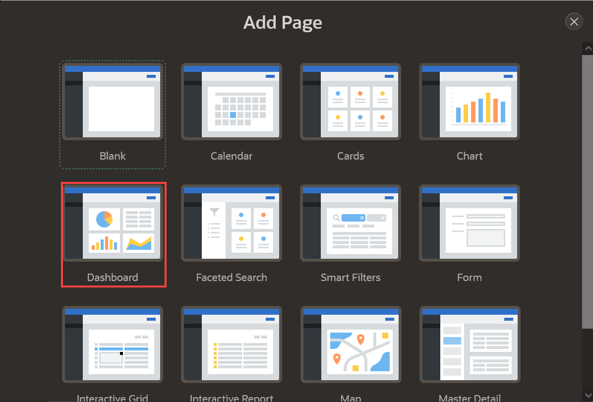

3. For Chart 1, enter the following:

    * Chart Type – select **Bar**
    * Chart Name – enter **Top 10 Products**
    * Table or View – select **PRODUCT_ORDERS**
    * Label Column – select **PRODUCT_NAME**
    * Type – select **Sum**
    * Value Column – select **TOTAL_SALES**.

    

4. Click Chart 2, and enter the following:

    * Chart Type – select **Pie**
    * Chart Name – enter **Top 5 Stores**
    * Table or View – select **STORE_ORDERS**
    * Label Column – select **STORE_NAME**
    * Type – select **Sum**
    * Value Column – select **TOTAL_SALES**.

    

5. Click Chart 3, and enter the following:

    * Chart Type – select **Pie**
    * Chart Name – enter **Order Status**
    * Table or View – select **CUSTOMER\_ORDER\_PRODUCTS**
    * Label Column – select **ORDER_STATUS**
    * Type – select **Count**
    * Value Column – select **ORDER_ID**.

        

6. Click Chart 4, and enter the following:

    * Chart Type – select **Bar**
    * Chart Name – enter **Product Reviews**
    * Table or View – select **PRODUCT_REVIEWS**
    * Label Column – select **PRODUCT_NAME**
    * Type – select **Column Value**
    * Value Column – select **AVG_RATING**.

      

7. Click Advanced and check **Set as Administration Page**.

    Setting a page as Administration Page will make that only certain users can run the page. In this case, only users with Administration Rights will be able to run the Dashboard page, which means that this page will require authentication.

    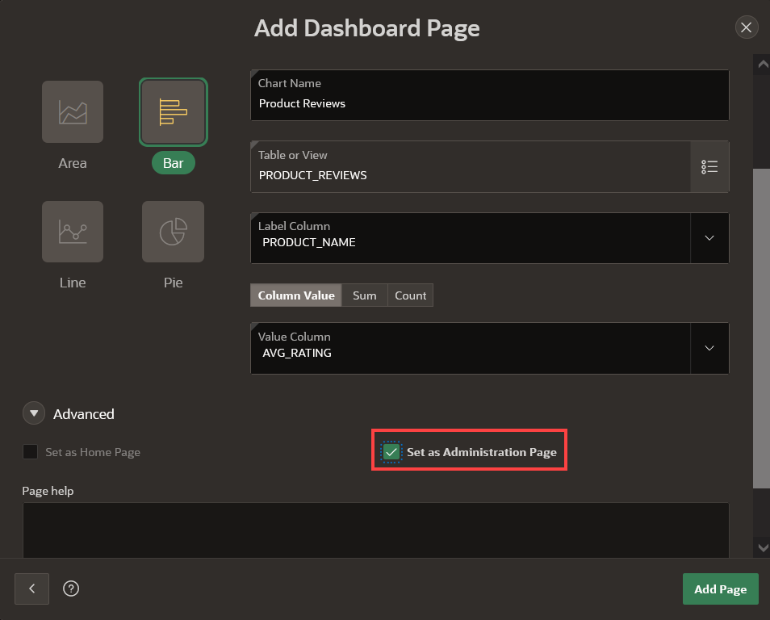

8. Click **Add Page**.

## Task 4: Add the Products Page

1. In the Create Application wizard, click **Add Page**.
2. Click **Faceted Search**.

    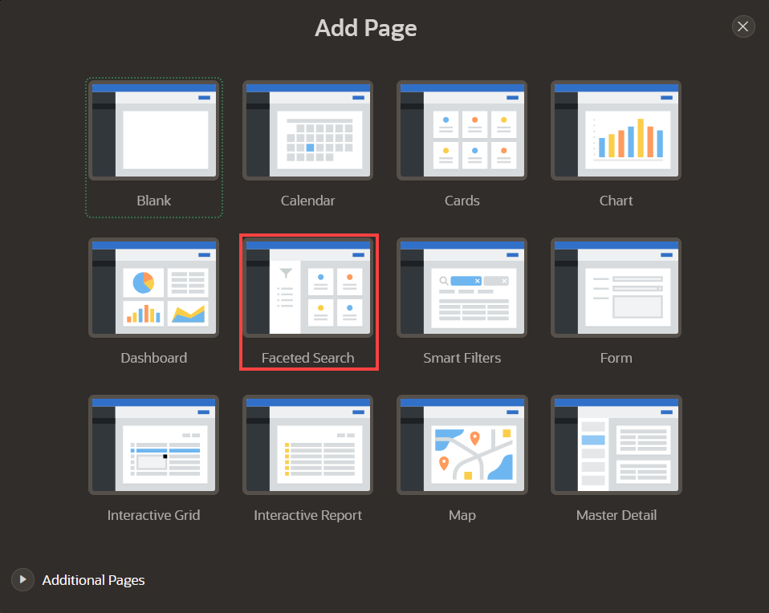

3. On the Faceted Search Page, enter the following:
    - Page Name - enter **Products**
    - Select **Cards**
    - Table - select **PRODUCTS**
    - Select **Grid**
    - Title Column - select **PRODUCT_NAME**
    - Body Column - select **- Select Column -** (to unselect the default column chosen)

    Expand Advanced Section and check **Set as Home Page**

    Click **Add Page**.

    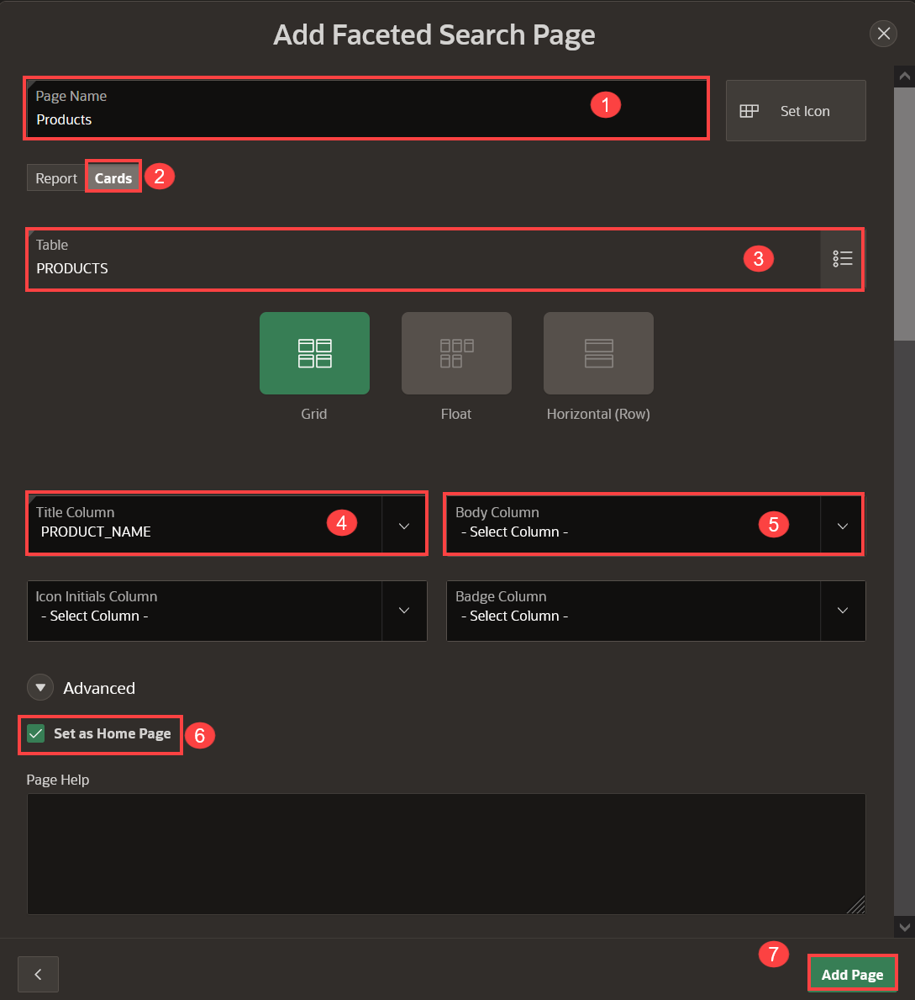  

## Task 5: Delete Original Home Page

Since we designated the product faceted search page as the application's home page, we no longer need the default home page that the wizard included in the list of pages. Therefore, in this task, we will remove the original home page.

1. Navigate to the original page named "Home" and click **Edit**.

      

2. Click **Delete**.    

    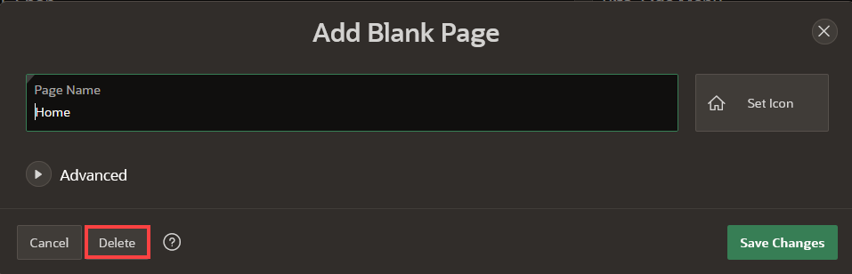  

3. Confirm the deletion by clicking **OK** on the dialog.

## Task 6: Add Multiple Reports

1. In the Create Application wizard, click **Add Page**.
2. Click the arrow to the left of **Additional Pages** to see additional page types.
3. Click **Multiple Reports**.

    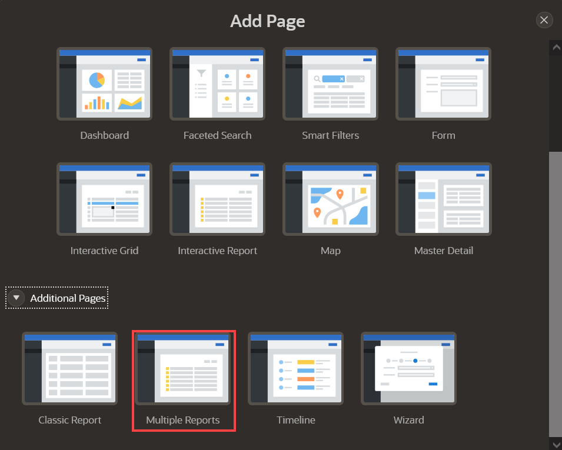

3. On the Create Multiple Reports Page, select the following tables:
    - CLOTHING_LOOKUP
    - COLOR_LOOKUP
    - CUSTOMERS
    - DEPARTMENT_LOOKUP
    - PRODUCT_REVIEWS
    - STORES

4. Click **Add Pages**.

    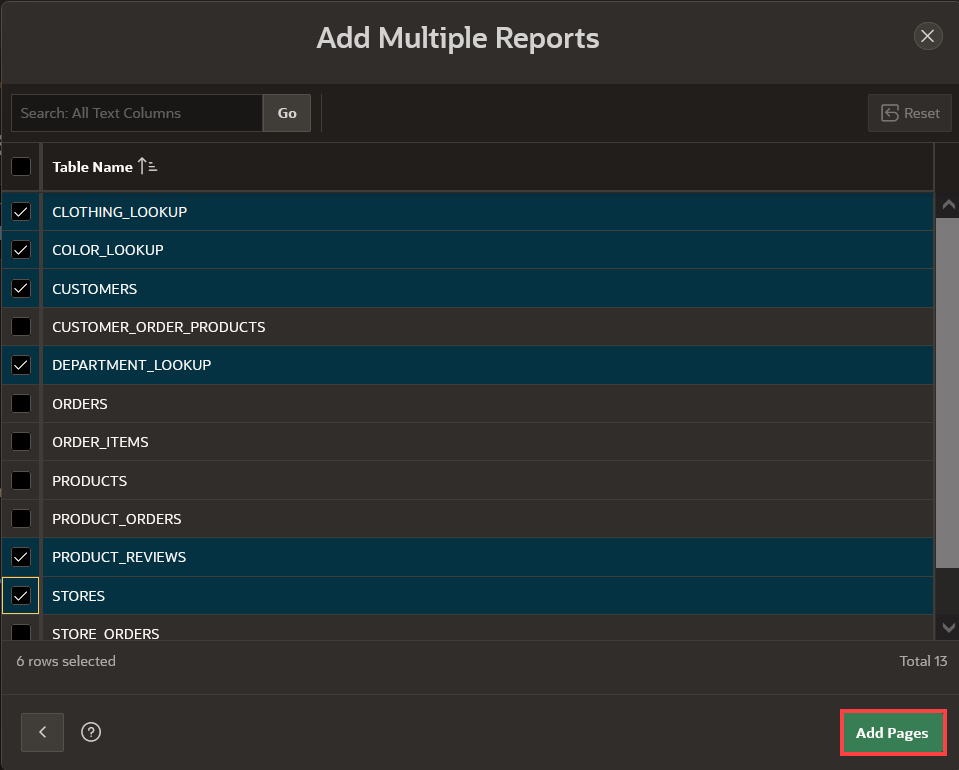

## Task 7: Set Multiple Reports as Administration Pages

1. Edit each of the following pages to set it as an Administration Page:
    - CLOTHING_LOOKUP
    - COLOR_LOOKUP
    - CUSTOMERS
    - DEPARTMENT_LOOKUP
    - PRODUCT_REVIEWS
    - STORES  

    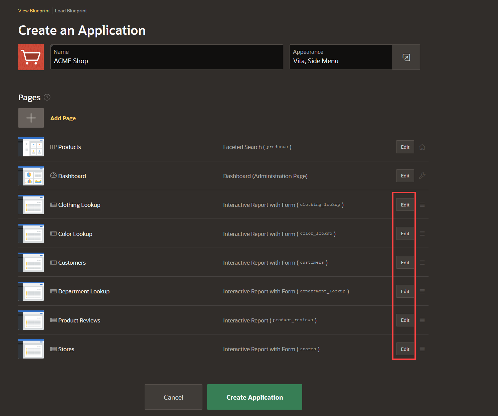

2. For each page you edit, click **Advanced** and check **Set as Administration Page**.
3. Click **Save Changes**.

    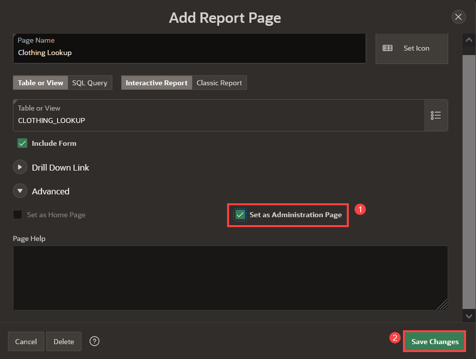

## Task 8: Add Manage Products Page

1. In the Create Application wizard, click **Add Page**.
2. Click **Interactive Report**.

    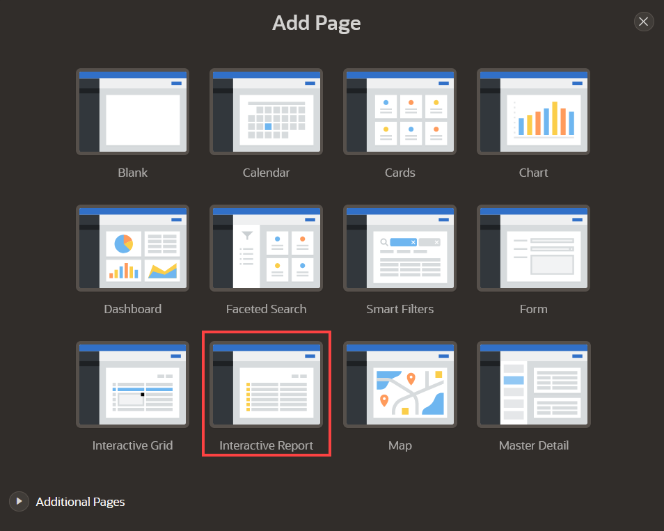

3. On the Report Page, enter the following:
    - Page Name - enter **Manage Products**
    - Table - select **PRODUCTS**
    - Check **Include Form**

4. Click **Advanced** and check **Set as Administration Page**.

5. Click **Add Page**.

    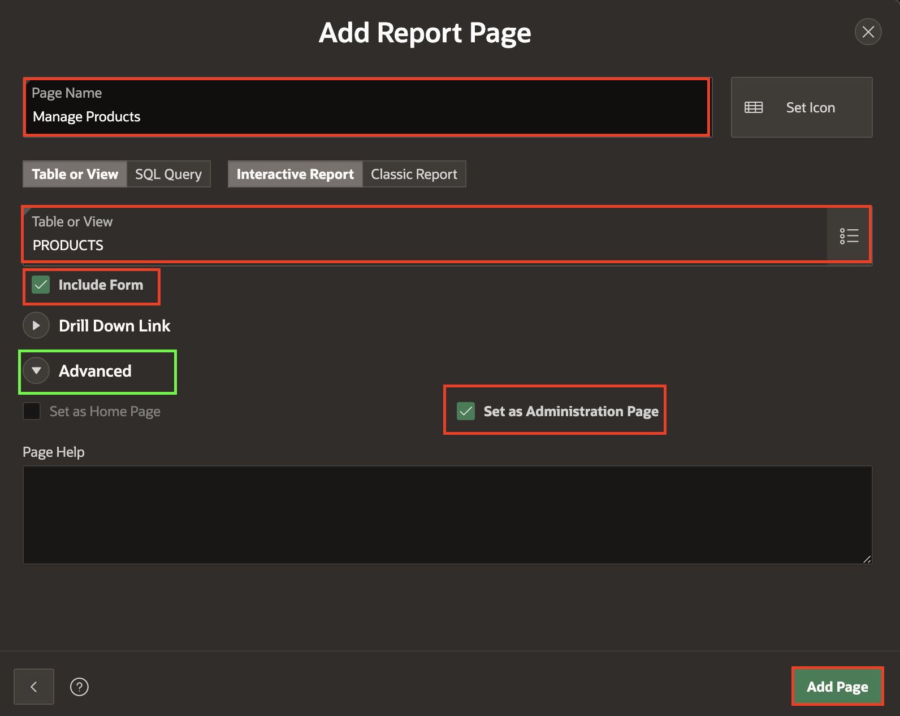

## Task 9: Set Features

Features are a set of optional application capabilities Oracle APEX can include for your new application. Access Control enables role-based user authorization with a single click.

1. Under **Features** section, check **Access Control**.

    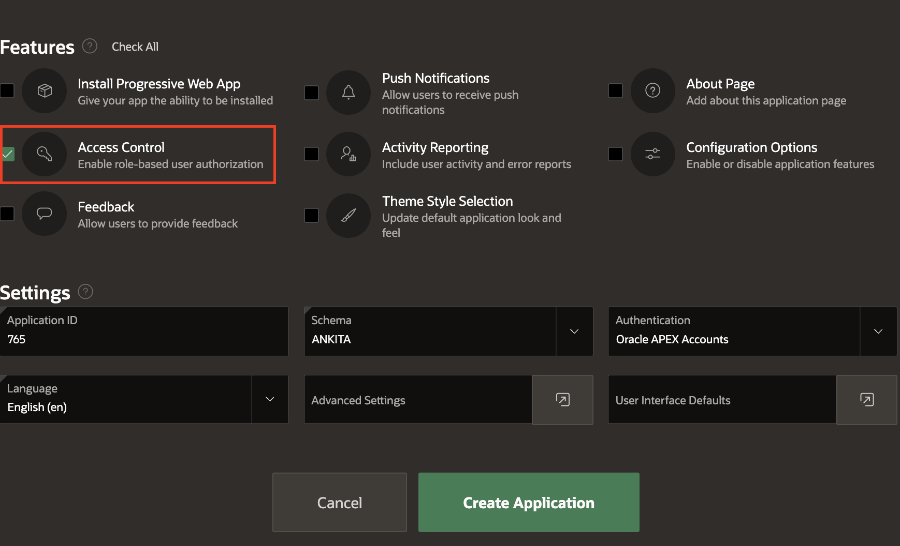

## Task 10: Finish Creating the Application

Now that you have added all the pages, it is time to generate the app and review it.

1. Scroll to the bottom of the page, and click **Create Application**.

    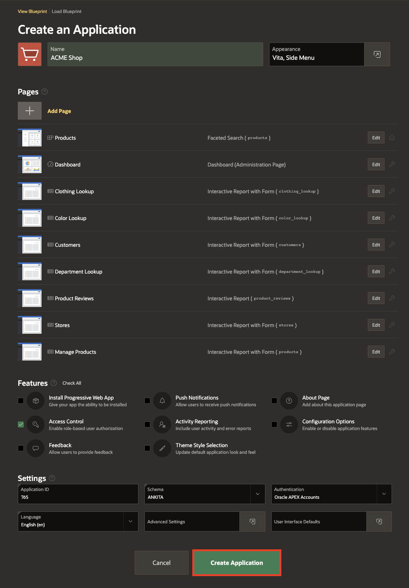

2. Once the application is created, you will find the new app on the application home page.
Click **Run Application**.

    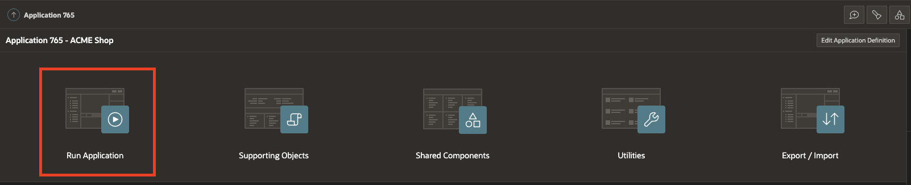

## Task 11: Run the Application

1. Enter your user credentials. Click **Sign In**.

    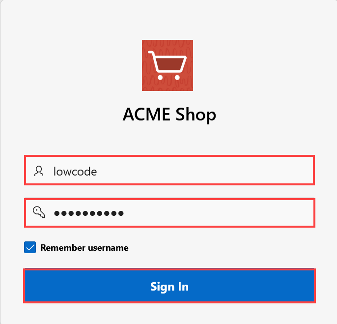

2. The new application will be displayed. Explore the pages that you just created by clicking on the navigation menu.

    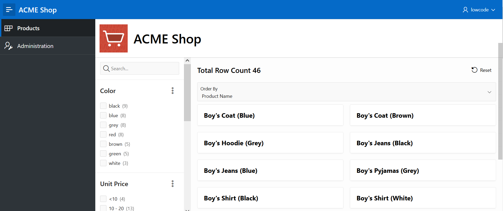

You now know how to create an application with a number of different page types based on existing database objects. You may now **proceed to the next lab**.

## Acknowledgments

- **Author** - Apoorva Srinivas, Senior Product Manager; Mónica Godoy, Principal Product Manager;
- **Last Updated By/Date** - Ankita Beri, Product Manager, May 2023
