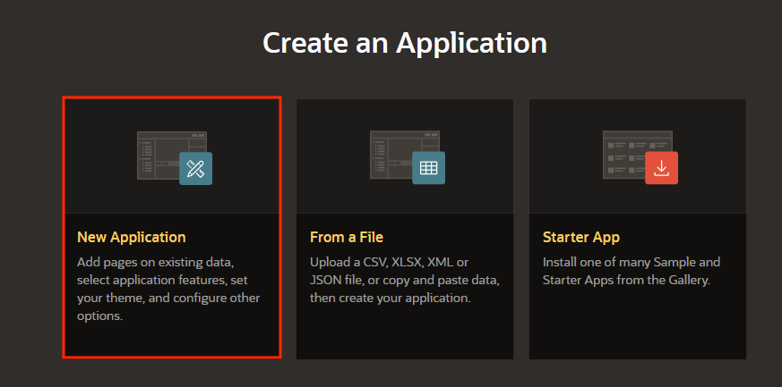
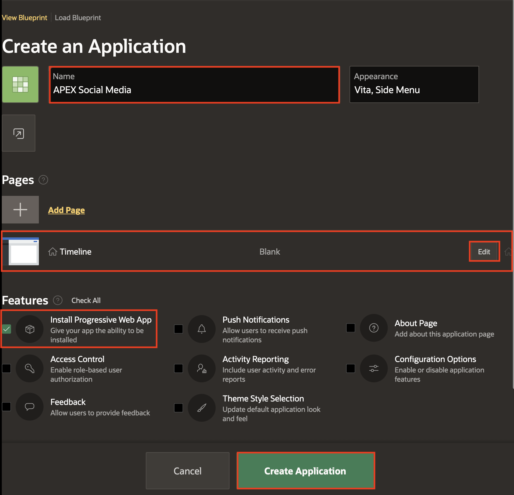
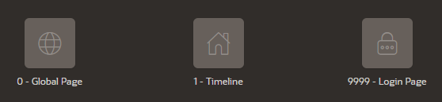
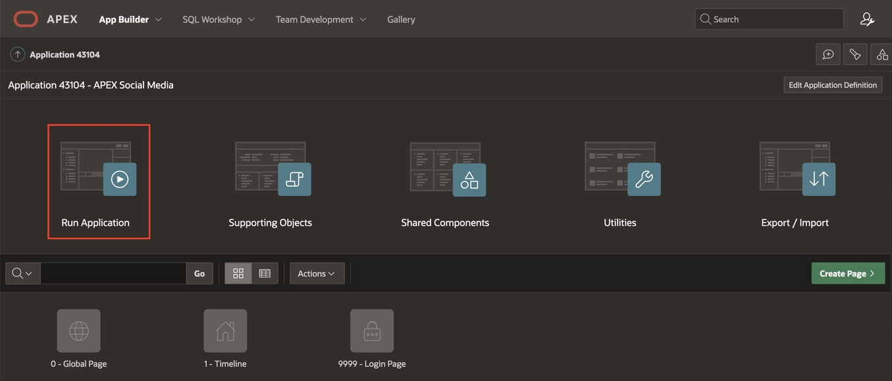
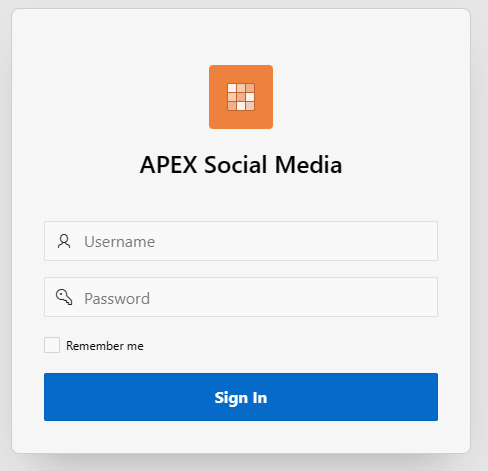
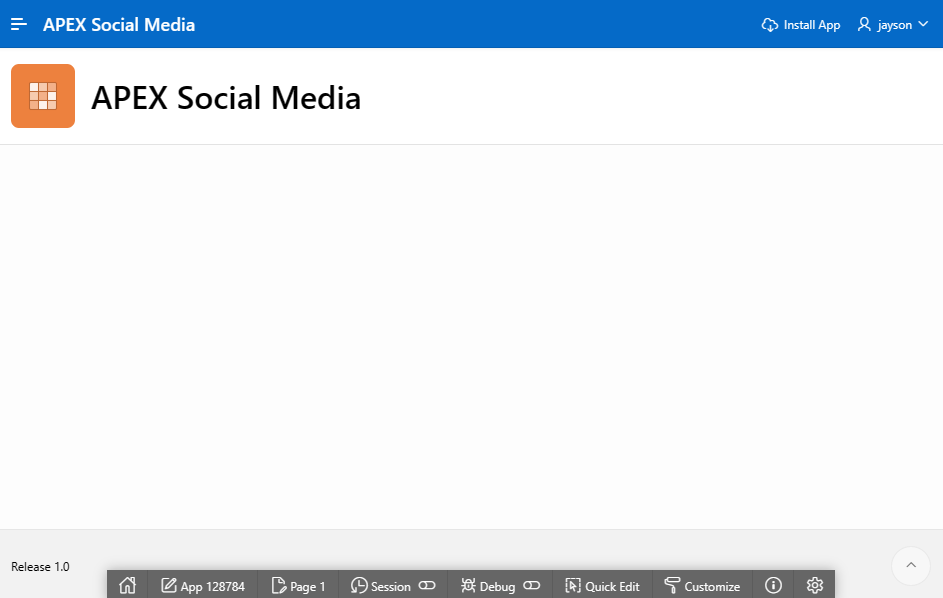
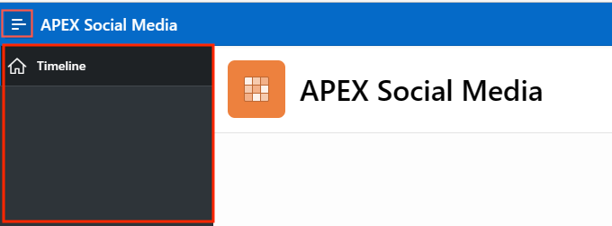

# Create an APEX Application

## Introduction
In this lab, you learn to create a blank APEX application that will be used to build the Social Media App.

In this lab, you build a simple application for the Social Media App. It is important to note that APEX is great for a variety of apps, from simple ones like the Social Media App we are building to large, sophisticated apps based on local database objects, REST enabled SQL objects, and even REST APIs.

While APEX developers spend the majority of their time in the **App Builder**, you should also investigate the following:
- **SQL Workshop**: where you can create and maintain database objects.
- **Team Development**: where you can track large APEX development projects.
- **Gallery**: which contains numerous productivity and sample apps that can be installed within minutes.

**Note:** The screenshots in this workshop are taken using Dark Mode in APEX 23.1.

Estimated Time: 5 minutes

Watch the video below for a quick walk-through of the lab.
[Create an APEX App](videohub:1_a6bi2e62)

### Objectives

In this lab, you will:
- Create a new APEX application
- Run your application

### Prerequisites

- An Oracle APEX workspace

## Task 1: Create the APEX app

1. From your APEX workspace homepage, click **Create Application**.

2. Select **New Application**

    

3. You are now viewing the **Create An Application** Page, with View
Blueprint tab selected. Update the following information:

    - Name: **APEX Social Media**

    - In the *Pages* section:
        - Click **Edit** next to Home page
        - Update the Home Page Name: **Timeline**

    - In *Features* section, check the **Install Progressive Web App** option.

    

Click **Create Application**.

4. We now have three pages in our APEX application. 
    - The Global page (which we will not be using in this lab), 
    - The Timeline page (which is the primary page we will be working on in this lab), 
    - The Login Page, which is the default page configured to use your workspace account credentials.

    

## Task 2: Run the App and Sign-in

1. Run the application.

    

2. To sign in to the application, use your workspace username and password.

    

3. Now you see the very beginning of your app.

    

## Task 3: Observe the App

1. We currently have the side navigation enabled in our app. To open the navigation menu, click on the hamburger menu at the top left of the screen. We will be customizing the page to our purpose.

   

Next, we will go back to the APEX Workspace and create the APEX social Media data model.

You may now **proceed to the next lab**

## Acknowledgements
 - **Author** - Jayson Hanes, Principal Product Manager; Apoorva Srinivas, Senior Product Manager;
 - **Contributor(s)** - Ankita Beri, Product Manager, May 2023
 - **Last Updated By/Date** - Apoorva Srinivas, Senior Product Manager, June 2023
