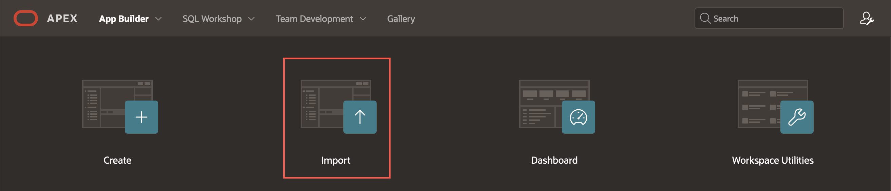
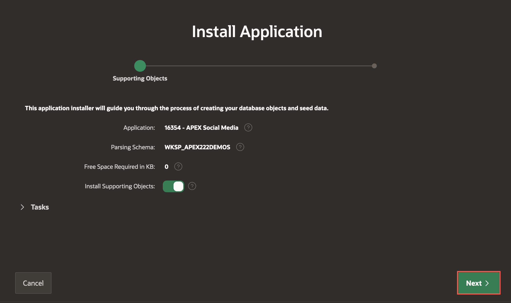

# Customize the App Homepage

## Introduction
In this lab, you take advantage of the low code development by customizing the Social Media App declaratively. You  learn to navigate and modify the application and page properties.

Estimated Time: 5 minutes

Watch the video below for a quick walk-through of the lab.
[Create an APEX App](videohub:1_bgxyfanv)

### Objectives

In this lab, you will:
- Customize the Application Homepage
- Learn to remove the Navigation Menu and Breadcrumb Region

### Prerequisites

- Completion of workshop through Lab 3

## Task 1: Remove the Navigation Menu

1. As a first step, we want to remove the Navigation menu from the page. To do this, select **Page 1: Timeline** in the Rendering Tree. 

    

2. In the Property Editor:
    - Go to the **Navigation Menu** section
    - Toggle **Override User Interface Level**: ON
    - List: **Do not show the Navigation Menu List**

    

## Task 2: Remove the Breadcrumb Region

Since our app is a Single Page Application, we do not need a breadcrumb bar at the top of the page. Let us go ahead and delete the default Breadcrumb.

1. In the Rendering Tree, navigate to Components > Breadcrumb Bar. Right-click on **APEX Social Media**, and select **Delete**.

    

    Observe how the tree reflects after the breadcrumb was deleted.

    

3. Click **Save and Run** to see how they have affected our app so far.

    

    **Once you are signed in, your app should look like this:**

    

    **Note:** We will repeat this process of iterating over the app development: Make
changes, Save and Run and review the effects of our changes.

    With the navigation list and the breadcrumb removed, we have a nice
clean slate to proceed with.

    Switch back to your browser tab with **Page Designer**.

## [OPTIONAL] Alternate Time Saver

In this task, you will learn to download and import a starter app. If you follow this lab, you can skip Lab 1, Lab 2, Lab 3 and Lab 4. Once you complete this task, go to Lab 5.

1. Download the [Starter App](https://c4u04.objectstorage.us-ashburn-1.oci.customer-oci.com/p/EcTjWk2IuZPZeNnD_fYMcgUhdNDIDA6rt9gaFj_WZMiL7VvxPBNMY60837hu5hga/n/c4u04/b/livelabsfiles/o/data-management-library-files/APEX_Social_Media_HOL_LAB1-4_completed.zip) for Social Media workshop. This app has all the functionality performed in Lab 1,2,3 and 4.

2. To import an application, from your app builder, click **Import**.

    

3. Drag and drop the Starter app zip file downloaded in Task 1. Click **Next**.

    

4. Click **Next** to confirm import.

    

5. Accept the defaults and click **Install Application**. Click **Next**.

    

    

6. Click **Install**. Once you get a success message, click **Run Application**.

    

    Now, continue Lab 5.

    You may now **proceed to the next lab**

## Acknowledgements

 - **Author** - Jayson Hanes, Principal Product Manager; Apoorva Srinivas, Senior Product Manager; 
 - **Last Updated By/Date** - Apoorva Srinivas, Senior Product Manager, March 2023