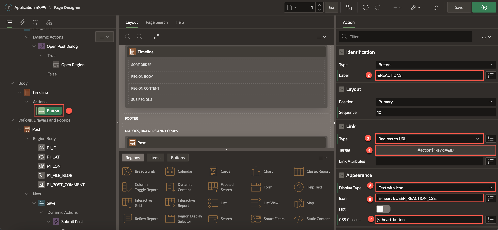
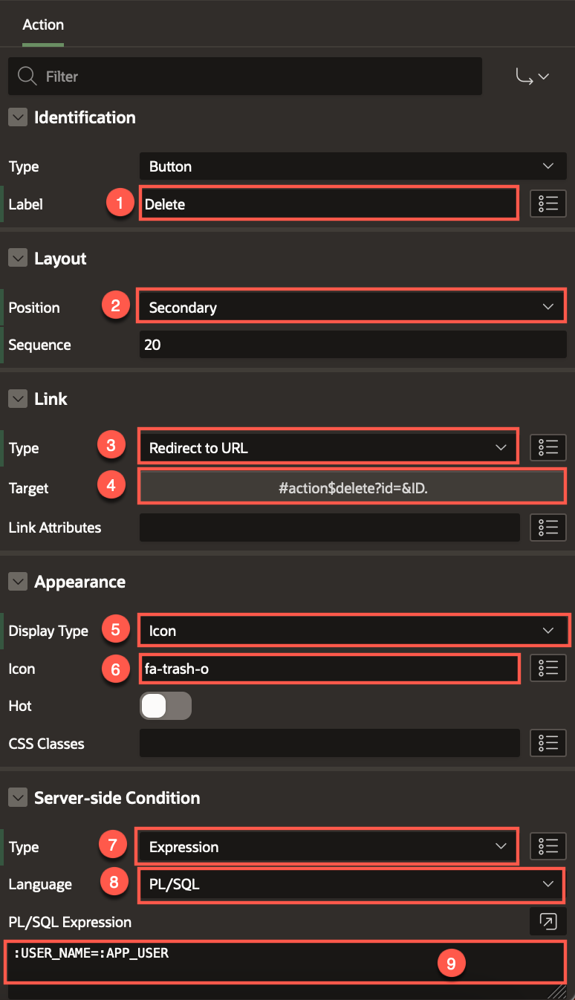
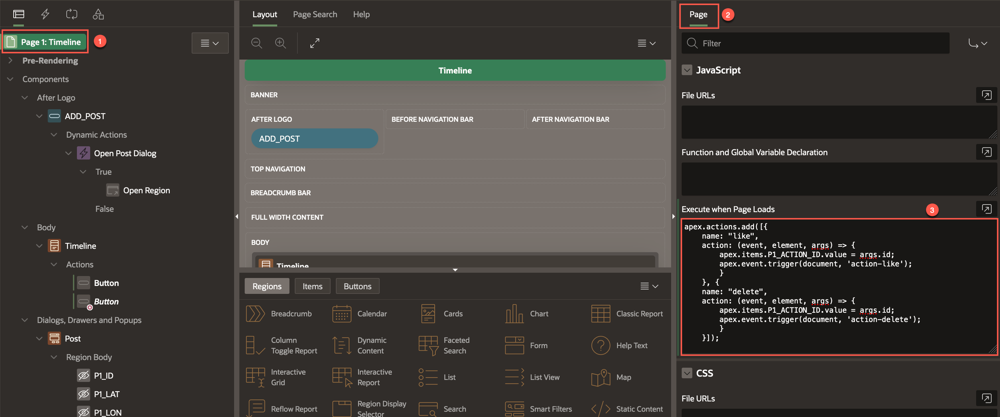
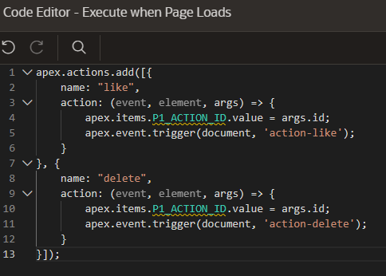
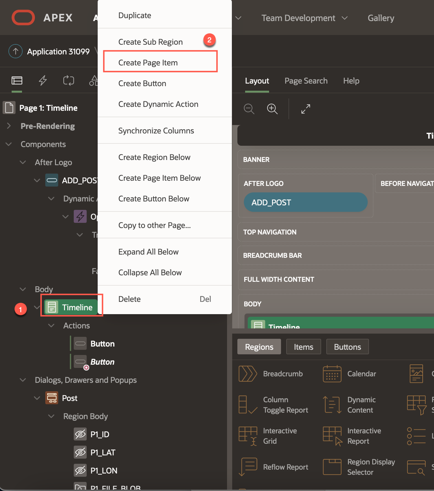
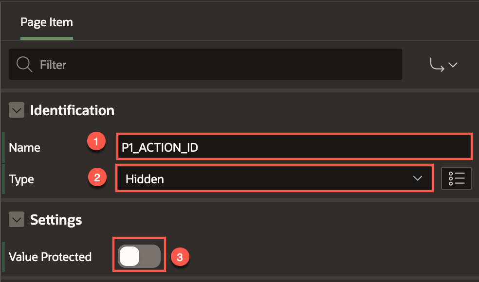
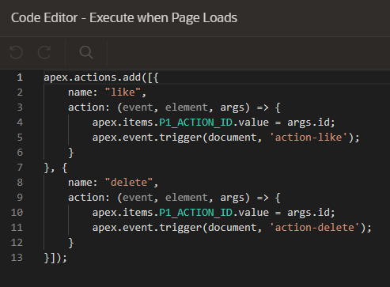
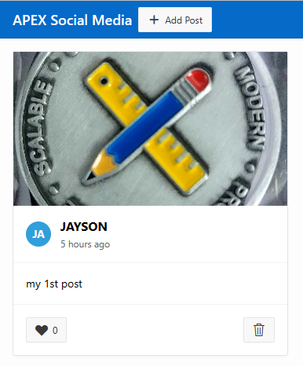

# Create Action Buttons

## Introduction

In this lab, you will learn to customize the card in order to add a reaction button and a delete button for a user to like a post or delete a post respectively.

Estimated Time: 5 minutes

Watch the video below for a quick walk-through of the lab.
[Create an APEX App](videohub:1_53khevkr)

### Objectives

In this lab, you will:
- Create a Like button for the user to react to a post
- Create a Delete button to delete a post

### Prerequisites

- Completion of workshop through Lab 6

## Task 1: Create a Like Button

The **Like** button will display the current count of likes next to a heart
icon. The user will be able to see the number of likes in total, and they will be able to click the button and add their
like to the post. If the user has already liked the post, the effect of
clicking it again will remove the like. 

1.  In the Rendering Tree: 
    - Under the **Timeline** Cards Region, right-click on **Actions** 
    - Choose **Create Action**

2.  You will see a new sub-entry item titled **Button** and you can
    select it to see the properties on the right.

3.  In the Property Editor:
    - For Identification > Label, enter **&REACTIONS.** (including the period). 
    
        This is called APEX string substitution syntax, and it will render the count of reactions as
    the Label for this button, on each post. 
        Note: The **REACTIONS** column is defined in the query for this CARDS Region.
    - Set the Link > Type to **Redirect to URL**. 
    
        We need the LIKE button to have a URL that can be linked to
    javascript later, so that the database operation can be performed.
    - For Target > URL, enter **#action$like?id=&ID.** (including the period), and click **OK**.
    - Under Appearance,
        - For Display Type, select **Text with Icon**
        - Icon: **fa-heart &USER\_REACTION\_CSS.** (including the period). The **USER\_REACTION\_CSS** column
    is defined in the query for this CARDS region
        - For the **CSS Classes** property, enter **js-heart-button** which will be used by our Dynamic
    Action JavaScript later.

    

    If you run the app now, the button will generate a javascript error because we have not yet added that code to make it work. We will do it after creating the DELETE button.

## Task 2: Create a Delete Button

Similar to the previous task, we create another button that will be used for Deleting posts. We will add a condition to this button so that the button only displays for posts that belong to the logged in user.

1.  In the Rendering tree, right-click **Timeline > Actions**, and choose **Create Action**.

2.  In the Property Editor, update the following attributes:
    - Action > Label: **Delete**.

    - Layout > Position: **Secondary** (This ensures that the button is displayed on the right side of the card)

    - Link > Type: **Redirect to URL**

    - Target > URL: **#action$delete?id=&ID.** 
    
    - Click **OK**

    - Under Appearance:
        - For Display Type, select **Icon**
        - For Icon, enter **fa-trash-o**

    - Under Server-side condition:
        - For Type, select **Expression**
        - For Language, select **PL/SQL**
        - For **PL/SQL expression**, enter **:USER\_NAME=:APP\_USER**

        This Server-side condition controls whether or not this **button** shows for a card.
        The expression will compare the query column value returned to
    the currently signed-in APEX user. The colon-prefixed "variable"
    syntax is called the "Bind Variable Syntax" in PL/SQL. If it evaluates
    to true (for each row or Card) then APEX will render the **Button**,
    otherwise the button is not visible.

        

## Task 3: Add Javascript to the Page for the Card Buttons

In this task, we will provide the APEX page with the custom javascript
that will be invoked by the "URL" from the Cards button target link, to the Dynamic actions that we will create in Lab 8.

1.  Select the **Page 1: Timeline** entry in the **Rendering Tree**
    and review the attributes for the **Page 1:Timeline** in the Property editor
    on the right. 

2.  Under the Javascript section, enter the following javascript code:

    ```
    <copy>
        apex.actions.add([{
        name: "like",
        action: (event, element, args) => {
            apex.items.P1_ACTION_ID.value = args.id;
            apex.event.trigger(document, 'action-like');
            }
        }, {
        name: "delete",
        action: (event, element, args) => {
            apex.items.P1_ACTION_ID.value = args.id;
            apex.event.trigger(document, 'action-delete');
            }
        }]);
    </copy>
    ```

    

    Open the Code Editor to see the entire script.

    
    
    

    Notice that the code references a Page Item, **P1\_ACTION\_ID** with a squiggly underline, which we have not created
yet.

    

    We need this Page Item **P1\_ACTION\_ID** to be on the page so that this
javascript can store the particular CARD ID when a user clicks
either buttons, which in turn, will execute either the **like** or the
**delete** operations from the URL link targets. 

    This is a design pattern using a single APEX Javascript API call (on page load) with an
array of multiple code blocks as parameters. Each respective javascript
block will then in-turn call a custom event, which we willl configure our
Dynamic Actions to respond to in the next task.


4.  To create and configure **P1\_ACTION\_ID** Page Item, right-click on the **Timeline** Cards Region in the **Rendering Tree** and choose **Create Page Item**.

    

5. In the Property Editor:
    - Rename the Identification > Name as **P1\_ACTION\_ID**
    
    Note: APEX will set **Page Item** > **Name** by default with the Prefix of
    **P** and the **Page Number** followed by an underscore (**\_**),
    and **NEW**; in this case, as **P1\_NEW**.

    - Type: **Hidden**
    - Settings > Value Protected: **OFF**
    
    

8. Now, let's go back and select the **Page 1: Timeline** Rendering Tree
entry, and open up the code editor again to see the javascript we copied
and pasted earlier. The code editor looks clean with no concerns!

    
  

9. **Save and Run** the page to see how the app is shaping up. Functionally, we're
almost there!

    

You may now **proceed to the next lab**

## Acknowledgements

 - **Author** - Jayson Hanes, Principal Product Manager; Apoorva Srinivas, Senior Product Manager; 
 - **Last Updated By/Date** - Apoorva Srinivas, Senior Product Manager, March 2023
