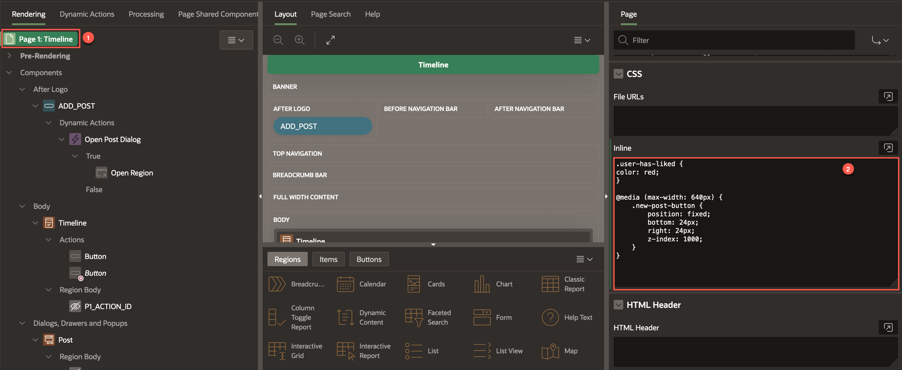
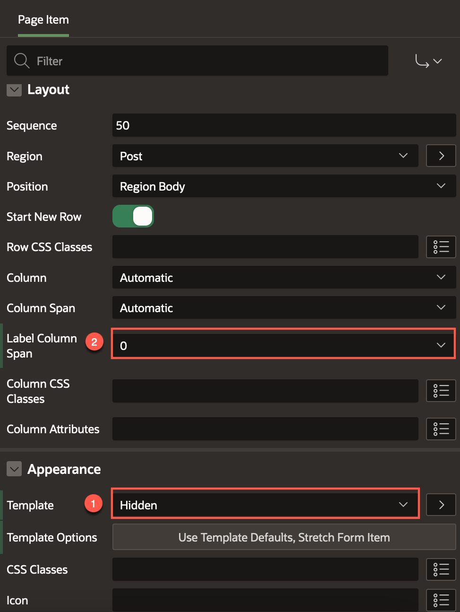
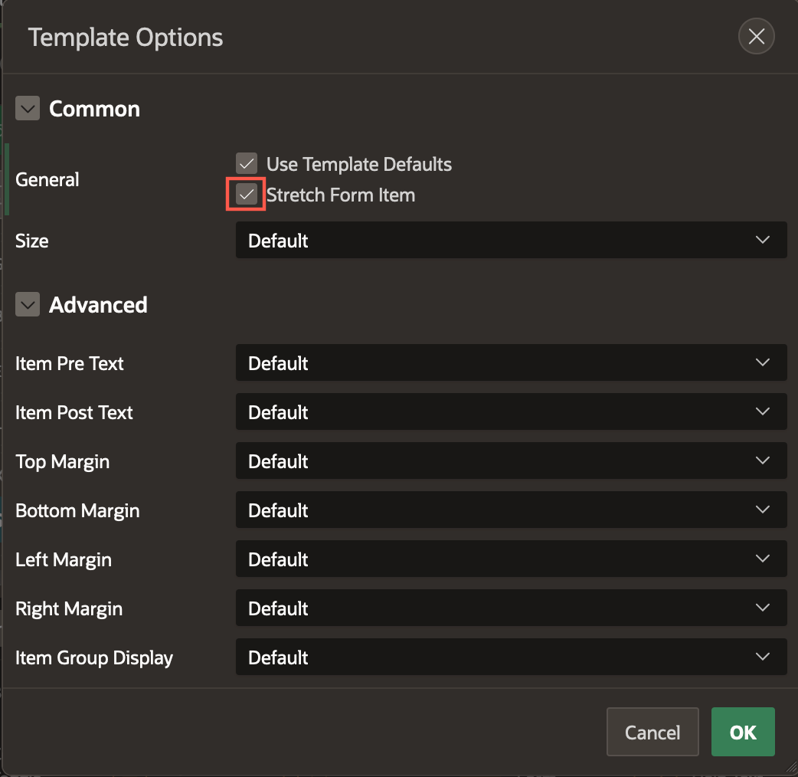
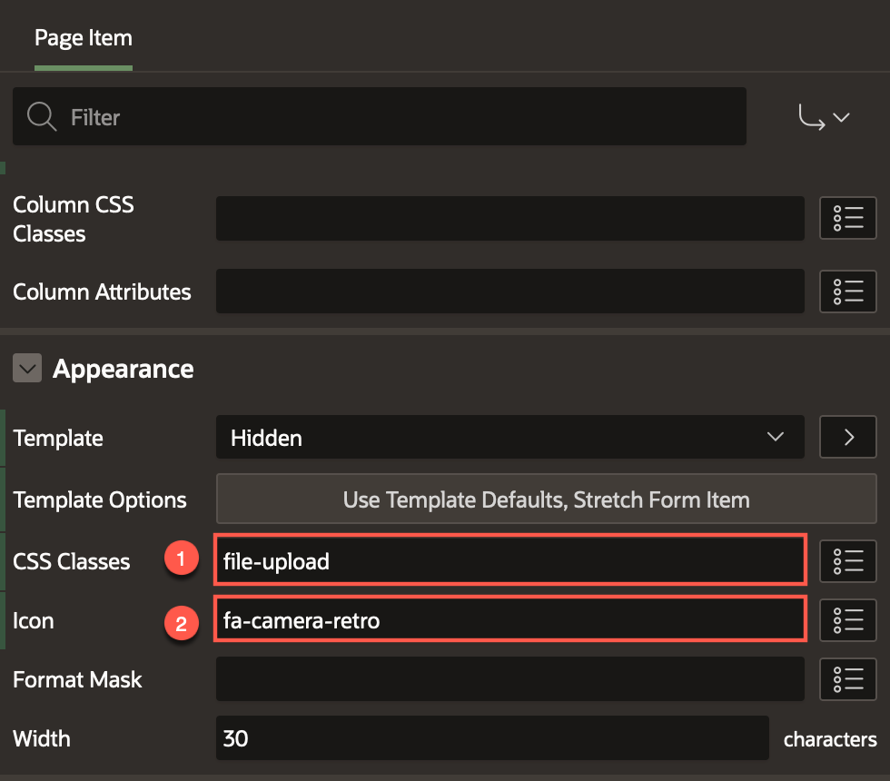

# Clean Up the App

## Introduction

In this lab, you will do the final touch up of the app to improve the aesthetics. You will learn how to customize the CSS.

Estimated Time: 5 minutes

Watch the video below for a quick walk-through of the lab.
[Create an APEX App](videohub:1_gu1lhbr3)

### Objectives

In this lab, you will:
- Improve the aesthetics by using custom CSS
- Enhance the appearance of a page item declaratively

### Prerequisites

- Completion of workshop through Lab 8

## Task 1: Add CSS to the page

When we Like a post, we should be able to see the Heart in RED. Also, if we are using this app on a small screen (like a mobile device) it would be better if the Add Post button was relocated to the bottom right of the Screen. We can do this with two small blocks of Inline CSS on the page level.

1.  Select **Page 1: Timeline** from the Rendering Tree and then in the Property Editor, proceed to **CSS > Inline**.

2.  Copy and paste the following CSS into the **Inline** box:

    ```
    <copy>
        .user-has-liked {
    color: red;
    }

    @media (max-width: 640px) {
        .new-post-button {
            position: fixed;
            bottom: 24px;
            right: 24px;
            z-index: 1000;
        }
    }
    </copy>
    ```
    

## Task 2: Clean up the File Browse Page Item

1.  Select **P1\_FILE\_BLOB** page item under the Post region. In the Property Editor:
    - Change **Appearance > Template** to **Hidden**
    - Set the **Layout > Label Column Span** to 0.  

    

2.  Click on **Template Options**. Under **General**, check the **Stretch Form Item** option. This improves the alignment.

    

3.  And finally, under Appearance:
    - For CSS Classes, enter **file-upload** 
    - For icon select **fa-camera-retro**

    

4. Voila! We have arrived at a working and significantly functional low-code APEX application. **Save and Run** the application.

    


    You can also send the URL to your mobile and try it out!

    You may now **proceed to the next lab**

## Acknowledgements

 - **Author** - Jayson Hanes, Principal Product Manager; Apoorva Srinivas, Senior Product Manager;
 - **Last Updated By/Date** - Apoorva Srinivas, Senior Product Manager, March 2023
