# Improving the Faceted Search

## Introduction
In this lab, you will get a first-hand experience with enhancing the application by improving the faceted search page for better clarity and improved usability. The search page includes facets on the left which can readily be used to limit the data shown in the report on the right.

If you review the **NYC Highschools Search** page, you can check and uncheck various facets. When you check a facet, the counts on all of the remaining facets will be updated to show the number of records that meet the new criteria.

Estimated Time: 10 minutes

Watch the video below for a quick walk-through of the lab.
[Improve the Faceted Search](videohub:1_66hdojc7)

## **Task 1**: Enhancing the Safe Facet
Reviewing the facets, you will notice that **Safe** is down the page and you can choose multiple range values from a checkbox group.

1. From the runtime application, go to the search page by clicking **NYC Highschools Search**. Assuming that you ran this app from the APEX App Builder, a Developer Toolbar is displayed at the bottom of the screen. *Note - End users who log directly into the app will not see this toolbar.*

    In the Developer Toolbar click **Page 3**.

    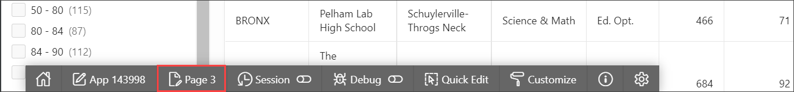

    Alternatively, you can also navigate back to the APEX App Builder tab in your browser manually by selecting the appropriate browser tab or window. Once in the App Builder click **3 - NYC Highschools Search**.

    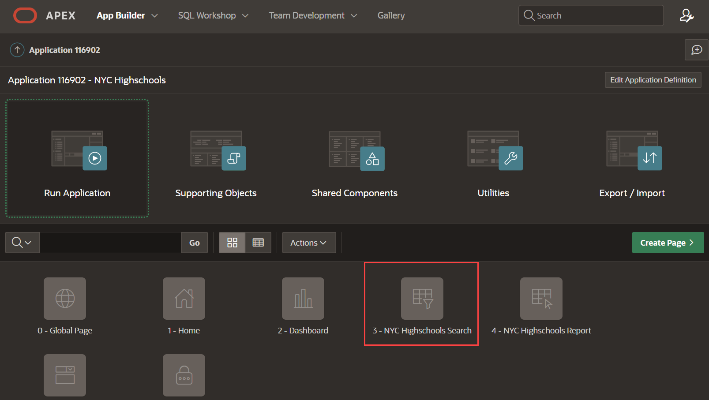

    You should now be in the Page Designer. Page Designer is where you will spend the majority of your time improving your application. There are three panes within Page Designer.
    - The left pane initially displays the Rendering tree, with a list of page components.
    - The middle pane displays the Layout, a representation of the page, and Gallery, from which you can drag and drop new components into the Layout.
    - The right pane is the Property Editor, where you can change attributes for the selected component.

2. Safety of a Highschool is a very important search criteria while selecting a High School, so you want to reorder the facets such that **Safe** is between *Borough* and *Interest*.

    In the Rendering tree (left pane), under **Search**, within **Facets**, click and hold **P3\_SAFE** and drag it up until it is under **P3\_BOROUGH** then release the mouse.

    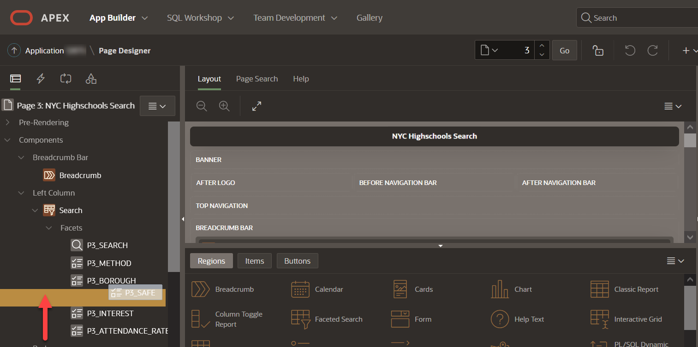   

3. Currently the **Safe** facet is a checkbox group with range values. However, it is unlikely that users will want to select multiple safety percentage value, so you will convert it into a radio range group.

    Continuing with **P3\_SAFE** selected, within the Property Editor (right pane), under **Settings**, toggle the **Select Multiple** button such that multiple values cannot be selected.

    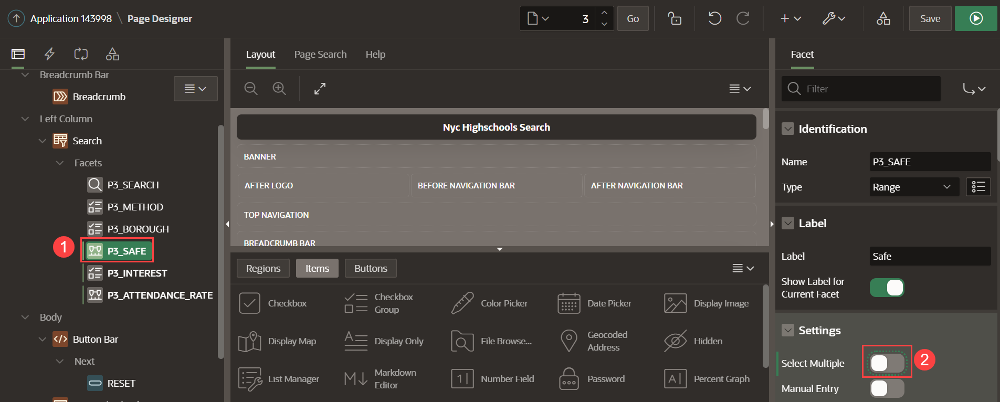   

4. At the top right of the page click **Save and Run Page** to save the changes made to the facets and review the app.

    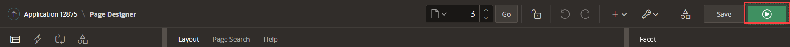   

5. In the runtime environment, click one of the **Safe** ranges. Review how the counts on the other facets are updated based on your selection. Also notice how you can still select one of the other **Safe** ranges or click **Clear**, within the **Safe** facet, to clear your selection and again show all the counts for all the safety ranges.

 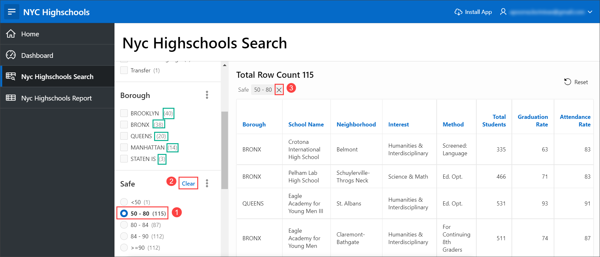

*Note*: As an optional step, you can follow the same steps in **STEP 1** to customize the **Attendance Rate** facet.   

6. You can view each of the facets and their respective counts as a chart. To view the chart, click on the context menu next to the **Borough** facet and select **Show Chart**. A chart dialog window is displayed with the Borough names on the X-axis and the count on the Y-axis.

    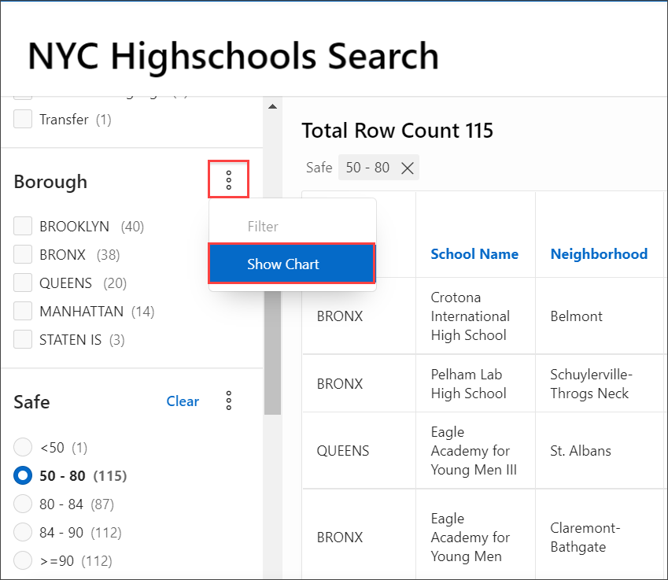

    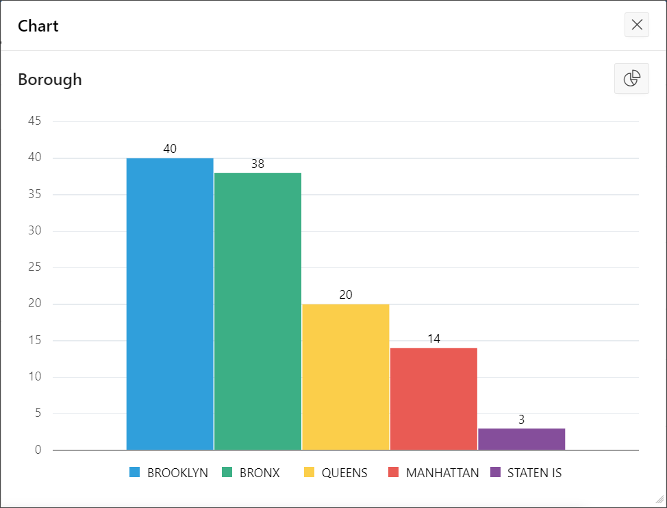

## **Task 2**: Collapsing Facets
1. You may have noticed that the facets go off the bottom of the page. Therefore, it would be preferable to collapse the last three facets, making it easier to see all available facets.

    Navigate back to the development environment (APEX App Builder) by using the edit link in the Developer toolbar, or manually navigating to the appropriate browser tab.

    In the Rendering tree (left pane), under **Search**, within **Facets**, click **P3\_SAFE**, hold down the *Shift* key and then click **P3\_ATTENDANCE\_RATE**, such that three facets are selected. In the Property Editor (right pane), within the filter at the top, enter **collap**, so that Collapsible is displayed under Advanced. When you toggle the switch for **Collapsible**, **Initially Collapsible** property appears. For Advanced > Initially Collapsed, change the switch to selected.

    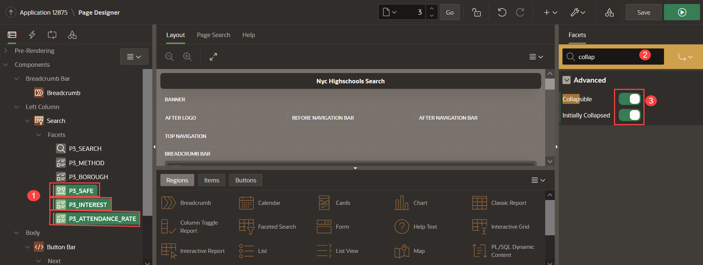   

    *Note - Rather than entering a filter you can also scroll down the properties until you find the correct attribute to update.*

7. Click **Save and Run Page** to see the improved search page.   

    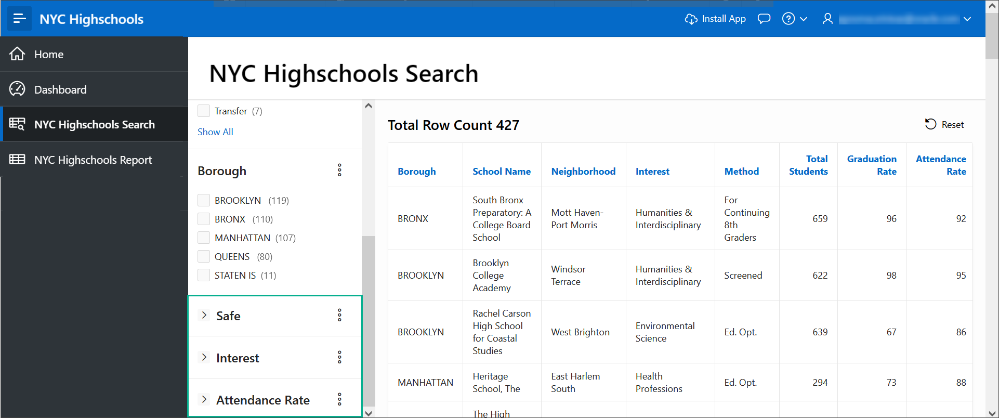   

## **Task 3**: Filtering Facets
1. Some facets may have multiple values to choose from and becomes difficult for the end user to scroll and select the values. APEX 22.1 introduces a new filter feature for facets which provides a search bar to search and filter facet values.

  Click the context menu (three dots) next to the facet name **Method**. Select **Filter**.

  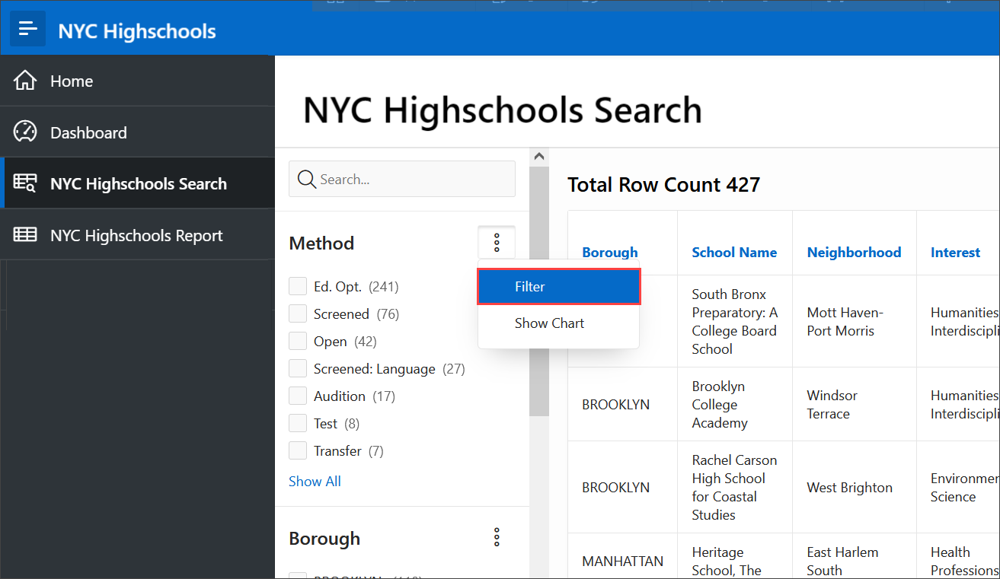  

2. A search filter is displayed below the facet name. Type **Transf** in the text box and all the facet values that contain the substring will be displayed. You can then select the checkbox for **Transfer** to be filtered in the report.

  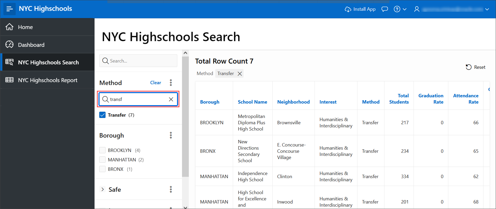  

## **Summary**

You now know how to enhance a faceted search page and modify the properties on a page using the Page Designer.

## **Acknowledgements**

 - **Author** -  Apoorva Srinivas, Senior Product Manager
 - **Contributors** - Salim Hlayel, Tom McGinn
 - **Last Updated By/Date** - Ankita Beri, Product Manager, April 2023
