# Create REST Data Sources

## Introduction
This lab will walk you through how to create REST Data Sources that you will use to get movie data from The Movie Database API. You will use these REST sources in later labs to build out the movie search functionality. Make sure you have access to your API key that you signed up for at the end of the previous lab.

Estimated Lab Time: 10 minutes

Watch the video below for a quick walk-through of the lab.
[Create REST Data Sources](videohub:1_lfhqcopc)

### Objectives
In this lab, you will:  
- Create REST data sources using a REST Catalog.  
- Update the Web Credential needed for the REST sources.  

### Prerequisites
- Completion of workshop through Lab 1  
- A TMDB API key  
- The <a href="https://objectstorage.us-ashburn-1.oraclecloud.com/p/Ei1_2QRw4M8tQpk59Qhao2JCvEivSAX8MGB9R6PfHZlqNkpkAcnVg4V3-GyTs1_t/n/c4u04/b/livelabsfiles/o/oci-library/build-movies-watchlist-app-using-apex/tmdb_catalog.sql" download>TMDB REST Source Catalog</a>

## Task 1: Import the REST Catalog
You will use a REST Source Catalog that contains predefined services to create REST data sources. Using a REST Catalog will greatly simplify the process of creating REST sources to get data from TMDB API because all you will need to do is import the catalog, select the sources you want to use, and update the web credential associated with the sources.

1. Download the TMDB REST Source Catalog by clicking <a href="https://objectstorage.us-ashburn-1.oraclecloud.com/p/Ei1_2QRw4M8tQpk59Qhao2JCvEivSAX8MGB9R6PfHZlqNkpkAcnVg4V3-GyTs1_t/n/c4u04/b/livelabsfiles/o/oci-library/build-movies-watchlist-app-using-apex/tmdb_catalog.sql" download>here</a>.

2. In the App Builder tab in your browser, click **Export/Import** on the Movies Watchlist application home page.

    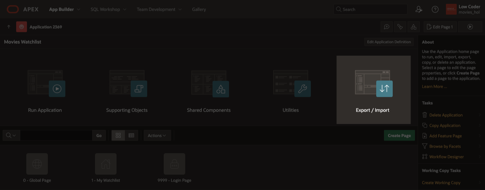

3. Click **Import**.

    

4. On the Import page:
    
    * Drag and drop the **tmdb_catalog.sql** file you downloaded or click on the Drag and Drop region to open the file finder and select the catalog.

    * Set File Type to **REST Source Catalog**.

    * Click **Next**.

    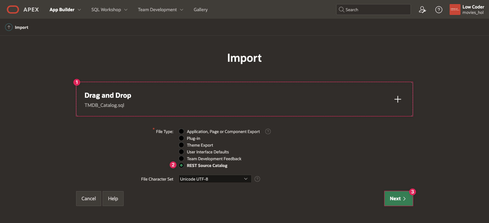

5. When the file has been imported successfully, click **Next**.

6. Enter **Movies** for the Catalog Group the catalog will be in.

7. Click **Import REST Catalog**.

    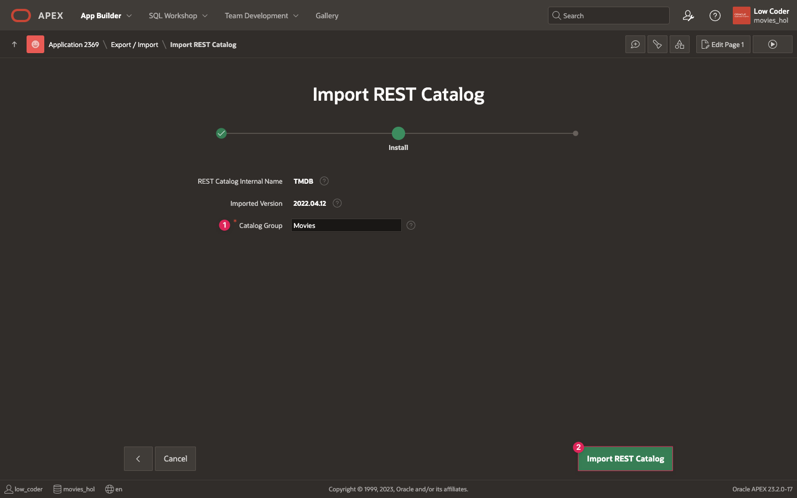

8. On the REST Source Catalogs page, you can see your new TMDB catalog that contains 4 Services in the Movies group.

    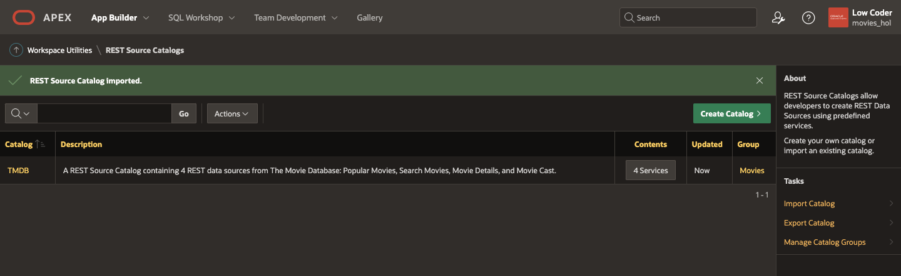

## Task 2: Create REST Data Sources
Now that you have imported your REST Source Catalog, it will be very simple to create REST Data Sources using the services within the catalog.

1. Return to the App Builder home by clicking **App Builder** in the APEX navigation bar.

    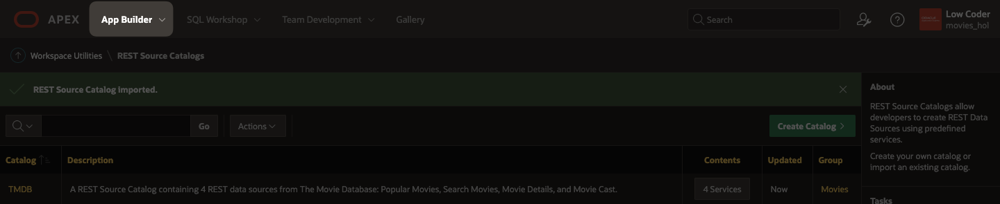

2. Click on the **Movies Watchlist** application.

3. Click **Shared Components** in the middle of your Movies Watchlist application home.

    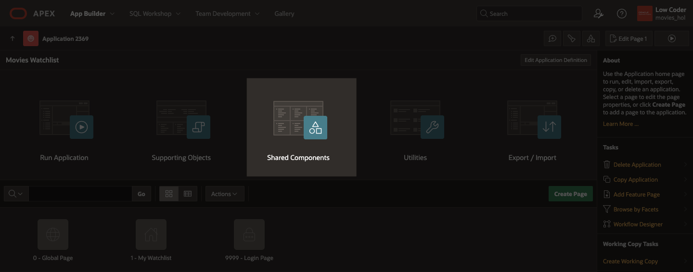

4. In the Data Sources section at the bottom of the page, click on **REST Data Sources**.

    

5. On the REST Data Sources page, click the **Create** button.

    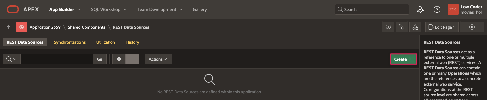

    * Select **From a REST Source Catalog**.

    * Click **Next**.

    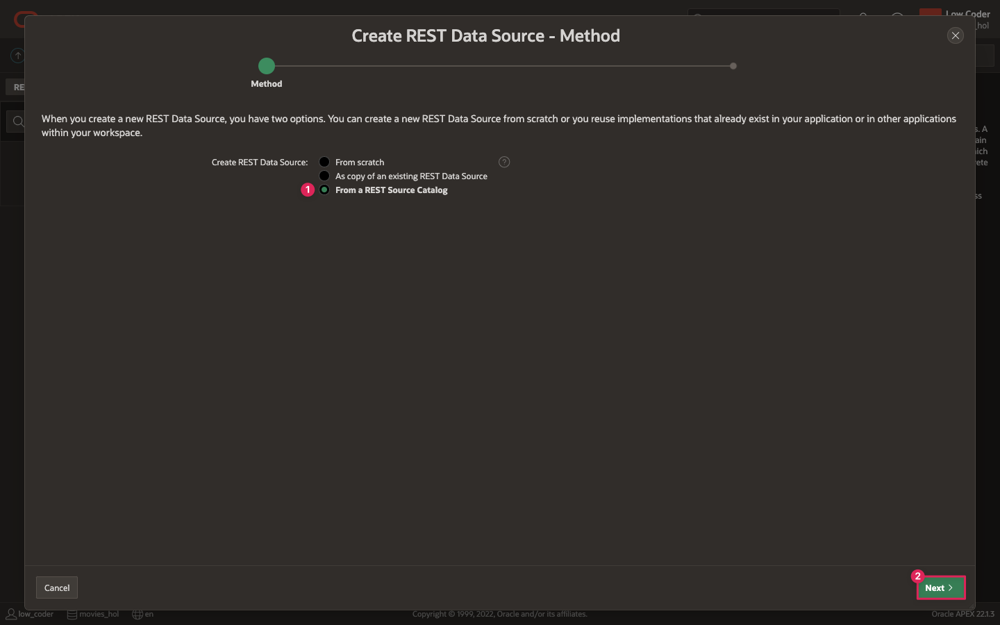

6. On the Create REST Data Source - Catalog Services page, you can view the different services in the TMDB REST Catalog and choose which ones you want to create REST data sources from.

    * From the list of services, click on **Popular Movies** to add it to the list of Selected Catalog Services.

    * Select **Search Movies**, **Movie Details**, and **Movie Cast** to add each to the selected catalog services as well.

    * Click **Next**.

    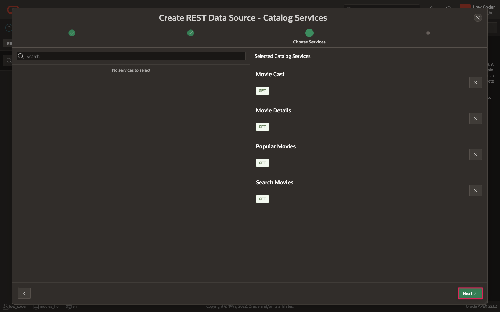

7. On the Create REST Data Source - Catalog Details page, click **Create REST Data Sources** to create your four sources and return to the REST Data Sources page.

## Task 3: Update the Web Credential
When you created the REST data sources from the REST Catalog, a new Web Credential was created in your workspace. This credential will allow you to make requests to the TMDB API. The final task to get your REST Data Sources to work will be updating your Web Credential to use your TMDB API key.

1. In the APEX navigation bar, click the down arrow next to App Builder, select **Workspace Utilities** from the menu, and then choose **All Workspace Utilities** from the sub-menu.

    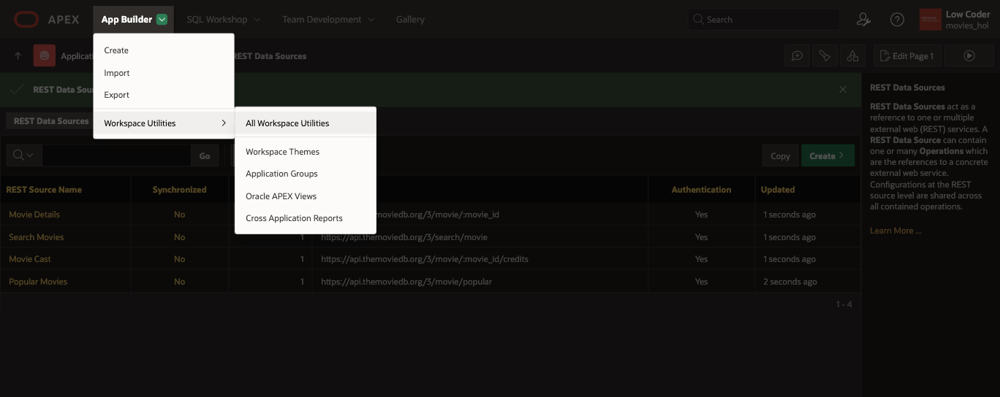

2. From the list of Workspace Utilities, select **Web Credentials**.

    

3. Click on **Credentials for Movie Cast**.  
*Note: The Web Credentials name may instead match one of the other REST Data Sources you set up in Task 2.*

4. On the Web Credentials edit page, set the following:

    * Name: **Credentials for Movies**
    
    * Static Identifier: **Credentials\_for\_Movies**

    * Credential Name: **api\_key**

    * Credential Secret: *Insert your unique API key here.*

    * Valid for URLs: **https://api.themoviedb.org/3/**

5. Click **Apply Changes** to save your Web Credential.

    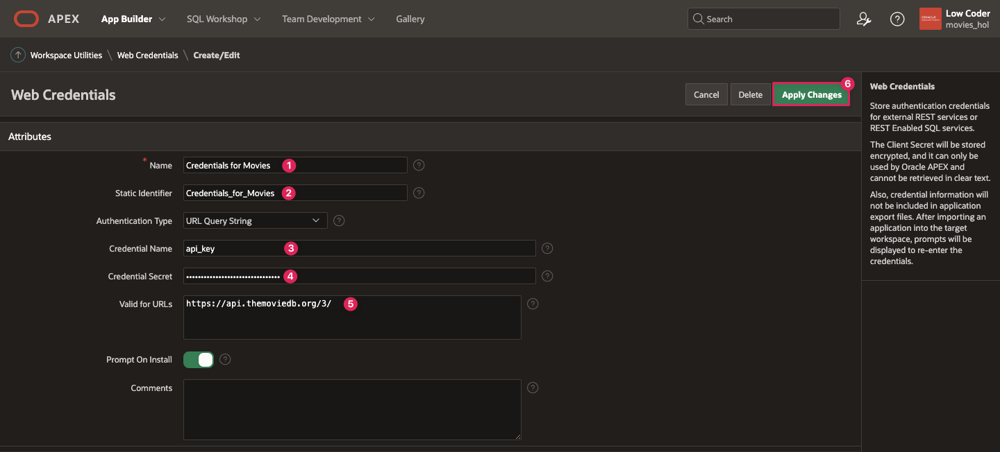

6. Return to your Application home by clicking **App Builder** in the APEX navigation bar and selecting the **Movies Watchlist** application.

You now know how to create REST data sources from a REST Catalog in Oracle APEX and will be able to get data from The Movie Database to use for your application. You may now **proceed to the next lab**.

## Learn More

- [REST Data Sources Documentation](https://docs.oracle.com/en/database/oracle/apex/23.2/htmdb/managing-REST-data-sources.html)  

- [REST Data Sources Video](https://www.youtube.com/watch?v=ctCwvD1qavs)  

## Stuck? Download the Application Here
Stuck on a step or struggling with the lab? You can download a copy of the Movies Watchlist application through Lab 2 and follow the instructions below to import it into your Oracle APEX workspace.

- [Click here](https://objectstorage.us-ashburn-1.oraclecloud.com/p/Ei1_2QRw4M8tQpk59Qhao2JCvEivSAX8MGB9R6PfHZlqNkpkAcnVg4V3-GyTs1_t/n/c4u04/b/livelabsfiles/o/oci-library/build-movies-watchlist-app-using-apex/lab-2-232.sql) to download a copy of the app at the end of Lab 2.

- You can import the app to your APEX workspace by clicking **Import** in the App Builder home page and following the wizard steps.

- You will be prompted for the Credentials for Movies web credential that was set up in this lab. You can see in the screenshot below that Credentials for Movies does not already exist in your workspace.  

    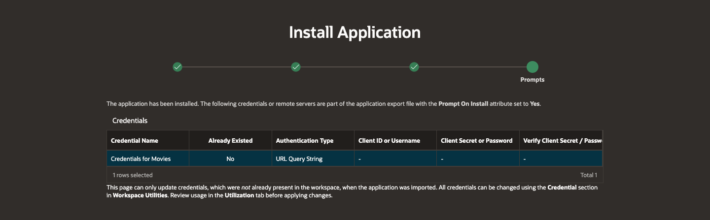  

- Within the Credentials for Movies row:

    - In the Client ID or Username column, enter **api\_key**.

    - In the Client Secret or Password column, paste your unique API key that you got from The Movie Database.

    - In the Verify Client Secret/Password column, past your API key again.

        

- Click **Next**.

- Make sure Install Supporting Objects is **on** and click **Next** again.

- Click **Install** to install the supporting objects and finish importing the application.

## Acknowledgements

- **Author** - Paige Hanssen
- **Last Updated By/Date** - Paige Hanssen, November 2023