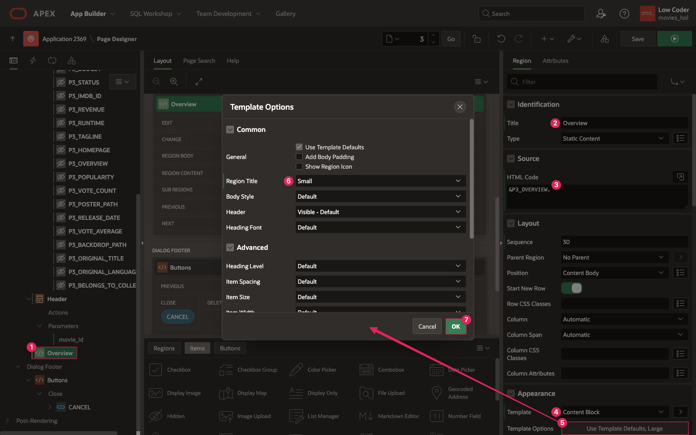

# Create the Movie Details Page

## Introduction
In this lab, you will set up a new page that displays the details of a single movie. When you click on a specific movie from the Movie Search page and, eventually, the My Watchlist page, the details for that movie will be retreived from the Movie Details TMDB API and shown in the Movie Details page. 

Estimated Lab Time: 20 minutes

Watch the video below for a quick walk-through of the lab.
[Create the Movie Details Page](videohub:1_k3bn0l55)

### Objectives
In this lab, you will:  
- Create a new page, Movie Details.  
- Use the Movie Details REST source to display data on the Movie Details page.  
- Connect the Movie Details page to the Movie Search page.

### Prerequisites
- Completion of workshop through Lab 3

## Task 1: Create the Movie Details Page
You will start by creating a new page, Movie Details, which contains a Form. While this form will not display in the final Movie Details page, it will hold the Movie Details data needed to display content in other regions on the page.

1. In the toolbar at the top of the Page Designer, click the **Create** button (3 buttons left of the Save button) and select **Page**. 

    * Click **Form**.

    

    * Page Number: **3**
    
    * Name: **Movie Details**

    * Mode: **Modal Dialog**

    * Data Source: **REST Data Source**

    * REST Data Source: **Movie Details**

    * Click **Next**.

    

    * Select **ID (Number)** as the Primary Key Column 1 value.

    * Click **Create Page**.

    

    * You should now be on page 3, the **Movie Details** page.

2. Make sure **Page 3: Movie Details** is selected in the rendering pane on the left.

3. In the Page properties pane on the right, scroll down to **Appearance** and click on the **Use Template Defaults** button next to Template Options.

    * In the Template Options popup dialog, check the **Stretch to Fit Window** box under Common.

    * Click **Ok**.

4. In the **CSS** property group, paste the code below and into the **Inline** CSS code editor:

    ```
    <copy>
    /* Customize Movie Header Card */
    .movie-header-card.a-CardView {
        /* Increase the font sizes for movie name and tag line */
        --a-cv-title-font-size: 24px;
        --a-cv-subtitle-font-size: 16px;

        /* Add additional spacing around the header content */
        --ut-cv-subtitle-margin: 16px 0 0 0;
        display: flex;
        padding: 24px 0;
    }
    .movie-header-card .a-CardView-body {
        /* Remove unnecessary padding */
        padding-top: 0;
    }
    .movie-details {
        /* Center align Card Body text */
        text-align: center;
    }
    ```

    * The CSS above will style the page header you are going to create. While the original layout and format of the Cards region type can get you pretty far, a little CSS goes a long way in rounding out the entire look of a component or page.

    

## Task 2: Create the Header and Overview
You can use the value stored in the P3\_ID page item in the Movie Details form to specify which movie to get the details for. Then you can utilize a few columns from the Movie Details REST source to create a nice header that includes the movie poster, the background image, and the movie title. In addition to the header, you will add a region to display the overview of the movie formatted in a way that is easy to read.

1. You will first need to hide all the Movie page items so that you can still access the values stored in them but create your own content for the page. To do this, you can set the Type of a column to Hidden, which will not display an item on the frontend.

    * To select all items, click on the first item under the Movie region, P3\_ID, and then hold shift and click on the last item, P3\_BELONGS\_TO\_COLLECTION.

    * In the Page Items editing pane, set Type: **Hidden**

    

2. To start creating the header for the Movie Details page, right click on Content Body and select **Create Region**.

    * Set the following:

        - Title: **Header**

        - Type: **Cards**

        - Source → Location: **REST Source**

        - Source → REST Source: **Movie Details**

        - Local Post Processing → Type: **SQL Query**

        - Local Post Processing → replace the existing SQL query with the following:

            ```
            <copy>
            select id,
                   title,
                   'https://image.tmdb.org/t/p/w500'||poster_path as poster_url,
                   'https://image.tmdb.org/t/p/w500'||backdrop_path as backdrop_url,
                   release_date,
                   runtime,
                   trunc(runtime/60) || 'hr ' ||
                        extract (minute from numtodsinterval((runtime/60), 'HOUR' )) || 'min'
                        as runtime_friendly,
                   vote_average,
                   tagline
              from #APEX$SOURCE_DATA#
            ```

        - The above query is a simplified version of the original query because you only need a few columns for the header. It also converts RUNTIME into the hours and minutes format and returns it as RUNTIME\_FRIENDLY.

        - Appearance → open Template Options:

            + Style: **Style B**

            + Click **Ok**.

        

3. Click on the **Attributes** tab at the top of the Header region Property Editor.

    * Set the following:

        - Appearance → Layout: **Horizontal (Row)**

        - Card → CSS Classes: **movie-header-card**

        - Card → Primary Key Column 1: **ID**

        - Title → Column: **TITLE**

        - Subtitle → Column: **TAGLINE**

        - Body → Advanced Formatting: **on**

        - Body → HTML Expression:

            ```
            <copy>
            &lt;div class="movie-details">
                &lt;span title="Release Date">Released &RELEASE_DATE.&lt;/span> &amp;middot; 
                &lt;span title="Runtime">&RUNTIME_FRIENDLY.&lt;/span> &amp;middot;
                &lt;span title="&VOTE_AVERAGE. out of 10">&lt;span class="fa fa-star" aria-hidden="true">&lt;/span> &VOTE_AVERAGE.&lt;/span>
            &lt;/div>
            ```

        - Icon and Badge → Icon Source: **Image URL**

        - Icon and Badge → Image URL: **&POSTER\_URL.**

        - Icon and Badge → Icon CSS Classes: **w100 h150**

        

        - Media → Source: **URL Column**

        - Media → URL Column: **BACKDROP\_URL**

        - Media → Position: **As Background Image**

        - Media → Sizing: **Cover**

        

4. In order to get the details for a specific movie selected from the Search page, you have to update the **movie\_id** parameter that is part of the call to TMDB Movie Details API. When you look at the Details and Header regions in the rendering pane, you can see that under each is a Parameters section, just like there was for Popular and Searched Movies on the Movie Search page.

5. Expand the **Parameters** section under the **Movie Details** region.

6. Click on the **movie\_id** parameter.

    * Change the Type from REST Source Default to **Item**.

    * In the Item field, enter **P3\_ID**.

    

7. Follow steps 6 and 7 to update the movie_id parameter for the **Header** region.

8. Finally, you will add a region to display the movie Overview to go along with the nice header containing the movie details.

9. In the rendering pane on the left, right click on Content Body and select **Create Region**.

10. Set the following properties:

    * Identification → Title: **Overview**

    * Source → HTML Code: **&P3\_OVERVIEW.**

    * Appearance → Template: **Content Block**

    * Appearance → Template Options:

        - Region Title: **Small**

        - Click **Ok**.

        

11. Click **Save**.

## Task 3: Connect the Details Page to the Search Page
To be able to view the details of any movie you click on on the Movie Search page, you can link the Details page to the Search page like you did when setting up the Movie Search page and Add Movie button. However, in order to get the details for the specific movie you clicked on, you have to pass some data from the Search page to the Details page.

1. Navigate to page **2: Movie Search** by clicking the down arrow in the page navigation on the Page Designer toolbar.

2. On the Movie Search page, you can see in the rendering pane that both Popular Movies and Searched Movies have an **Actions** section underneath them.

3. Right click on **Actions** underneath Popular Movies and select **Create Action**.

    

    * Identification → Type: **Full Card**

    * The Link section is where you can connect page 3 to page 2 by redirecting the user to a new page, similar to how a user gets to the Movie Search page from the Home page.

    * Click on **No Link Defined** next to Target to open the Link Builder dialog.

        - Page: **3**

        - You also need to set the value of the ID item on page 3 (P3\_ID) so that the Movie Details page has the ID of the movie that was clicked on.

        - Under Set Items, enter **P3\_ID** as the Name.

        - Value: **&ID.**  
        	*Note: You can also use the buttons next to the name and value fields to browse items that you can pass values to. Notice that the options for Name all come from the Movie Details page (P3), because that is the item you want to set. The options for Value are the columns from the Movie Search data source because this is the what you are getting from page 2 and passing to page 3.*

        - Click **Ok**.

        

4. Follow step 3 for the **Searched Movies** region to create a Full Card action that redirects to page 3.

5. Click **Save**.

6. Refresh the page where your application is running.

7. Test the Movie Details page by clicking the **Add Movie** button to open the Movie Search page.

8. Click on the movie of choice to see the details.

    

You have now set up the Movie Details page and set it up to open for any card that is selected from the Movie Search page. You may now **proceed to the next lab**.

## Learn More

- [Modal Dialog Pages](https://docs.oracle.com/en/database/oracle/apex/23.2/htmdb/creating-dialog-pages.html)  

- [Variables in APEX](https://www.talkapex.com/2011/01/variables-in-apex/)  

## Stuck? Download the Application Here
Stuck on a step or struggling with the lab? You can download a copy of the Movies Watchlist application through Lab 4 and follow the instructions below to import it into your Oracle APEX workspace.

- [Click here](https://objectstorage.us-ashburn-1.oraclecloud.com/p/Ei1_2QRw4M8tQpk59Qhao2JCvEivSAX8MGB9R6PfHZlqNkpkAcnVg4V3-GyTs1_t/n/c4u04/b/livelabsfiles/o/oci-library/build-movies-watchlist-app-using-apex/lab-4-232.sql) to download a copy of the app at the end of Lab 4.

- You can import the app to your APEX workspace by clicking **Import** in the App Builder home page and following the wizard steps.

- You will be prompted for the Credentials for Movies web credential that was set up in lab 2. You can see in the screenshot below that Credentials for Movies does not already exist in the workspace.  
*Note: If you completed Lab 2, Credentials for Movies will already exist in your workspace and this will be pre-filled*

      

- If Credentials for Movies does not already within your workspace, set the following for the Credentials for Movies row:

    - In the Client ID or Username column, enter **api\_key**.

    - In the Client Secret or Password column, paste your unique API key that you got from The Movie Database.

    - In the Verify Client Secret/Password column, past your API key again.

        

- Click **Next**.

- Make sure Install Supporting Objects is **on** and click **Next** again.

- Click **Install** to install the supporting objects and finish importing the application.

## Acknowledgements

- **Author** - Paige Hanssen
- **Last Updated By/Date** - Paige Hanssen, November 2023