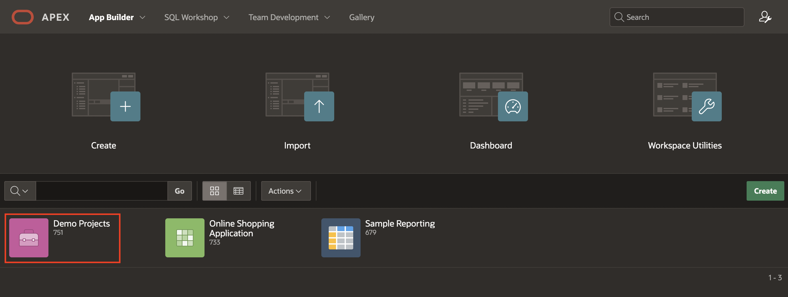
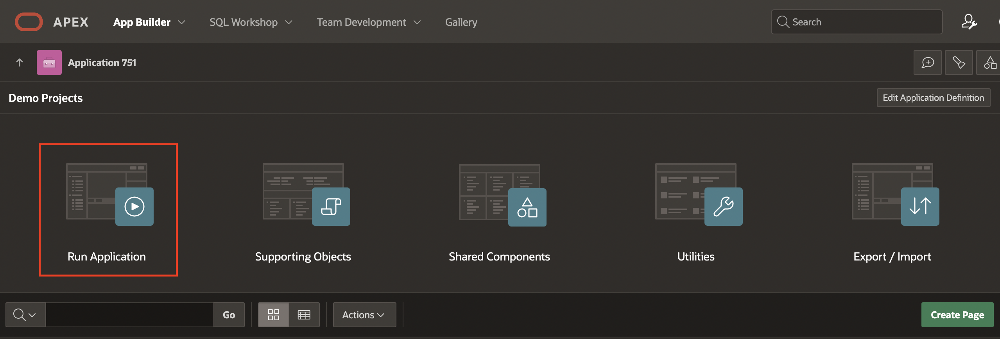
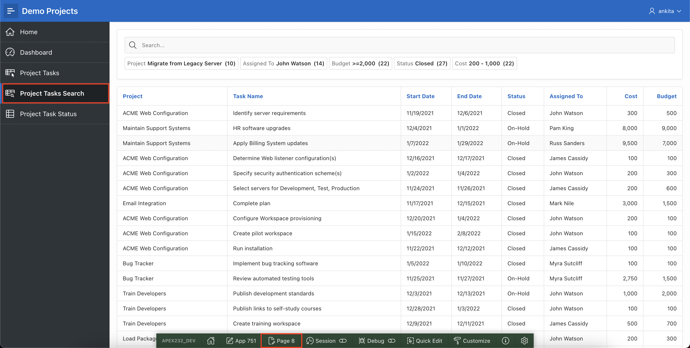
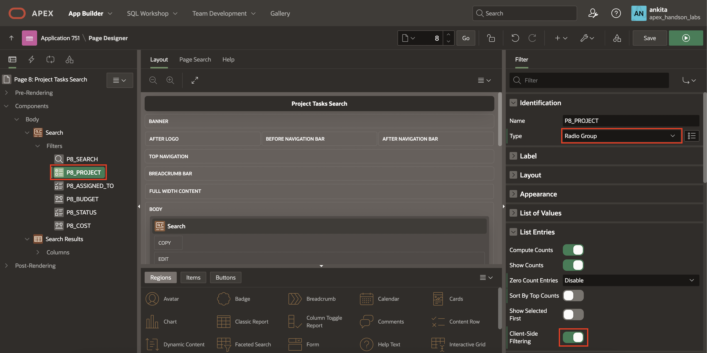
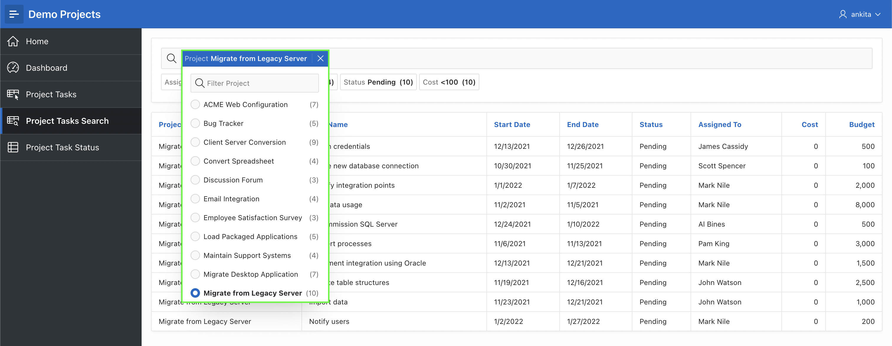
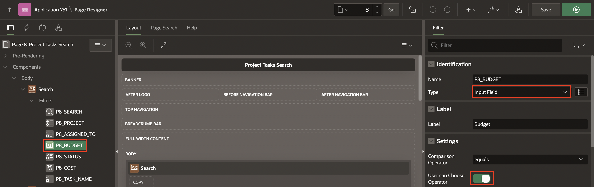
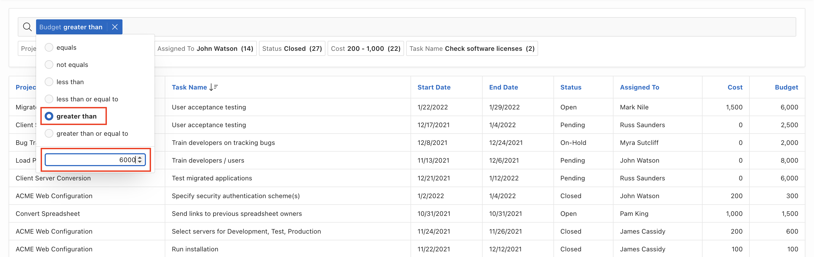
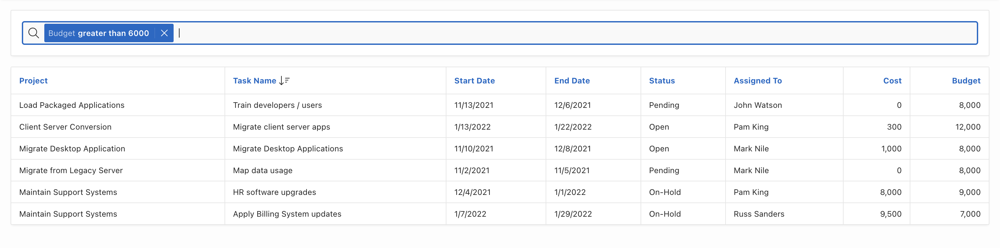
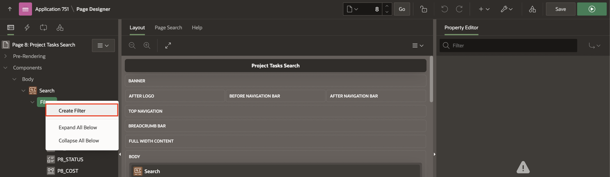
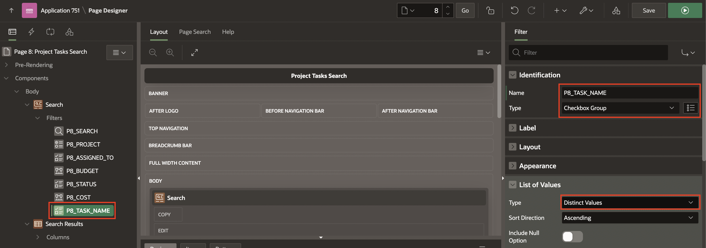

# Improve Smart Filters

## Introduction
In this Lab, you gain an insight into the abilities of Smart Filters and learn how to add **New Filters** and Edit existing Filters.

Estimated Time: 10 minutes

### Downloads
- Did you miss out on trying the previous labs? Don’t worry! You can download the application from **[here](files/hol10.sql)** and import it into your workspace. To run the app, please run the steps described in **[Get Started with Oracle APEX](https://livelabs.oracle.com/pls/apex/r/dbpm/livelabs/run-workshop?p210_wid=3509)** and **[Using SQL Workshop](https://livelabs.oracle.com/pls/apex/r/dbpm/livelabs/run-workshop?p210_wid=3524)** workshops.

## Task 1: Enhance Smart Filters

In this Lab, you will customize the **Smart Filters** page in the **Demo Projects** application.
The **Project Tasks Search** page utilizes Smart Filters to display the records.

1. Navigate to the **App Builder**. Then Click on the **Demo Projects** application.

    

2. Now, you run the application using the **Run Application** icon. If prompted, enter your workspace username and password and click Sign In.

    

3. Navigate to **Project Tasks Search** page and click **Page 8** in the **Developer toolbar**.      

  **Note** that your page number might be different.

  

4. Now, Update **P8\_PROJECT**, Change type to **Radio Group** and enable the **Client-Side Filtering** attribute.  
   In the Rendering tab, select the P8_PROJECT filter (if not already selected).
   In the Property Editor, under **Identification**, change the type to **Radio Group**, then find **List Entries** and enable **Client-Side Filtering**. Enabling this option renders a search field above the list entries.

    

5. Click **Save and Run Page** in the upper right corner.
The revised page appears.

    

6. Navigate back to **Page Designer - Page 8** . Now, you set the Budget filter as an input field that can be filtered, allowing you to input values and dynamically select the filter criteria.

7. In the Rendering tree (left pane), under Search, select **P19\_BUDGET**within filters.

   - Under Identification Section:

      - For Type: Select **Input Field**

   - Under Settings Section:

      - For **User can Choose Operator** : Enable **Yes**

    

     Click **Save and Run**.

8. Select the **Budget** filter in the search bar in the runtime environment. Select **greater than** and Enter **6000** in the input field. The results appear with a budget greater than 6000.

    

    

## Task 2: Add New Smart Filter

Add new filters in Page Designer by right-clicking the filter and selecting Create Filter from the context menu.

Filters map to specific database columns. When creating a new filter, you can create the following types: Checkbox Group, Input Field, Radio Group, and Range.

1. View the smart filters page in Page Designer. In the Rendering tab, right-click Filters and select **Create Filter**.

    

2. Select the new filter and edit the following filter attributes in the Property Editor:
    - Under **Identification**:

      - For Name: Enter **P8\_TASK_NAME**.

      - For Type: Select **Checkbox Group**.

    - Under **List of Values**:

      - For Type: Select **Distinct Values**.

  

3. Click **Save and Run Page** in the upper right corner. If prompted, enter your workspace username and password and click Sign In.
The revised page appears.

## Summary
You now know how to create smart filters and customize them. You may now **proceed to the next Lab**.

## Acknowledgements
- **Author** - Roopesh Thokala, Senior Product Manager
- **Contributor** - Ankita Beri, Product Manager
- **Last Updated By/Date** - Ankita Beri, Product Manager, January 2024
