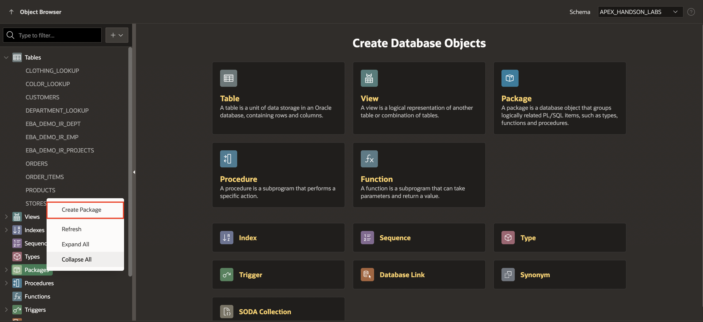
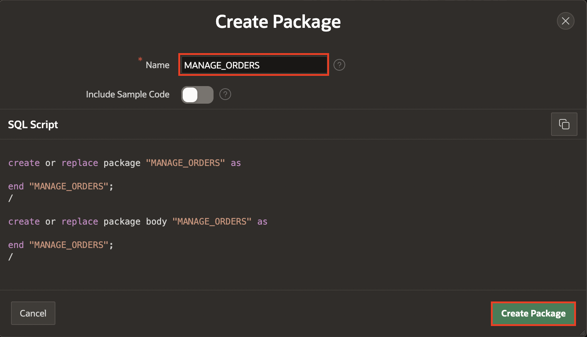
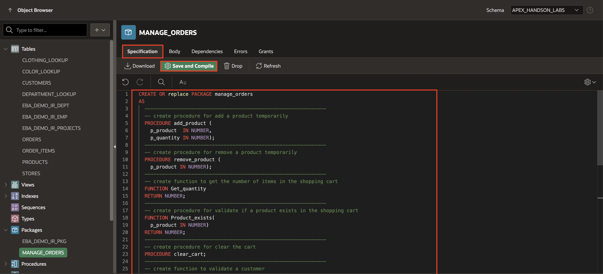
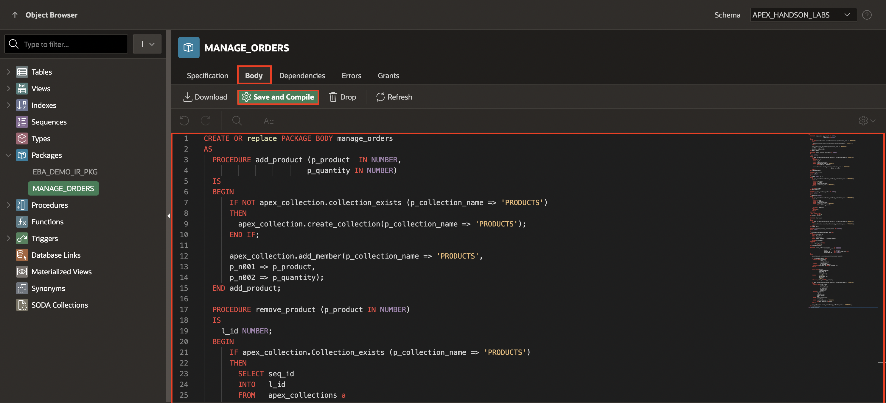

# Create a Database Package for Business Logic

In this lab, you learn to create database objects for your APEX application. This Package contains functions and procedures to add products to the cart, remove products, create an order, clear the cart, and more.

To manage items in the cart, you use [collections](https://docs.oracle.com/en/database/oracle/application-express/21.2/aeapi/APEX_COLLECTION.html), which enables you to temporarily store products currently in session state so they can be accessed, manipulated, or processed during a user's specific session.

Estimated Time: 10 minutes
<!--
Watch the video below for a quick walkthrough of the lab.

[](youtube:X8nVMCJhQic)
-->
### Objectives

Business logic in APEX applications can be written using PL/SQL, Oracle's procedural language extension to SQL. PL/SQL offers a handy program unit called a "package" that lets you separate the API signatures for reusable procedures and functions from their implementation in a clean manner. In this lab, you will:
- Create a package to manage the Shopping Cart.

## Task 1: Create the Package
Create specifications and a body for the Package.

1. Navigate to **SQL Workshop**, click **Object Browser**.
2. Navigate to the **Packages** on the left side, right-click on it and select **Create Package**.

    

3. For Package Name, enter **MANAGE_ORDERS** and click **Create Package**.

    

4. Select **Specification** and replace the contents of the code editor with the following:

    ```
    <copy>
    CREATE OR replace PACKAGE manage_orders
    AS
      --------------------------------------------------------------
      -- Create a procedure for adding a product temporarily
      PROCEDURE add_product (
        p_product  IN NUMBER,
        p_quantity IN NUMBER);
      --------------------------------------------------------------
      -- Create a procedure for removing a product temporarily
      PROCEDURE remove_product (
        p_product IN NUMBER);
      --------------------------------------------------------------
      -- Create a function to get the number of items in the shopping cart
      FUNCTION Get_quantity
      RETURN NUMBER;
      --------------------------------------------------------------
      -- Create a procedure for validating if a product exists in the shopping cart
      FUNCTION Product_exists(
        p_product IN NUMBER)
      RETURN NUMBER;
      --------------------------------------------------------------
      -- Create a procedure for clearing the cart
      PROCEDURE clear_cart;
      --------------------------------------------------------------
      -- Create a function to validate a customer
      FUNCTION Customer_exists(
        p_customer_email IN VARCHAR2)
      RETURN NUMBER;
      --------------------------------------------------------------
      -- Create a procedure to insert orders
      PROCEDURE create_order (
        p_customer       IN VARCHAR2 DEFAULT NULL,
        p_customer_email IN VARCHAR2,
        p_store          IN NUMBER,
        p_order_id       OUT orders.order_id%TYPE,
        p_customer_id    OUT NUMBER );
    END manage_orders;
    </copy>
    ```
5. Click **Save and Compile** to save the changes.
    

6. Navigate to the body part of the Package by clicking on the **Body** tab and replace the contents of the code editor with the following:

    ```
    <copy>
    CREATE OR replace PACKAGE BODY manage_orders
    AS
      PROCEDURE add_product (p_product  IN NUMBER,
                            p_quantity IN NUMBER)
      IS
      BEGIN
          IF NOT apex_collection.collection_exists (p_collection_name => 'PRODUCTS')
          THEN
            apex_collection.create_collection(p_collection_name => 'PRODUCTS');
          END IF;

          apex_collection.add_member(p_collection_name => 'PRODUCTS',
          p_n001 => p_product,
          p_n002 => p_quantity);
      END add_product;

      PROCEDURE remove_product (p_product IN NUMBER)
      IS
        l_id NUMBER;
      BEGIN
          IF apex_collection.Collection_exists (p_collection_name => 'PRODUCTS')
          THEN
            SELECT seq_id
            INTO   l_id
            FROM   apex_collections a
            WHERE  collection_name = 'PRODUCTS'
                  AND a.n001 = p_product;

            apex_collection.delete_member(p_collection_name => 'PRODUCTS',
                                          p_seq => l_id);
          END IF;
      END remove_product;

      FUNCTION get_quantity
      RETURN NUMBER
      IS
        l_items NUMBER := 0;
      BEGIN
          IF apex_collection.collection_exists (p_collection_name => 'PRODUCTS')
          THEN
            SELECT SUM(n002)
            INTO   l_items
            FROM   apex_collections a
            WHERE  collection_name = 'PRODUCTS';
          END IF;

          RETURN l_items;
      END get_quantity;

      FUNCTION product_exists(p_product IN NUMBER)
      RETURN NUMBER
      IS
        l_quantity NUMBER;
      BEGIN
          IF apex_collection.collection_exists (p_collection_name => 'PRODUCTS')
          THEN
            SELECT a.n002
            INTO   l_quantity
            FROM   apex_collections a
            WHERE  collection_name = 'PRODUCTS'
                  AND a.n001 = p_product;

            RETURN l_quantity;
          ELSE
            RETURN 0;
          END IF;
      EXCEPTION
        WHEN OTHERS THEN
                  RETURN 0;
      END product_exists;

      PROCEDURE clear_cart
      IS
      BEGIN
          IF apex_collection.collection_exists (p_collection_name => 'PRODUCTS')
          THEN
            apex_collection.truncate_collection(p_collection_name => 'PRODUCTS');
          END IF;
      END clear_cart;

      FUNCTION customer_exists(p_customer_email IN VARCHAR2)
      RETURN NUMBER
      IS
        l_customer customers.customer_id%TYPE;
      BEGIN
          SELECT customer_id
          INTO   l_customer
          FROM   customers
          WHERE  email_address = p_customer_email;

          RETURN l_customer;
      EXCEPTION
        WHEN no_data_found THEN
                  RETURN 0;
      END customer_exists;

      PROCEDURE create_order (p_customer       IN VARCHAR2,
                              p_customer_email IN VARCHAR2,
                              p_store          IN NUMBER,
                              p_order_id       OUT orders.order_id%TYPE,
                              p_customer_id    OUT NUMBER)
      IS
      BEGIN
          p_customer_id := customer_exists(p_customer_email);

          IF p_customer_id = 0 THEN
            INSERT INTO customers
                        (full_name,
                        email_address)
            VALUES      (p_customer,
                        p_customer_email)
            returning customer_id INTO p_customer_id;
          END IF;

          INSERT INTO orders
                      (order_datetime,
                      customer_id,
                      store_id,
                      order_status)
          VALUES      (SYSDATE,
                      p_customer_id,
                      p_store,
                      'OPEN')
          returning order_id INTO p_order_id;

          IF apex_collection.collection_exists (p_collection_name => 'PRODUCTS')
          THEN
            INSERT INTO order_items
                        (order_id,
                        line_item_id,
                        product_id,
                        unit_price,
                        quantity)
            SELECT p_order_id,
                  seq_id,
                  p.product_id,
                  p.unit_price,
                  n002
            FROM   apex_collections a,
                  products p
            WHERE  collection_name = 'PRODUCTS'
                  AND p.product_id = a.n001;
          END IF;

          apex_collection.delete_collection(p_collection_name => 'PRODUCTS');
      END create_order;
    END manage_orders;
    </copy>
    ```

7. Click **Save & Compile**.

    

While you don't have to understand the code to complete the workshop successfully, know that the functions and procedures you've defined in this lab use a built-in feature of Oracle APEX to handle the user's shopping cart by managing a collection of product id and quantity values specific to the current user, and automatically create a new row in the **Customers** table during order creation if it's the first time the user is placing an order.

## Summary
You now know how to create a package to manage the shopping cart. In the following labs, you will call these procedures and functions when it is required. You may now **proceed to the next lab**.

## Acknowledgements

- **Author** - Roopesh Thokala, Senior Product Manager
- **Contributor** - Ankita Beri, Product Manager
- **Last Updated By/Date** - Ankita Beri, Product Manager, January 2024
