<!--# Create the shopping cart page -->
# Add Cards and Faceted search page to the Shopping Cart Application

In this lab, you add features to the Online Shopping Application to update items in the cart. You also create pages to view all the Products in the store and the product details.

<!--
Customers will be able to:
- Review the items in the shopping cart
- Edit the quantity of the items
- Remove an item
- Proceed to checkout

Estimated Time: 20 minutes

Watch the video below for a quick walkthrough of the lab.

[](youtube:Cvl9xMAqnm8)-->

Estimated Time: 20 minutes

### Objectives
In this lab, you will:
- Create Application Items and Application Process
- Cards pages to view Product Details and Customer Reviews
- Create a Faceted Search page to list the products


### Downloads

Stuck or Missed out on completing the previous labs? Don’t worry! You can download the application from **[here](https://c4u04.objectstorage.us-ashburn-1.oci.customer-oci.com/p/EcTjWk2IuZPZeNnD_fYMcgUhdNDIDA6rt9gaFj_WZMiL7VvxPBNMY60837hu5hga/n/c4u04/b/livelabsfiles/o/data-management-library-files/apex-23-2-object-storage-files/hol4.sql)** and import it into your workspace. To run the app, please run the steps described in the following workshops:
1. **[Get Started with Oracle APEX](https://livelabs.oracle.com/pls/apex/r/dbpm/livelabs/run-workshop?p210_wid=3509)**
2. **[Using SQL Workshop](https://livelabs.oracle.com/pls/apex/r/dbpm/livelabs/run-workshop?p210_wid=3524)**


## Task 1: Create Application Items
These items are needed to count the number of items in the shopping cart and the icon to display in the Navigation Bar.

1.  Navigate to **App Builder** and select **Online Shopping Application**. Click **Shared Components**.

    

    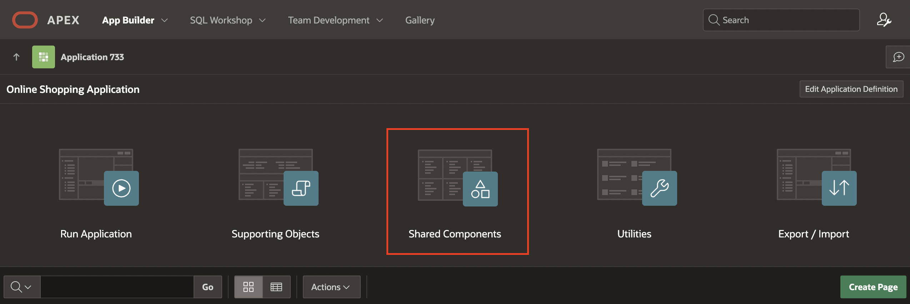

2. Under Application Logic, click **Application Items**.

    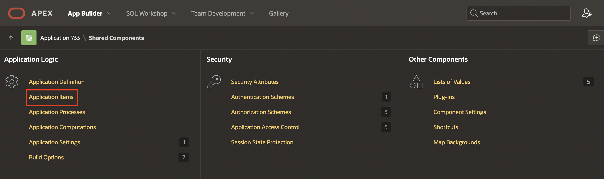

3. Click **Create**.

    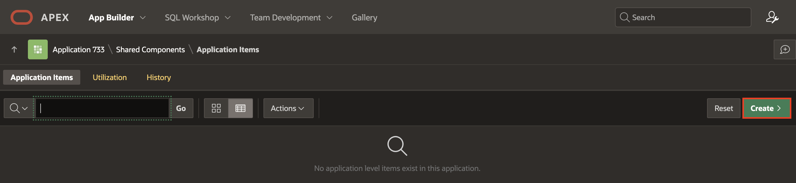

4. Create two items as follows:

    | Name                  | Scope       |
    | --------------------- | ----------- |
    | SHOPPING\_CART\_ICON  | Application |
    | SHOPPING\_CART\_ITEMS | Application |
    {: title="List of Application Items"}

5. Click **Create Application Item** and create the second item.

    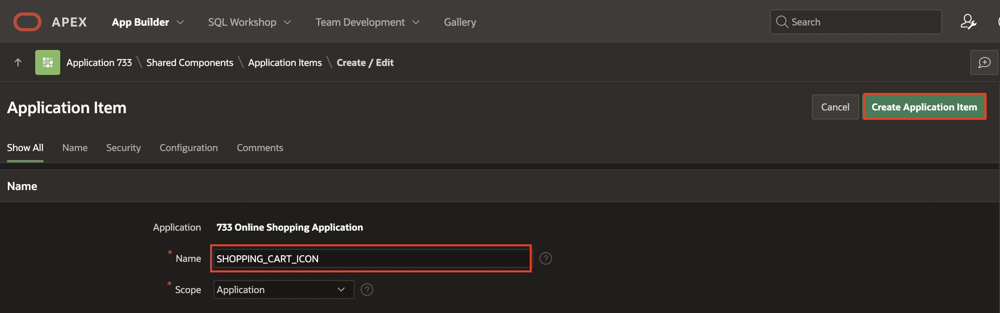

    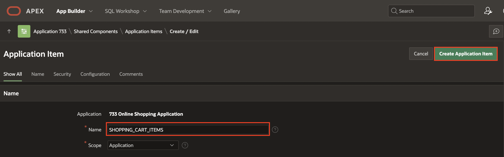

## Task 2: Create Application Process
An Application Process is needed to refresh the number of items in the shopping cart, shown in the navigation bar.

1. Click **Shared Components**.

    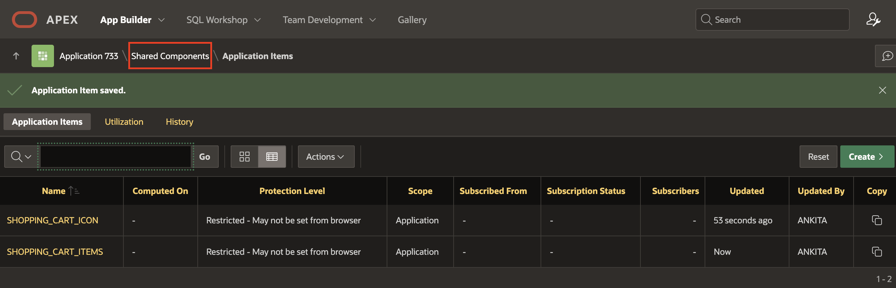

2. Under Application Logic, click **Application Processes**.

    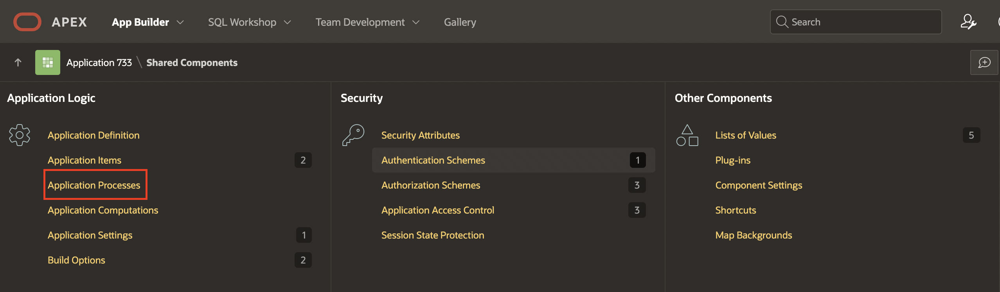

3. Click **Create** and enter the following:

    - Name: **Initialize Shopping Cart Header**

    - Process Point: **On Load: Before Header (page template header)**

  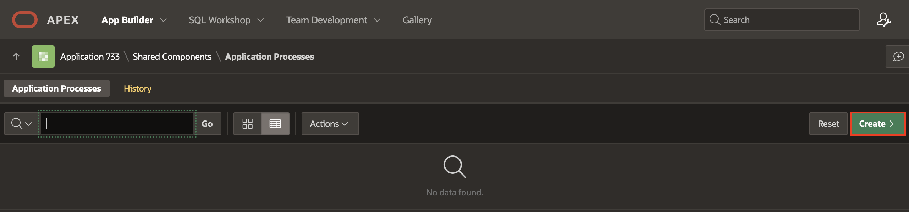

  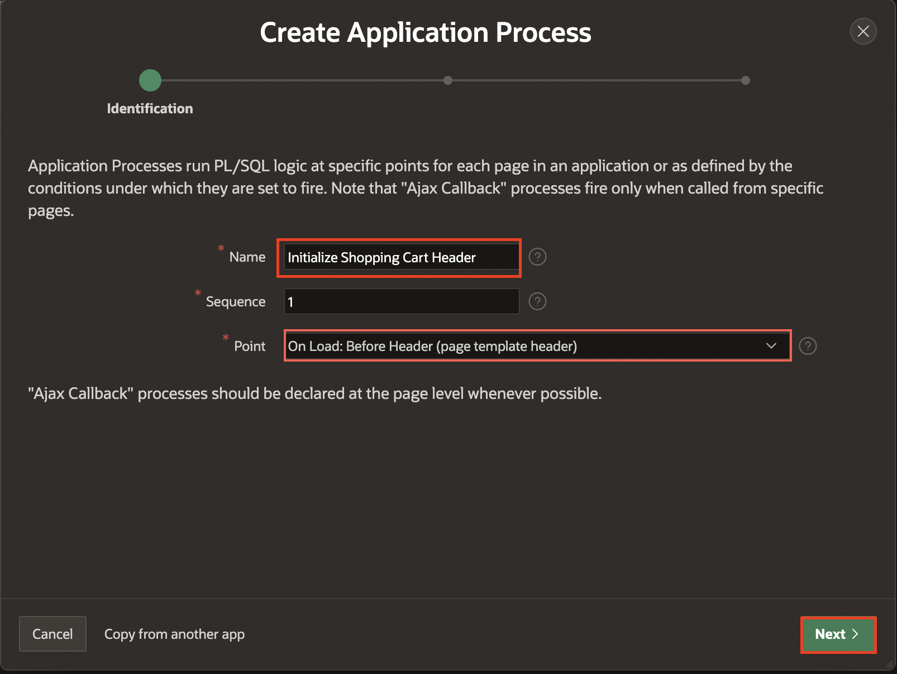

4. Click **Next**.

5. For **Code**, copy and paste below code snippet:

    ```
    <copy>
    -- Initialize the shopping cart navigation bar to show appropriate icons and count
    DECLARE
        l_cnt NUMBER := manage_orders.get_quantity;
    BEGIN
        IF l_cnt > 0 THEN
            :SHOPPING_CART_ITEMS := l_cnt;
            :SHOPPING_CART_ICON := 'fa-cart-full';
        ELSE
            :SHOPPING_CART_ITEMS := '';
            :SHOPPING_CART_ICON := 'fa-cart-empty';
        END IF;
    END;
    </copy>
    ```

6. Click **Next**.

    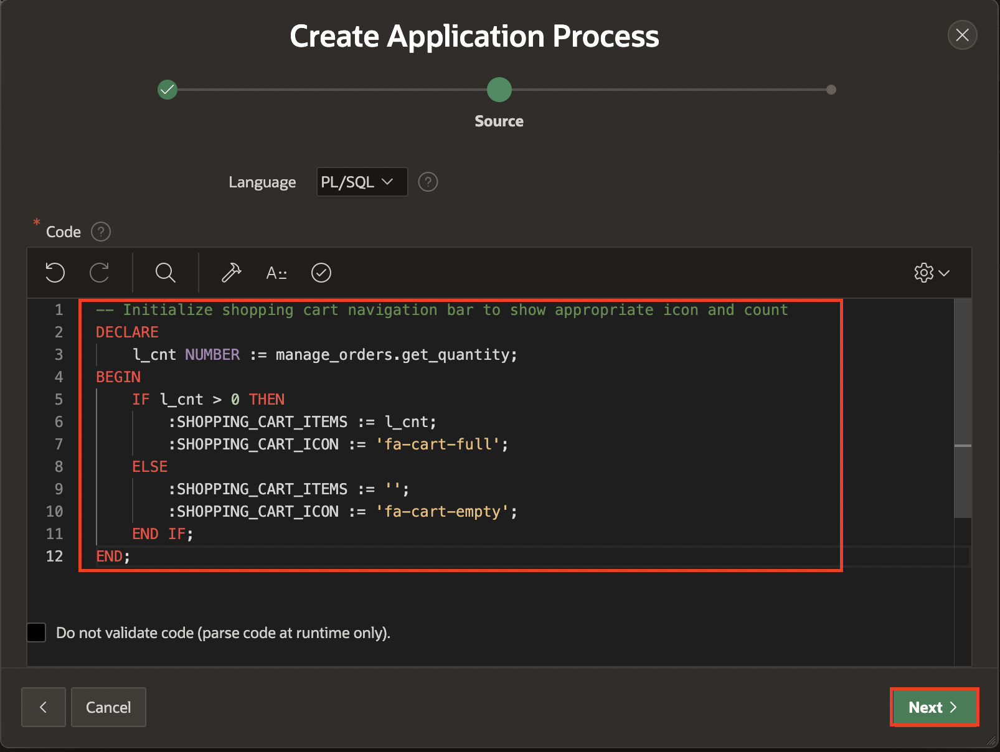

7. Click **Create Process**.

    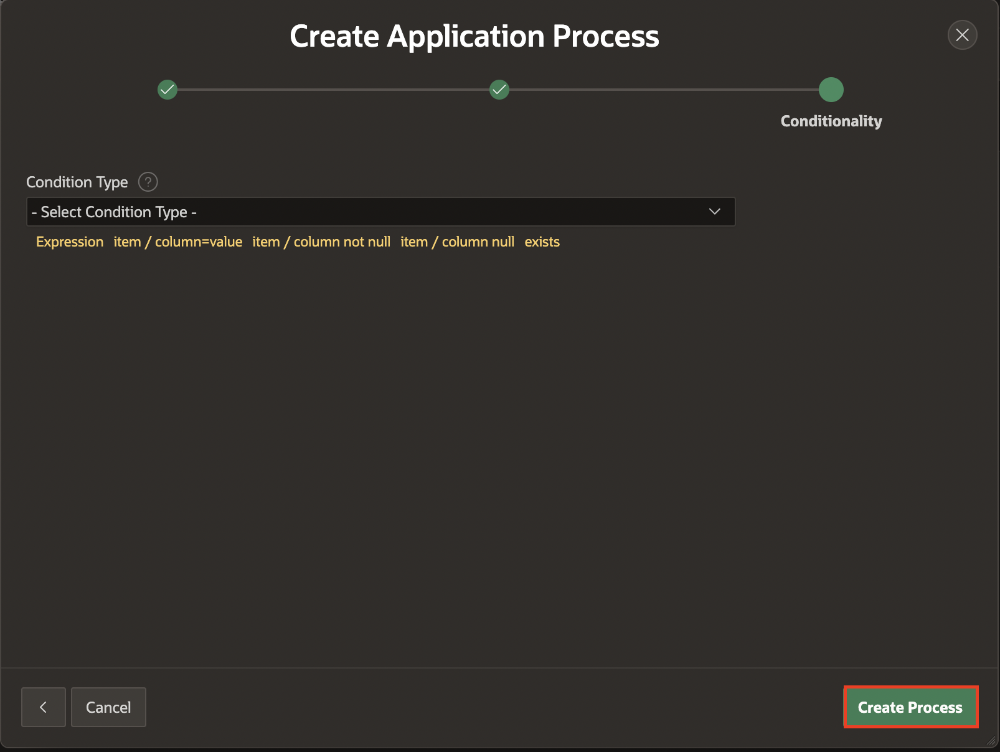

## Task 3: Create a Blank Page for Checkout
The shopping cart page allows users to review and edit the products in the cart. Also, users can create an order or clear the shopping cart.

1. Click **Application ID**.  ***The ID of your application may vary***.

    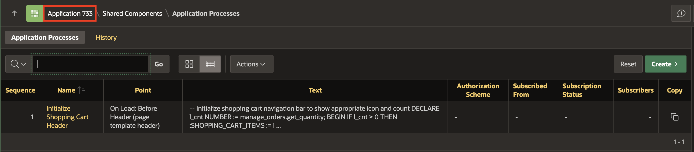

2. Click **Create Page**.

    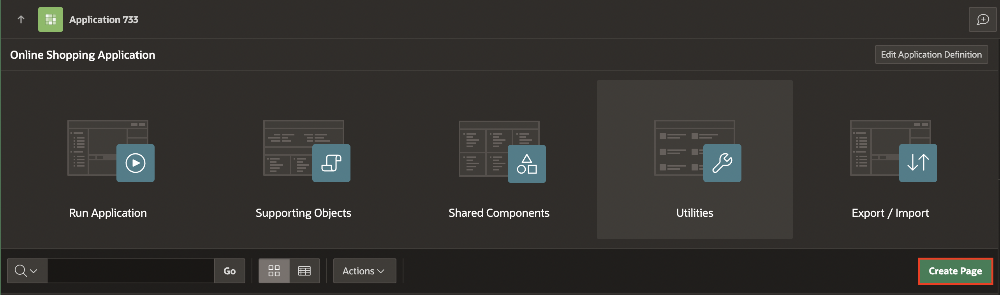

3. Select **Blank Page**.

    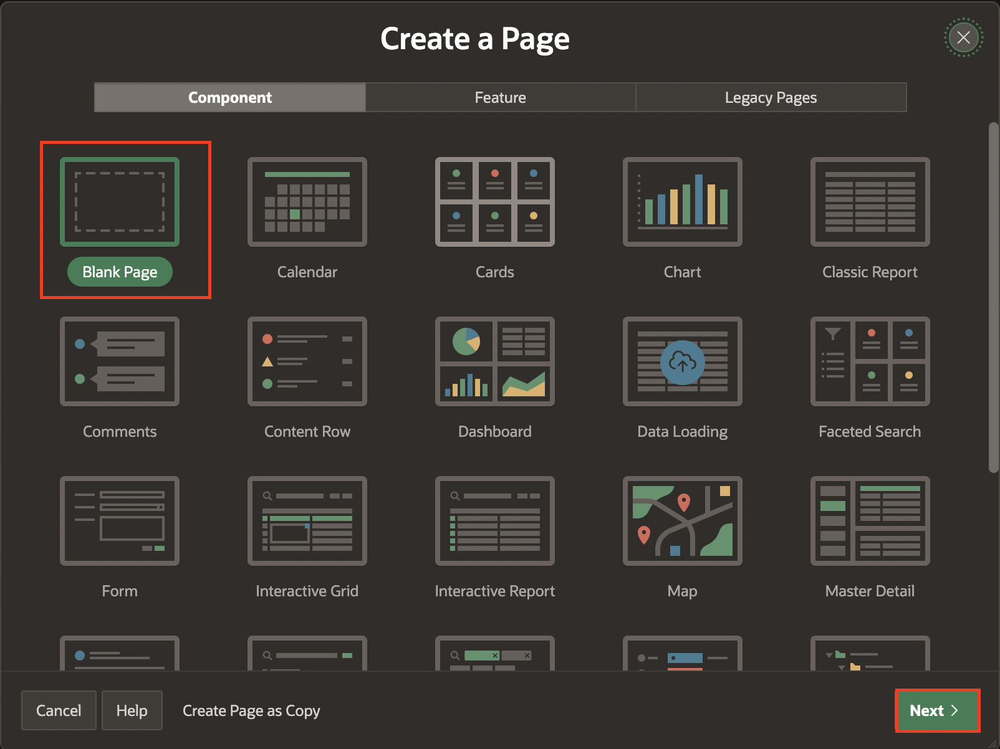

4. In the Create Blank Page wizard, enter/select the following:

  - Under **Page Definition**:

      - Page Number: **16**

      - For Name: **Shopping Cart**

  - Under **Navigation**:

      - Use Breadcrumb: Toggle the button to **OFF**

      - Use Navigation: Toggle the button to **OFF**

   Click **Create Page**.

 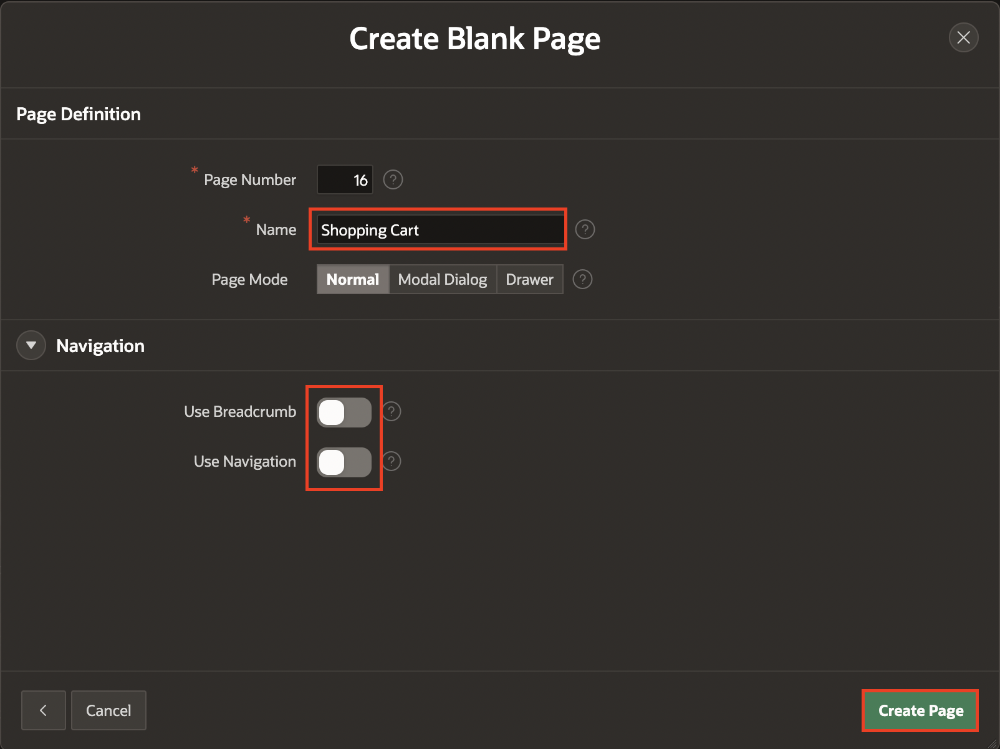

## Task 4: Add a Cards Region
This region will list the items added temporarily to the shopping cart.

1. Navigate to gallery in the newly created page.
2. Drag a **Cards** region and drop it to the  **Body** section.

    

3. In the Property Editor, enter/select the following:
    - Title: **Shopping Cart**
    - Under Source:
        - Type: **SQL Query**
        - SQL Query: Enter the following SQL Query:

          ```
              <copy>
              SELECT seq_id item,
                  p.product_image,
                  p.product_id,
                  p.product_name name,
                  p.unit_price,
                  n002               quantity,
                  p.unit_price* n002 subtotal,
                  b.brand
              FROM   apex_collections a,
                  products p,
                  json_table (p.product_details, '$' columns ( brand varchar2(4000) path '$.brand') ) b
              WHERE  collection_name = 'PRODUCTS'
              AND    p.product_id = a.n001
              </copy>
          ```
        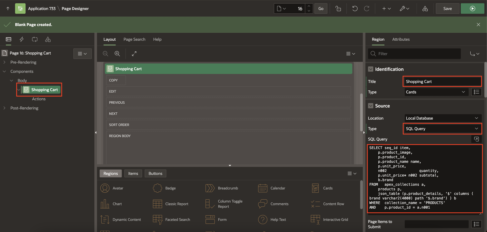

4. Click **Attributes** and enter the following:

   - Appearance > Layout: **Horizontal (Row)**

   - Title > Column: **NAME**

   - Subtitle > Column: **BRAND**    

   - Under Body:

      - Advanced Formatting: Toggle the button to **ON**

      - HTML Expression: Enter the following:

        ```
          <copy>
          Quantity: &QUANTITY.
          </copy>
        ```

     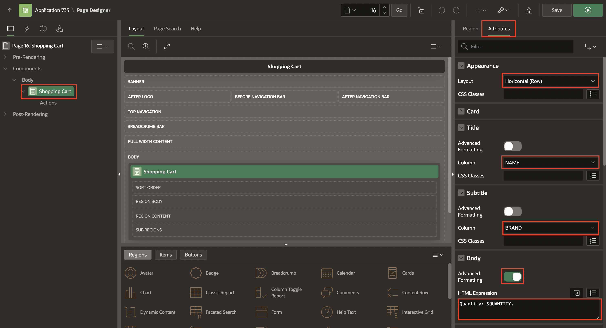

  - Under Secondary Body:

      - Advanced Formatting: Toggle the button to **ON**

      - HTML Expression: Enter the following:

      ```
                <copy>
                <b>Unit Price: &UNIT_PRICE. </b> <BR>
                <b>Subtotal: &SUBTOTAL. </b>
                </copy>
      ```

  - Under Media:

      - Source: **BLOB Column**

      - BLOB Column: **PRODUCT_IMAGE**  

      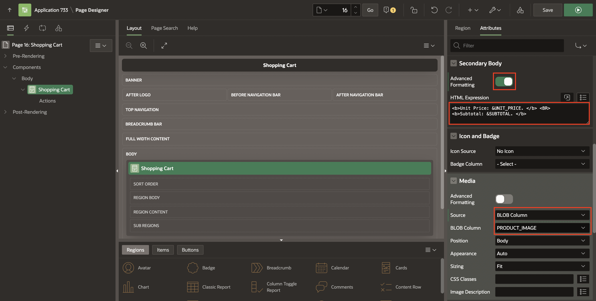

  - Under Messages:

      - When No Data Found: **Your shopping cart is empty!**

      - No Data Found Icon: **fa-cart-empty**

  - Cards > Primary Key Column 1: **ITEM**


  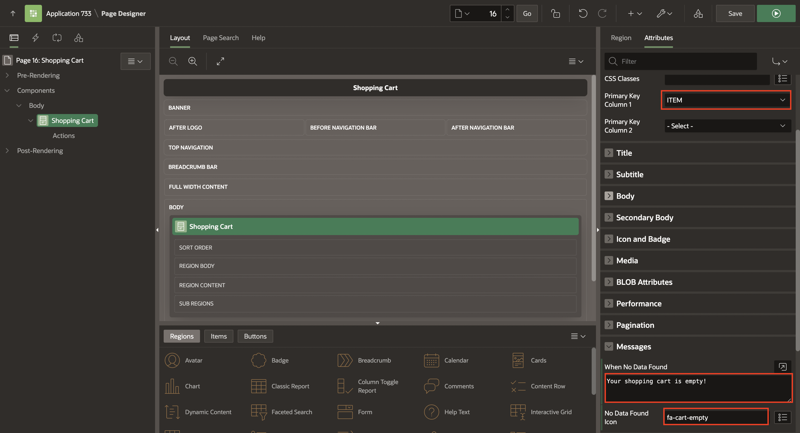

## Task 5: Add an Action to the Shopping Cart
The action we add in this task allows customers to open a page to edit a particular item in the shopping cart.

1. In the Rendering tree (left pane), navigate to**Shopping Cart** > **Actions**.
2. Right-click **Actions** and click **Create Action**.

 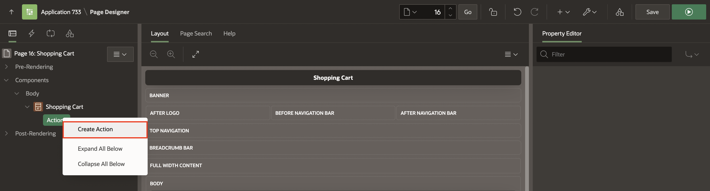

3. In the Property Editor, enter/select the following:
    - Label: **Edit**
    - Target: **No Link Defined**:
      - Page: **17**  
          *{Note: Page 17 will be created in the next lab}*
      - Set items:

            | Name             | Value        |
            | ---------------- | ------------ |
            | P17\_PRODUCT\_ID | &PRODUCT_ID. |

      Click **Ok**.

    - Under Appearance:

      - Display Type: **Text with Icon**

      - Icon: **fa-cart-edit**

    Click **Save**.

    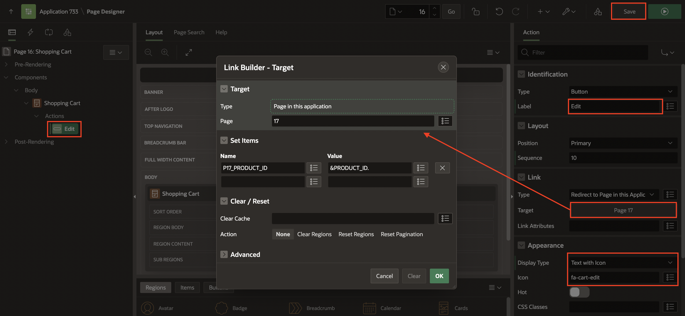

    This configures the (Edit) button to open page 17, passing the value of the PRODUCT_ID column of the current card as the value for the page item P17\_PRODUCT\_ID in the called page (page 17).

## Task 6: Create a Modal Page

Create a Modal Page to add products to the cart.

1. Navigate to **+** icon and select **Page**.

  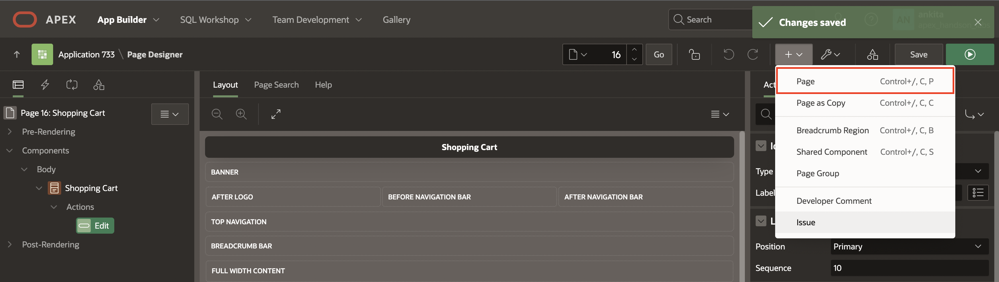

2. Select **Blank Page**.

  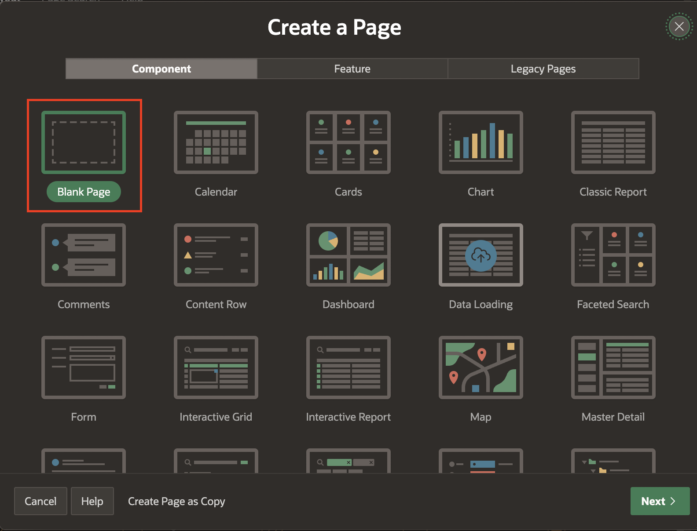

3. Enter/select the following:

    - Page Number: **17**

    - Name: **Add to Cart**

    - Page Mode: **Modal Dialog**  

   Click **Create Page**.

   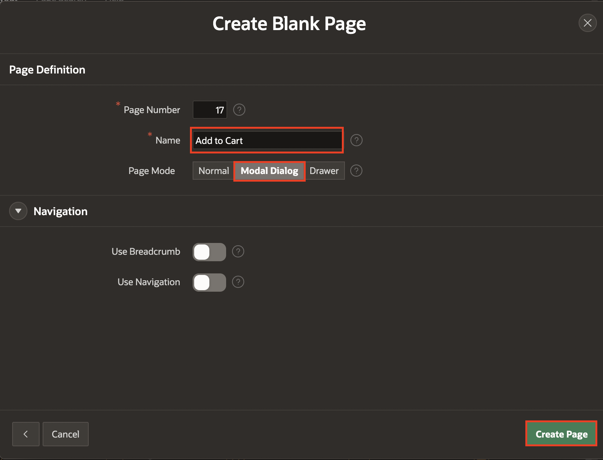


## Task 7: Add Cards Region for Product Details

This region allows users to review the product details, such as brand, price, description, and more.

1. Once the new modal page is created, navigate to the **Gallery Menu**.

2. Drag a **Cards** region and drop it in the Content Body section.

     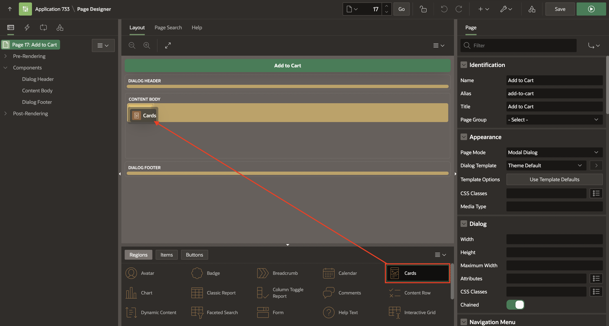  

3. In the Property Editor, enter/select the following:

    - Title: **Product**

    - Under Source:

        - Type: **SQL Query**

        - SQL Query: Enter the following SQL Code:

        ```
        <copy>
              SELECT product_id,
                  product_name,
                  unit_price,
                  product_details,
                  product_image,
                  image_mime_type,
                  image_filename,
                  image_charset,
                  image_last_updated,
                  color_id,
                  department_id,
                  clothing_id,
                  d.description,
                  b.brand
              FROM   products p,
                  json_table (p.product_details, '$' columns ( description varchar2(4000) path '$.description') ) d,
                  json_table (p.product_details, '$' columns ( brand       varchar2(4000) path '$.brand') ) b
              WHERE  product_id = :p17_product_id
              </copy>
        ```

    

    - Under Appearance, click **Template Options**:

        - Style: **Style C**

        Click **OK**.

        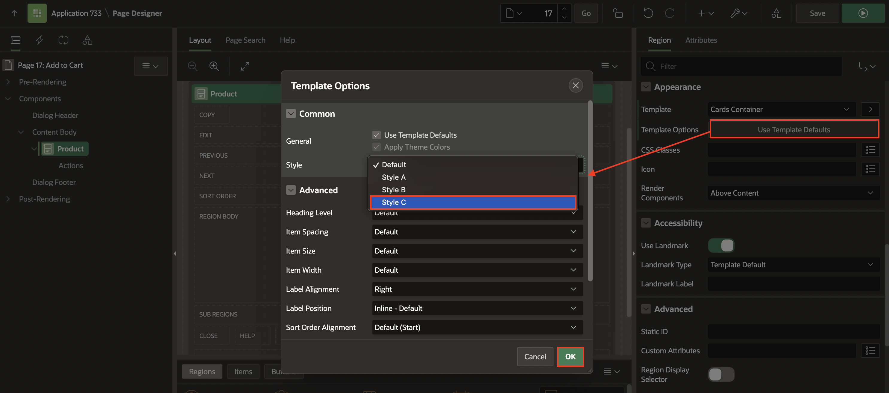

4. Click **Attributes** and enter the following:

   - Appearance > Layout: **Float**

   - Title > Column: **PRODUCT_NAME**

   - Subtitle > Column: **BRAND**

   - Body > Column: **DESCRIPTION**

  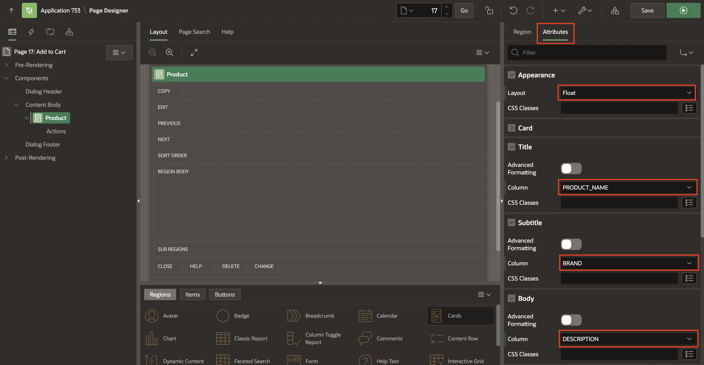

   - Under Secondary Body:

      - Advanced Formatting: Toggle the button to **ON**

      - HTML Expression: Enter the following:

          ```
          <copy>
          Price: &UNIT_PRICE.
          </copy>
          ```   

   - Under **Media** section:

      - Source: **BLOB Column**

      - BLOB Column: **PRODUCT_IMAGE**

      - Position: **First**

      - Appearance: **Square**

      - Sizing: **Fit**  

      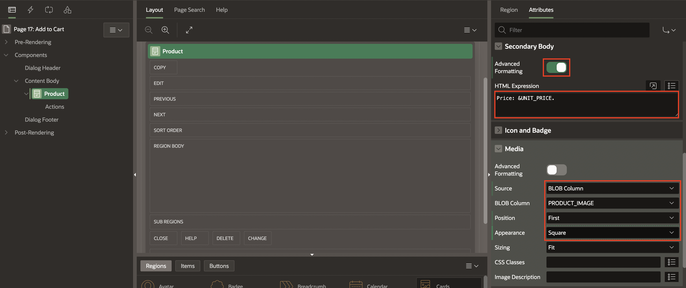


   - Card > Primary Key Column 1: **PRODUCT_ID**    

   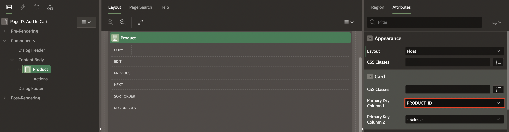

## Task 8: Add Cards Region for Customer Reviews
This region lets users read the customer reviews for this product.

1. Navigate to the **Gallery Menu**.

2. Drag a **Cards** region and drop it to the Content Body section under **Product** region.

     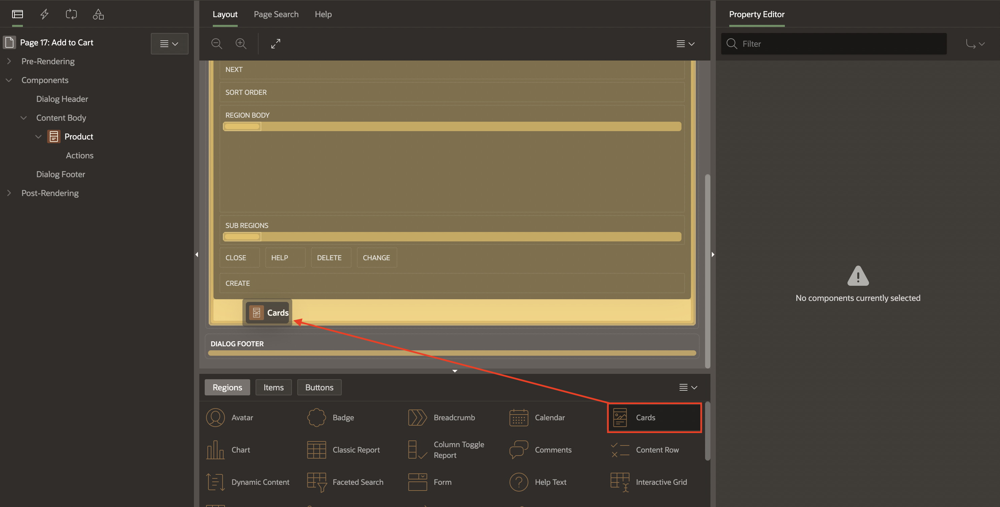  

3. In the Property Editor, enter/select the following:
    - Title: **Customer Reviews**

    - Under Source:
      - Type: **SQL Query**

      - SQL Query: Enter the following SQL Code:

      ```
              <copy>
              SELECT m.rating,
                  m.review
              FROM   products p,
                  product_reviews m
              WHERE  p.product_name = m.product_name
                  AND p.product_id = :p17_product_id
                  order by m.rating desc
              </copy>
        ```

    - Appearance > Template: **Standard**

    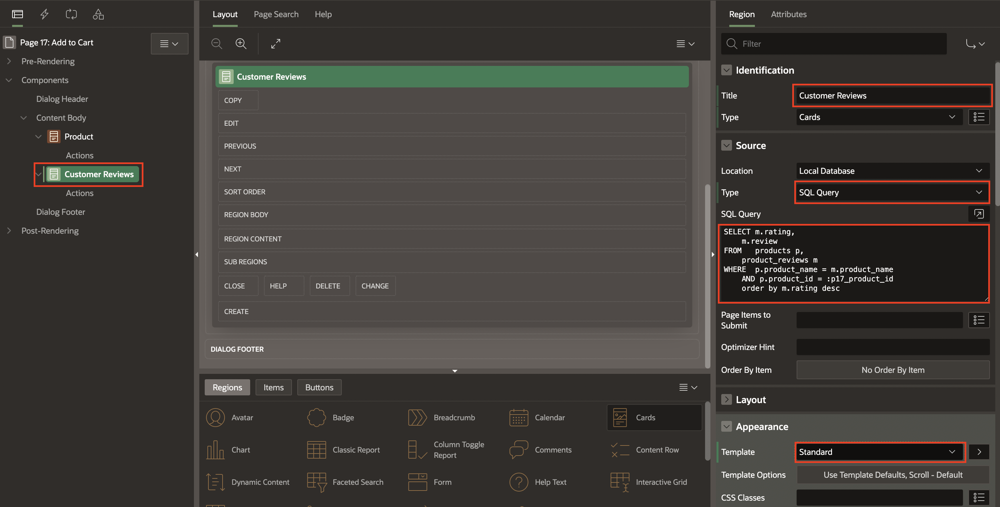

4. Click **Attributes** and enter the following:

    - Appearance > Layout: **Horizontal (Row)**

    - Under Title:

        - Advanced Formatting: Toggle the button to **ON**

        - HTML Expression: Enter the following:

        ```
                <copy>
                <b>Review:</b> &REVIEW. <br>
                <b>Rating:</b> &RATING.
                </copy>
          ```  

        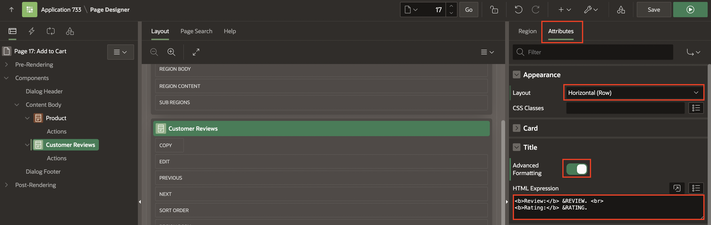

    - Messages > When No Data Found: **There are no customer reviews yet.**

      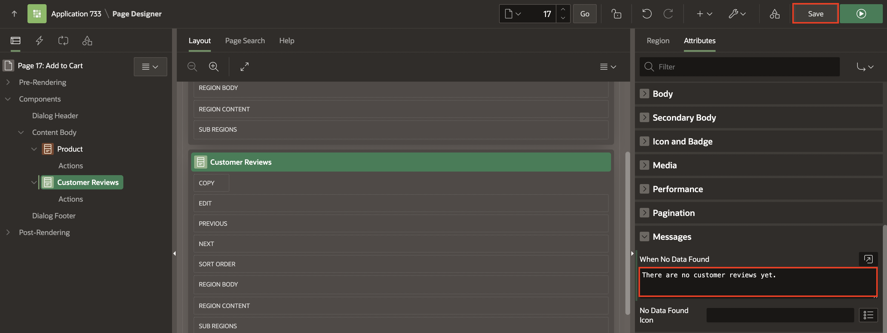

5. Click **Save**.

## Task 9: Add the Products Page.

1. Click **+** icon and select **Page**.

  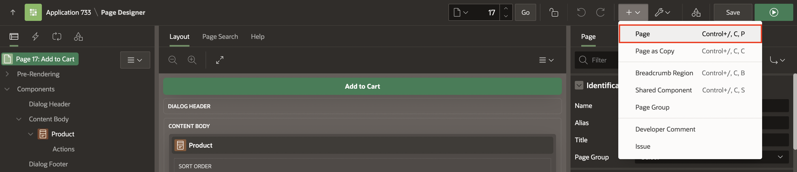

2. Select **Faceted Search**.

  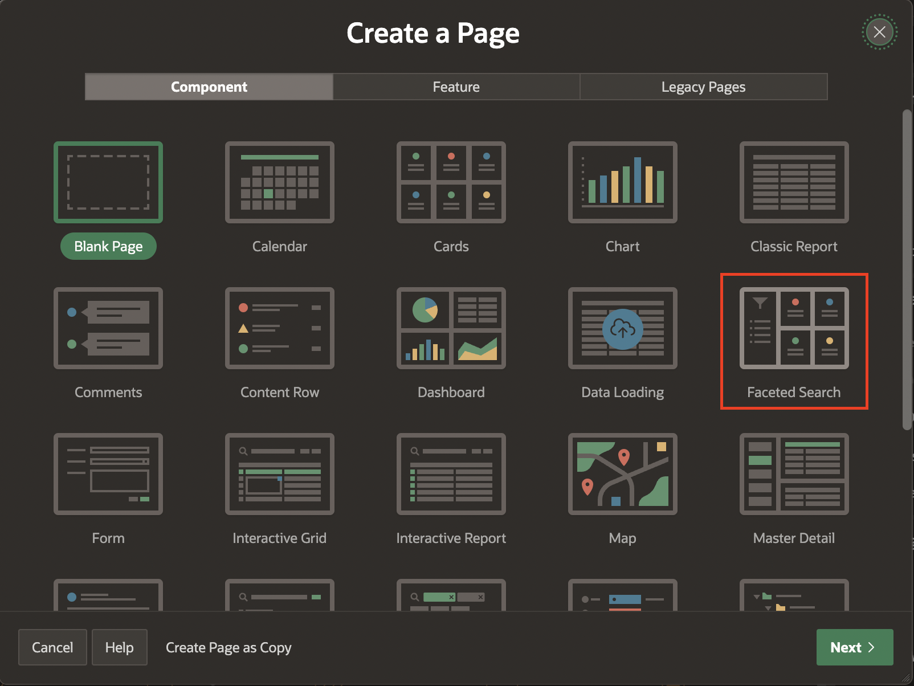

3. Enter the following:
    - Under Page Definition:

        - Page Number: **19**

        - Name: **Products**

    - Data Source > Table/View Name: **PRODUCTS**

    - Navigation > Use Breadcrumb: Toggle the button to **OFF**

  Click **Next**.

   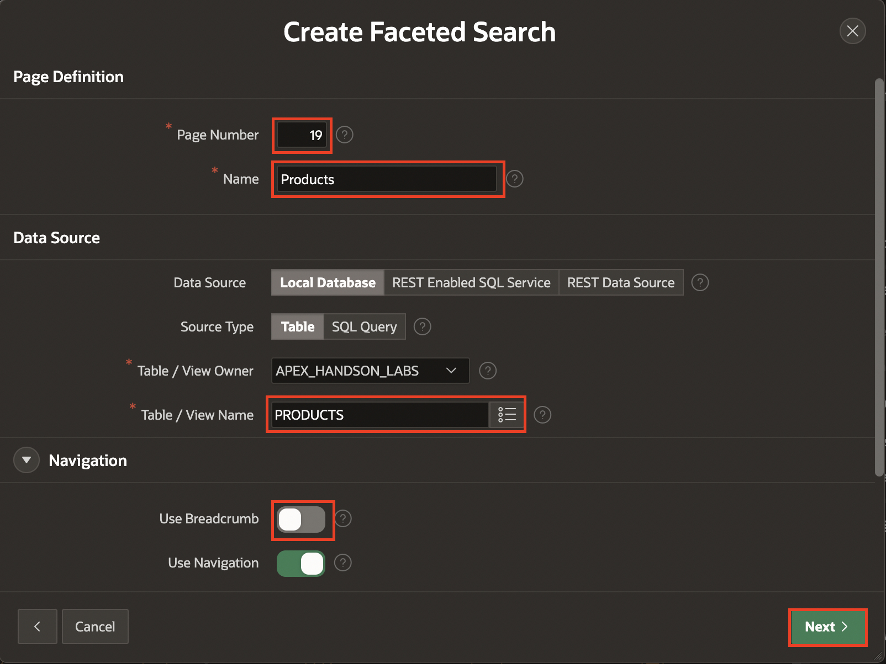

4. For Facet Selection, select the **Display as** option as **Cards**.

  Click **Refresh**. Accept the remaining default options, and click **Next**.

    

5. In the Create Faceted Search wizard, enter/select the following:

     - Cards Layout: **Grid**

     - Title Column: **PRODUCT_NAME**

     - Body Column : **- Select Column -** (to unselect the default column chosen)

     Click **Create Page**.

    

## Summary
You now know how to create an Application item, Application process, Faceted search page and Cards page. You may now **proceed to the next workshop**.

## What's Next?
In the next workshop, you learn how to customize an Interactive Report as a developer and an end-user.

## Acknowledgements
- **Author** - Roopesh Thokala, Senior Product Manager
- **Contributor** - Ankita Beri, Product Manager
- **Last Updated By/Date** - Ankita Beri, Product Manager, January 2024
