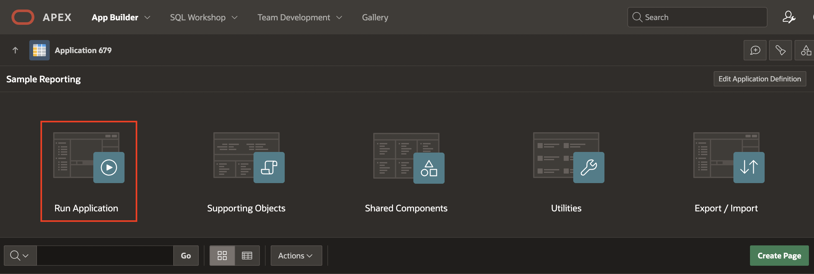
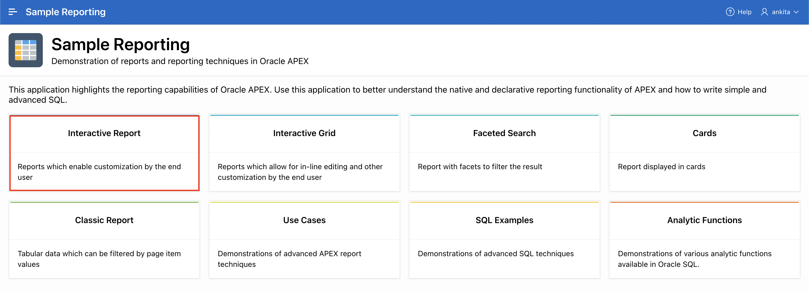
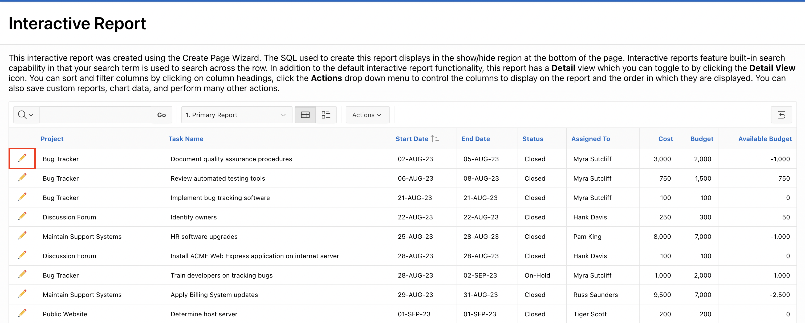
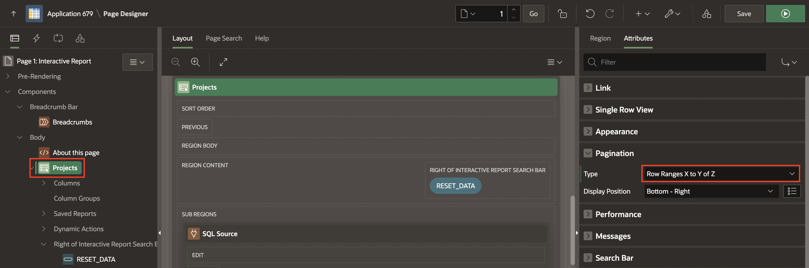
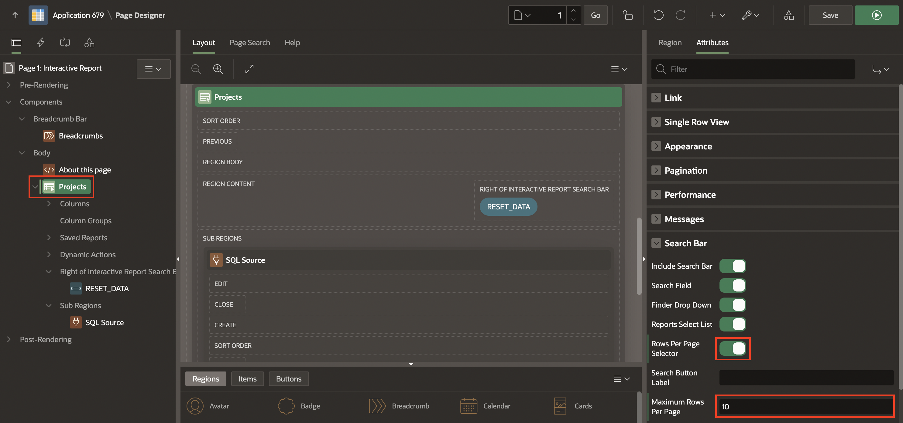
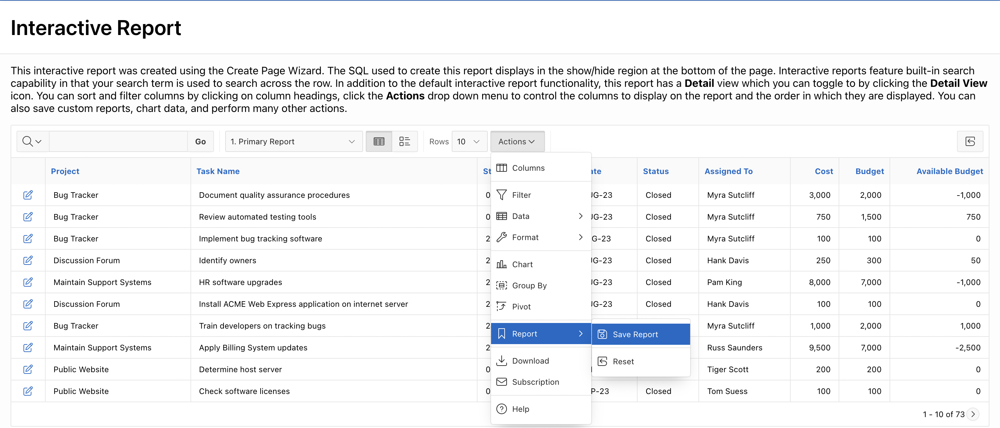
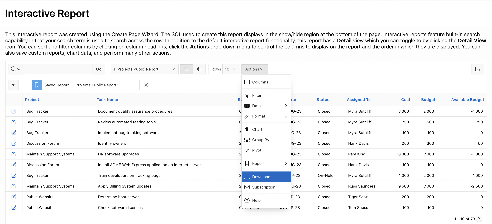

# Customize Interactive Report as a Developer

In this hands-on lab, you will Manage and Customize the Interactive report in the **Sample Reports** application as a **Developer**.

Estimated Time: 15 minutes

### Objectives

In this lab, you:
- Customize your Interactive Report page in **Sample Reports** Application both as a **Developer**.

### Downloads

- Did you miss out on trying the previous labs? Don't worry! You can download the application from [here](https://c4u04.objectstorage.us-ashburn-1.oci.customer-oci.com/p/EcTjWk2IuZPZeNnD_fYMcgUhdNDIDA6rt9gaFj_WZMiL7VvxPBNMY60837hu5hga/n/c4u04/b/livelabsfiles/o/data-management-library-files/apex-23-2-object-storage-files/hol6-lab1.sql) and import it into your workspace. To run the app, please run the steps described in the following workshops:
1. **[Get Started with Oracle APEX](https://livelabs.oracle.com/pls/apex/r/dbpm/livelabs/run-workshop?p210_wid=3509)**
2. **[Using SQL Workshop](https://livelabs.oracle.com/pls/apex/r/dbpm/livelabs/run-workshop?p210_wid=3524)**

## Task 1: Customize an Interactive Report as a Developer

In this lab, you edit an interactive report in Page Designer and customize it as a Developer for end users.

1. On the Workspace home page, click **App Builder**. Select **Sample Reporting** Application.

    

2. Click **Run Application**.

    

3. Select **Interactive Report**.

    

4. First, view the Interactive Report in the page designer. In the Developer Toolbar, click **Edit Page \<n\>**.

      

5. When the end users click an edit icon for a specific row, they should be directed to a page showing the row's column values. The interactive report currently has a link column to a Form Page. Modify your interactive report to have a link to a single-row view.

    a. Under Rendering, navigate to **Projects** Interactive Report and then, in the Property Editor select **Attributes**. For Link > Link Column, select **Link to Single Row View**.

    Click **Save and Run**.

    

    b.  In the report, ensure that **1. Primary Report** is selected in the report toolbar. Click the **edit icon** (**pencil**) for any row.

    

    c. The single-row view is displayed. Click **Report View** to return to the report.

    

6. The current pagination type of the interactive report is **Row Ranges X to Y**. Let's say you always want to show your end users the total number of rows in the report as part of the pagination display. To do so, in the Developer Toolbar, click **Edit Page 1**.  

    a. In the Rendering tree, navigate to **Projects** Interactive Report and in the Property Editor, select **Attributes**.  

    b. Under Pagination, for Type, select **Row Ranges X to Y of Z**.

    

7. You want to customize the display of the Search Bar. End users should be able to select the display of the desired number of rows per page.  

    In the Property Editor, navigate to **Attributes > Search Bar**. Enter/select the following:

    - Rows Per Page Selector: Toggle the button to **ON**
    - Maximum Rows Per Page: **10**

    

8. You want to enable the **Excel** and **PDF** download formats and disable **Send as Email** formats in the Download option.

    In the property editor, do the following:
    - Under Download:
        - Formats: Enable **Excel** and **PDF** checkboxes
        - Send as Email: Toggle the button to **ON**

    

9. Now that you have finished the customization for end users, click **Save and Run**.

10. Notice that the **row selector** and the **New pagination type** are available on the report.

    

11. Select **Actions** > **Report** > **Save Report**.

    

12. The Save Report dialog displays. Notice that the **Public** check box is now available. Enter/select the following:

    - Save(Only displayed for developers): **As Named Report**
    - Name: **Projects Public Report**
    - Enable the **Public** checkbox

    Click **Apply**.

    

13. This report is now saved as a public report for all users and is available in the Reports drop-down list.

    

14. Click **Actions** > **Download**.

15. Notice that the **Excel** and **PDF** formats are available. Click the **Close** icon.

    

    

16. From the Reports drop-down list, select **Primary Report**.

## Summary

You now know how to Manage and Customize the Interactive report as a developer. You may now **proceed to the next lab**.

## Acknowledgements

- **Author** - Roopesh Thokala, Senior Product Manager
- **Last Updated By/Date** - Ankita Beri, Product Manager, January 2024
