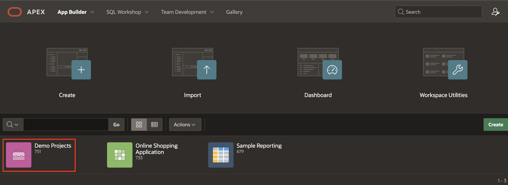
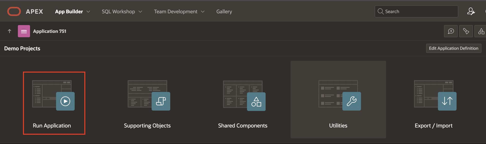
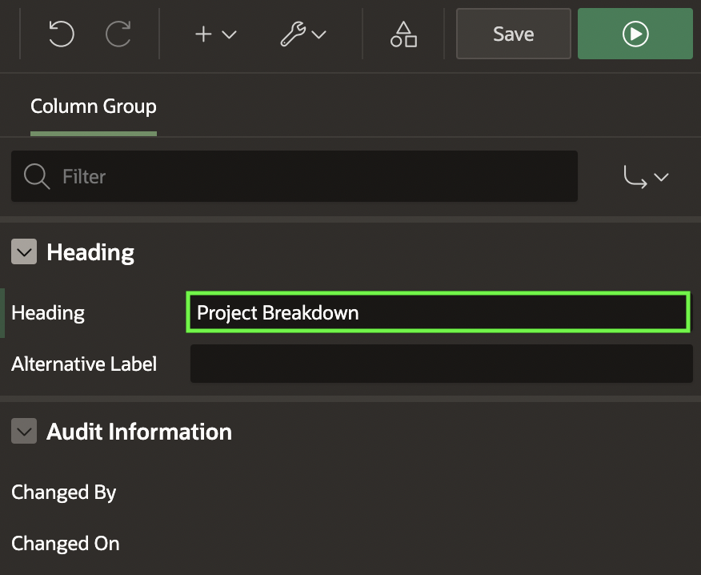
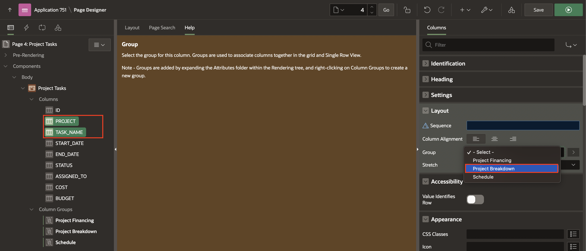
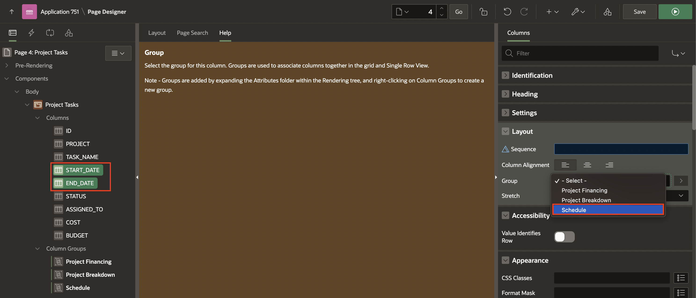
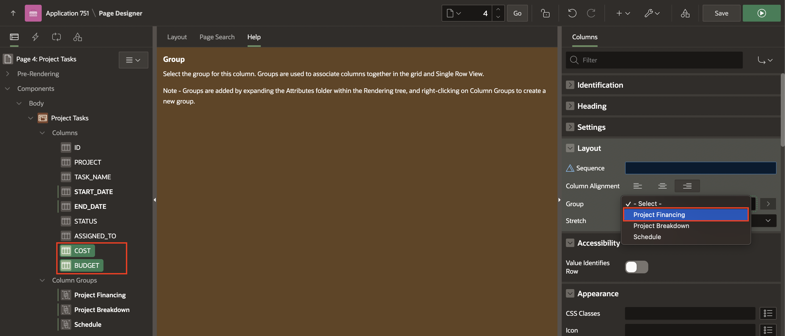
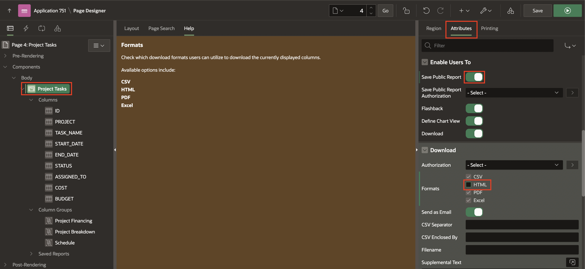
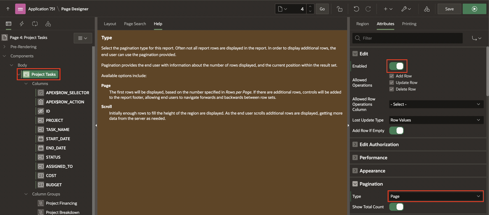
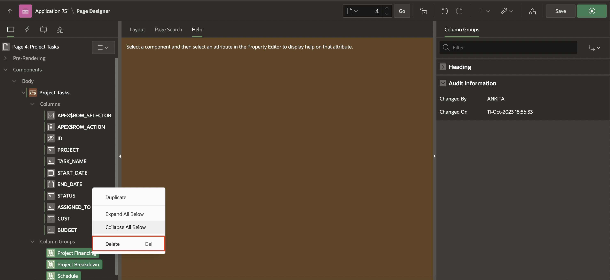

# Customize Interactive Grid as a Developer

### Objectives
In this lab, you customize:
  - **Project Tasks** page we Created in Workshop 5 (**Developing Reports**).
  - **Interactive Grid** Page as a developer.

Estimated Time: 20 minutes

### Downloads

- Did you miss out on trying the previous labs? Don’t worry! You can download the application from [here](https://c4u04.objectstorage.us-ashburn-1.oci.customer-oci.com/p/EcTjWk2IuZPZeNnD_fYMcgUhdNDIDA6rt9gaFj_WZMiL7VvxPBNMY60837hu5hga/n/c4u04/b/livelabsfiles/o/data-management-library-files/apex-23-2-object-storage-files/hol5-lab1.sql) and import it into your workspace. To run the app, please run the steps described in the following workshops:
1. **[Get Started with Oracle APEX](https://livelabs.oracle.com/pls/apex/r/dbpm/livelabs/run-workshop?p210_wid=3509)**
2. **[Using SQL Workshop](https://livelabs.oracle.com/pls/apex/r/dbpm/livelabs/run-workshop?p210_wid=3524)**

## Task 1: Manage and Customize Interactive Grid as a Developer
This lab uses the **Demo Projects** application. In this lab, you customize the **Interactive Grid** for end users. You create column groups, set pagination type, and set the report downloadable formats that should be available for end users. You also enable end users to save the report as Public interactive grids and convert a read-only interactive grid to an editable interactive grid.

1. Navigate to **App Builder** and run the **Demo Projects** application.

    

    

2. In the navigation menu, click **Projects Tasks**. You want to customize the display of this interactive grid for your end users. In the Developer Toolbar, click **Edit Page 4**.

    

3. Add column group headers to the interactive grid as:
    - **Project Breakdown**: Project, Task_Name columns
    - **Schedule**: Start\_Date, End\_Date columns
    - **Project Financing**: Cost, Budget columns  

    a) In the page designer, navigate to Components > Body > **Project Tasks** Interactive Grid region and right-click **Column Groups**. Select **Create Column Group**.

    

    b) In the Property Editor, for Heading enter **Project Breakdown**.

    

    c) Repeat the above two steps **a** and **b** to create column groups: **Schedule** and **Project Financing**.

    d) Now that you have created column groups, you need to assign columns to them.

    Expand **Columns** in the rendering tree and select **Project** and **Task_Name** columns.

    e) In the property editor, under **Layout**, select **Project Breakdown** for Group.

    

    f) Then, in thee rendering tree, select **Start\_Date** and **End\_Date** columns.

    In the property editor, under **Layout**, select **Schedule** for Group.

    

    g) Finally, in the rendering tree, select **Cost**, and **Budget** columns. In the property editor, under **Layout**, select **Project Financing** for Group.

    Then, click **Save and Run**.

    

    h) The interactive grid now displays column groups.

    

4. Rearrange the columns in the interactive grid. You want to display the column groups Project Breakdown, Schedule, and Project Financing in order, followed by Status and Assigned To.

    a) Hover the mouse over the **Project Financing** column group header to display the drag handle. Your mouse cursor also changes when it comes into contact with the drag handle. Click and hold the **drag** handle.

    b) Then, drag the column group to the **Status** column location. The Heading shifts out of place in the row. The Status column should follow the Project Financing column group. Release the mouse. The Project Financing column group drops into place.

    

    

5. You want to ensure end users can save Public interactive grids. You want to exclude HTML from the download formats available to end users.
    a) In the Rendering tree, select the **Project Tasks** Interactive Grid region.

    b) In the property editor, select **Attributes**, and perform the following steps:
        - Enable Users To > **Save Public Report**: Toggle the button to **ON**.
        - Under **Download**, deselect the **HTML** check box.

    

6. Convert this read-only interactive grid into an **Editable interactive grid**. Then, reset the pagination as Page type displaying the total row count.  

    a) Under Rendering, select the **Project Tasks** Interactive Grid region.

    b) In the property editor, navigate to **Attributes** and perform the following steps:
        - Edit > Enabled: Toggle the button to **ON**
        - Pagination > Type: **Page**

    

7. Delete the column groups in the interactive grid.

    Navigate to Rendering > Project Tasks Interactive Grid > Column Groups. Select **Schedule**, **Project Breakdown** and **Project Financing**, right-click and select **Delete**.

    

8. Suppose you want to display the ID column and exclude the ID column from DML operations.

    In the rendering tree, navigate to **Project Tasks > Columns > ID**.

    In the Property Editor, enter/select the following:

    - Identification > Type: **Display Only**
    - Heading > Heading: **ID**

  Click **Save and Run**.

    

## Summary
You now know how to Manage and Customize the Interactive Grid as a Developer. You may now **proceed to the next lab**.

## Acknowledgements
- **Author** - Roopesh Thokala, Senior Product Manager
- **Contributor** - Ankita Beri, Product Manager
- **Last Updated By/Date** - Ankita Beri, Product Manager, January 2024
