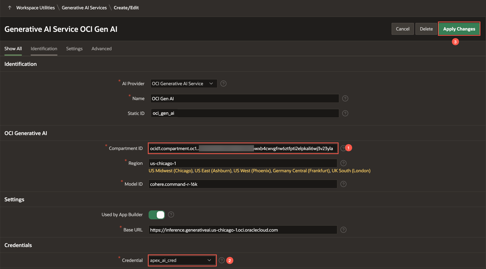

# Introduction

## About this Workshop

From precisely summarizing intricate data to crafting context-aware responses, Generative AI stands at the forefront of a technological shift, promising to redefine how we navigate and leverage knowledge in our day-to-day interactions. With the introduction of AI assisted development in Oracle APEX, enabling your applications with generative AI capabilities has never been easier.

In this workshop, you learn to bring generative AI capabilities based on large language models (LLMs) to your applications built using Oracle APEX, your favourite low-code platform. The Generative AI service can be accessed through REST APIs, and by using the powerful REST Data Source capabilities of APEX, you can effortlessly incorporate this advanced technology into your applications with a low-code approach.

<!-- ## What is OCI Generative AI service?

[Oracle Cloud Infrastructure Generative AI](https://www.oracle.com/artificial-intelligence/generative-ai/large-language-models/) is a fully managed service that provides a set of state-of-the-art, customizable large language models (LLMs) that cover a wide range of use cases for text generation. Generative AI currently supports the following pre-trained foundational models available from Meta and Cohere:

- Llama 2
- Command
- Summarize
- Embed

You can read more about these models from the [documentation](https://docs.oracle.com/en-us/iaas/Content/generative-ai/pretrained-models.htm). -->

This workshop will guide you through the process of utilizing the generation models within the Generative AI Service to develop an "Ask Questions" feature for the New York High Schools APEX application. This functionality empowers parents to inquire about school facilities, policies, and more, aiding them in making an informed decision about whether a specific school is the ideal fit for their child.

Estimated Time: 60 minutes

### **Objectives**

* Implement Faceted Search for Cards and Map Regions to filter and search for the best school.
* Build a conversational chatbot using Generative AI to ask questions about a school.
* Generate Email using Generative AI to apply to a school.

*Note: This workshop assumes you are using Oracle APEX 24.1.2 or later.*

## Prerequisites

- A paid Oracle Cloud Infrastructure (OCI) account or a FREE Oracle Cloud account with $300 credits for 30 days to use on other services. Read more about it at: [oracle.com/cloud/free/](https://www.oracle.com/cloud/free/). The OCI account must be created in or subscribed to one of the regions that supports OCI Generative AI Service. Currently, OCI Generative AI Service is supported in the following regions:

    - US Midwest (Chicago)
    - Germany Central (Frankfurt)
    - UK South (London)
    - Brazil East (Sao Paulo)

- This workshop makes use of OCI Generative AI Service. OCI Generative AI service is available in limited regions. To see if your cloud region supports OCI Generative AI service, visit the [documentation](https://docs.oracle.com/en-us/iaas/Content/generative-ai/overview.htm#regions).

- An OCI compartment. An Oracle Cloud account comes with two pre-configured compartments - The tenancy (root compartment) and ManagedCompartmentForPaaS (created by Oracle for Oracle Platform services).

- The logged-in user should have the necessary privileges to create and manage Autonomous Database instances in this compartment. You can configure these privileges via an OCI IAM Policy. If you are using a Free Tier account, it is likely that you already have all the necessary privileges.

- An APEX 24.1.2 workspace. We recommend that you sign up for a workspace on [apex.oracle.com](https://apex.oracle.com). Refer to the [Get Started: Option 3](?lab=1-sign-up-apex#Option3:apexoraclecom) lab to sign up for a new workspace.

*Note: This workshop assumes you are using Oracle APEX 24.1.2. Some of the features might not be available in prior releases and the instructions, flow, and screenshots might differ if you use an older version of Oracle APEX.*

## Labs

| Module | Est. Time |
| --- | --- |
| [Creating an APEX application](?lab=1-create-app) | 5 minutes |
| [Visualize Schools on a Map](?lab=2-schools-on-map) | 10 minutes |
| [Configure the OCI API Keys](?lab=3-configure-oci) | 10 minutes |
| [Build a Conversational Inquiry using Generative AI](?lab=4-using-genai) | 20 minutes |
| [Generate Email to Apply to a School](?lab=5-apply-to-school) | 15 minutes |
| [Run the Application](?lab=6-run-app) | 5 minutes |

Total estimated time: 60 minutes

### **Let's Get Started!**

If the menu is not displayed, you can open by clicking the menu button () at the upper-left corner of the page.

## Downloads

If you are stuck or the app is not working as expected, you can download and install the completed app as follows:

1. [Click here](https://c4u04.objectstorage.us-ashburn-1.oci.customer-oci.com/p/EcTjWk2IuZPZeNnD_fYMcgUhdNDIDA6rt9gaFj_WZMiL7VvxPBNMY60837hu5hga/n/c4u04/b/livelabsfiles/o/labfiles/nyc-gen-ai-app.zip) to download the completed application zip file.

2. Import the **nyc-gen-ai-app.zip** file into your workspace. To import the app, go to **App Builder > Import**.

3. Follow the steps in the Install Application wizard to install the app along with the Supporting Objects.

4. Once the application is installed, navigate to **App Builder > Workspace Utilities > Web Credentials**.

5. Edit the **apex\_ai\_cred** details to match with your OCI API Key. Refer to the lab: [Configure the OCI API Keys](?lab=3-configure-oci) to create an OCI API Key.

     
6. Navigate to **App Builder > Workspace Utilities > Generative AI**. Edit the **OCI Gen AI** service.

    - Enter the **Compartment ID**. Refer to the [Documentation](https://docs.oracle.com/en-us/iaas/Content/GSG/Tasks/contactingsupport_topic-Locating_Oracle_Cloud_Infrastructure_IDs.htm#:~:text=Finding%20the%20OCID%20of%20a,displayed%20next%20to%20each%20compartment.) to fetch your Compartment ID. If you have only one compartment, then use the OCID from the configuration file you saved while creating your OCI API Key.
    - For Credential, select **apex\_ai\_cred**.
    - Click **Apply Changes**.
    

7. All set. Now, run the application and see it in action! Follow the lab: [Run the Application](?lab=6-run-app) to run the app.

## Learn More - *Useful Links*

- [OCI Generative AI](https://www.oracle.com/artificial-intelligence/generative-ai/large-language-models/)
- [APEX on Autonomous](https://apex.oracle.com/autonomous)
- [APEX Collateral](https://www.oracle.com/database/technologies/appdev/apex/collateral.html)
- [Tutorials](https://apex.oracle.com/en/learn/tutorials)
- [Community](https://apex.oracle.com/community)
- [External Site + Slack](http://apex.world)

## Acknowledgements

 - **Authors** - Toufiq Mohammed, Senior Product Manager; Apoorva Srinivas, Senior Product Manager
 - **Last Updated By/Date** - Apoorva Srinivas, Senior Product Manager, July 2024
