# Use the Create Application Wizard

## Introduction

In this lab, you build an interactive Project Management application using the AI-driven Create Application wizard. You will make use of the Sample Dataset you installed in the previous lab.

Estimated Time: 15 minutes

### Objectives
- Create an application using the AI-driven Create Application wizard with the sample datasets installed in the previous Lab

### What You will Need

- An Oracle Cloud paid account, or free trial.
- Project Data installed from Sample dataset.

## Task 1: Create the Application using Generative AI

1. From your APEX workspace homepage, click **App Builder**.

    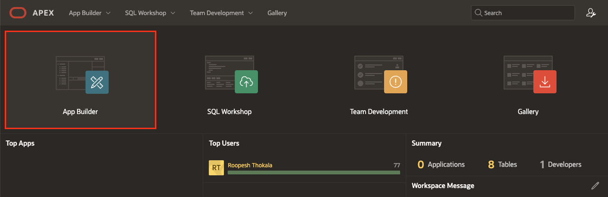

2. Click **Create**.

    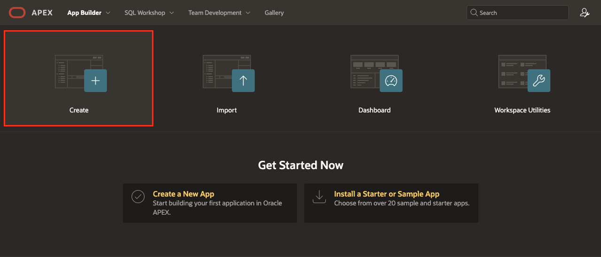

3. In the Create an Application Page, Select **Create APP Using Generative AI**

    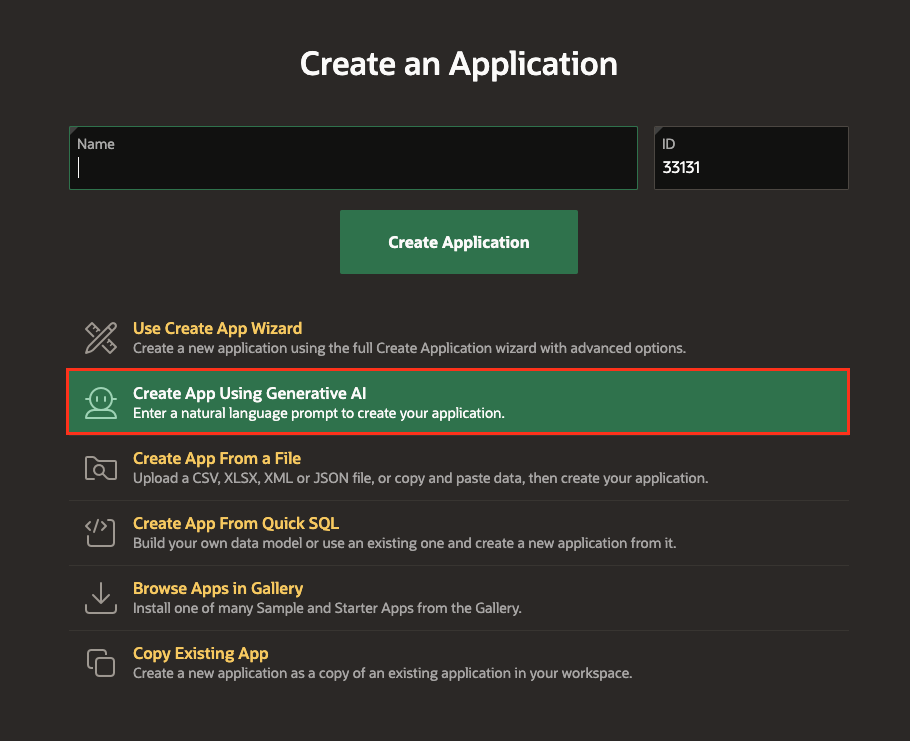

4. In the APEX Assistant Wizard, if you see a warning that says "It looks like there are some changes to tables in your workspace. Please refresh the data dictionary cache to work with the latest tables". Click on **Accept** and then click **Refresh Cache**.

     

5. Use the APEX Assistant Wizard to create an Application, to create a Project Management Application, enter the prompt mentioned below.

    >Prompt 1:
    >Create an application with Projects, Milestones, Status, Tasks, To Dos, Links, and Comments. Also, enable all the Features

    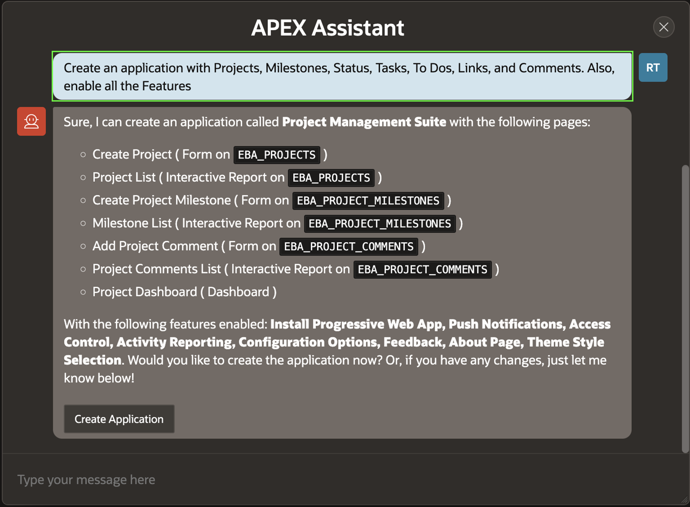

6. Now, we need to remove Form/Edit Pages from the AI-suggested pages and then convert all the Interactive Report Pages to Interactive Report with a Form.
    >Prompt 2:
    >Remove all the Form pages and convert all the Interactive Report pages to Interactive Report with a Form

    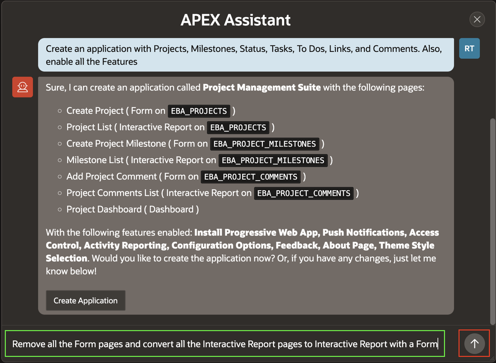
    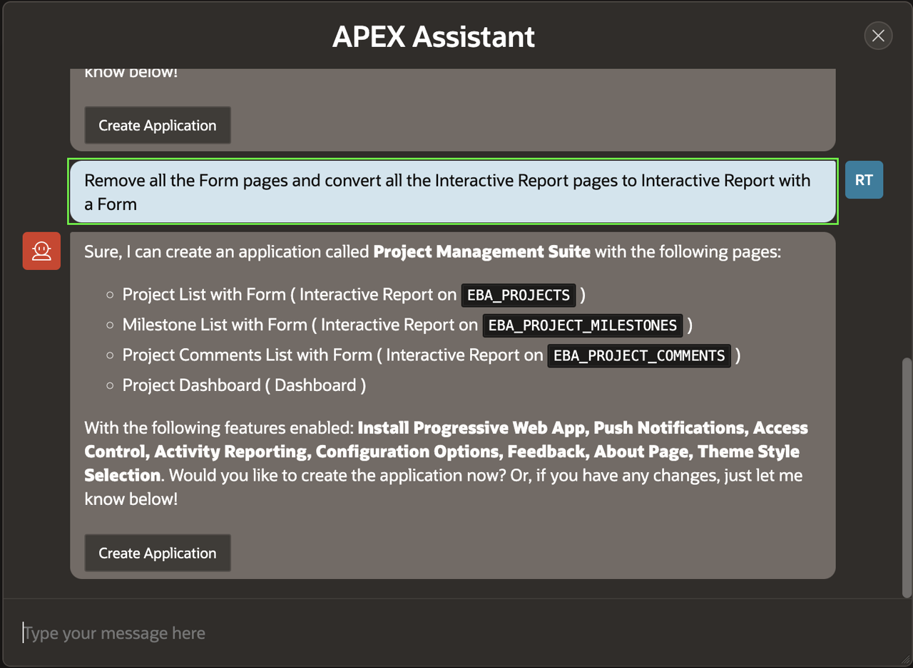

7. Similarly, you need to set the Milestones Page as an Interactive Grid and then Make the Project Dashboard page the Homepage.
    >Prompt 3:
    Set Milestones Page as Interactive Grid

    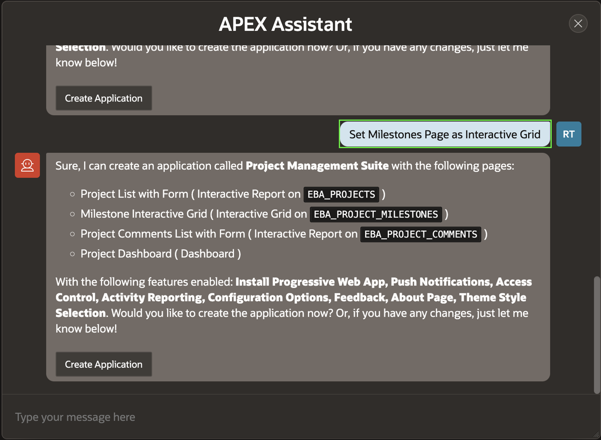

    >Prompt 4:
    Set the Project Dashboard as the homepage and make it the first page

    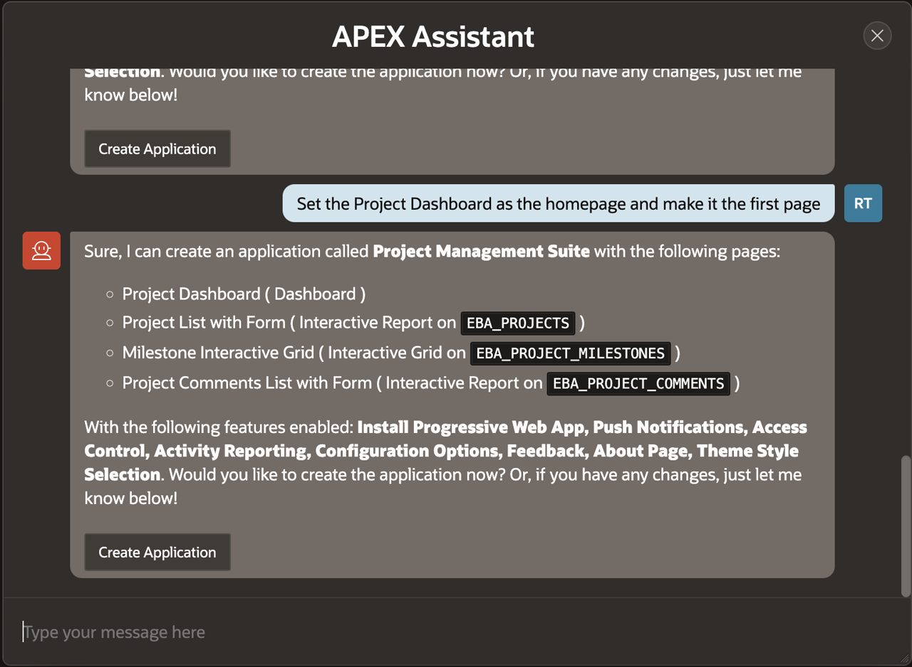

8. Then, You need to add a few more Interactive reports with Form pages to track Tasks, To Dos and Link.

    >Prompt 5:
    Add pages for Tasks, To Dos, and Links utilizing the tables EBA\_PROJECT\_TASKS, EBA\_PROJECT\_TASK\_TODOS, and EBA\_PROJECT\_TASK\_LINKS. These pages will be of the page type Interactive Reports with a Form

    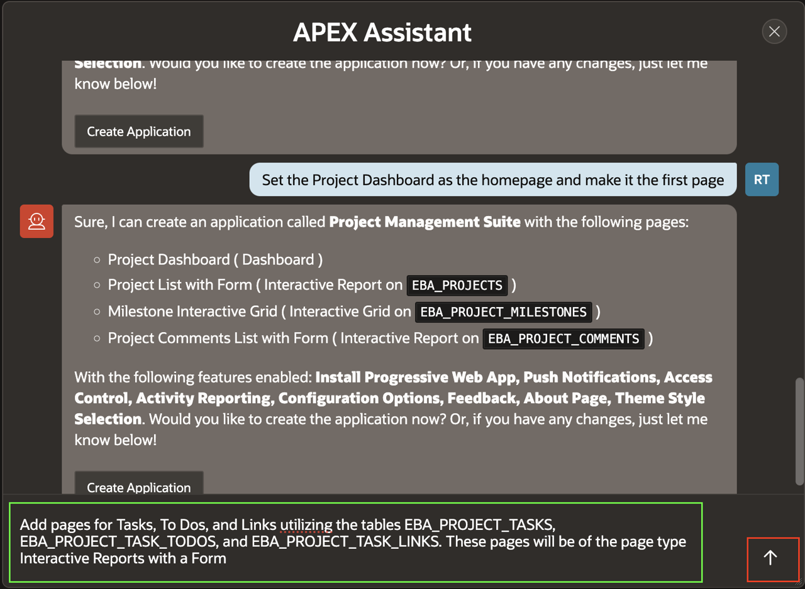

9. Finally, set the Project Dashboard Page as a Cards region and click **Create Application**.

    >Prompt 6:
    Set the Project Dashboard page as Cards Region

    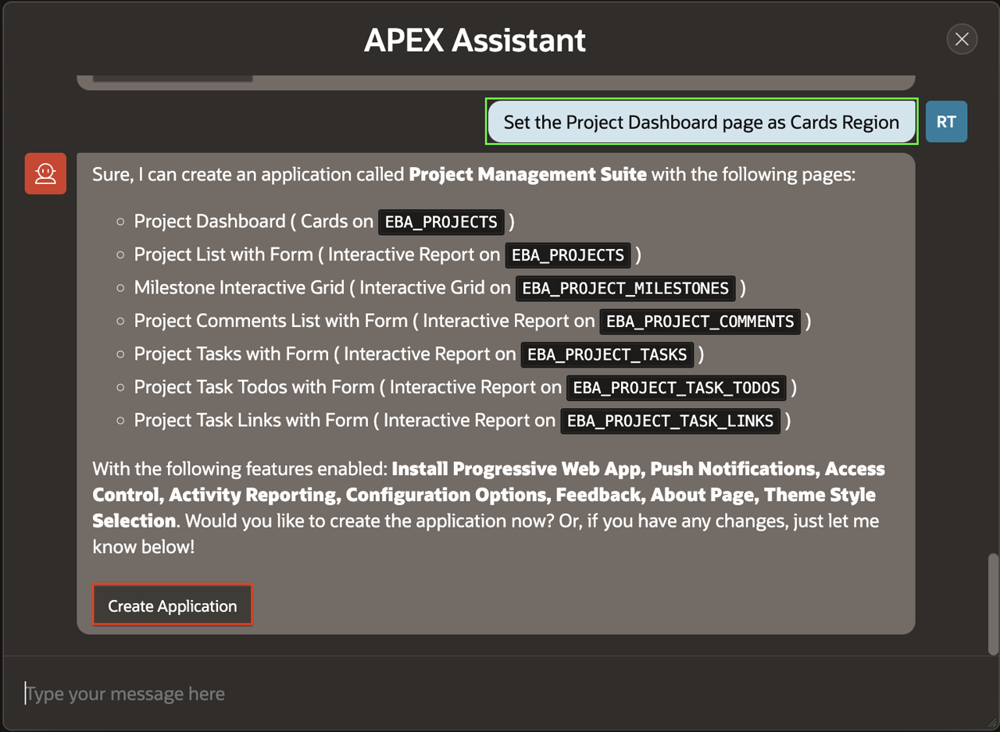

> **Note:** _The pages might differ based on the prompt. Make sure that you have **Project Dashboard page defined as Cards Region**, **Project Tasks to-dos, and Links pages created as Interactive report with a Form** by giving appropriate prompts_

10. On the Create an Application page, click **Appearance** Icon.

    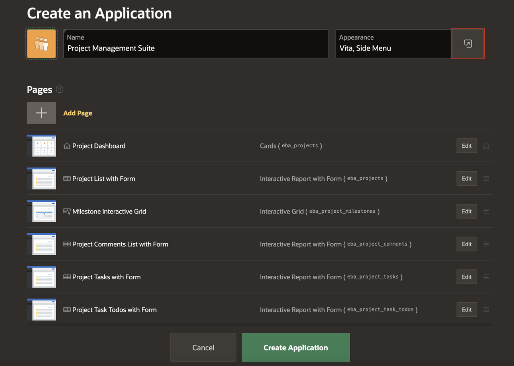

11. In the Appearance Wizard, Select **Redwood Light** and then click **Save Changes**.

    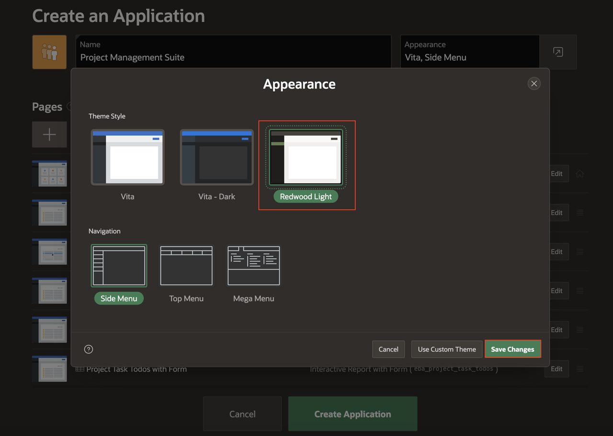

12. Make sure that all the Features are enabled by default and then click **Create Application**.

    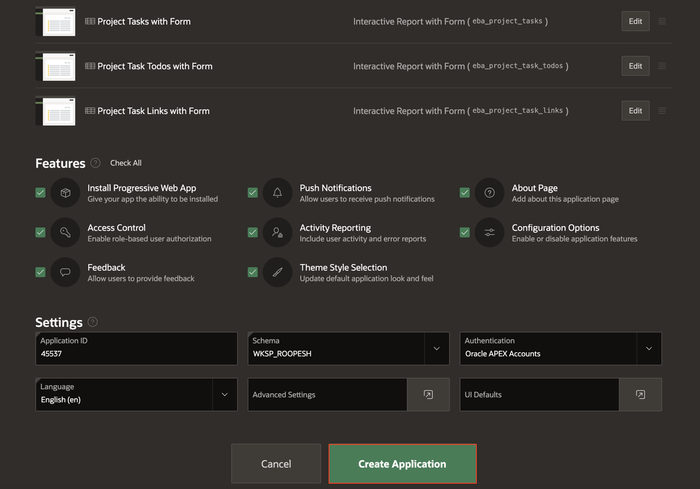

## Task 2: Run the Application

1. Your new application will be displayed in Page Designer.

    Click **Run Application**.

    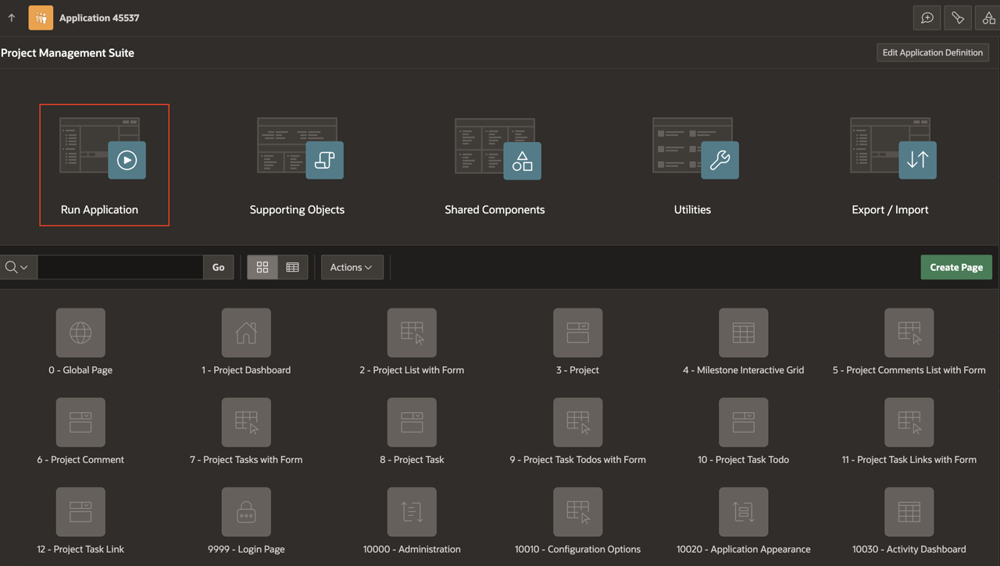

2. In the runtime environment, the login page will be displayed.

    Enter your **Username** and **Password** (Username should be Demo).   
    Click **Sign In**.

    The new application will be displayed.

    

3. Play around with the application and explore the different pages.

    Records are displayed in all of the reports which makes page review significantly easier, especially for reports. The fact that the data may not be exactly correct for the columns is not critical, as you can very easily update the data to make it more realistic.

    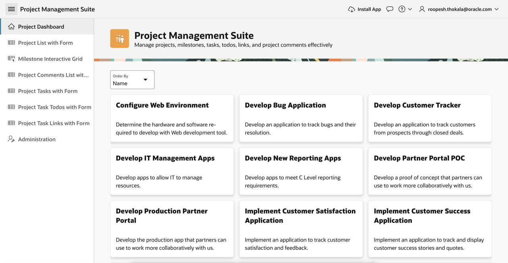

## **Summary**
You now know how to utilize Generative AI to create the first cut of your application.

## **Acknowledgments**

- **Author** - Roopesh Thokala, Senior Product Manager
- **Contributors** - Salim Hlayel, Principle Product Manager
- **Last Updated By/Date** - Roopesh Thokala, Senior Product Manager, May 2024
