# Improve Links

## Introduction

In this lab, you will learn how to modify the URL so that it can be used to display the content listed in a new window. You will also learn how to utilize APEX Assistant to generate SQL.

Estimated Time: 5 minutes

### Objectives
- Improve the Projects List of Values
- Use APEX Assistant to generate SQL in the code Editor
- Update the Links section of your application

### What You will Need

- An Oracle Cloud paid account, a LiveLabs account or free trial.
- An APEX Workspace and application

## Task 1: Adding Columns to the Report.
In a similar fashion to how you modified the Project Tasks Todos report, you need to update the Links report to include the Project and Milestone columns.

1. From the runtime application, navigate to the Links report page, and then navigate to Page Designer.

    In the Developer Toolbar click **Edit Page11**.

    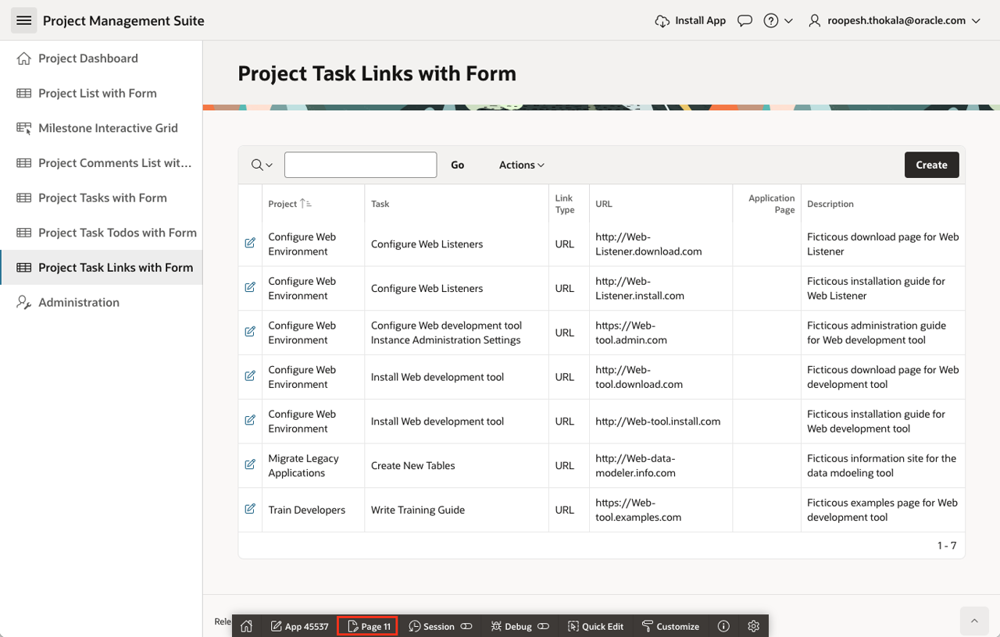

    You should now be in Page Designer with **Page 11: Project Task Links** loaded.

2. You need to update the query defined for Project Task Links.

    Within Page Designer, in the Rendering tree (left pane), click **Project Task Todos**.

    In the Property Editor (right pane), for Source > Type, select **SQL Query**.  
    > **Note:** _The SQL Query will be populated. The SQL statement selects all of the columns from the HOL\_TO\_DOS table_

    For Source > SQL Query, click the **Code Editor** icon.     

3. In the **Code Editor - SQL Query** wizard, click **APEX Assistant**.

    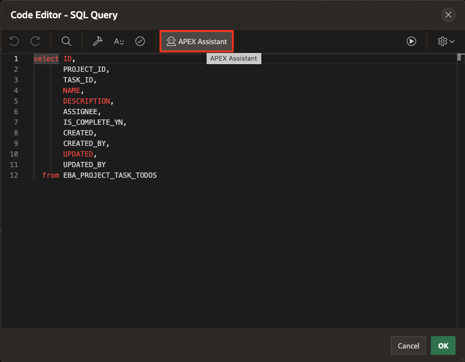

4. To retrieve the Project name and Milestone Name from the respective tables, copy and paste the below prompt in your AI Assistant and click **Enter**.

    >Prompt:  

    >Write a query to retrieve details from the EBA\_PROJECT\_TASK\_LINKS table, including associated project and milestone names, by using subqueries to join the EBA\_PROJECTS, EBA\_PROJECT\_TASKS, and EBA\_PROJECT\_MILESTONES tables.

    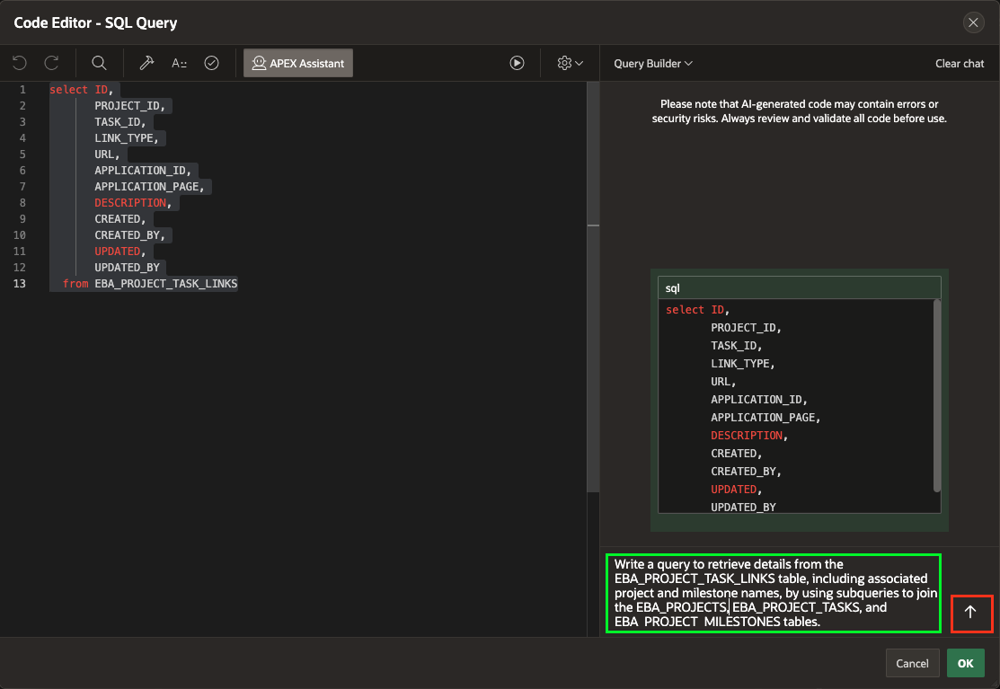

5. Notice that APEX Assistant generated an SQL, if you wish to utilize it, select **Insert**.

    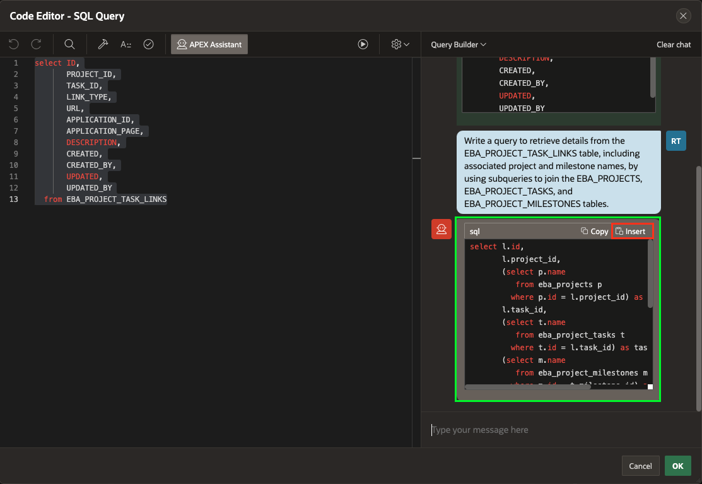

6. In the Code Editor toolbar, click **Validate**. If the SQL is validated successfully, then click **OK**.

    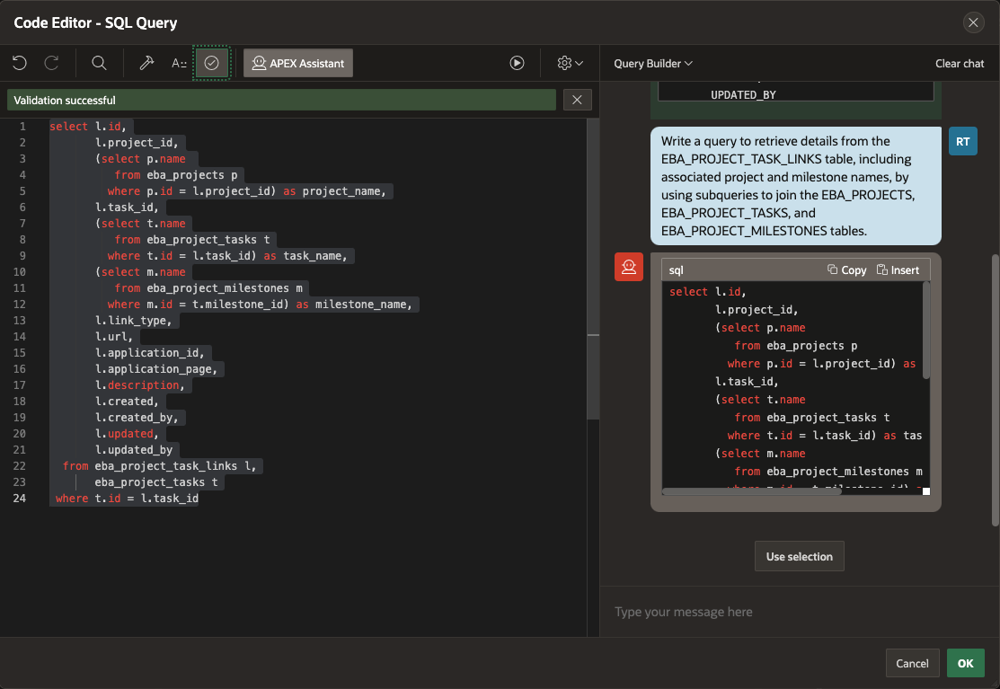

7. The URL column within the report needs to be updated.

    In Page Designer, in the Rendering tree (left pane), under the Links region, expand **Columns**.

    In the list of columns, click **URL**.

    In the Property Editor (right pane), enter the following:

    - Identification > Type - select **Link**

    - Link > Target - click **No Link Defined**, and enter the following -

        - Target > Type - select **URL**

        - Target > URL - enter **#URL#**.  

    > **Note:** _This will link to the value in the URL column_

      Click **OK**

      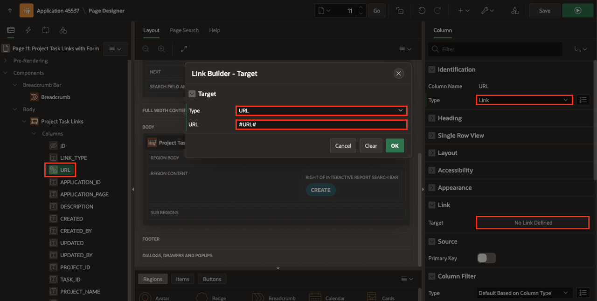

    - Link > Link Attributes - enter **target="_blank"**    
    > **Note:** _Click on Help (middle pane) to review examples_

    Time to review the page. In the Page Designer toolbar, click **Save and Run**

    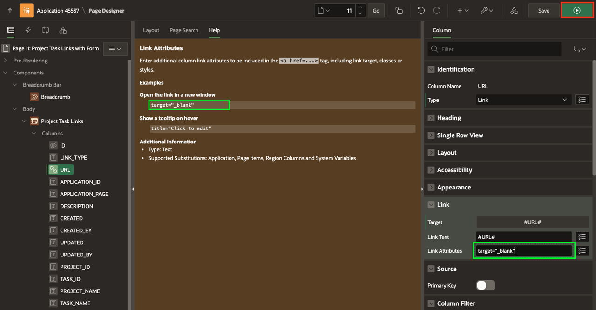

    > **Note:** _The URL column is now a link. Clicking on one of the links will bring up a new page, however, the URL is not properly formed as it is missing the hypertext transfer protocol (http or https), and the value is a fictious site address_

5. In the runtime environment, in the Project Tasks Todos report menu, click **Actions**. In the dropdown, select **Columns**.

    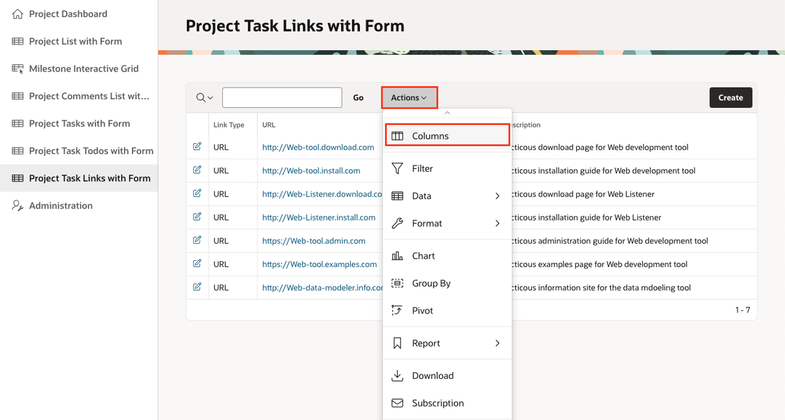

6. In the Select Columns dialog, select **Project Name** and **Milestone Name** from the Left side or **Do Not Display** side and move them to **Display in Report**.   

7. In the Select Columns dialog, click **Project Name**.        
    Hold down the [Shift] key, and click **Milestone Name**.     
    In the options on the right of the dialog, click **Top**.        
    Click **Apply**.

    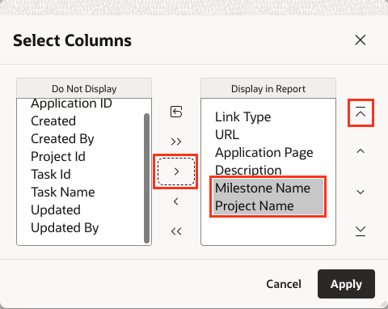

8. You need to save the revised report layout so others will see the new and improved column placement.

    In the runtime environment, in the To Dos report menu, click **Actions**.       
    In the dropdown, select **Report**, and then click **Save Report**.

    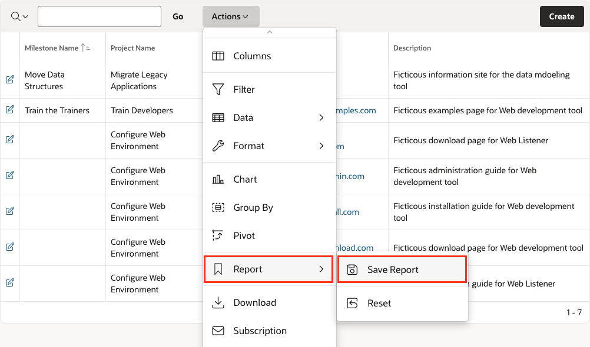

9. In the Save Report dialog, for Save (Only displayed for developers), select **As Default Report Settings**.

    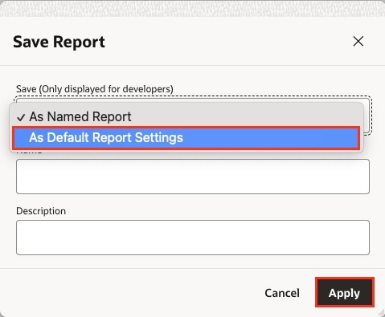

10. In the Save Default Report dialog, click **Apply**.     

    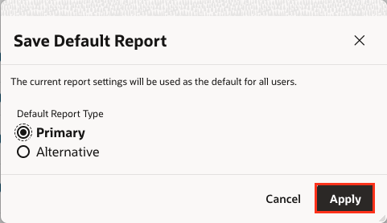

    > **Note:** _You want to save the report as Primary so that it displayed as you see it now to end users when they navigate to the page_

## Task 2: Updating the Form Page.
If you review the Links form page, by clicking an edit icon on the report, you will see that the Task item is not displaying the Project and Milestone. In the previous lab you updated the Tasks LOV to include the extra display columns. Therefore, all you need to do now is update the Task item to be a Popup LOV.

1. From the runtime environment, in the Developer Toolbar, click **Edit Page 12**.
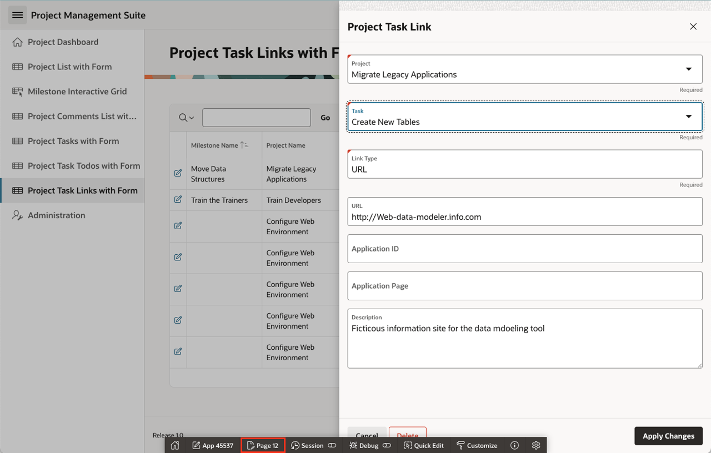

2. Within Page Designer, in the Rendering tree (left pane), click **P12\_TASK_ID**.  
    In the Property Editor (right pane), for Identification > Type, select **Popup LOV**.

    In the Page Designer toolbar, click **Save**.

       

3. Time to review the completed form page.    

    Navigate to the runtime environment tab or browser.     
    Navigate to **Project Task Link** and refresh the page.     
    Click the edit icon for a Link.

    For Task, click the down arrow to display the Task Popup LOV.     
    Enter in a search term and hit [Enter].

    For URL enter [https://apex.oracle.com](https://apex.oracle.com)     
    Click **Apply Changes**.

    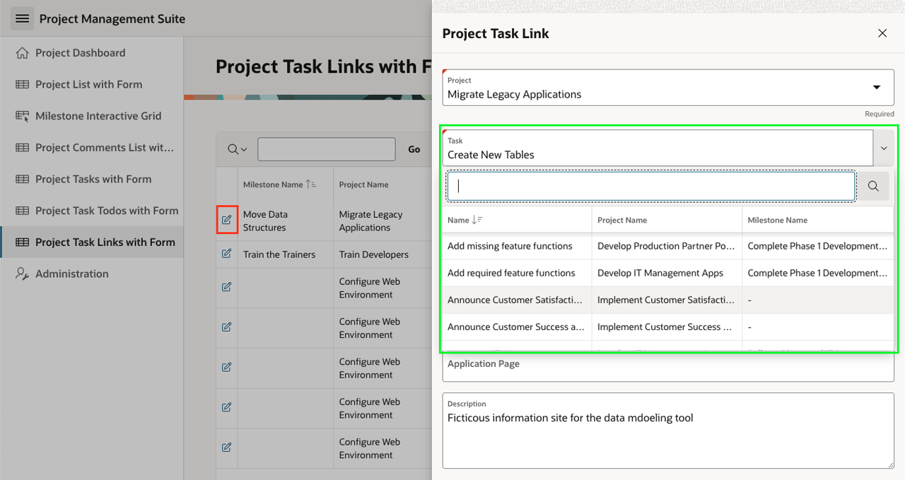    

    On the Links report page, click the URL for the record you just updated.    
    It should bring up the main APEX site in a new browser tab or window.

## **Summary**

You now know how to change a URL value to be a link to a separate browser tab or window.

## **Learn More** - *Useful Links*

- APEX on Autonomous:   [https://apex.oracle.com/autonomous](https://apex.oracle.com/autonomous)
- APEX Collateral:   [https://apex.oracle.com](https://apex.oracle.com)
- Tutorials:   [https://apex.oracle.com/en/learn/tutorials](https://apex.oracle.com/en/learn/tutorials)
- Community:  [https://apex.oracle.com/community](https://apex.oracle.com/community)
- External Site + Slack:   [http://apex.world](http://apex.world)

## **Acknowledgments**

- **Author** - Salim Hlayel, Principle Product Manager; Roopesh Thokala, Senior Product Manager
- **Contributors** - Oracle LiveLabs Team (Robbie Ruppel, Functional Lead; Marilyn Isabella Kessinger, QA Intern; Arabella Yao, Product Manager Intern)
- **Last Updated By/Date** - Roopesh Thokala, Senior Product Manager, May 2024
