# Improve To Dos

## Introduction

In this lab, you will learn how to add additional columns to a report and improve a list of values. You will also learn how to utilize APEX Assistant to generate SQL.

Estimated Time: 10 minutes

### Objectives
- Improve the Projects List of Values
- Use APEX Assistant in the code Editor
- Update the applications To Dos section

### What You will Need

* An Oracle Cloud paid account, a LiveLabs account or free trial.
* An APEX Workspace and application

## Task 1: Adding Columns to the Report.
In the Runtime environment navigate to Project Task To Dos and notice that the report includes the Task but not the associated Milestone. To retrieve these values in the report you need to utilize an SQL which ties in the Projects and Milestones tables. This can be done using inner selects or by joining multiple tables together. For simplicity you are going to implement inner select statements. And, you will generate this query using AI Assistant.

1. From the runtime application, navigate to the To Dos report page, and then navigate to Page Designer.

    In the Developer Toolbar click **Edit Page 9**.

    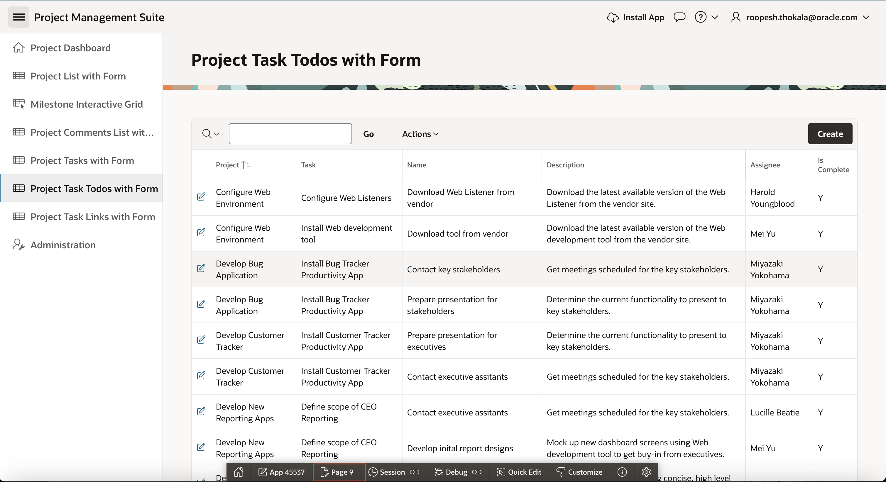

    You should now be in Page Designer with **Page 9: Project Task ToDos with Form** loaded.

2. You need to update the query defined for To Dos.

    Within Page Designer, in the Rendering tree (left pane), click **Project Task Todos**.

    In the Property Editor (right pane), for Source > Type, select **SQL Query**.
    > **Note:** _The SQL Query will be populated. The SQL statement selects all of the columns from the HOL\_TO\_DOS table_

    For Source > SQL Query, click the **Code Editor** icon.     

    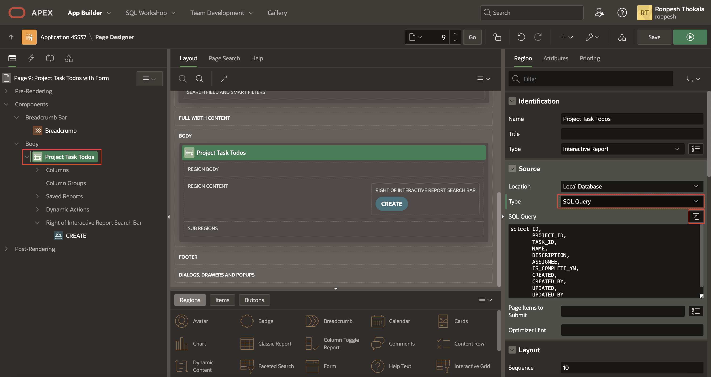

3. In the **Code Editor - SQL Query** wizard, click **APEX Assistant**.

    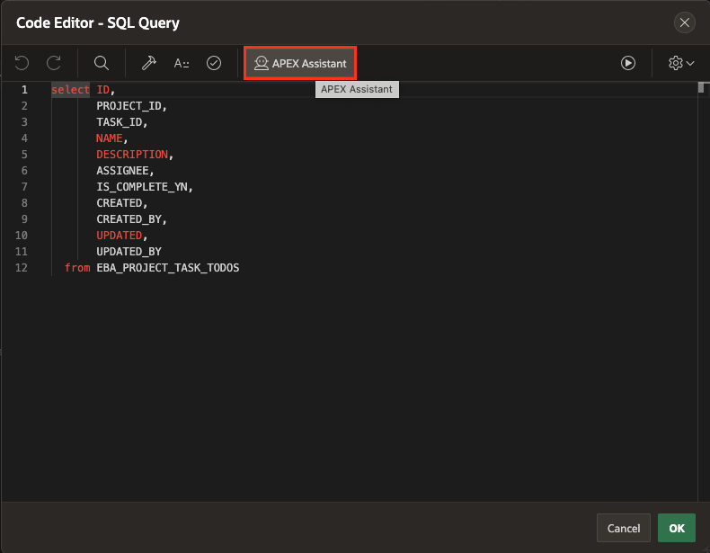

4. To retrieve the Project name and Milestone Name from the respective tables, copy and paste the below prompt in your AI Assistant and click **Enter**.

    >Prompt:  

    >Write a query to retrieve details from the EBA\_PROJECT\_TASK_TODOS table, including associated project and milestone names, by using subqueries to join the EBA\_PROJECTS, EBA\_PROJECT\_TASKS, and EBA\_PROJECT\_MILESTONES tables.

    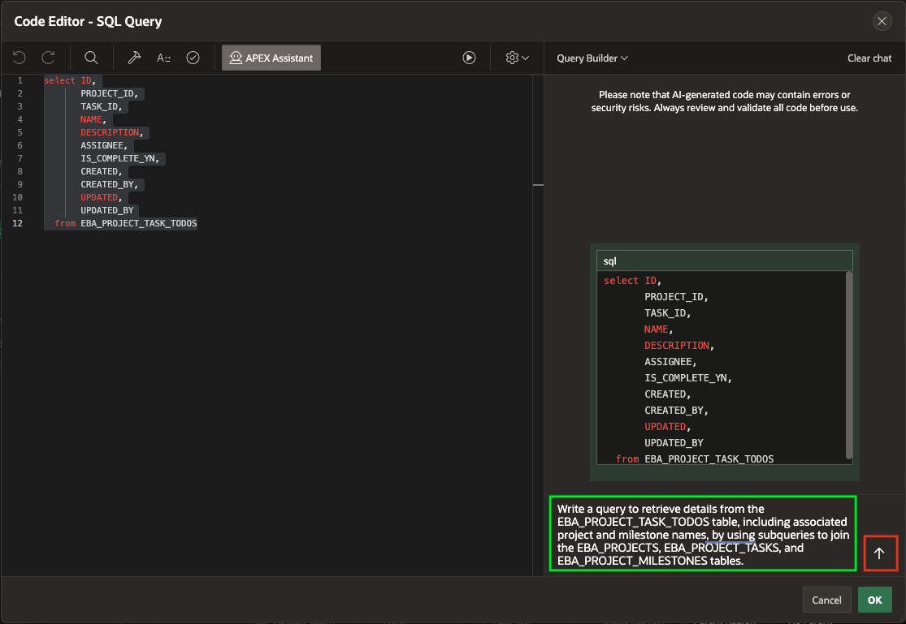

5. Notice that APEX Assistant generated an SQL, if you wish to utilize it, select **Insert**.

    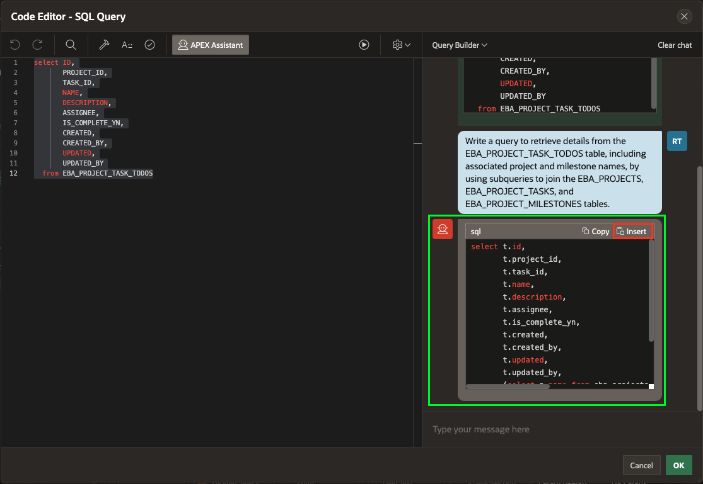

6. In the Code Editor toolbar, click **Validate**. If the SQL is validated successfully, then click **OK**.

    

7. Run the application to ensure the new Project and Milestone columns display correctly.

    In the Page Designer toolbar, click **Save and Run**.

    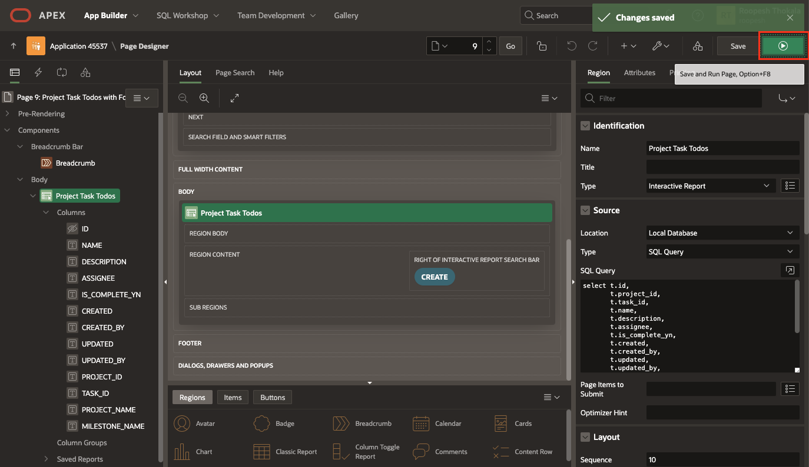

8. In the runtime environment, in the Project Tasks Todos report menu, click **Actions**. In the dropdown, select **Columns**.

    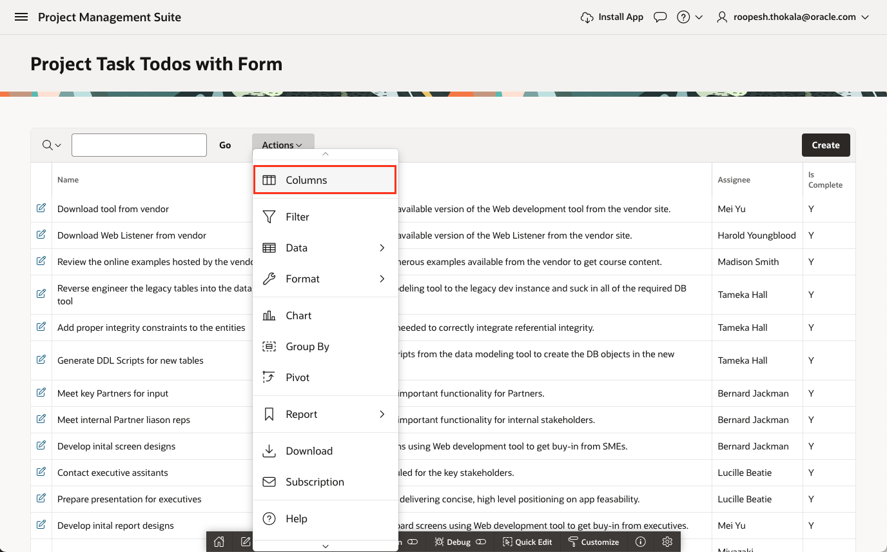

9. In the Select Columns dialog, select **Project Name** and **Milestone Name** from the Left side or **Do Not Display** side and move them to **Display in Report**.   

    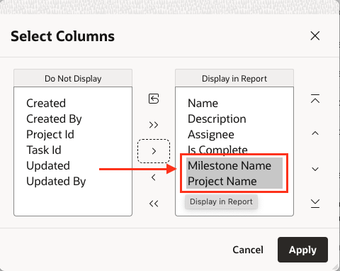

10. In the Select Columns dialog, click **Project Name**.        
    Hold down the [Shift] key, and click **Milestone Name**.     
    In the options on the right of the dialog, click **Top**.        
    Click **Apply**.

    

11. You need to save the revised report layout so others will see the new and improved column placement.

    In the runtime environment, in the To Dos report menu, click **Actions**.       
    In the dropdown, select **Report**, and then click **Save Report**.

    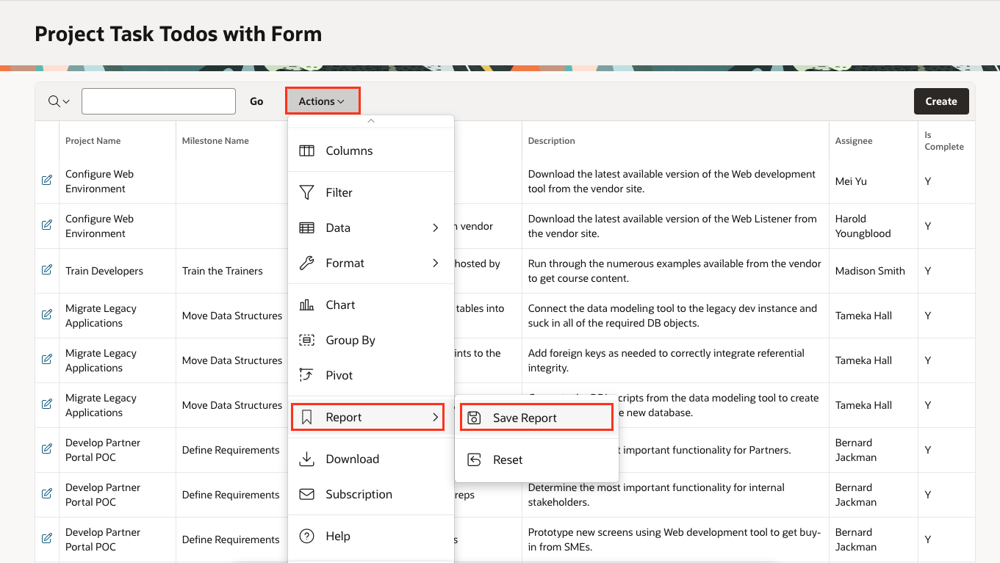

12.  In the Save Report dialog, for Save (Only displayed for developers), select **As Default Report Settings**.

    

13. In the Save Default Report dialog, click **Apply**.     

    
    > **Note:** _You want to save the report as Primary so that it displayed as you see it now to end users when they navigate to the page_

## Task 2: Updating the Tasks LOV.
If you review the To Dos form page, by clicking an edit icon on the report, you will see that Project and Milestone are not on the form page either. To simplify data entry, you will change the Tasks select list to a Popup LOV and include the Project and Milestone.

This same LOV is used on the Links form page so we can reuse it there as well.

1. Within Page Designer, with Page 8 selected, in the Page Designer toolbar, click **Shared Components**.

    

    Alternatively, from the application home page, click **Shared Components**.

2. From Shared Components, under Other Components, click **List of Values**.

    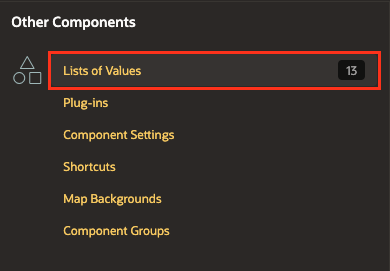

3. From the List of Values page, click **EBA\_PROJECTS\_TASKS.NAME**.

    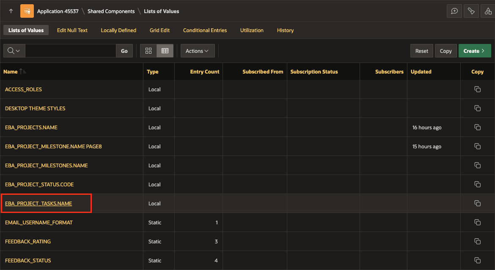

4. Under Source, Set the Source type as **SQL Query**. In the **SQL Query** wizard, click **APEX Assistant**.

    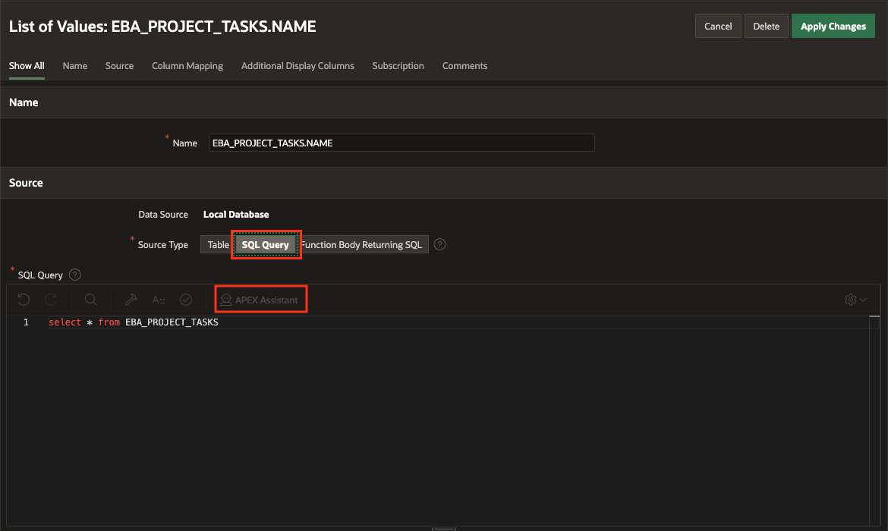

5. To retrieve the Project name and Milestone Name from the respective tables, copy and paste the below prompt in your AI Assistant and click **Enter**.

    >Prompt:  

    >Write a query that retrieves id and name from the EBA\_PROJECT\_TASKS table, including the associated project and milestone names, by using subqueries to join EBA\_PROJECTS and EBA\_PROJECT\_MILESTONES tables

    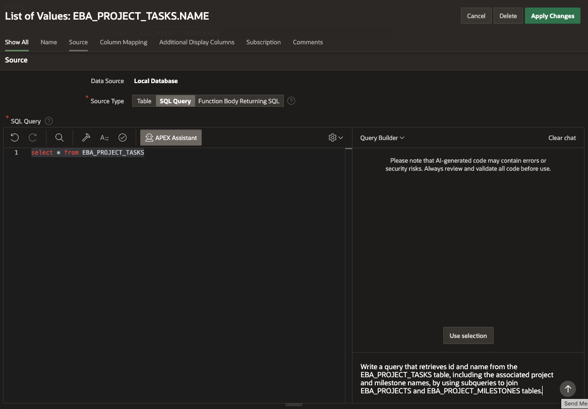

6. Notice that APEX Assistant generated an SQL, if you wish to utilize it, select **Insert**. Then, click **Validate** in your Code Editor Toolbar. If the query doesn't throw any errors, click **Apply Changes**.

    

7. In the Code Editor toolbar, click **Validate**. If the SQL is validated successfully, then click **OK**.

    

8. In the List of Values page, enter the following:

    - Column Mapping > Return - select **ID**

    - Column Mapping > Display - select **NAME**

    - Column Mapping > Default Sort - select **NAME**

    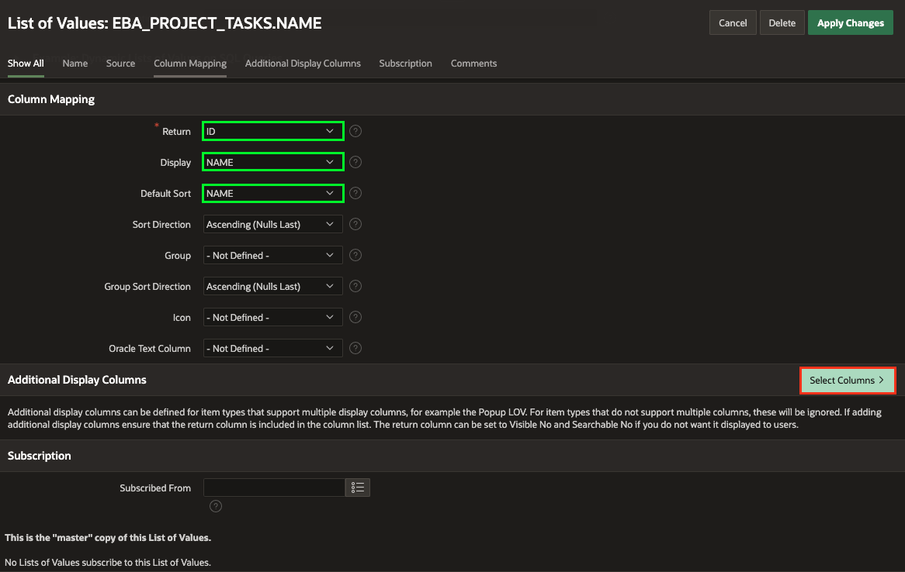

    To display the extra columns, click **Select Columns**

    On the Select Additional Display Columns, performing the following actions:     
    - Move **PROJECT_NAME (Varchar2)** to the right pane             
    - Move **MILESTONE_NAME (Varchar2)** to the right pane   
    - Move **NAME (Varchar2)** to be below Milestone in the right pane    
    > **Note:** The ID column must be included in the list, however, it will be marked as Visible = No so will not be displayed

    Click **Update**.

    

    In the List of Values toolbar, click **Apply Changes**.

    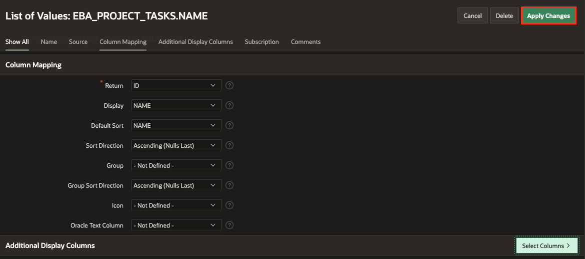

9. On the Project Task Todo form page you will need to update the item type for Task.

    From Shared Components, within the breadcrumbs, click **Application xxxxx**.

    

    From the application home page, in the list of pages, click **XX - Project Task Todo**.

    

10. Within Page Designer, in the Rendering tree (left pane), click **P10\_TASK_ID**.  
    In the Property Editor (right pane), for Identification > Type, select **Popup LOV**.

    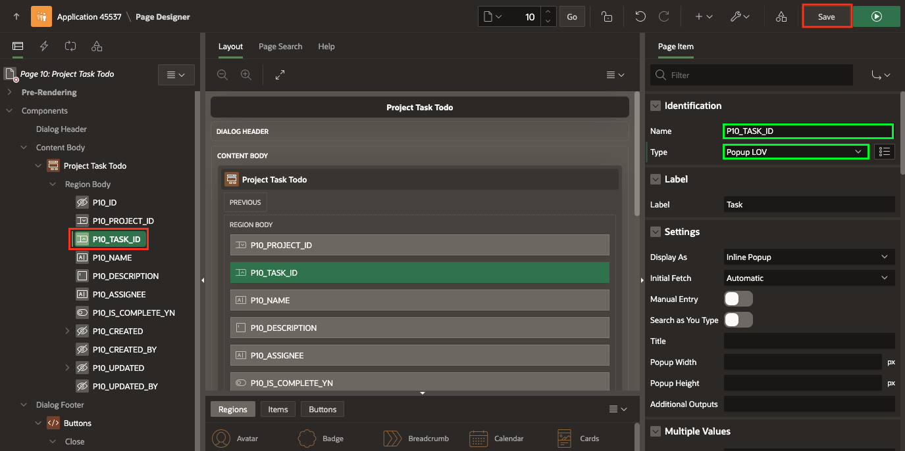   

11. In the Page Designer toolbar, click **Save**.

12. Time to review the completed form page.    

    - Navigate to the runtime environment tab or browser.

    - Navigate to **Project Task Todo** and refresh the page.   

    - Click the edit icon for a To Do.

    - For Task, click the down arrow to display the Task Popup LOV.     

    - Enter in a search term and hit [Enter].

        

## **Summary**  

You now know how to enhance report and list of value queries using APEX Assistant to display related details.

## **Acknowledgments**

- **Author** - Roopesh Thokala, Senior Product Manager
- **Contributors** - Oracle LiveLabs Team (Robbie Ruppel, Functional Lead; Marilyn Isabella Kessinger, QA Intern; Arabella Yao, Product Manager Intern)
- **Last Updated By/Date** - Roopesh Thokala, Senior Product Manager, May 2024
