# Configure content capture

## Introduction

In this session we will configure “Capture” capabilities to ingest email attachment from a configured email address and store that in asset repository.

Estimated Time: 20 minutes

### Background

Content Capture feature allows you to configure content ingestion from various sources like Email, FTP, Scanner device and many more. It also support orchestration of other document processing activity like OCR, file type conversion and others. In this session, we will keep the use case simple but you can refer documentation for more advance use cases.

Let’s have a look at the basic process of capturing content and uploading it to Oracle Content Management.
section.

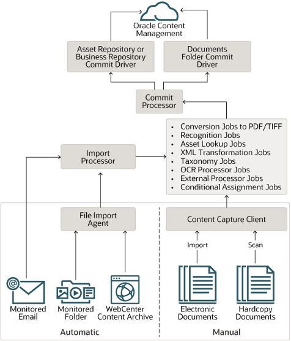

### Objectives

In this lab, you will:

* Create Procedure
* Define Metadata
* Configure Capture Source
* Define Commit Target
* Test Content Ingestion flow

### Prerequisites

This lab assumes you have:

* An Oracle account
* All previous labs successfully completed

## **Task 1**: Create Procedure

Procedures are defined content capture workflows, from the initial sourcing all the way to final upload to Oracle Content Management.

1. Navigate to **Capture** menu under **ADMINISTRATION**

   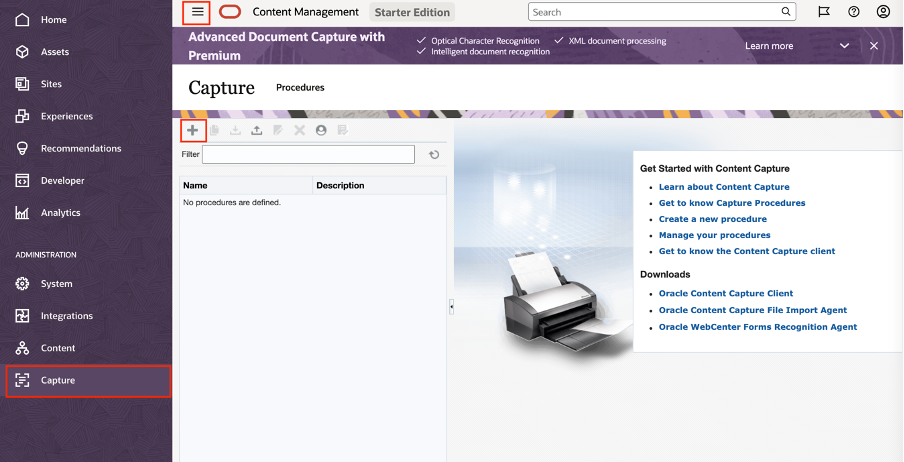

2. Click  icon to create new Procedure, this will open below form

   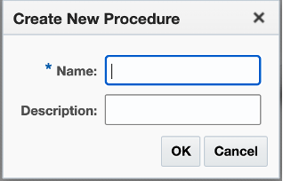

3. Provide Name as **Contract** and click **OK**

4. Select the newly created procedure **Contract** and move to next task.

## **Task 2**: Define Metadata

Navigate to **Metadata** tab and here we will create define metadata as **Party Name** to store subject of email (Assuming that email subject will have Party name just for this session purpose)

1. Click  on “Metadata Fields” section as shown below

   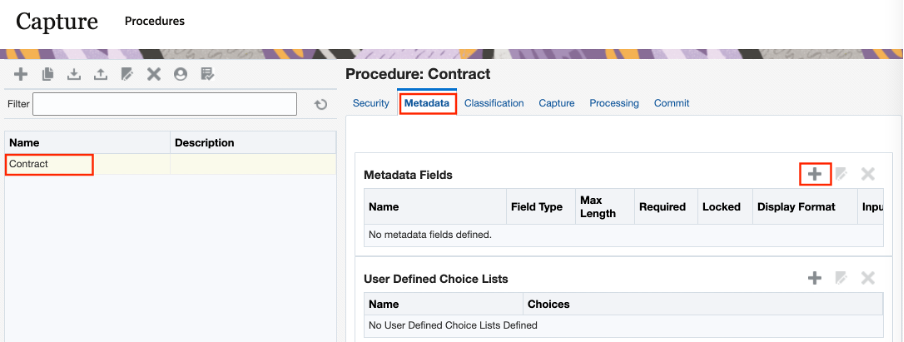

2. Fill up the “Metadata Fields: New Metadata Field” forms with below details
    * **Field Name** : Party Name
    * **Data Type** : Alpha Numeric

   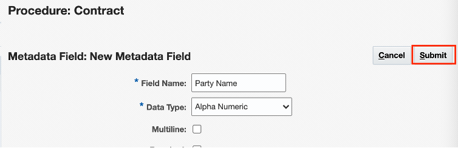

3. Click **Submit** to complete the field creation.

## **Task 3**: Configure Capture Source as Email account

1.	Navigate to “Capture” tab and here we will setup email account from where document will be ingested.
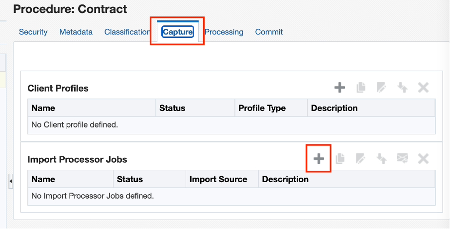

2.	As shown above, Click  under Import Processor Jobs . Enter below field data
    * **Import Job Name** : Email Source 
    * **Online** : Check this box
    * **Batch Prefix** : CON_
    * **Import Source** : Email Source

   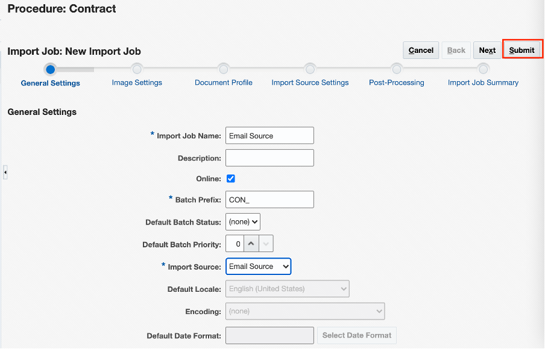

3. Click **Next**

4. Click **Next** to Image Settings stage without changing default values

5. On **Document Profile** stage, change **Default Document Profile** to (Default)

   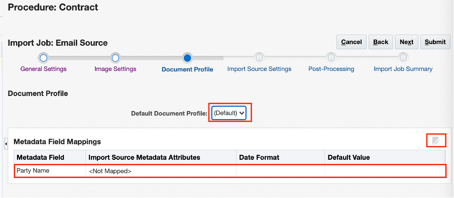

6.	As shown above, select Party Name under **Metadata Field Mappings** and then click **Edit** icon on top right corner.

7.	Select **Metadata Attributes** as Subject and click **OK** 

   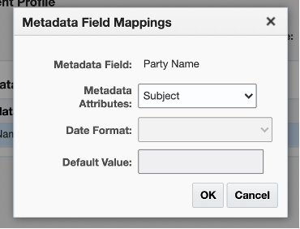

8.	Click **Next** and navigate to **Import Source Settings**

9.	Select **Microsoft Exchange Web Services** and provide Service URL. Assuming you are using Office 365 then use https://outlook.office365.com/ews/exchange.asmx, otherwise refer [documentation](https://docs.oracle.com/en/cloud/paas/content-cloud/capturing-content/configure-import-processor-jobs.html#GUID-7C551069-6B76-4F96-87B0-72E97757BD4A) for more options.

   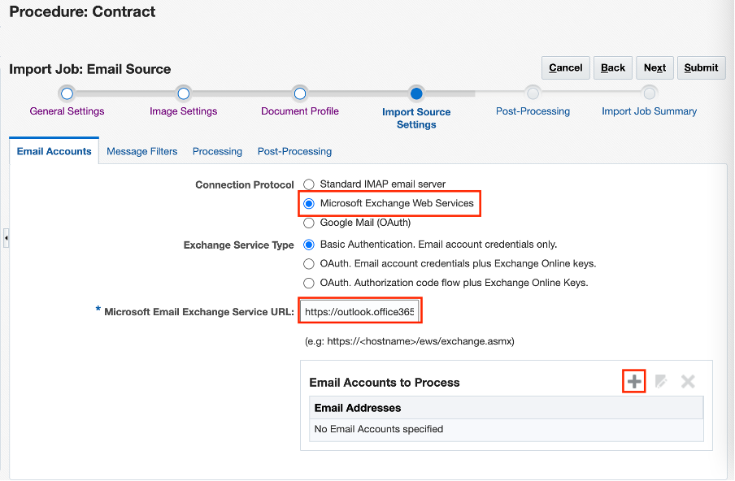

   >**Note**: If you have Office 365 email account with Single Sign-on enable then you need to create OAuth application, please refer to Office 365 documentation for creating OAuth app. Alternatively you can create free account with Google Mail & create OAuth application.

10. As shown above Click  icon for **Email Accounts** to Process and provide **Email address & Password**.

   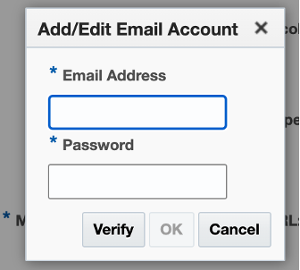

11.	Click **Verify** and then **OK**

12. Navigate to Message **Filter** tab, provide Folder name from which you want to process email. Typically, you will be using **Inbox**.
   
   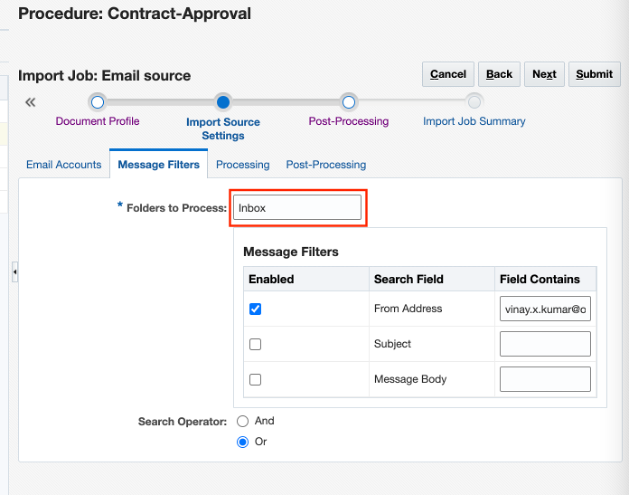

13. **Message Filters** is an optional step, you can provide your email address for **From Address** if that so that only email sent by you to Source Email address will be picked for processing.

14. Navigate to **Post-Processing** tab. You can either provide different folder name (make sure you create this folder in Source email account) to move message after processing or you can have default values.

   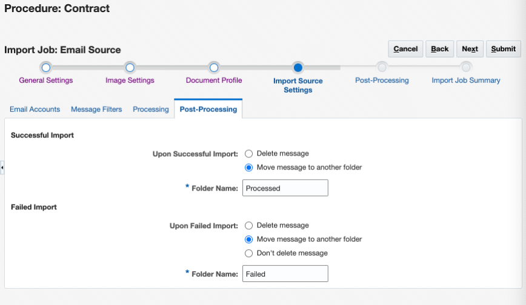

15. Click **Next** and set **Batch Processor** as **Commit Processor** on Post-Processing stage.

   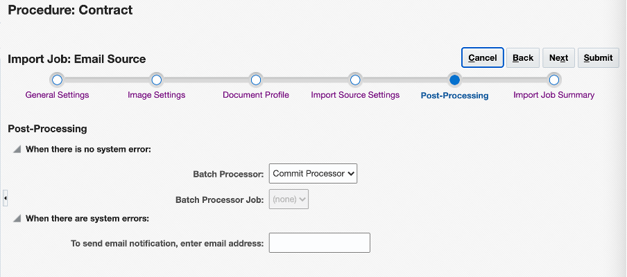

   *Make sure you create folder **Processed** & **Failed** in your email account*

16. Click **Next** to review setup and click **Submit**.

## **Task 4**: Define Commit Target

1.	Skip **Processing** tab and navigate to **Commit**. Click add icon to create Commit Profile.

   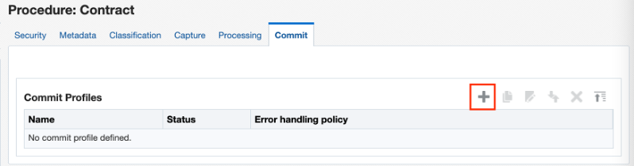

2.	Enter the value in the form as shown below 

   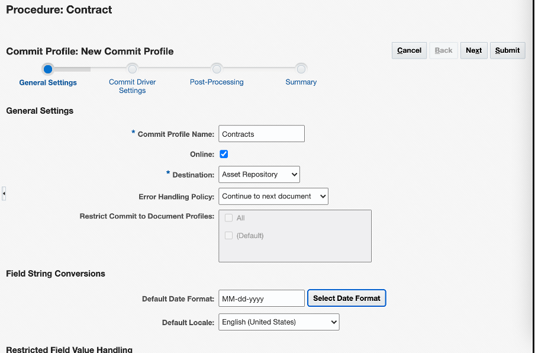

3.	Click **Next** and navigate to Commit Driver Settings. Select Repository as **Demo**

   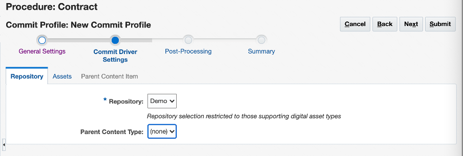

4.	Select **Assets** tab. Select the table row as shown below and click **Edit** icon

   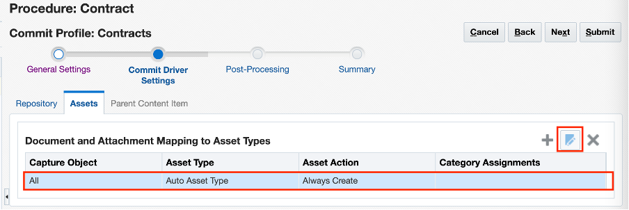

5.	Select **Asset type** as Contract. Select **Contract Name** asset field and then click Edit icon to map Capture value.

   

6.	Shuttle &lt;Document Title &gt; from left to right and click **OK**
   
   

7.	Repeat above step for **Asset Field** Party Name and shuttle Party Name as shown below

   

8.	Click OK and Navigate to Post-Processing stage

   

9.	Provide your email address to receive notification in case of any error. Click **Next** to see summary of configuration.

10.	Click **Submit**

##  **Task 5**: Test the Content Ingestion flow

1.	Send Email to configured email address (Refer Task 3.10) with any sample file as attachment and mention **Subject**  as **CafeSupremo**

   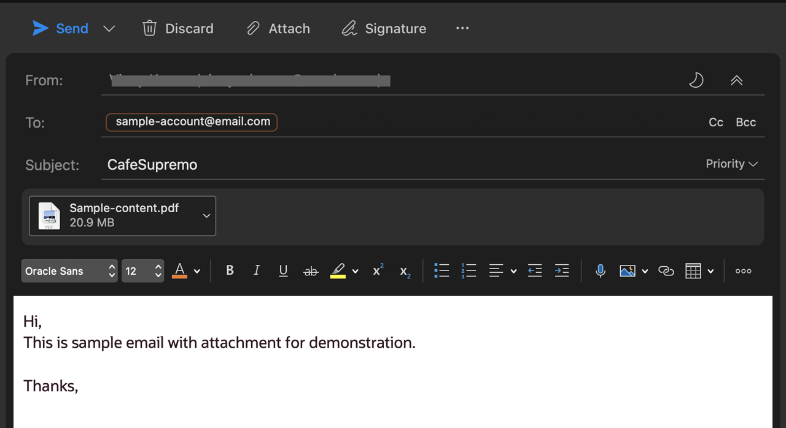
   
   *For lab we will use Subject as unique identifier to associate content with Customer*

2.	After sometime check **Demo** Asset repository, email attachment will be avilalbe as asset.

3.	Click asset & check the attribute to validate if Subject was populated in Party Name attribute.

## Summary

This completes this lab. At this point, you know how to configure Capture procedure to automate content ingestion from email account and store it in content repository along with meta-data. You may now **proceed to the next lab**.
## Learn More

* [Content Capture Quick Tour](https://docs.oracle.com/en/cloud/paas/content-cloud/capturing-content/get-know-content-capture-procedures-page.html)

## Acknowledgements
* **Author** - Vinay Kumar, Director - Product Management, Oracle Content Management
* **Last Updated By/Date** - Vinay Kumar, Feb 2022
