# Setup an OCM instance

## Introduction

This lab walks you through the process of provisioning an instance of Oracle Content Management, assuming you don't already have one available to you. If you do, you can skip this lab and move on to the next one.

Estimated Time: 10 minutes

### Background
The Oracle Content Management **Starter Edition** offers a free content service tier with a limited feature set and limits on the number of users, assets, sites, and other items. However, it's sufficient to work with Oracle Content Management out of the box.

To take advantage of the full feature set and to increase the number of users and other items, [upgrade to the Premium Edition](https://docs.oracle.com/en/cloud/paas/content-cloud/administer/starter-vs-premium-edition.html).

For comparison of the features and limits in the Starter Edition vs. the Premium Edition, refer [documentation](https://docs.oracle.com/en/cloud/paas/content-cloud/administer/starter-vs-premium-edition.html).

### Objectives

In this lab, you will:
* Provision Oracle Content Management (Starter Edition)
* Create IAM App for Integration(API Call)
* Associate IAM App with OCM Instance

### Prerequisites

This lab assumes you have:
* An Oracle account
* You have enough privileges to use OCI

## **Task 1**: Create an instance of Oracle Content Management

1. Log into your Oracle Cloud account. From any browser go to [https://cloud.oracle.com/en_US/sign-in](https://cloud.oracle.com/en_US/sign-in)

  Enter Cloud **Account Name** in the input field and click the **Next** button
	
  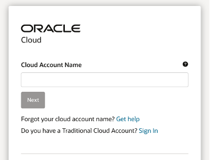

2. Select **oracleidentityservice** and click **Continue** button

    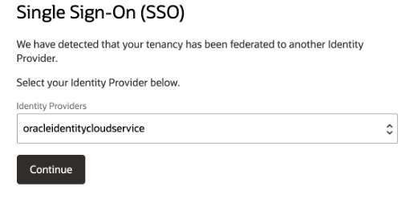

3. Enter your **User Name** and **Password** in the input fields and click **Sign In** button

  

4. After successful login click the navigation menu icon from left upper corner. From the menu click **Developer services** and then **Content Management – Overview** 

  

5. Click **Create Instance** . If compartment is not selected by default for you then first you need to select **Compartment** <your tenancy>(root) from dropdown.

  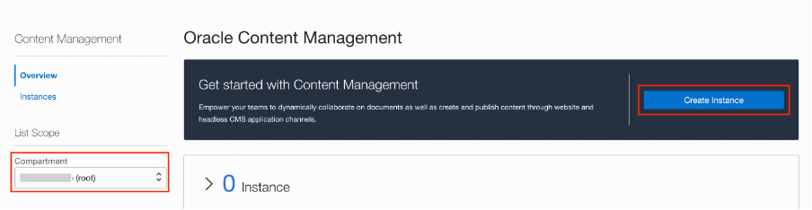

6. Enter following details and Click **Create Instance**
    * **Instance** name as Demo
    * select your **Compartment**
    * Enter your email address for **Notification Email**
    * Select **License Type** as **Starter Edition**

    

7. Wait till your instance provision is completed as shown below
  
  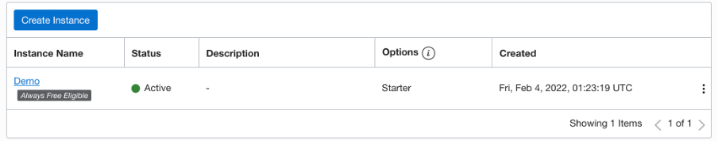

8. Click **Demo** (Instance Name) and click **Open Instance**
  
  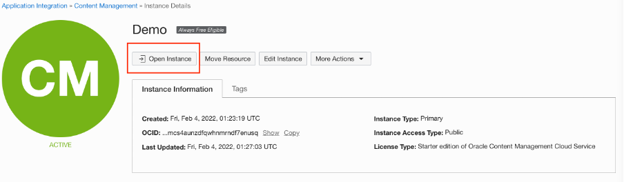

9. Bookmark the URL (https://&lt;your-tenancy-specific-id&gt;.oraclecloud.com/   documents/home) as it’s your OCM instance URL for future login.

  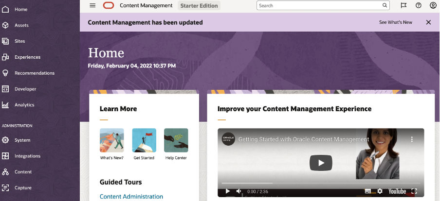

## **Task 2**: Create IAM app for integrating OCM & APEX

1. Assuming you are already logged in to https://cloud.oracle.com , Click side navigation menu to select **Identity & Security** and then click **Domains**

    

2. Click **Default** domain and go to detail page. Copy the **Domain URL** for future use.

    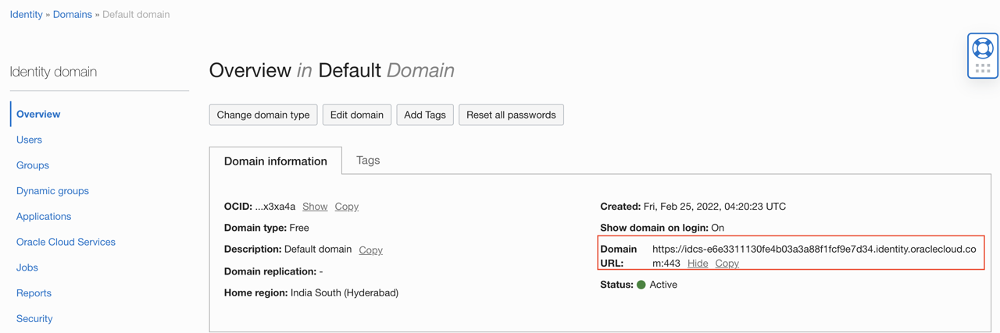

3. Click **Applications** from left menu and then click **Add Application**

    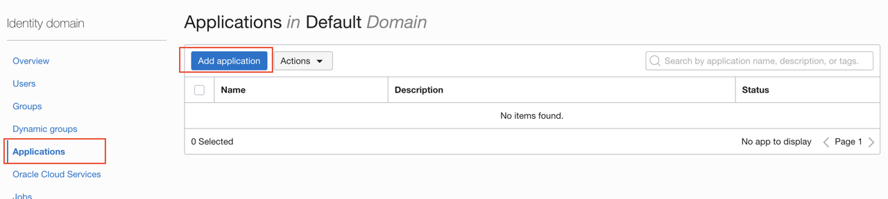

4.	Select **Confidential Application** 

    

5.	Enter below details

    * Name: OCM-APEX Integration
    * Description : App to call OCM API from APEX
    

6. Click **Next**

7. Select **Configure this application as a client now**

8. In the Authorization section choose **Allowed Grant** Types as **Client Credentials**
    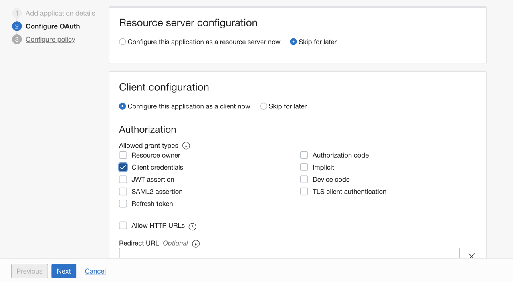

9.	Scroll to section **Token Issuance policy**, select Authorized resource as **Specific** and click **Add Scope**

  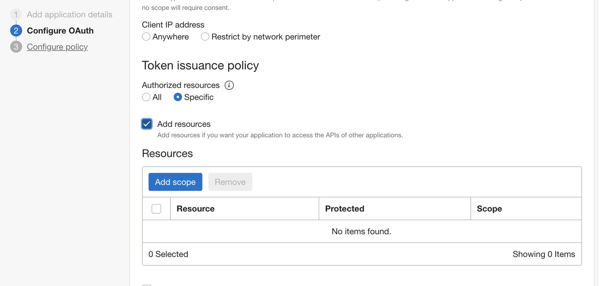

10.	From the list select the OCM instance created by you, it will be named like **CECSAUTO_ &lt;Your InstanceName &gt;CECSAUTO**. For example below is the instance created above with name **Demo** and highlighted row is corresponding to that. Select ending with **urn:opc:cec:all** and click **Add**

  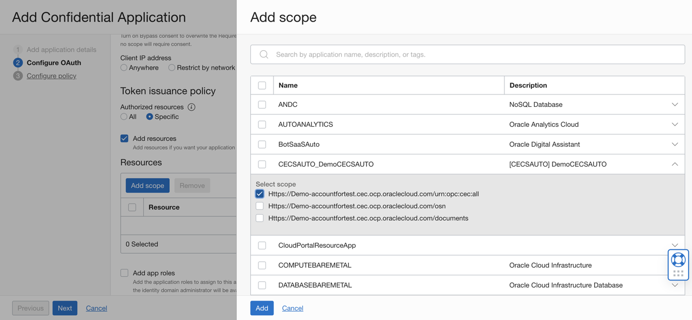

11. Click **Next**

12.	Click **Next** to Skip for later (Expose APIs to Other Applications)

13.	Click **Next** to Skip for later (Web Tier Policy)

14.	Click **Finish** on create application.

15.	Click **Activate** button to activate application
  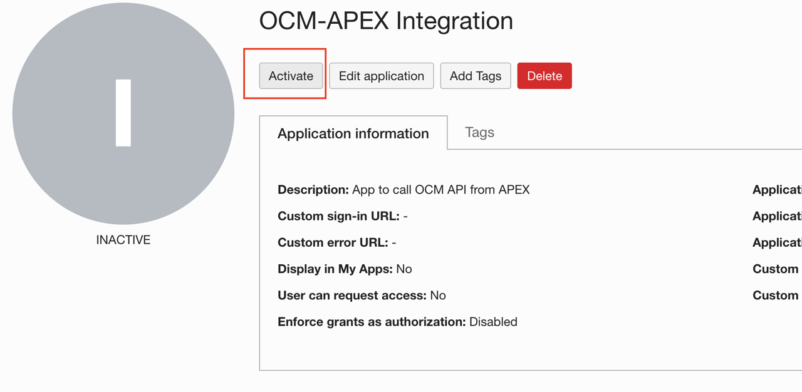

16.	Click the **Activate Application** to confirm

17.	Scroll down **General Information** section to get **ClientID** and **ClientSecret**. Copy this details to notepad as this will be used later in the lab.
  

18. Scroll down **Token Issuance Policy** and copy the **Scope URL** for future use.
  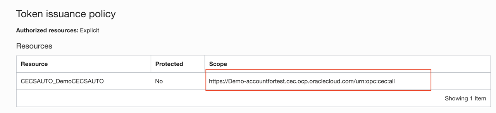

## **Task 3**: Assign OCM roles to IAM App

1.	Go back to **Default** domain and select **Oracle Cloud Services** from side menu. Click application name corresponding to your OCM Instance,it will follow pattern **CECSAUTO_** &lt;Your InstanceName &gt; **CECSAUTO**

  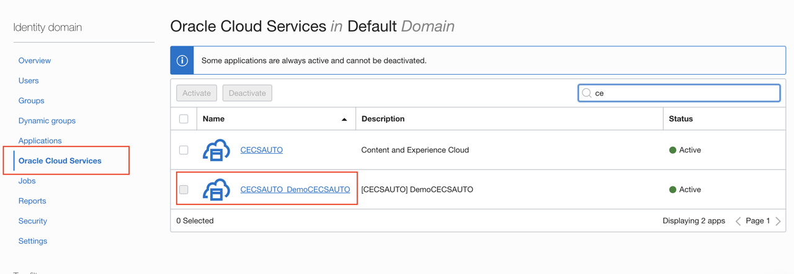

2.	Click **Application Roles** as shown below

  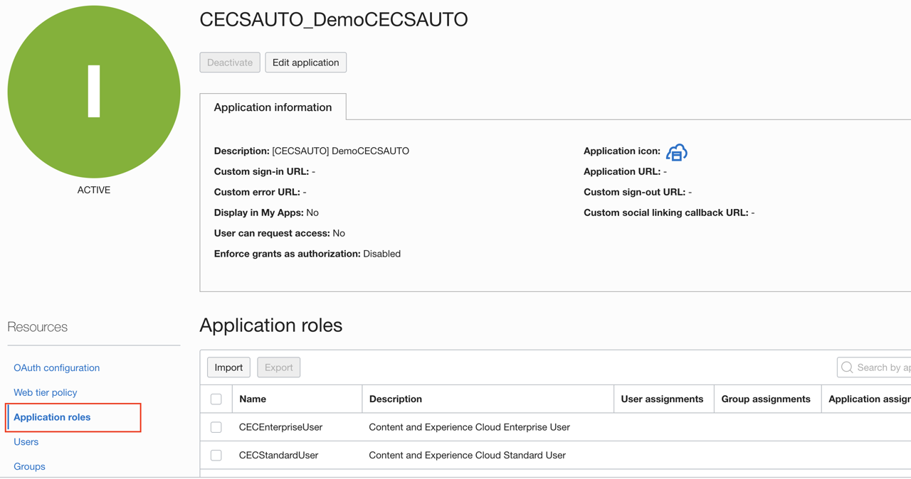

3.	Select the role **CECEnterpriseUser** and then click the icon on right side as shown below. Select **Assign Applications**

  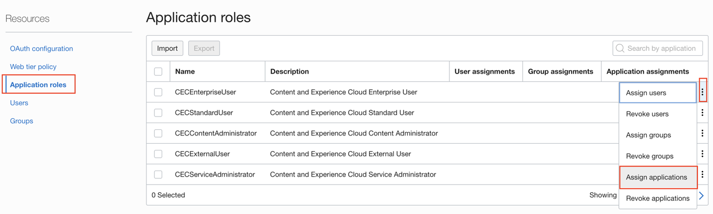

4.	Search for your application created in previous task **OCM-APEX Integration** and then click **Add**

  

5.	Repeat above step 3 & 4 for roles **CECContentAdministrator** & **CECRepositoryAdministrator**. You might have to navigate to next page using page navigation option available at bottom of table to select this roles.

    >**Note:** You will use this IAM application later while assigning access to repository. Sometime it take approx 45min before it's visible as member in OCM

## Summary

This completes this lab. At this point, you know how to create a new Oracle Content Management instance and create an IAM app. You may now **proceed to the next lab**.

## Learn

* [Deploy Oracle Content Management](https://docs.oracle.com/en/cloud/paas/content-cloud/administer/create-instance-infrastructure-console.html)
* [Administrative Interface](https://docs.oracle.com/en/cloud/paas/content-cloud/administer/administrative-interfaces.html)

## Acknowledgements

* **Author** - Vinay Kumar, Director - Product Management, Oracle Content Management
* **Last Updated By/Date** - Vinay Kumar, Feb 2022
