# Create website based on template

## Introduction

In this lab we will create site based on site template provided as part of lab file.

  >**Note**:Oracle Content Management let you create unlimited website but Starter edition is limited to 1 site per instance

Estimated Time: 20 minutes

### Background

As a site developer, you define the framework that site creators use to build sites, such as:
* [standard templates](https://docs.oracle.com/en/cloud/paas/content-cloud/creating-experiences/understand-templates.html#GUID-0BA49046-671B-4DE0-8D64-ADBFECB2EC76), used as a framework for a site, based on a theme, with sample pages and content, custom components, and other resources you need to start building a site
* [themes](https://docs.oracle.com/en/cloud/paas/content-cloud/creating-experiences/understand-themes.html), used to define the overall look and feel of a site, consisting of logos, style sheets, configuration files and background code that defines site navigation
* [custom components](https://docs.oracle.com/en/cloud/paas/content-cloud/creating-experiences/manage-custom-components-and-layouts1.html#GUID-15CB1AE6-E45C-4BD7-AE4E-41F94AFA550F), used to add specific types of content to site pages, enabling you to develop compound elements that can be embedded within a site page, using any page technology of your choice

### Objectives

In this lab, you will:
* Import Site Template
* Create New Site
* Change Site Security
* Publish Site

### Prerequisites

This lab assumes you have:

* An Oracle account
* All previous labs successfully completed

## **Task 1**: Import Site Template

1.	Navigate to **Developer** for side vertical menu

	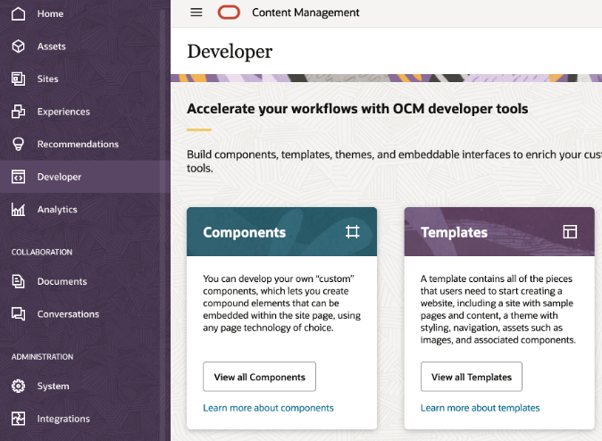

  >**Note**: If you are first user to visit Developer menu then you will get prompt to install sample site template. We recommend you to install it but it's not needed for this lab.

2.	Select **View All Template** as show in above image in the **Templates** block

3.	Click **Create** button and then select **Import a template package**

  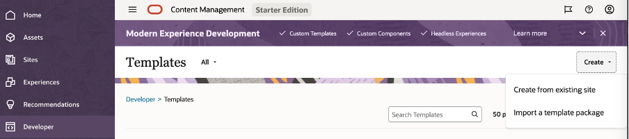

4.  Download [CafeSupremoSalesEnablement.zip](https://objectstorage.us-ashburn-1.oraclecloud.com/p/VEKec7t0mGwBkJX92Jn0nMptuXIlEpJ5XJA-A6C9PymRgY2LhKbjWqHeB5rVBbaV/n/c4u04/b/livelabsfiles/o/data-management-library-files/wms-id-10041-get-started-with-cec-and-apex/CafeSupremoSalesEnablement.zip)

5. Click **Upload** button and then upload the site template zip file **CafeSupremoSalesEnablement.zip**
  
    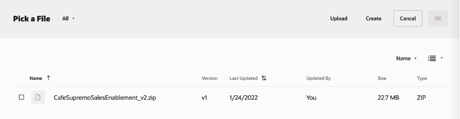

6.	Select the uploaded file and then click **Ok**

7.	Wait for confirmation message for successful of template import and you will see the imported templated listed as below
  
    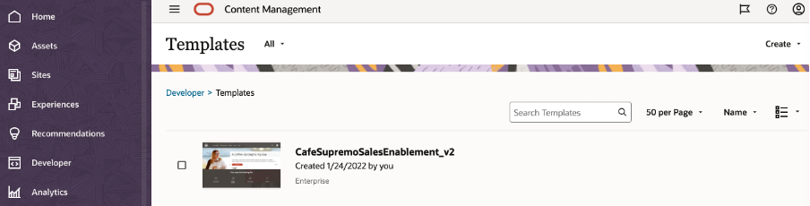

## **Task 2**: Create new Site

1.	Navigate to **Sites** from side vertical menu

  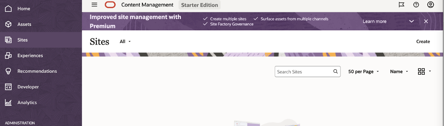

2.	Click **Create** to create new site based on site template imported in previous task.

  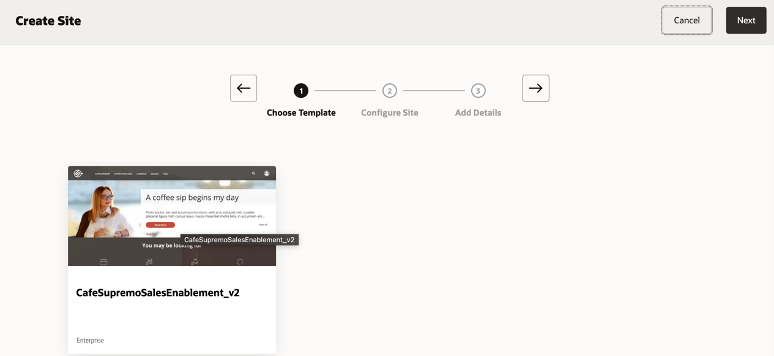

3.	Click the Template to select and it will take you to next step

4.	Select the Asset repository as **Demo** which we created in previous labs.

5.	Select **Localization Policy** as **SE2 Localization** and then click **Next**

  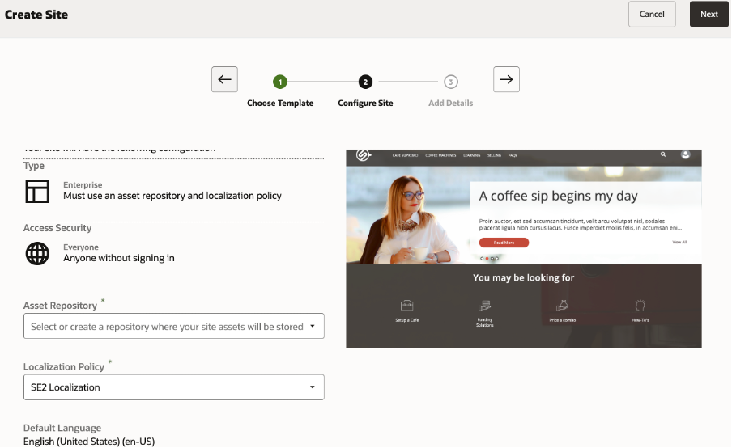

6.	Click **Next** and then provide name **Sales-Enablement** to your site as shown below. Please select **Duplicate Assets** for **Assets in the target repository**

  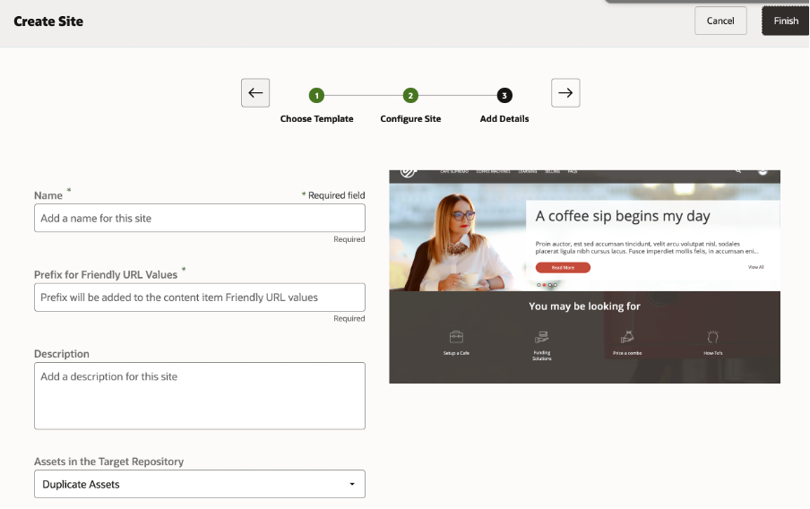

7.	Click **Finish** and wait for your site creation process to complete.	

## **Task 3**: Change site Security

1.	Select the site and then click **More** menu to select **Properties**

  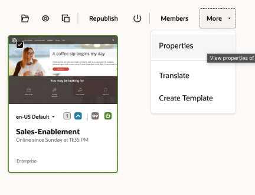

2. Enable the **Embeddable Site**
  

3. Click **Security** tab and then change radio option from **No** to **Yes**. Select **Cloud Users** as shown below and finally click **Save**

  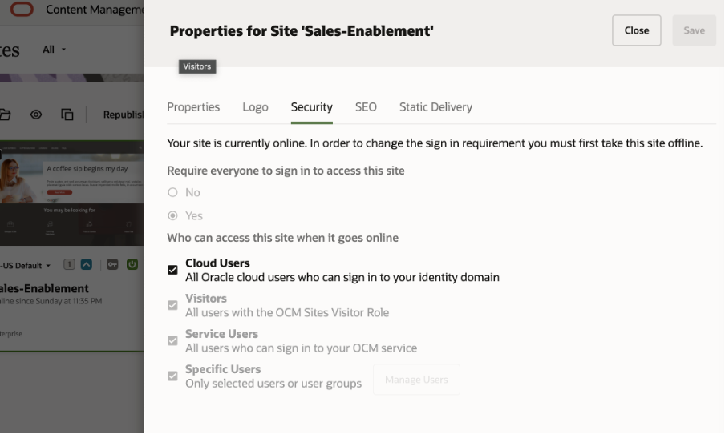

## **Task 4**: Publish Site

1.	Select the site and click “Publish”, it will show you below screen

  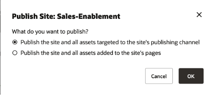

2.	Continue with default selected option and click **Ok**

3.	Click **Publish**

  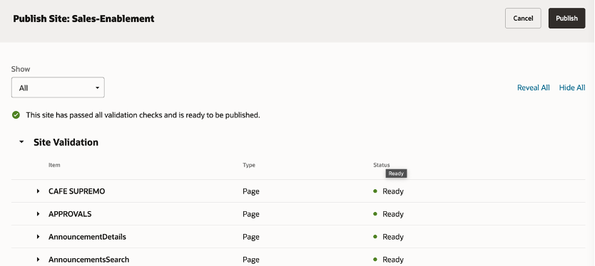

4.	Wait for publishing to complete and you will see “Published” icon as shown below

  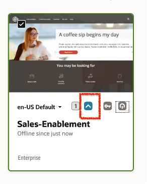

5.	Click the toggle icon as shown below to change status of site from offline to online.

  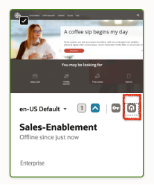

6.	Select **Confirm** to proceed and click **Bring Online**

  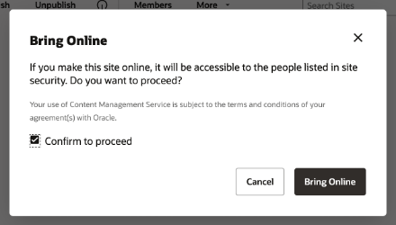

7.	Right click the Site and select **View**. This will open the site in new tab. Copy the URL of site which will be like **https://**&lt;your-instan-name&gt;**/site/authsite/Sales-Enablement/

## Summary

This completes this lab. At this point, you know how to create new site using template, change security setting & publish it. You may now **proceed to the next lab**.

## Learn More

* [Create your first website](https://docs.oracle.com/en/cloud/paas/content-cloud/creating-experiences/create-your-first-website1.html)

## Acknowledgements
* **Author** - Vinay Kumar, Director - Product Management, Oracle Content Management
* **Last Updated By/Date** - Vinay Kumar, Feb 2022
