# Create and Prepare APEX Workspace

## Introduction

In this lab, you will create a new APEX workspace and import an APEX application as a starting point for learning how to leverage the APEX Native Map Region against geospatial data.

Estimated Time: 10 minutes.

<!-- Watch the video below for a quick walk through of the lab. -->

<!-- update video link. Previous iteration: [](youtube:XnE1yw2k5IU) -->

### Objectives
Learn how to:
- Configure a new APEX workspace for application development
- Import an existing APEX application as a starting point for exploration of Native Map Region features

### Prerequisites
This lab assumes:
- You have finished all prior labs
- You have ORDS running so you can open APEX

    > Note: If you have closed ORDS, repeat the steps in Lab 2 to reopen it.

## Task 1: Login and create APEX workspace

1. Open Activities -> Google Chrome

    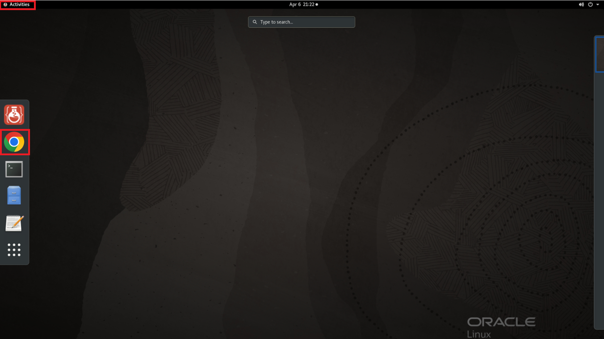


2. Go to this URL and wait for the screen to load.
    ```
    <copy>
    http://localhost:8080/ords/apex_admin
    </copy>
    ```

    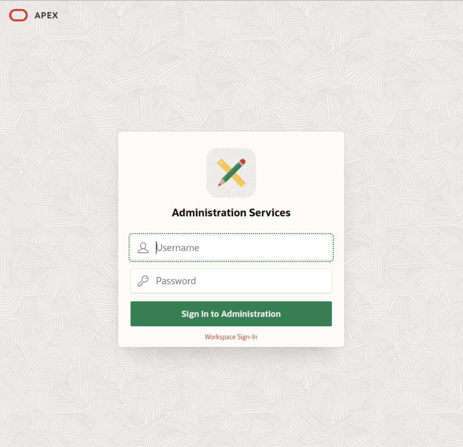

3. Login as ADMIN with the password you created in Lab 2 and reset it to whatever you please.

    *Be sure to retain the password for later access!*

    

4. You can see the welcome screen for APEX now. Click the Create Workspace button.

    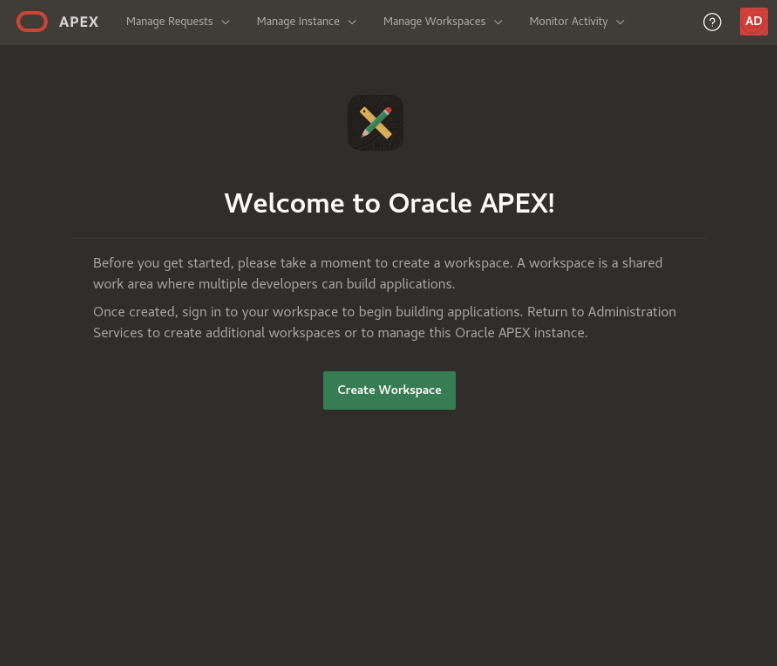

5. Name the workspace 'WTFC' and click Next. Workspace ID and Description are optional.

    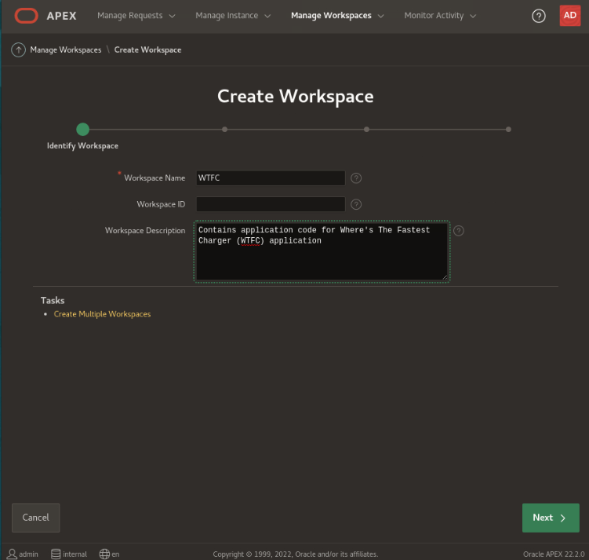

7. Set *Re-use existing schema?* to Yes. Click the menu icon next to schema name and select HOL23C from the drop-down list of schemas. Leave the default for space quota and password. Click Next.

    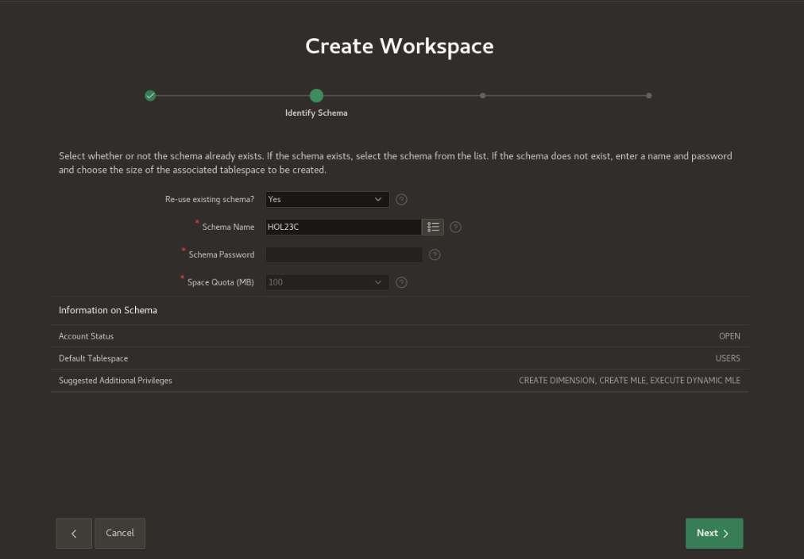

8. For username, supply **admin**; for password, we will use **Welcome123#**, and for email, supply your desired email address. Click Next.

    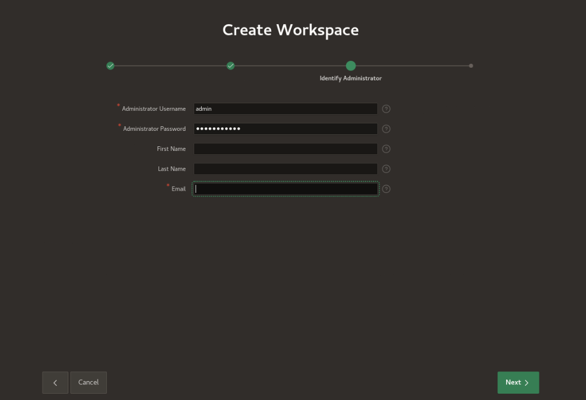

9. Review the summary information returned and if it's correct, then click Create Workspace.

    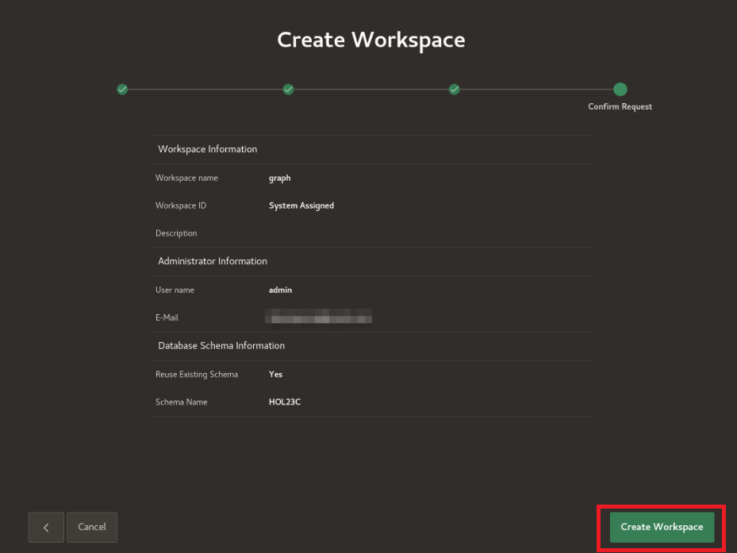

10. Success! Now click Done.

    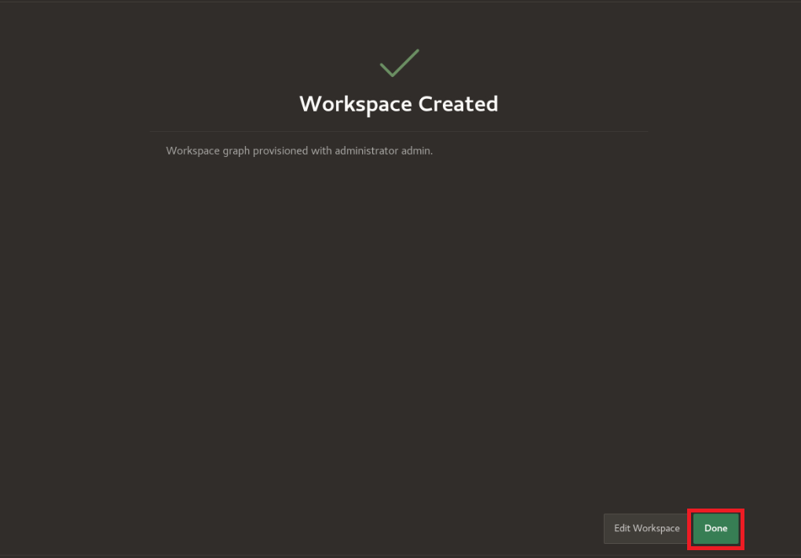

## Task 2: Import APEX application to visualize queries

1. In the upper right corner, click the admin icon then click sign out.
    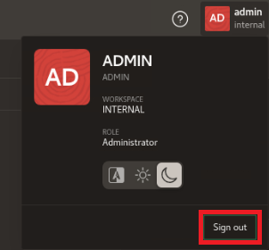


2.  Log back in as the **admin** user  you just created, supplying **WTFC** as the workspace name.
    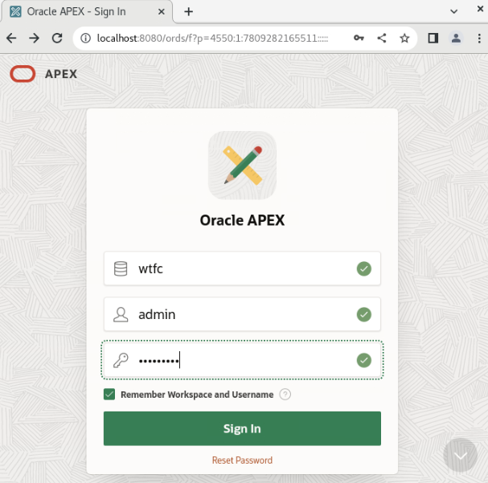

3. Since this is the first time you'll be using the APEX workspace, you will be prompted to change the password.

    *Be sure to retain it somewhere safe!*

    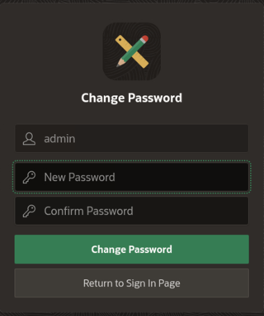

4. Click on App Builder -> Import.

    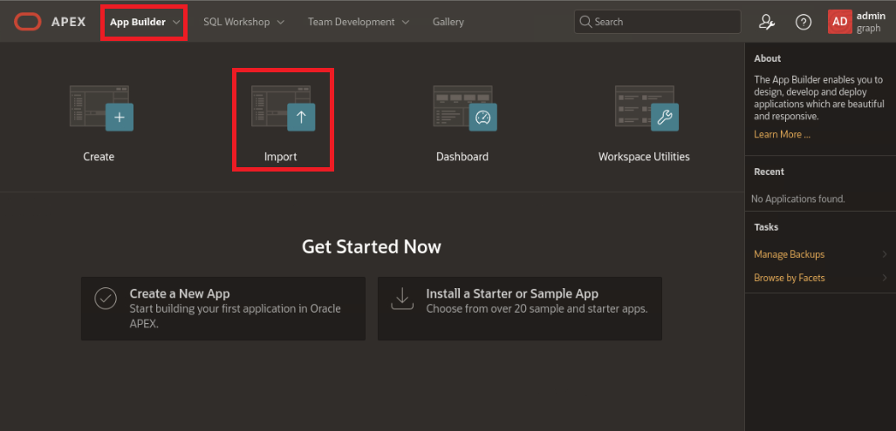

5. Click to add a file to open for import. Go to Home -> examples -> f106.sql and open that file. Leave the defaults and click Next.

    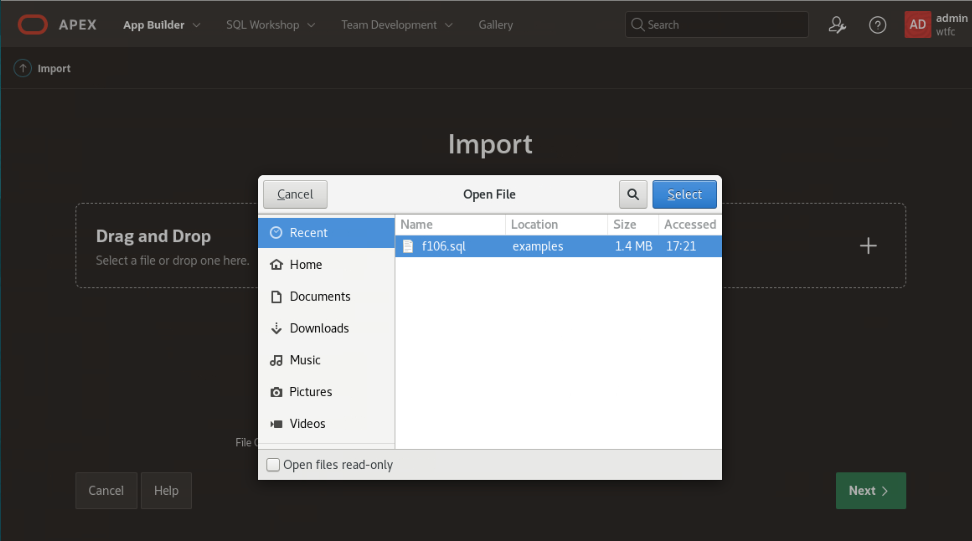

    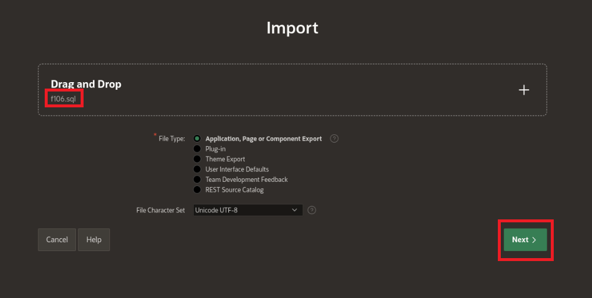

6. Click Next.
    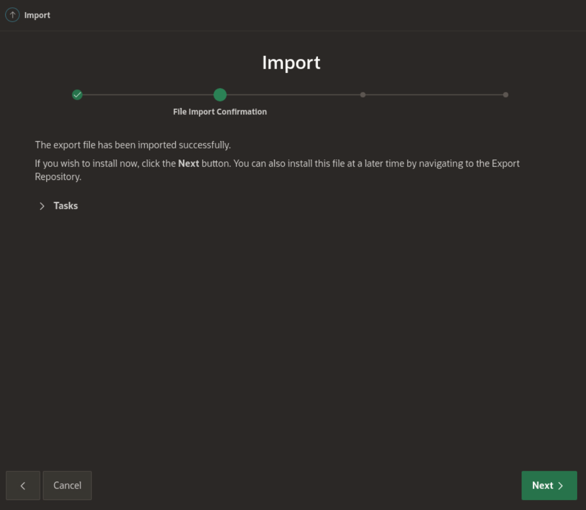

7.  Select **Change Application ID** and supply **301** (or other application ID of your choice). Leave all other options and click **Install Application**.
    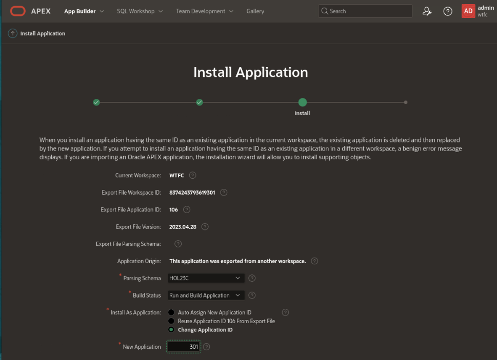


You may now proceed to the next lab.

## Learn More
* [Oracle APEX 23.1: Workspace and Application Administration](https://docs.oracle.com/en/database/oracle/apex/23.1/aeadm/workspace-and-application-administration.html#GUID-853F40E1-F360-4CE9-8DC1-FC111A825D14)
* [Oracle APEX 23.1: Importing Export Files](https://docs.oracle.com/en/database/oracle/apex/23.1/htmdb/importing-export-files.html#GUID-16650312-4E36-489E-8012-940924ADF2E9)

## Acknowledgements
* **Author** - Jim Czuprynski, LiveLabs Contributor, Zero Defect Computing, Inc.
* **Contributors** - Hope Fisher, Program Manager, Database Product Management
* **Last Updated By/Date** - Hope Fisher, June 2023