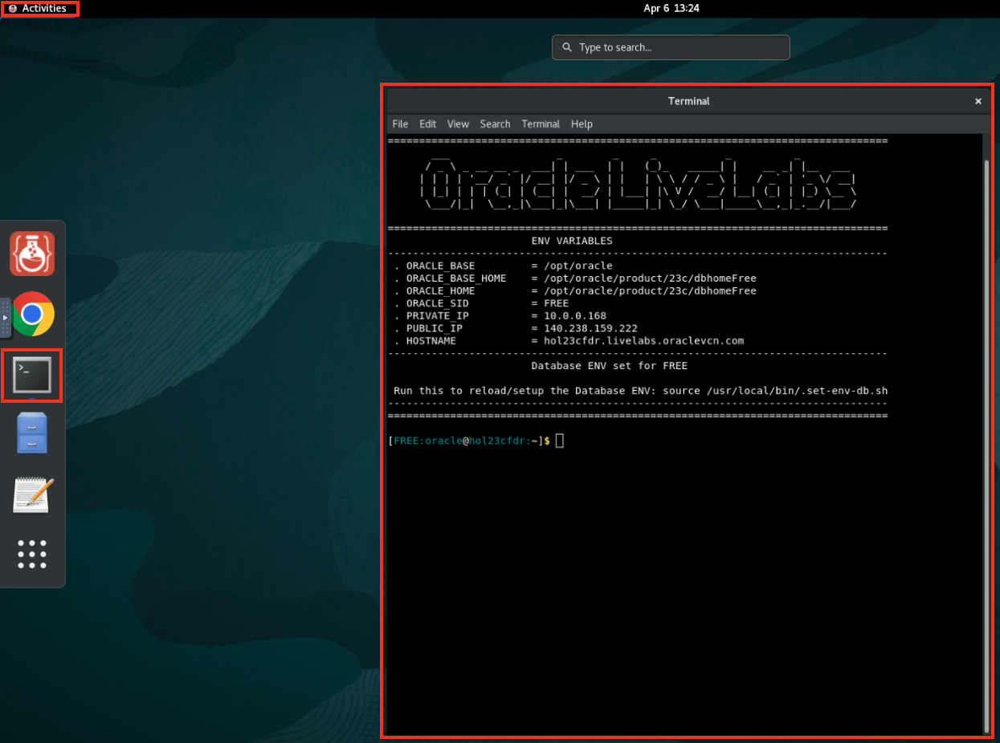
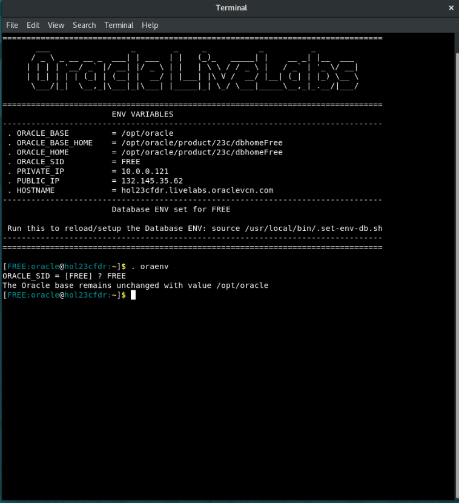
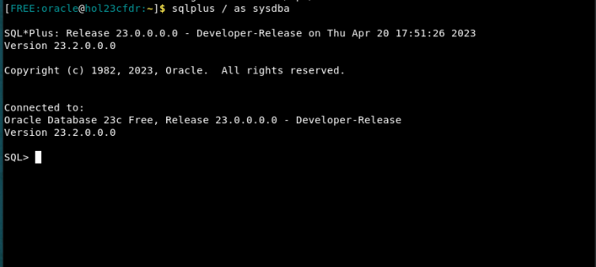
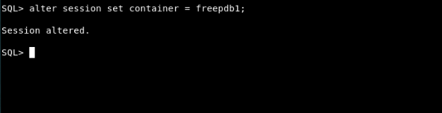
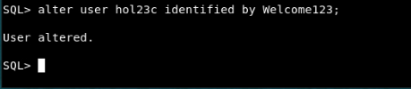
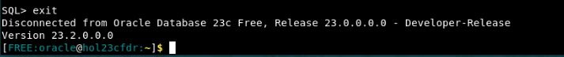
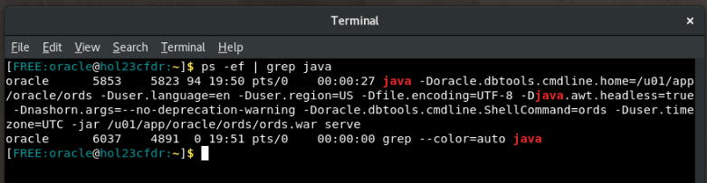

# Change Password and Start Oracle REST Data Services (ORDS)

## Introduction

In this lab, you will reset the password for the **hol23c** user in the Oracle Database and then start up **Oracle REST Data Services** (ORDS), which will be needed to start up **Oracle Application Express** (APEX) and other applications.

Estimated Time: 5 minutes

### Objectives

In this lab, you will:
* Reset the password for the **hol23c** user
* Start ORDS

### Prerequisites

This lab assumes you have:
* Oracle Database 23ai Free Developer Release
* A terminal or console access to the database

## Task 1: Resetting database user password

1. The first step is to get to a command prompt. If you need to open a terminal and you are running in a Sandbox environment, click on Activities and then Terminal.

    

2. Next, configure your Oracle environment. The **oraenv** command will set all of the environment variables based on your database. When prompted, type **FREE** for the database name; *if you supplied a different database name, use that instead.*

    ```
    [FREE:oracle@hol23cfdr:~]$ <copy>. oraenv</copy>
    ORACLE_SID = [FREE] ? FREE
    The Oracle base has been set to /opt/oracle
    [FREE:oracle@hol23cfdr:~]$
    ```

   


3. Next, connect to your database.

    ```
    [FREE:oracle@hol23cfdr:~]$ <copy>sqlplus / as sysdba</copy>

    SQL*Plus: Release 23.0.0.0.0 - Developer-Release on Wed Apr 5 13:38:14 2023
    Version 23.2.0.0.0

    Copyright (c) 1982, 2023, Oracle.  All rights reserved.


    Connected to:
    Oracle Database 23ai Free, Release 23.0.0.0.0 - Developer-Release
    Version 23.2.0.0.0

    SQL>
    ```

    

4. Now change your container to your pluggable database. *If your pluggable database has a different name, make sure to change it in the command below.*

    ```
    SQL> <copy>alter session set container = freepdb1;</copy>

    Session altered.

    SQL>
    ```

    

5. To change the password for the **hol23c** user, use the "alter user \[username\] identified by \[new password\]" command. The syntax below shows how to do this for the hol23c user; make sure to replace *[new\_password\_here]* with your new password. Throughout this workshop, we will use the **Welcome123** password.

    ```
    <copy>alter user hol23c identified by </copy>[new_password_here];
    ```

    ```
    SQL> alter user hol23c identified by Welcome123;

    User altered.

    SQL>
    ```
    

6. Once the password has been changed, you can exit SQL Plus.

    ```
    SQL> <copy>exit</copy>
    Disconnected from Oracle Database 23ai Free, Release 23.0.0.0.0 - Developer-Release
    Version 23.2.0.0.0
    [FREE:oracle@hol23cfdr:~]$
    ```

    

## Task 2: Starting ORDS

1. To start ORDS, from the same command prompt use the following command. The output of `[1] 26895` is just an example, your output could be different.

    ```
    [FREE:oracle@hol23cfdr:~]$ <copy>ords serve > /dev/null 2>&1 &</copy>
    [1] 26895
    [FREE:oracle@hol23cfdr:~]$
    ```

    **NOTE:** You must *leave this terminal window open* and keep the process running. Closing either will stop ORDS from running, and you will not be able to access other applications that are used in this lab.

    


2. To confirm ORDS is running, you can run the `ps -ef | grep java` command, as shown below. Your results may be slightly different, but as long as you see one java process running and ORDS is mentioned in the results, it is running.

    ```
    <copy>
    ps -ef | grep java
    </copy>
    ```

    

You may now **proceed to the next lab.**

## Acknowledgements
* **Author** - Kaylien Phan and William Masdon, Product Managers, Database Product Management
* **Contributors**
    - Jim Czuprynski, LiveLabs Contributor, Zero Defect Computing, Inc.
    - Hope Fisher, Program Manager, Database Product Management
* **Last Updated By/Date** - Hope Fisher, June 2023