# Explore APEX Native Map Region Capabilities

## Introduction

In this lab you will explore and experiment with features of the APEX Native Map Region using the preconfigured APEX application you imported in the previous lab step.

Estimated Time: 20 minutes.

<!-- Watch the video below for a quick walk through of the lab. -->

<!-- update video link. Previous iteration: [](youtube:XnE1yw2k5IU) -->

### Objectives
Learn how to:
- Visualize geospatial data stored a database table's SDO_GEOMETRY column
- Use APEX and SQL to perform simple analysis of geospatial data

### Prerequisites
This lab assumes you have:
- Oracle Database 23ai Free Developer Release
- Completed all previous labs successfully
- ORDS still running so that you can open APEX

    > **Note:** If you have closed ORDS, repeat the steps in Lab 2 to reopen it

Watch the video below for a quick walk through of the lab.
[Prepare APEX workspace](videohub:1_afr7ooim)

Watch the video below for a quick walk through of the lab.
[Prepare APEX workspace](videohub:1_afr7ooim)

## Task 1: Open sample APEX Native Map Regions application

1. Open Activities -> Google Chrome

    


2. Go to this URL and wait for the screen to load, then log in as **admin** and supply the password you previously reset in the prior lab.
    ```
    <copy>
    http://localhost:8080
    </copy>
    ```
    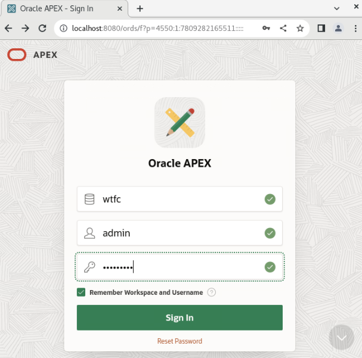

3. The APEX development environment opens. Select the App Builder option.

    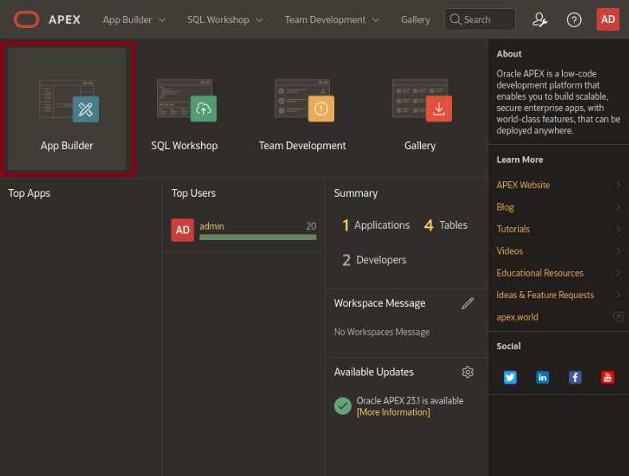

4. Within the App Builder tool, choose the application named WTFC that you previously imported.

    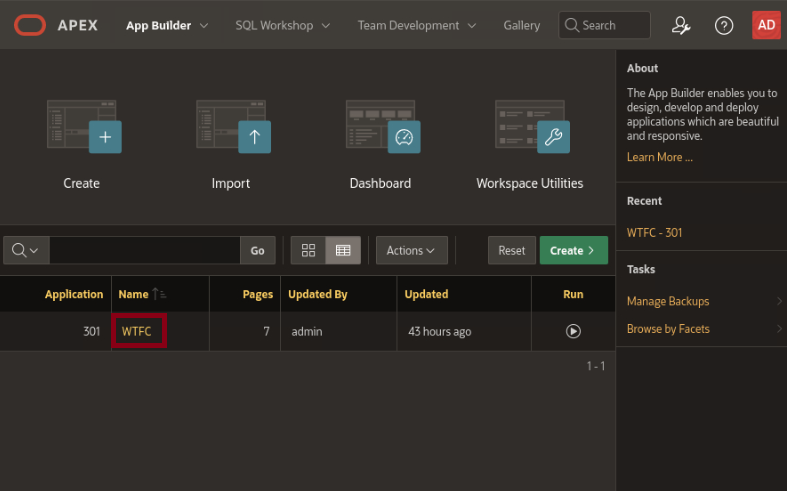

## Task 2: Explore advanced features of APEX Native Map Regions

1. Click on the 100 - Top Disadvantaged Areas page to open that page.

    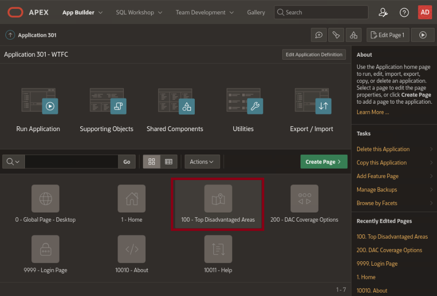

2. Click on Run Page icon next to the Save button near the top right of the page to run it.

    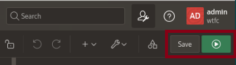

3. Since we are using database account authentication to connect our APEX application to the database, supply **hol23c** for the login and supply the password you previously reset in the prior lab.

    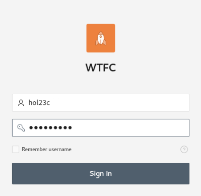

4. A map of the top 450 most disadvantaged communities (DACs) in the USA state of Wisconsin are displayed using the APEX Native Map Region's capability to show multiple aspects mapping data as *Extruded Polygons.*  Explore the map to understand these features:

    - Move around the map and hover over a few of the DACs displayed. You can use the +/- keys or CTL and your mouse wheel to increase or decrease the scale of the map, just as if it were a Google Maps or MapQuest web interface.
    - Observe the intensity of the color scheme for a few of the most disadvantaged DACs. Also, observe that the height of each polygon in the map region is tied to the [] value for each DAC.
    - You can also turn off the 3D appearance of DACs by clicking on the 2D button on the map region. Conversely, you can return to a 3D appearance by clicking on the 3D button.

    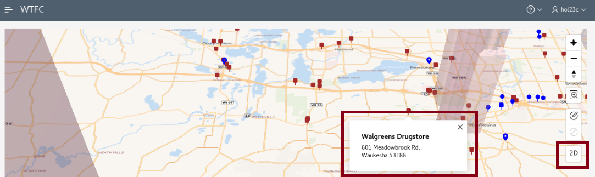

    - Click into a few of the DACs to view its FIPS code and some of the properties that qualify them to be a disadvantaged community.
    - Finally, click on a few of the map icons to view the location of *potential* (brown square) or *actual* (blue teardrop) charging stations and their location within the state.

    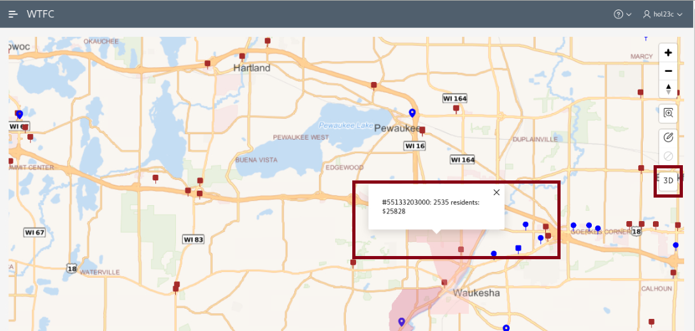

5. Sign out of the application and return to the Edit Page window of APEX so you can explore how the Native Map Region provides these capabilities.

    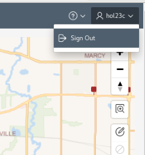

6. We will now take a closer look at how to configure a Native Map Region to facilitate these features. On the left-hand menu for Page 100, click on the Charging Points Within Disadvantaged Areas region under the *Components...Content Body* section. The region's attributes are displayed in the right-hand pane. The key attribute to note here: setting the region type to *Map* specifies that this is a Native Map Region.

    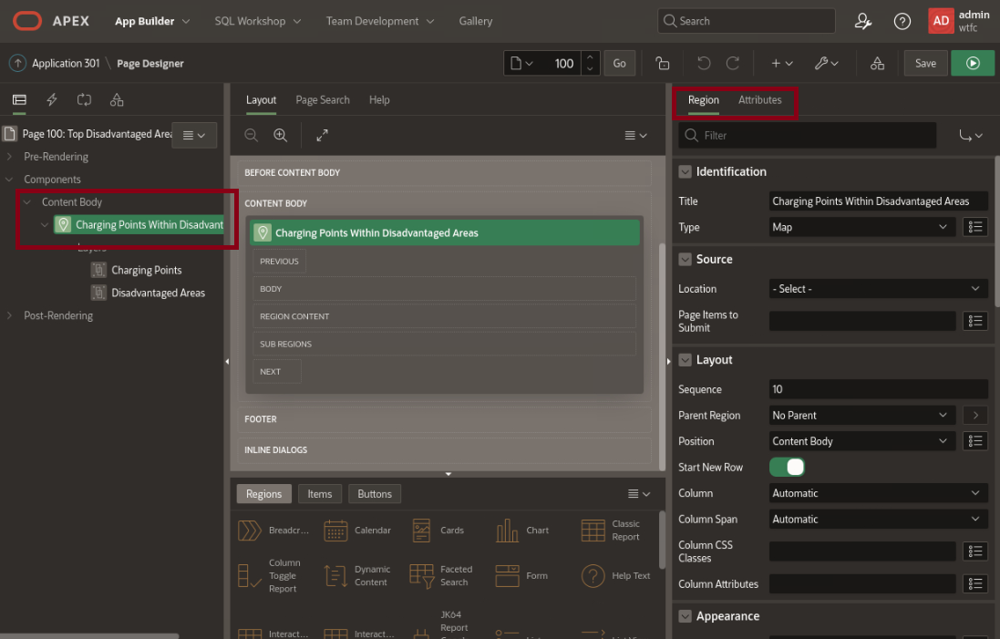

7. Now click on the Attributes tab the right-hand pane. Several additional parameters can be set here:

    - First, note the chosen *map style.* We are using the *OpenStreetMapBright* option for normal display and have selected *OpenStreetMapDark* for dark mode viewing for devices like tablets and smart phones that offer that viewing capability. If you want to experiment with these settings, feel free to choose a different set of map styles or modify the maximum map height in pixels to see the impact on your map.
    - We have also specified some custom settings for the Native Map Region's *controls.* For example, we've enabled the ability to zoom in and out of the map via mousewheel and allow infinite zoom-in and zoom-out. Experiment with any of these settings to see the impact on the Native Map Region.
    - Lastly, note we have chosen a specific latitude and longitude as the initial position for the map and a value of nine (9) for its zoom level. Experiment with these settings by choosing a slightly different latitude/longitude combination and a different initial zoom level to see the impact on your map.

    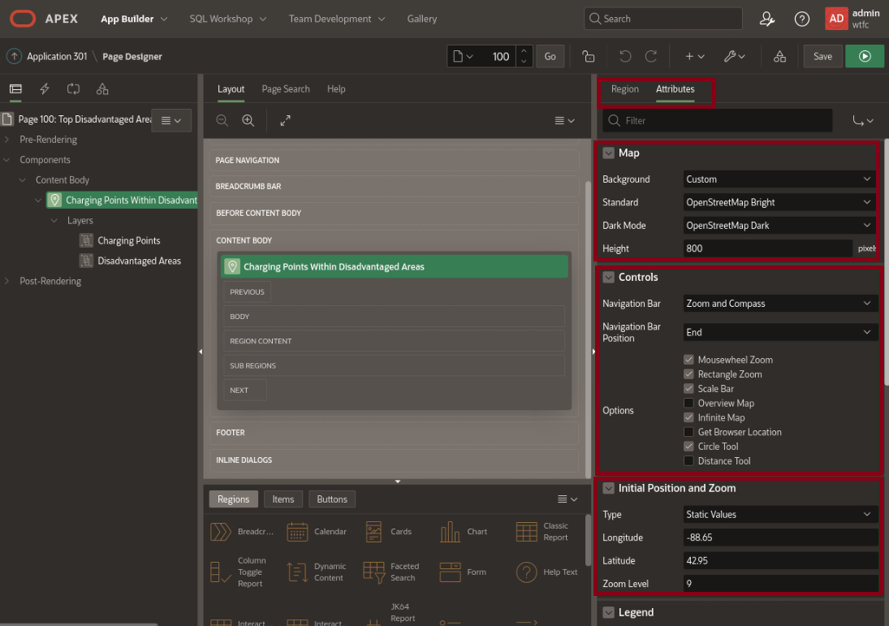

## Task 3: Explore Oracle Spatial features in concert with APEX Native Map Regions

1. Navigate to Page 200 by selecting the *Page Finder* icon near the top of the Page Designer panel and clicking on it to open a list of all pages in the application and then selecting page 200.

    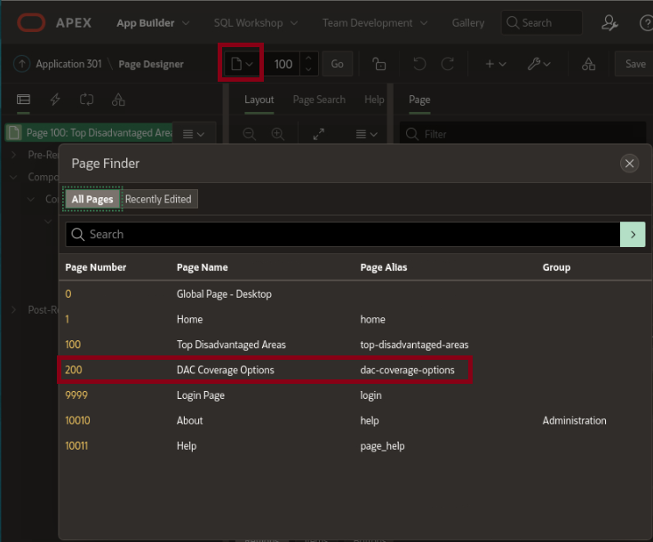

2. Page 200 is displayed in Page Designer. Just as with Page 100, execute this application page by clicking the Run Page button in the upper right.

    

3. Again, since we are using database authentication to execute this applications, supply **hol23c** for the application login and the **database** password that you reset in prior labs to access the application.

    

4. Now that Page 200 is displayed, explore its capabilities. This page offers the ability to apply Oracle Spatial functions for two different map regions - one displaying all of the DACs in Wisconsin, and another displaying all potential and actual charging stations within those DACs - but the overlap is controlled by the value supplied for the *Minimum Distance* field at the top of the page, initially set to 100 meters. The overall compliance rating for the State is approximately 80% with this selected threshold.

    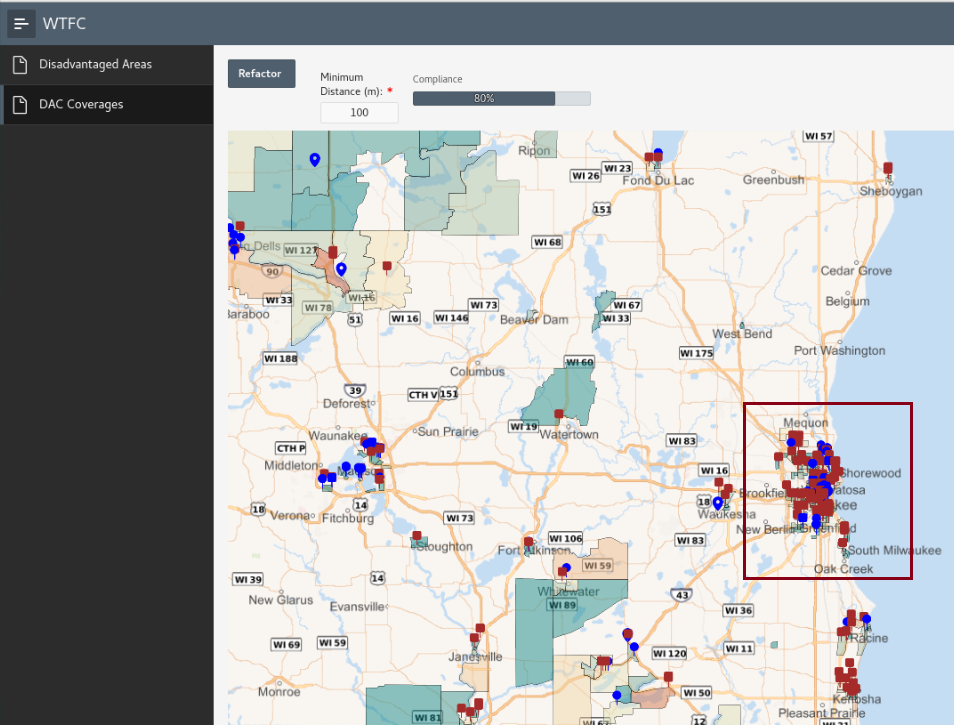

    - Scroll to the center of the state map and zoom in to find the city of Stevens Point. Note that only four charging points are within 100m of the nearest DAC just to the west of the city.

    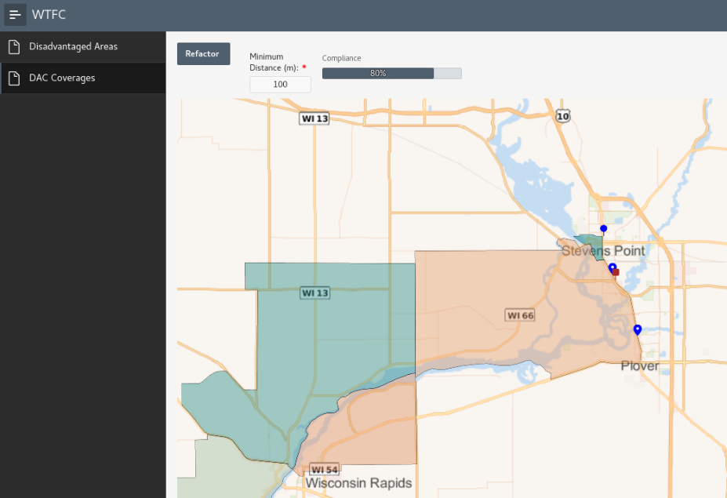

    - Try changing the Minimum Distance to a different, but larger, value and then clicking on the Refactor button. For example, this is how the map displays with a 350m value. Note that now one *additional* charger is now displayed.

    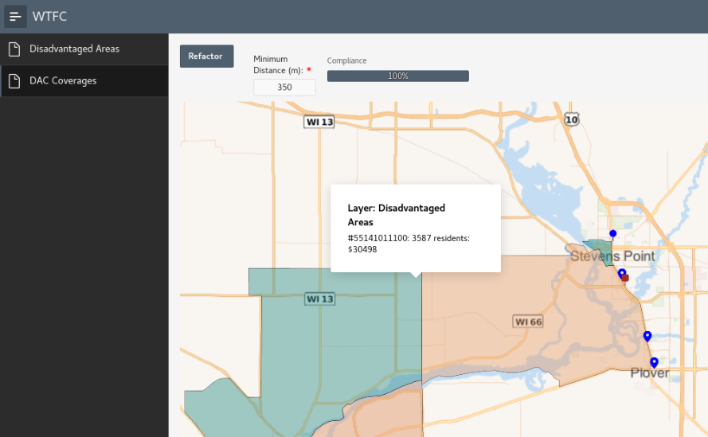

    - Zoom back out to see how this change has impacted selection of additional chargers across the State.

    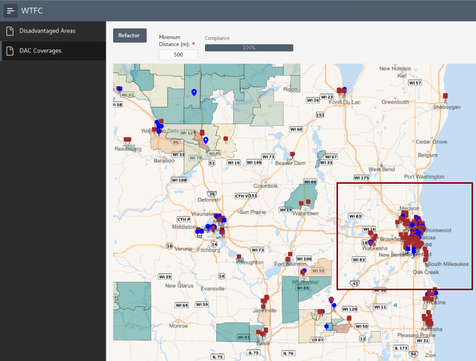

6. For a closer look at how Page 200 is configured to support these features, sign out of the application and return to the APEX Page Designer.

    - The Native Map Region named *Disadvantaged Areas* is configured much like it is for Page 100. However, note the addition of a button (P200\_FACTOR), a number field (P200\_MINIMUM\_DISTANCE), and a slider bar (P200\_COMPLIANCE).

    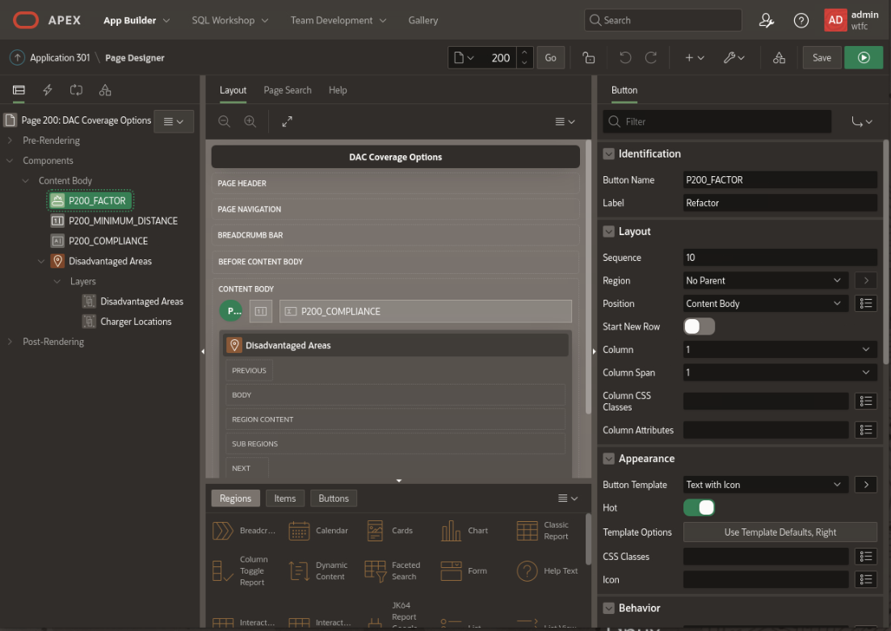

    - The Native Map Region contains two map layers. The one named *Disadvantaged Areas* shows the 450 most disadvantaged DACs in Wisconsin.

    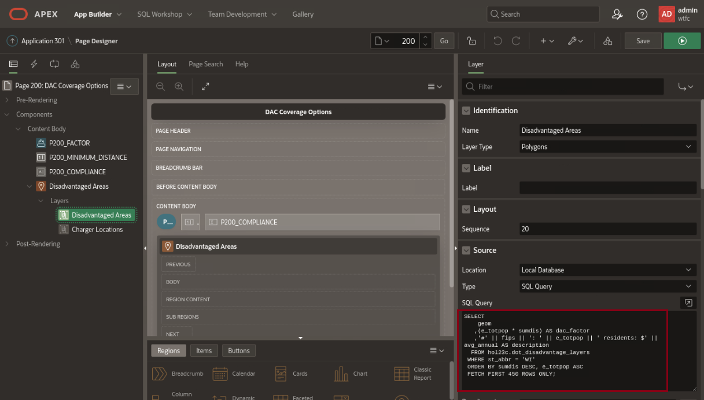

    - The *Charger Locations* map layer, however, uses a much more complex SQL query as its source.

    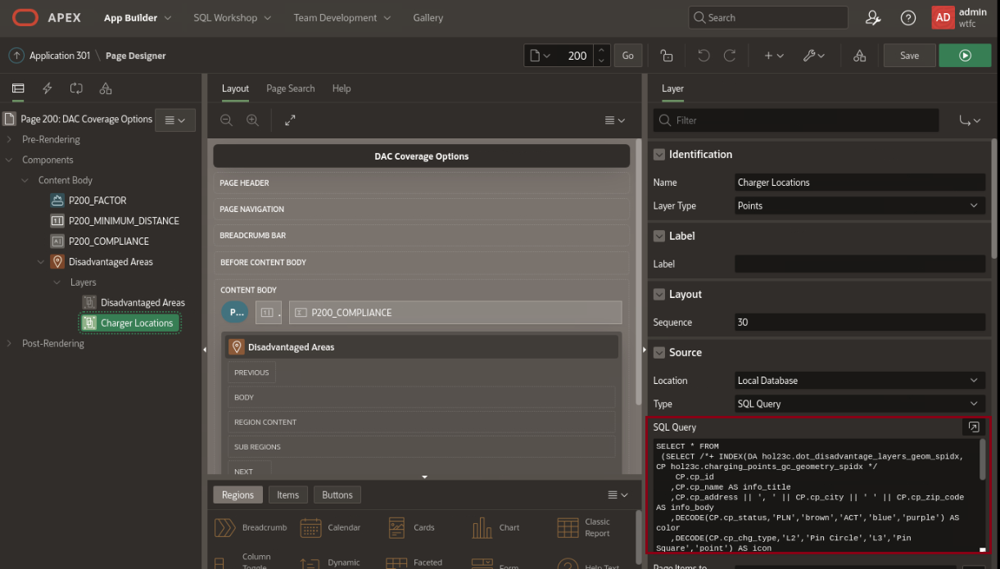

7. Here is a closer look at the SQL query that drives the changing display of chargers based on the supplied value for Minimum Distance. This query underlies the Charger Locations map layer, and it consists of three parts:

    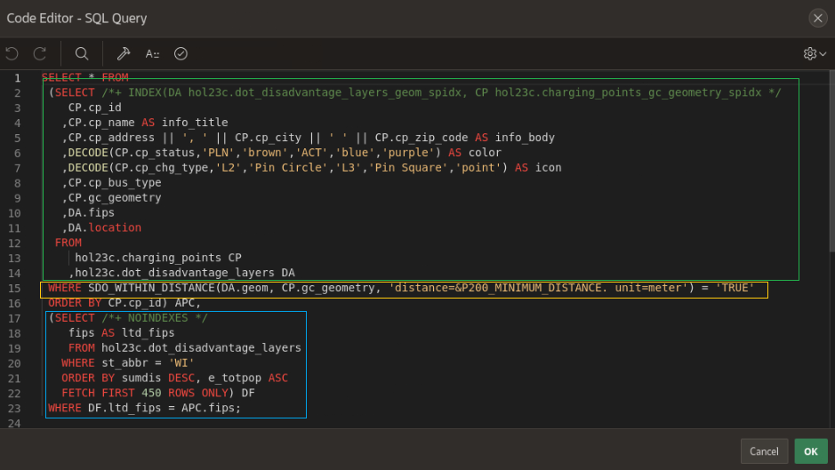

    - The code in the *green box* pulls together information from the CHARGING\_POINTS and DOT\_DISADVANTAGE\_LAYERS database tables. Note the use of the **+INDEX** optimizer hint to force the Oracle database to use the two spatial indexes for these tables when retrieving data.

    - The code in the *blue box* gathers data from only the DOT\_DISADVANTAGE\_LAYERS table, but note that it isolates this result set to only the 450 most disadvantaged DACs in Wisconsin. This fulfills federal government requirements to insure that the 40% least advantaged DACs in the state are covered. (As there are approximately 1100 DACs in Wisconsin, 450 / 1100 = 40.9% minimum coverage.)

    - The WHERE clause in the *gold box* is what ties these two result sets together. It uses the built-in Oracle Spatial function named **SDO\_WITHIN\_DISTANCE** to find only those charging points within the DACs that have been selected through the code in the blue box, but also uses the value supplied in the **P200\_MINIMUM\_DISTANCE** page variable to limit the displayed charging points.

8. The Compliance slider bar value is computed from a similar query to the one used above; the only difference is that it's computed based on the number of chargers actually displayed on the screen. You can view the query by selecting the P200_COMPLIANCE object on Page 200; note that it's set to recalculate on page submission and replaces the value already displayed previously.

    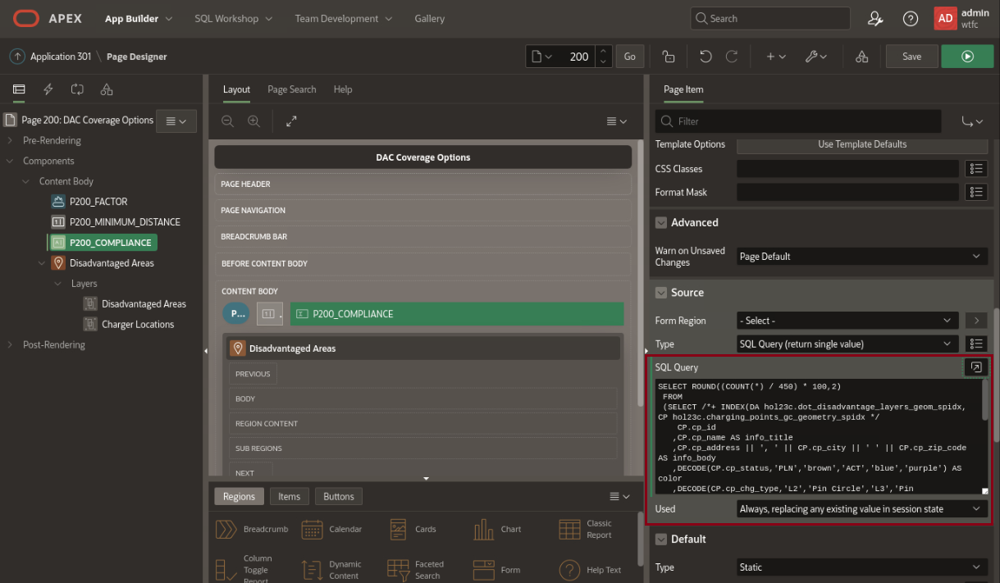

9. You have now completed the entire APEX Native Map Regions LiveLab.

## Learn More
* [Oracle APEX 23.1: Creating Maps](https://docs.oracle.com/en/database/oracle/apex/23.1/htmdb/creating-maps.html#GUID-ACA5ED1C-7031-42BF-90B1-98938FB6DC17)
* [Oracle Database 23ai: Spatial Concepts](https://docs.oracle.com/en/database/oracle/oracle-database/23/spatl/spatial-concepts.html#GUID-67E4037F-C40F-442A-8662-837DD5539784)
* [Oracle Database 23ai: SDO_WITHIN_DISTANCE](https://docs.oracle.com/en/database/oracle/oracle-database/23/spatl/indexing-querying-spatial-data.html#GUID-3839BEE8-7743-46F4-B573-667ADC7FEB3E)

## Acknowledgements
- **Author** - Jim Czuprynski, LiveLabs Contributor, Zero Defect Computing, Inc. 
* **Last Updated By/Date** - Jim Czuprynski, July 2023