# Lab 4: Prepare Database Objects

## Introduction

Before we can begin using APEX to visualize and analyze our geospatial data, we must first create and populate tables and other database objects containing our data sources. This lab assumes that you have already installed the Oracle Database 23c Free Developer Release and configured and installed ORDS on a pluggable database.

Estimated Time: 10 minutes

### Objectives

In this lab, you will:

- Connect SQL Developer to your pluggable database instance
- Create database objects and populate them with data

### Prerequisites

This lab assumes you have:
- Oracle Database 23c Free Developer Release
- Completed all previous labs successfully

## Task 1: Download the schema creation and population scripts

1. Click Activities in the upper left corner, then click Terminal. Select File -> New Tab since ORDS is running in your current Terminal tab.

    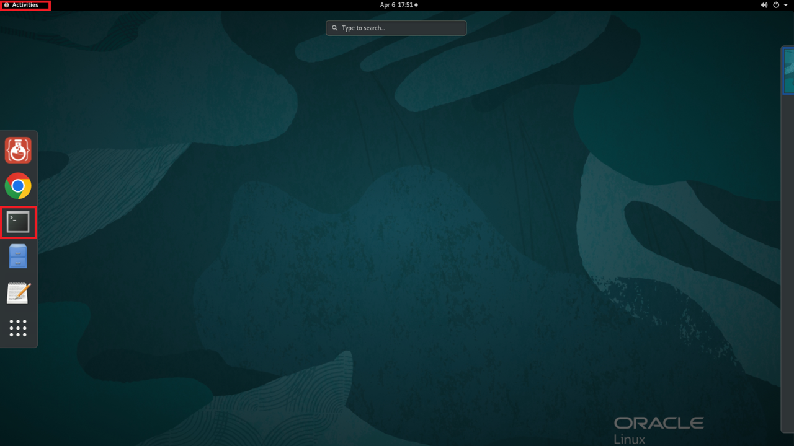

2. Go into the right directory.

    ```
    $ <copy>cd ~/examples</copy>
    ```

    

3. Pull down the materials for setup.

    ```
    $ <copy>wget https://objectstorage.us-ashburn-1.oraclecloud.com/p/b1_vZe_9llVqw_oTDq-SQyRrkDshcuABTHc6QuUDG984jfUi0mbk5x7pOZ7mPDPh/n/c4u04/b/livelabsfiles/o/partner-solutions/plot-ev-charging-points-with-apex-native-map-regions/apex-mapping.zip</copy>
    ```

    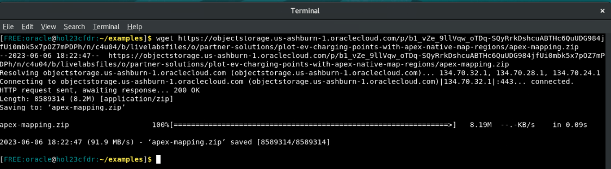

4. Unzip the file. Inside this zip file are the files to setup your schema and APEX application.

    ```
    $ <copy>unzip -o apex-mapping.zip</copy>
    ```

    

5. Remove the remaining zip file after you've unzipped it.

    ```
    $ <copy>rm -rf apex-mapping.zip</copy>
    ```

    <!--  -->


## Task 2: Open SQL Developer

1. From an open Terminal Window, navigate to the correct directory to open SQL Developer, and then run the command to start up SQL Developer.

    ```
    $ <copy>cd /opt/sqldeveloper/</copy>
    ```
    ```
    $ <copy>./sqldeveloper.sh</copy>
    ```

    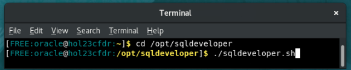

3. On the left side menu, you'll see **hol23c_freepdb1** underneath Oracle Connections. Double click it to open the connection.


    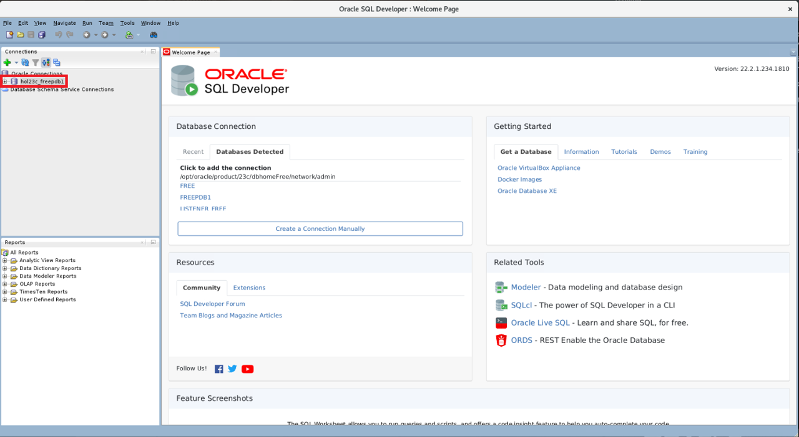

4. Fill out the connection information with your password. The default password we will be using throughout this lab is **Welcome123**. If you have changed yours, please use that one. After you click okay, you should be connected to your user.

    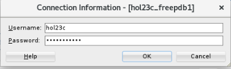

## Task 3: Create and populate database tables and related objects

1. Now that you have logged into SQL Developer, let's get familiar with some of its tools and features.

    From the left-side panel, you can view information about the different database components within the HOL23C schema. Expand the hol23c_freepdb1 node on the tree view to see tables, indexes, and other objects. If you click into the **tables** node, you'll note that there are no tables present yet.

    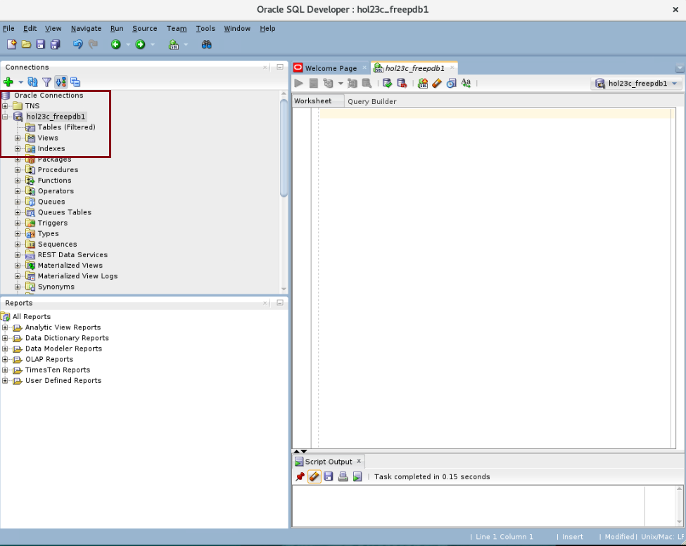

2. Click File -> Open and navigate to the **/home/oracle/examples/apex-mapping** folder.

    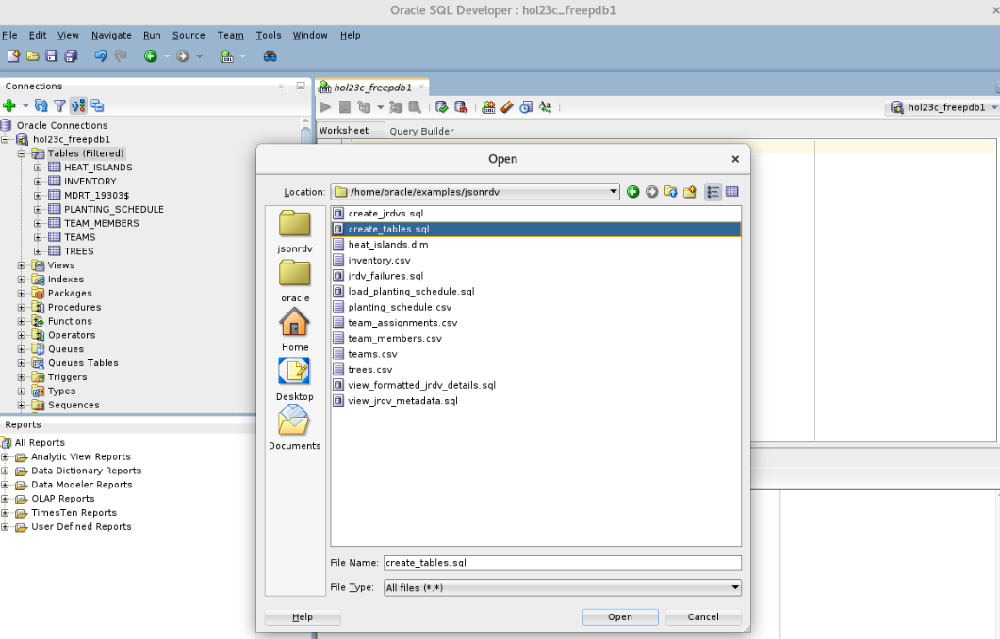

3. First, we will create the tables that will contain the geospatial data our APEX application will be using.

    - Open the file named **create_tables.sql** by clicking on the File -> Open icon.
    - Click the button that shows a document with the small green play button on it to run the whole script.
    - If it asks you to select a connection in a popup window, choose **hol23c_freepdb1** from the drop down and then click OK.

    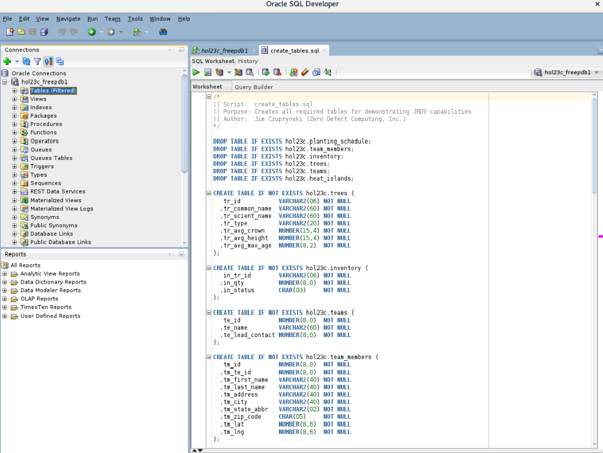

    You should see that the tables have been proactively dropped (if they had existed) and were then created.

4. Next, we'll populate the **CHARGING_POINTS** table with relevant geospatial data on available and potential charging points in the State of Wisconsin.

    - Open the file named **populate\_charging\_points.sql** by clicking on the File -> Open icon.
    - Select the **hol23c_free** database from the drop-down list in the upper-right-hand corner of the window  to connect to your PDB.
    - Then either click on the Run Script button or simply hit F5 to run the script. It should take approximately 10 seconds or less to complete.

    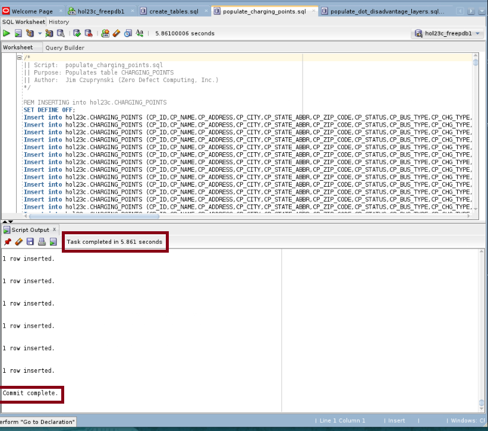

5. Next, we'll populate the **DOT\_DISADVANTAGE\_LAYERS** table with statistical and geospatial data across census tracts in several Midwestern USA states.

    - Open the file named **populate\_dot\_disadvantage\_layers.sql** by clicking on the File -> Open icon.
    - Select the **hol23c_free** database from the drop-down list in the upper-right-hand corner of the window  to connect to your PDB.
    - Then either click on the Run Script button or simply hit F5 to run the script. It should take approximately 90 seconds or less to complete.

    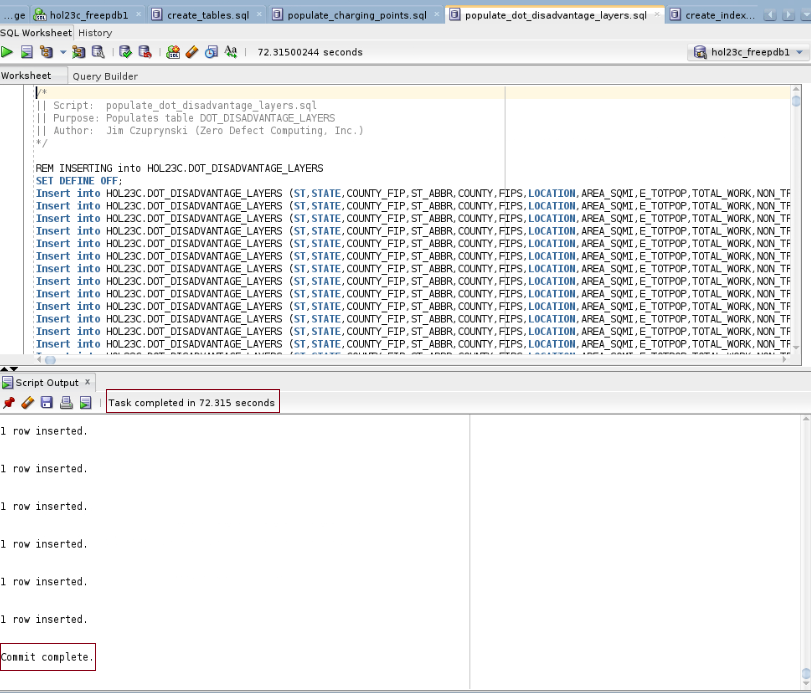

6. Finally, we'll create primary key constraints and indexes for these tables, as well as two spatial indexes on the contents of their SDO_GEOMETRY columns.

    - Open the file named **create\_indexes\_and\_constraints.sql** by clicking on the File -> Open icon.
    - Select the **hol23c_free** database from the drop-down list in the upper-right-hand corner of the window  to connect to your PDB.
    - Then either click on the Run Script button or simply hit F5 to run the script.

    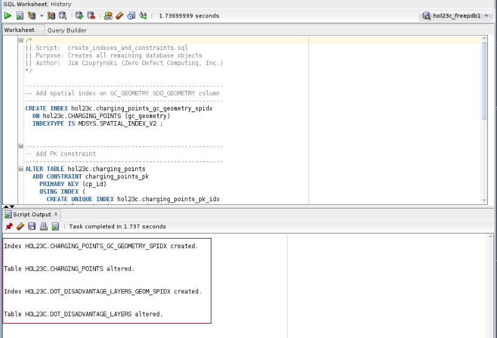

7. Your schema setup is now complete.

You may now proceed to the next lab.

## Learn More
- [Oracle SQL Developer 23.1 Concepts and Usage](https://docs.oracle.com/en/database/oracle/sql-developer/23.1/rptug/sql-developer-concepts-usage.html#GUID-464C045C-FBDF-417A-A20B-037D294B3BDA)
- [Oracle Spatial Database](https://www.oracle.com/database/spatial/)
- [Oracle APEX](https://apex.oracle.com/en/)

## Acknowledgements
* **Author** - Jim Czuprynski, LiveLabs Contributor, Zero Defect Computing, Inc.
* **Contributors** - Hope Fisher, Program Manager, Database Product Management
* **Last Updated By/Date** - Hope Fisher, June 2023