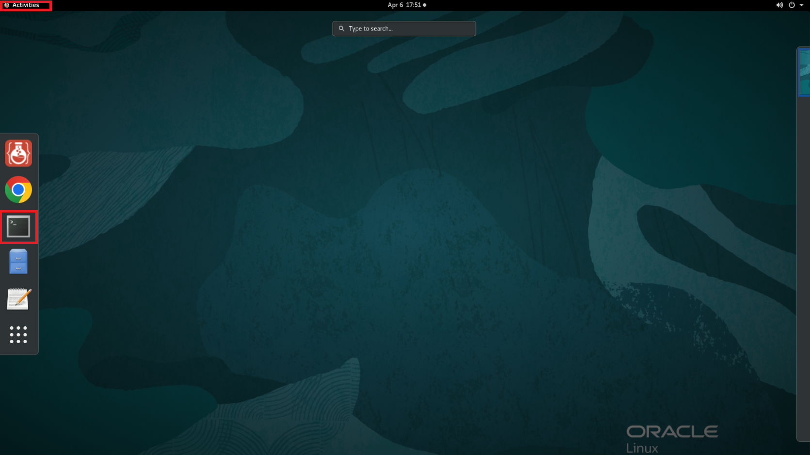
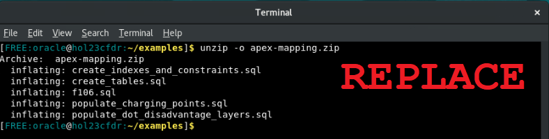

# Set Up Your Environment

## Introduction

Before we can begin using APEX to visualize and analyze our geospatial data, we must first create and populate tables and other database objects containing our data sources. This lab assumes that you have already installed the Oracle Database 23ai Free Developer Release and configured and installed ORDS on a pluggable database.

Estimated Time: 10 minutes

### Objectives

In this lab, you will:

- Connect SQL Developer to your pluggable database instance
- Create database objects and populate them with data

### Prerequisites

This lab assumes you have:
- Oracle Database 23ai Free Developer Release
- Completed all previous labs successfully

Watch the video below for a quick walk through of the lab.
[Prepare APEX workspace](videohub:1_jxcqa47n)

## Task 1: Download the schema creation and population scripts

1. Click Activities in the upper left corner, then click Terminal. Select File -> New Tab since ORDS is running in your current Terminal tab.

    

2. Go into the right directory.

    ```
    $ <copy>cd ~/examples</copy>
    ```

    

3. Pull down the materials for setup.

    ```
    $ <copy>wget https://c4u04.objectstorage.us-ashburn-1.oci.customer-oci.com/p/EcTjWk2IuZPZeNnD_fYMcgUhdNDIDA6rt9gaFj_WZMiL7VvxPBNMY60837hu5hga/n/c4u04/b/livelabsfiles/o/partner-solutions/plot-ev-charging-points-with-apex-native-map-regions/apex-mapping.zip</copy>
    ```

    

4. Unzip the file. Inside this zip file are the files to setup your schema and APEX application.

    ```
    $ <copy>unzip -o apex-mapping.zip</copy>
    ```

    

5. Remove the remaining zip file after you've unzipped it.

    ```
    $ <copy>rm -rf apex-mapping.zip</copy>
    ```

    <!--  -->


## Task 2: Open SQL Developer

1. From an open Terminal Window, navigate to the correct directory to open SQL Developer, and then run the command to start up SQL Developer.

    ```
    $ <copy>cd /opt/sqldeveloper/</copy>
    ```
    ```
    $ <copy>./sqldeveloper.sh</copy>
    ```

    

3. On the left side menu, you'll see **hol23c\_freepdb1** underneath Oracle Connections. Double click it to open the connection.


    

4. Fill out the connection information with your password. The default password we will be using throughout this lab is **Welcome123**. If you have changed yours, please use that one. After you click okay, you should be connected to your user.

    

## Task 3: Create and populate database tables and related objects

1. Now that you have logged into SQL Developer, let's get familiar with some of its tools and features.

    From the left-side panel, you can view information about the different database components within the HOL23C schema. Expand the hol23c_freepdb1 node on the tree view to see tables, indexes, and other objects. If you click into the **tables** node, you'll note that there are no tables present yet.

   

2. Click File -> Open and navigate to the **/home/oracle/examples/apex-mapping** folder.

   

3. We will now build and populate all of the database objects needed to demonstrate the features of JRDVs.

    - Open the file named **create\_tables.sql** by clicking on the *File ... Open* icon.
    - Click the button that shows a document with the small green play button on it to run the whole script.
    - If it asks you to select a connection in a popup window, choose **hol23c\_freepdb1** from the drop down and then click OK.

    

    - Then either click on the Run Script button or simply hit F5 to run the script. It should take approximately 90 seconds or less to complete.

4. Browse through the script output from the file's execution. You should see that:

    - Two tables have been proactively dropped (if they had already existed).
    - Two tables have been created.
    - The first SQL script, **populate\_charging\_points.sql,** loaded table CHARGING\_POINTS because its GC\_GEOMETRY column's datatype (SDO\_GEOMETRY) requires special handling during population.
    - The second SQL script, **populate\_dot\_disadvantage\_layers.sql,** loaded table DOT\_DISADVANTAGE\_LAYERS separately because its GEOM column's datatype also requires special handling.
    - Primary key constraints and corresponding indexes were created for both tables.
    - Finally, two special domain indexes of type MDSYS.SPATIAL\_INDEX\_V2 were created on the two SDO\_GEOMETRY columns' contents. We will leverage these indexes later in this lab.

   

5. Your schema setup is now complete.

You may now **proceed to the next lab.**

## Learn More
- [Oracle SQL Developer 23.1 Concepts and Usage](https://docs.oracle.com/en/database/oracle/sql-developer/23.1/rptug/sql-developer-concepts-usage.html#GUID-464C045C-FBDF-417A-A20B-037D294B3BDA)
- [Indexing and Querying Spatial Data](https://docs.oracle.com/en/database/oracle/oracle-database/23/spatl/indexing-querying-spatial-data.html)

## Acknowledgements
* **Author** - Kaylien Phan, William Masdon, Jim Czuprynski
* **Contributors** - Jim Czuprynski, LiveLabs Contributor, Zero Defect Computing, Inc.
* **Last Updated By/Date** - Jim Czuprynski, July 2023