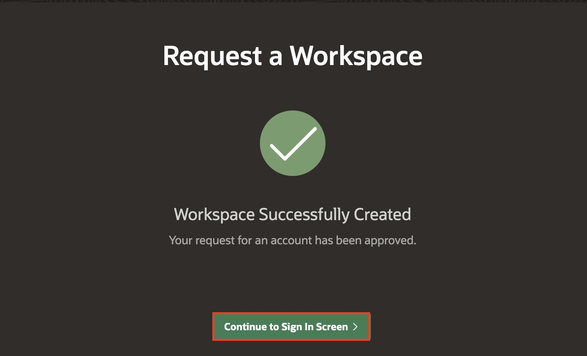
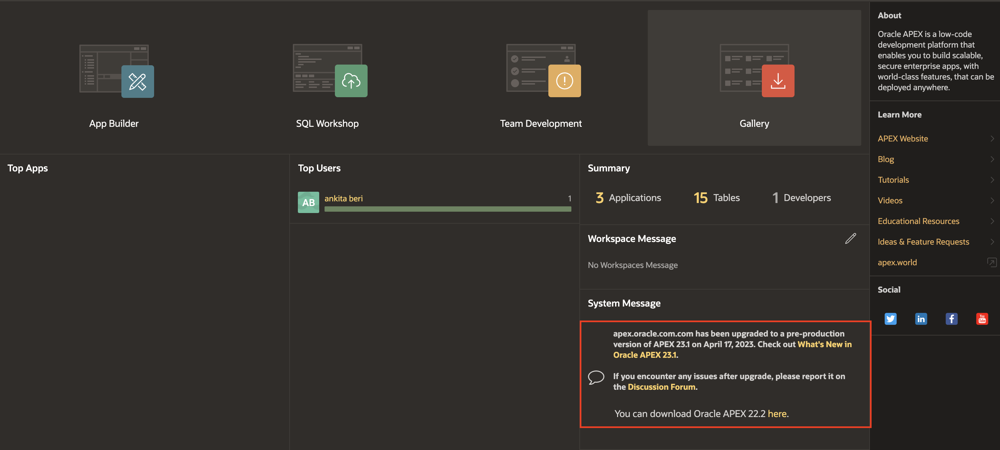
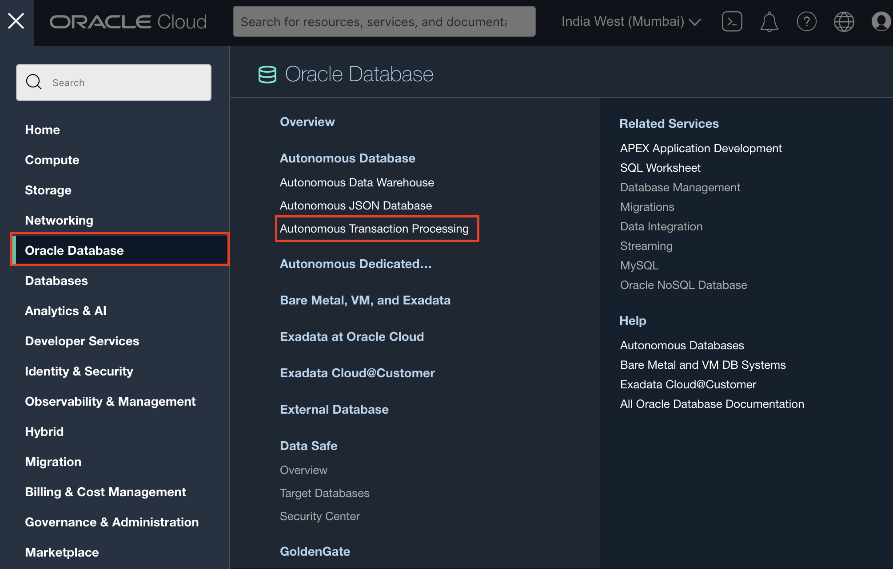
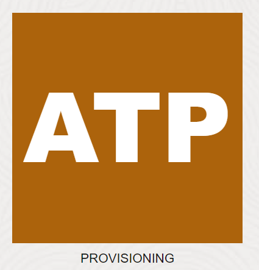
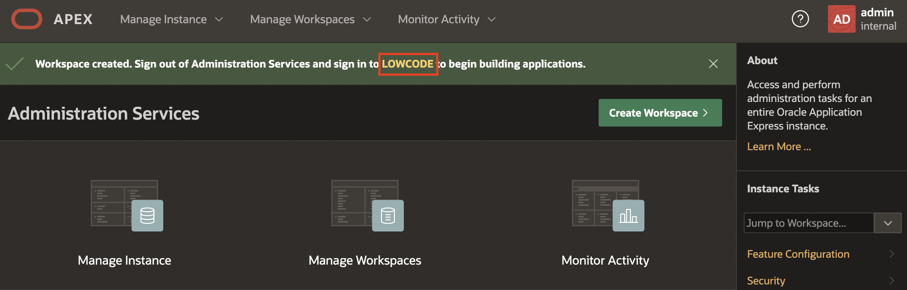
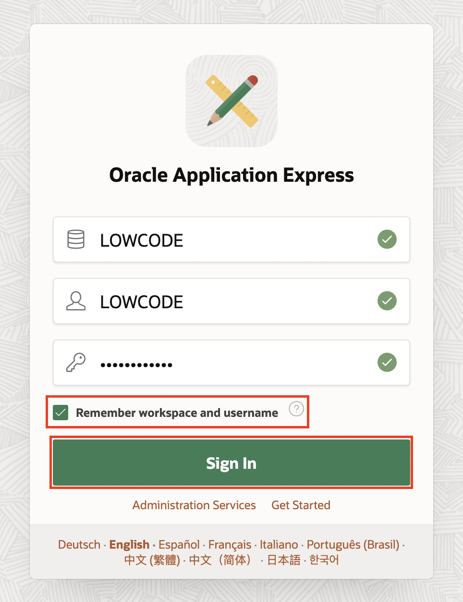
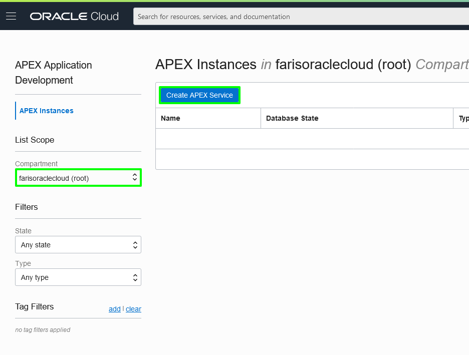
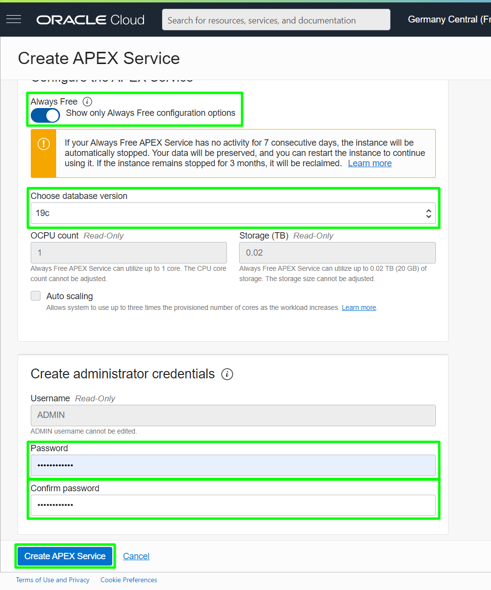
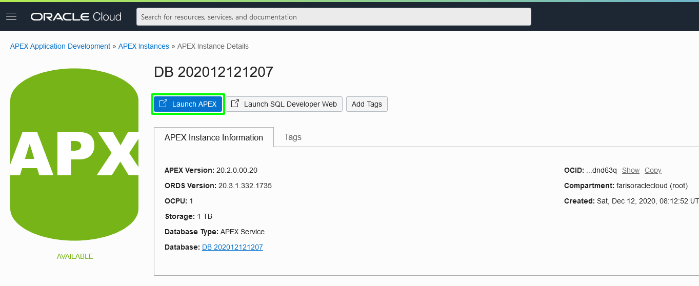

# Provision an APEX Workspace

## Introduction

Oracle APEX is a low-code application platform for Oracle Database. APEX Application Development, Autonomous Data Warehouse (ADW), and Autonomous Transaction Processing (ATP) are fully managed services, pre-integrated and pre-configured with APEX, for rapidly building and deploying modern data-driven applications in Oracle Cloud. Business users, citizens, and application developers can create enterprise apps 20X faster with 100X less code — without having to learn complex web technologies with just a browser. To start, you will need to decide on the service you are going to use for this workshop and then create an APEX workspace accordingly.

If you already have an APEX 22.2 Workspace provisioned, you can skip this lab.

Estimated Time: 5 minutes
<!--
Watch the video below for a quick walk through of the lab.

[](youtube:RcSCnZnDzDE)
-->

### What is an APEX Workspace?
An APEX Workspace is a logical domain where you define APEX applications. Each workspace is associated with one or more database schemas (database users) which are used to store the database objects, such as tables, views, packages, and more. APEX applications are built on top of these database objects.

### How Do I Find My APEX Release Version?
To determine which release of Oracle APEX you are currently running, do one of the following:
* View the release number on the Workspace home page:
    - Sign in to Oracle APEX. The Workspace home page appears. The current release version is displayed in the bottom right corner.

    

    

* View the About APEX page:
    - Sign in to Oracle APEX. The Workspace home page appears.
    - Click the Help menu at the top of the page and select About. The About APEX page appears.

  

### Where to Run the Lab

You can run this lab in any Oracle Database with APEX 22.2 installed. This includes the APEX Application Development Service, the free, "Development Only" apex.oracle.com service, your on-premises Oracle Database (providing APEX 22.2 is installed), on a third-party cloud provider where APEX 22.2 is installed, or even on your laptop by installing Oracle XE or Oracle VirtualBox App Dev VM and installing APEX 22.2.

Below are steps on how to sign up for an *APEX Application Development* Service, or for an *Oracle Autonomous Database* cloud service or *apex.oracle.com* service.
- On the other hand, **apex.oracle.com** is also a free service; however, it is only designated for development purposes, and running production apps is not allowed. For conducting labs in this workshop, any of these options can be utilized.

- The **Oracle Autonomous Database** option is ideal for learning about the Oracle Database and APEX, and it comes with a minimum of 1 OCPU and 1 TB of storage and can be extended as needed. This service can also be utilized for production applications.

- The **APEX Application Development Service** is excellent if you would like to go with a flexible paid option that allows concentrating your efforts on APEX development without worrying about database management. It provides 1 OCPU and 1 TB and can be extended as needed.


### Types of Cloud Accounts
We offer two types of Cloud Accounts:

*Free Tier Accounts*: After you sign up for the free [Oracle Cloud promotion](https://signup.cloud.oracle.com/) or sign up for a paid account, you’ll get a welcome email. The email provides you with your cloud account details and sign-in credentials.

*Oracle Cloud Paid Accounts*: When your tenancy is provisioned, Oracle sends an email to the default administrator at your company with the sign-in credentials and URL. This administrator can create a user for each person who needs access to the Oracle Cloud. Check your email or contact your administrator for your credentials and account name.

### Objectives
- Learn how to login to your Oracle Cloud Account

### Prerequisites
- Cloud account access is required but not Mandatory
- Cloud Account Name - The name of your tenancy (supplied by the administrator or in your Oracle Cloud welcome email)
- Username
- Password

Click one of the options below to proceed.


## **Option 1**: apex.oracle.com

Signing up for apex.oracle.com is simply a matter of providing details on the workspace you wish to create and then waiting for the approval email.

1. Go to [https://apex.oracle.com](https://apex.oracle.com.).

2. Click **Get Started for Free**.

    

3. Scroll down until you see details for apex.oracle.com.  Click **Request a Free Workspace**.

    

4. On the Request a Workspace dialog, enter your Identification details – First Name, Last Name, Email, Workspace Name, Your Location etc.,  
    Now, Please accept **Terms** of **Oracle APEX Service Agreement** and then **Request Workspace**

   *Note: For workspace, enter a unique name, such as first initial and last name.*

   

   

5. Check your email. You should get an email from `apexext-noreply@ociapp-notifications.oracle.com` within a few minutes.  
   *Note: If you don’t get an email go back to Step 3 and make sure to enter your email correctly.*

    Within the email body, click **Create Workspace**.

    

6. Click **Continue to Sign In Screen**.

  

7. Enter your password, and click **Apply Changes**.

  

8. On the APEX Workspace log in page, enter SecretPassw0rd for the password, check the Remember workspace and username checkbox, and then click Sign In.

    

9. You should now be in the APEX Builder.

    


## **Option 2**: Oracle Autonomous Database

If you've signed out of the Oracle Cloud, use these steps to sign back in.

1. Go to [cloud.oracle.com](https://cloud.oracle.com/en_US/sign-in) and enter your Cloud Account Name and click Next. This is the name you chose while creating your account in the previous section. It's NOT your email address. If you've forgotten the name, see the confirmation email.  

  Enter your **Cloud Account Name** in the input field and click the **Next** button.

    

2. Enter your **User Name** and **Password** in the input fields, and click **Sign In**.

    

3. From within your Oracle Cloud environment, you will create an instance of the Autonomous Transaction Processing database service.

    From the Cloud Dashboard, select the navigation menu icon in the upper left-hand corner and then select **Autonomous Transaction Processing**.

    

    From the Cloud Dashboard, select the **Navigation Menu** in the upper left

    

    Select **Autonomous Transaction Processing**.

    

4. Click **Create Autonomous Database**.

    

5. Enter **```SecretPassw0rd```** for the ADMIN password, then click **Create Autonomous Database**.

    
    

6. After clicking **Create Autonomous Database**, you will be redirected to the Autonomous Database Details page for the new instance.

    Continue when the status changes from:

    

    to:

    

7. Within your new database, APEX is not yet configured. Therefore, when you first access APEX, you will need to log in as an APEX Instance Administrator to create a workspace.

    Click the **Tools** tab.
    Click **Open APEX**.

    


8. Enter the password for the Administration Services and click **Sign In to Administration**.     
    The password is the same as the one entered for the ADMIN user when creating the ATP instance: **```SecretPassw0rd```**

    

9. Click **Create Workspace**.

    

10. In the Create Workspace dialog, enter the following:

    | Property | Value |
    | --- | --- |
    | Database User | LOWCODE |
    | Password | **`SecretPassw0rd`** |
    | Workspace Name | LOWCODE |

    Click **Create Workspace**.

    

11. In the APEX Instance Administration page, click the **LOWCODE** link in the success message.         
    *Note: This will log you out of APEX Administration so that you can log into your new workspace.*

    

12. On the APEX Workspace log in page, enter **``SecretPassw0rd``** for the password, check the **Remember workspace and username** checkbox, and then click **Sign In**.

    

## **Option 3**: Oracle APEX Application Development Service

1. You can login to your Oracle Cloud account by accessing the following URL from your browser:       
    [https://cloud.oracle.com](https://cloud.oracle.com)  

    Enter your **Cloud Account Name** in the input field and click the **Next** button.  

        

      Enter your **User Name** and **Password** in the input fields, and click **Sign In**.  

      

2. From within your Oracle Cloud environment, you will create an instance of the Oracle APEX Application Development Service.

    Click the **Navigation Menu** in the upper left

    

    Navigate to **Developer Services**, and select **APEX Instances**.

    

3. Select a Compartment and Click **Create APEX Service**.

    

4. Select **19c** for the database version.
   Enter **```SecretPassw0rd```** for the ADMIN password then click **Create APEX Service**.

    

    

5. After clicking **Create APEX Service**, you will be redirected to the APEX Application Development Details page for the new instance.

    Continue when the status changes from:

    

    to:

    

6.  Within your new APEX Application Development Service, APEX Workspace is not yet configured. Therefore, when you first access APEX, you will need to log in as an APEX Instance Administrator to create a workspace.

    Click **Launch APEX**.

    

<!--
     Click on the Database name under **APEX Instance Information** tab in the **APEX Instance Details** page:*

    

    *Click* **Stop***

     -->
7.  Enter the password for the Administration Services and click **Sign In to Administration**.     
    The password is the same as the one entered for the ADMIN user when creating the APEX instance: **```SecretPassw0rd```**

    

8.  Click **Create Workspace**.

    

9. In the Create Workspace dialog, enter the following:

    | Property | Value |
    | --- | --- |
    | Database User | LOWCODE |
    | Password | **`SecretPassw0rd`** |
    | Workspace Name | LOWCODE |

    Click **Create Workspace**.

    

10. In the APEX Instance Administration page, click the **LOWCODE** link in the success message.         
    *Note: This will log you out of APEX Administration so that you can log into your new workspace.*

    

11. On the APEX Workspace log in page, enter **``SecretPassw0rd``** for the password, check the **Remember workspace and username** checkbox, and then click **Sign In**.

    


## **Summary**

At this point, you know how to create an APEX Workspace and you are ready to start building amazing apps, fast.

You may now **proceed to the next lab**.

## **Acknowledgements**

 - **Author** -  Roopesh Thokala, Product Manager
 - **Last Updated By/Date** - Roopesh Thokala, Product Manager, March 2022
