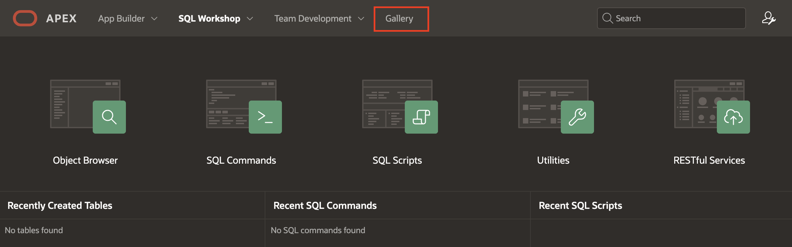

# Install and Run a Sample Application

## Introduction

In this lab, you log into your Oracle APEX workspace and explore key features like App Builder, SQL Workshop, and the Gallery. You'll learn to navigate the environment and install sample applications.

Estimated Time: 5 minutes

### Objectives

In this lab, you will:

- Navigate through the significant components of Oracle APEX.

- Install and run a packaged application.

## Task 1: Explore the significant Components of APEX

In this task, you go through the initial steps of logging into your Oracle APEX workspace and exploring the various components available within the development environment. You will begin by accessing the APEX workspace, which will introduce you to key features such as the App Builder, SQL Workshop, and the Gallery.

1. To log in to your Oracle APEX workspace, perform the following steps:

    - Open your browser and enter the **URL** to sign in to the APEX development environment.

    - The login page appears. Enter your **Workspace Name, Username, and Password** and click **Sign In**.

   

2. The Workspace home page appears. Click **App Builder**.

   

3. You do not have any applications listed right now. You can **Create a New App** or **Install a Sample or Starter App**.

   

4. Click **SQL Workshop**. The SQL workshop home page appears. Review each of the **SQL Workshop** components.

   

   

5. Click **Gallery**.

   

6. The Gallery page displays a collection of starter, sample, and custom applications you can install in your Workspace.

   

## Task 2: Install Sample Application

In this task, you install and explore a **Sample Reporting** application in Oracle APEX. You navigate to the Gallery, install the app, and log in as an end user to familiarize yourself with its interface. Additionally, you learn how to toggle between different views in the App Builder, helping you understand how applications are displayed and managed in APEX.

1. Navigate to **Gallery**, select **Sample Apps**.

   

2. Now, navigate to **Sample Reporting**, and click **Install**. You can also search for apps by entering **Reporting** in the **Search Apps** field.

   

3. You see that the application is installed. Click **Run Application**.

   

4. Log in to the **Sample Reporting** application as an End User. Enter your username and password (the same as your Workspace credentials) and click **Sign In**.

   

5. You now see the **Sample Reporting** application's home page. In your runtime environment, a Developer Toolbar appears at the bottom. Click **Home** to return to the home page of the APEX application development environment.

   

6. Click **App Builder**.

   

7. Toggle between the **View Icons** and the **View Reports** buttons. You see that applications are correspondingly displayed along with their icons and in the report format.

   

   

## Summary

You have now learned how to navigate the significant components of Oracle APEX and install and run a packaged application. You are ready to proceed to the next lab.

## What's Next?

In the next hands-on lab, you will gain practical experience in utilizing SQL Workshop. You will explore tasks such as installing a Sample Dataset, extending existing table­s by adding new columns, populating new columns, creating lookup tables, developing Package­s, and utilizing various utilities such as Quick SQL, Data Workshop, and Data Generator.

## Acknowledgements

- **Author** - Roopesh Thokala, Senior Product Manager; Ankita Beri, Product Manager
- **Last Updated By/Date** - Ankita Beri, Product Manager, December 2024
