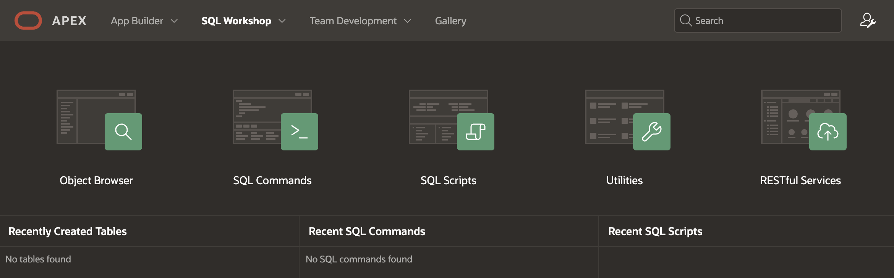
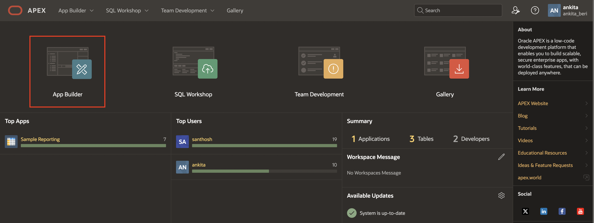
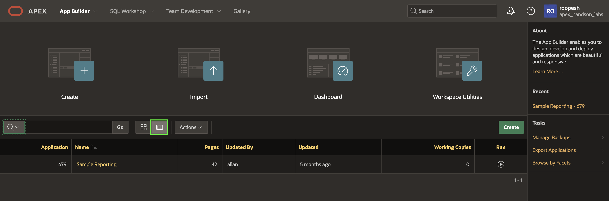

# Install and Run a Sample Application

## Introduction

In this lab, you will navigate through the major components of Oracle APEX. This lab also covers installing and running a sample application.

Estimated Time: 10 minutes

### Objectives
In this lab, you will:
- Navigate through the major Components of Oracle APEX
- Install and run a packaged application

## Task 1: Major Components of APEX

To log in to Oracle APEX, you need a Workspace Name, username, and the password created for that Workspace. In this hands-on lab, you log in to your Oracle APEX Workspace.

1. Log in to **Oracle APEX Workspace**. Perform the following steps:
    -	Open your browser and enter the URL to sign in to the APEX development environment.

    - The login page appears. Enter the Workspace name, username, and password. Click **Sign In**.  

  

2. The **Workspace** home page appears. Click **App Builder**.

  

3. You do not have any applications listed right now. You can create a new app or install a **sample** or **starter app**.

  

4. Click **SQL Workshop**.  

    The SQL Workshop home page appears. Review each of the **SQL Workshop** components.

      

    

5. Click **Gallery**

    

6. The Gallery Page displays a collection of starter Applications, Sample Applications and Custom Applications that you can install in your workspace.

   

## Task 2: Install Sample Application

This lab covers installing and running a sample application.

1. Once you Navigate to Gallery, Click **Sample Apps**.

   

2. Now that you are in **Sample Apps**, search for apps by typing "**Reporting**" into the "Search Apps" search box and navigate to **Sample Reporting** and click the **Install** Button.

  

3. On the Install Application page, click the **Install Application** Button.

   

4. You can now see that the application is installed. Run the application by selecting **Run Application**.

   

5. Log in to the **Sample Reporting** application as an End User. Enter your **Username** and **Password** (Same as your Workspace credentials) and click **Sign In**.

   

6. You now see the Sample Reporting application home page. In your Runtime environment under **Developer Toolbar**, click **Home** to return to the home page of the APEX development environment.

   

7. Click **App Builder**.

   

8. Toggle between the **View Icons** and the **View Reports** buttons. You see that applications are displayed along with their icons and report format.
   

   

## Summary
You now know how to Navigate through the major Components of Oracle APEX
and Install and run a packaged application . You may now **proceed to the next lab**.

## Acknowledgments

- **Author** - Roopesh Thokala, Product Manager
- **Contributors** - Ankita Beri, Product Manager
- **Last Updated By/Date** - Roopesh Thokala, March 2022
