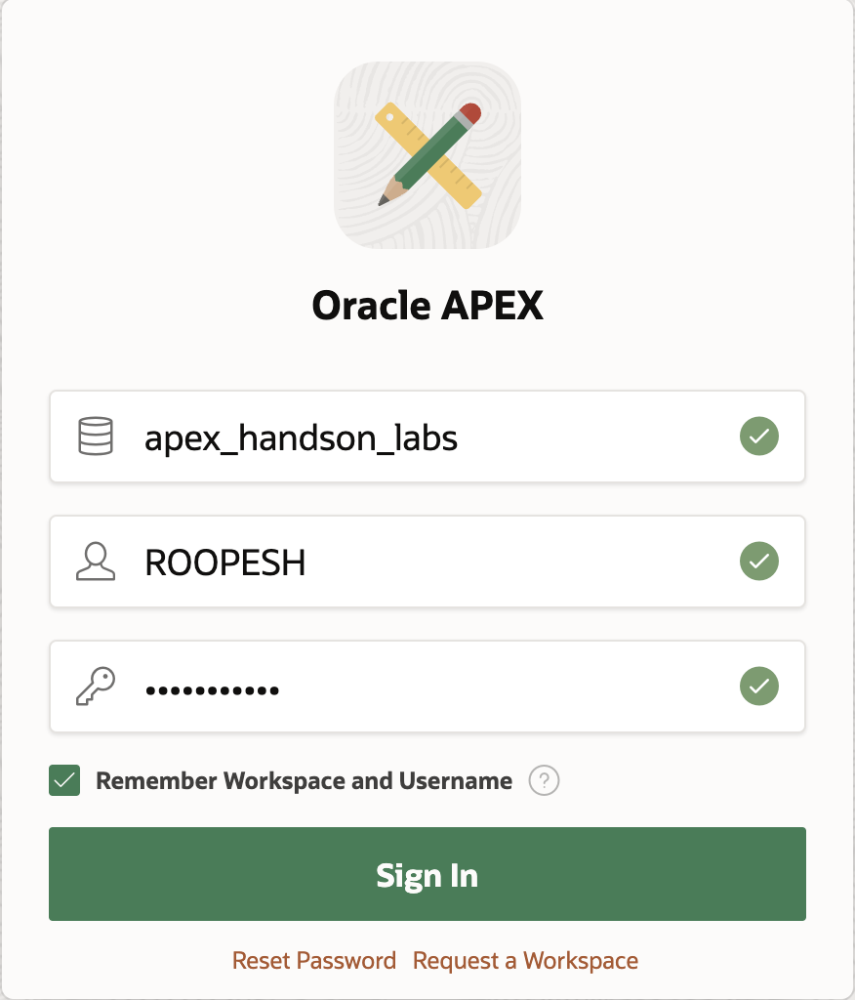
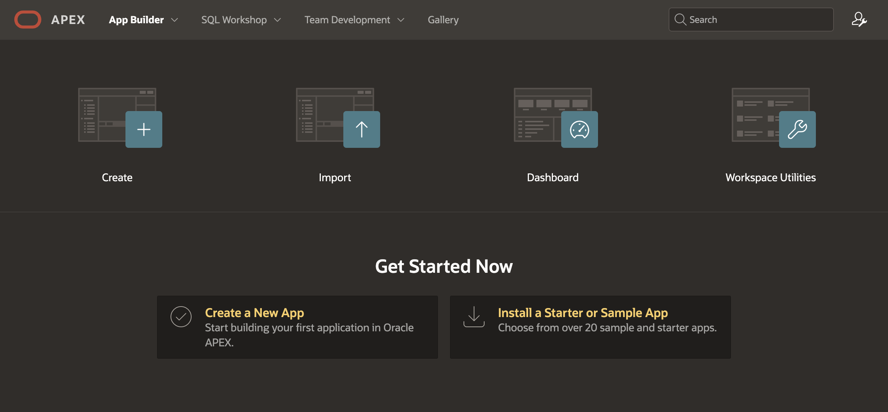
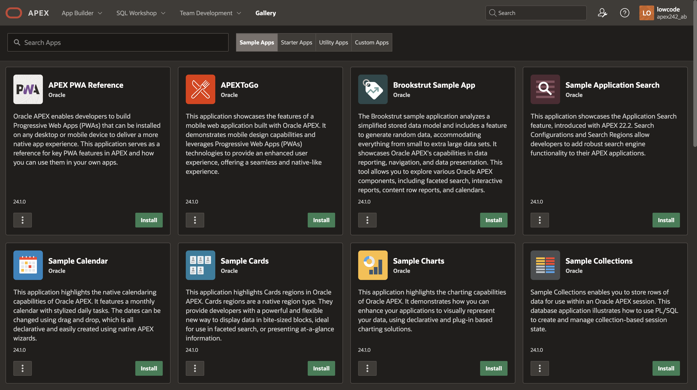
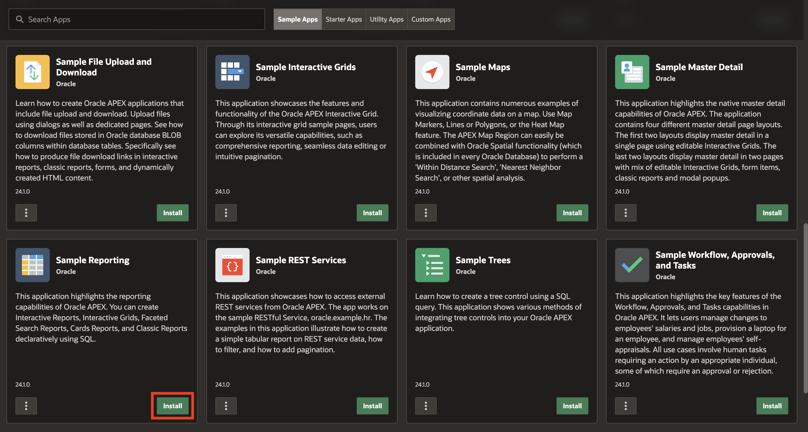
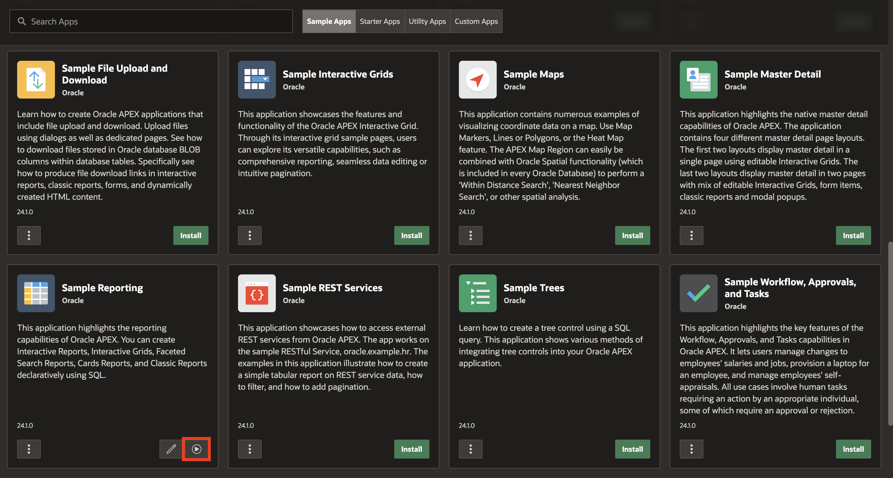
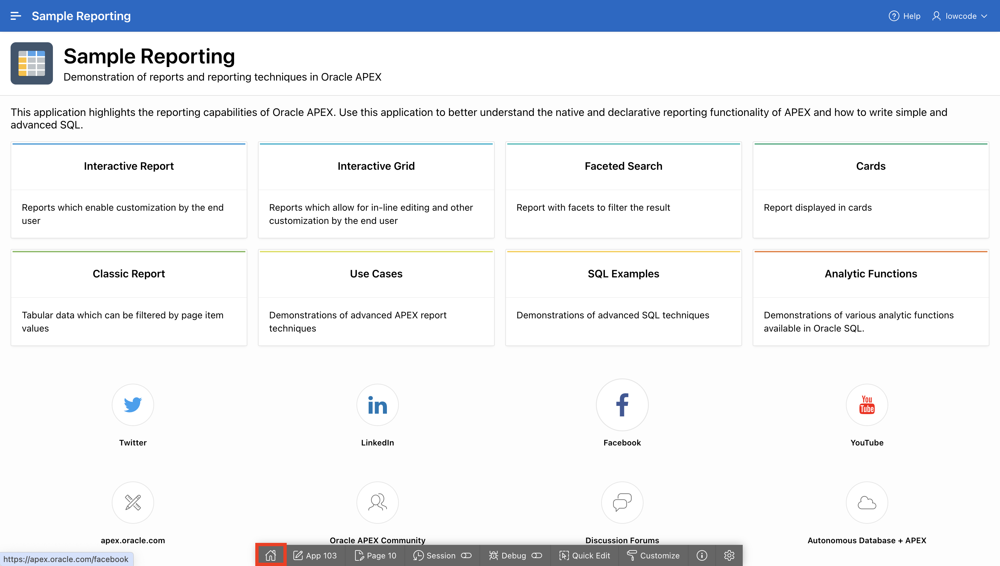
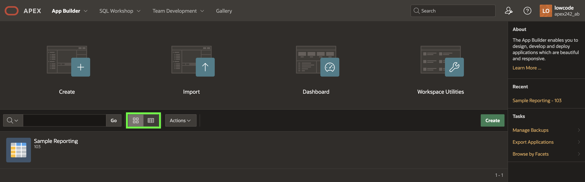

# Install and Run a Sample Application

## Introduction

In this lab, you learn to navigate the significant components of Oracle APEX. This lab also covers installing and running a sample application.

Estimated Time: 10 minutes

### Objectives
In this lab, you will:
- Navigate through the significant Components of Oracle APEX.
- Install and run a Packaged Application.

## Task 1: Explore the major Components of APEX

To log in to Oracle APEX, you need a Workspace Name, username, and the password created for that Workspace. In this hands-on lab, you log in to your Oracle APEX Workspace.

1. To login to your Oracle APEX Workspace, perform the following steps:
    -	Open your browser and enter the **URL** to sign in to the APEX development environment.

    - The login page appears. Enter the **Workspace Name, Username, and Password**. Click **Sign In**.  

  

2. The Workspace home page appears. Click **App Builder**.

  

3. You do not have any applications listed right now. You can 'Create a New App' or 'Install a Sample or Starter App'.

  

4. Click **SQL Workshop**.  

    The SQL Workshop home page appears. Review each of the **SQL Workshop** components.

      

    

5. Click **Gallery**.

    

6. The Gallery Page displays a collection of Starter Applications, Sample Applications and Custom Applications that you can install in your Workspace.

   

## Task 2: Install Sample Application

This lab covers installing and running a sample application.

1. Navigate to **Gallery**, select **Sample Apps**.

   

2. Now that you are in **Sample Apps**, navigate to **Sample Reporting**, and click the **Install** Button. You can also search for apps by typing "**Reporting**" in the 'Search Apps' box.

  

3. On the Install Application page, observe that your app is currently being installed.

   

4. You can now see that the application is installed. Click **Run Application**.
   

5. Log in to the **Sample Reporting** application as an End User. Enter your **Username** and **Password** (Same as your Workspace credentials) and click **Sign In**.

   

6. You now see the Sample Reporting application home page. In your Runtime environment, a **Developer Toolbar** appears at the bottom.
   Click **Home** to return to the home page of the APEX application development environment.

   

7. Click **App Builder**.

   

8. Toggle between the **View Icons** and the **View Reports** buttons. You see that applications are correspondingly displayed along with their icons and in the report format.
   

   

## Summary
You have now learned how to navigate the significant components of Oracle APEX and install and run a packaged application. You are now ready to **proceed to the next lab**.

## What's Next?
In the next hands-on lab, you'll gain practical experience in utilizing SQL Workshop. You'll explore tasks such as installing a Sample Dataset, extending existing table­s by adding new columns, populating new columns, creating lookup tables, developing Package­s, and utilizing various utilities such as Quick SQL, Data Workshop, and Data Generator.

## Acknowledgements

- **Author** - Roopesh Thokala, Senior Product Manager
- **Contributor** - Ankita Beri, Product Manager
- **Last Updated By/Date** - Roopesh Thokala, Oct 2023
