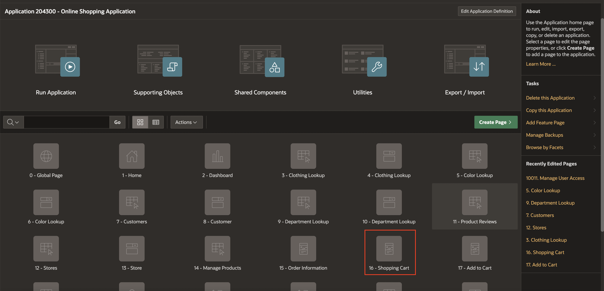
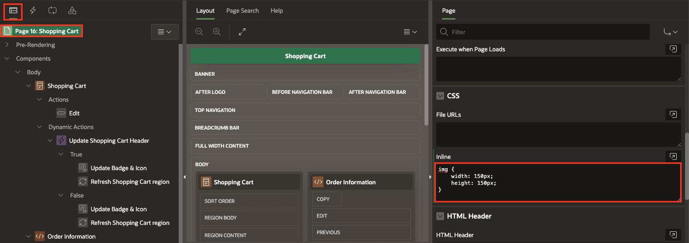
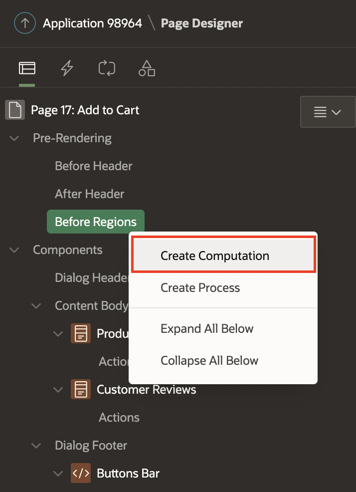
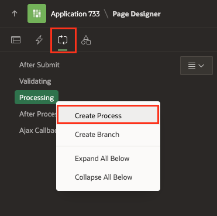

# Add Computations, Dynamic Actions and Processes

## Introduction
This Hands-on Lab is a collection of Nine tasks. After completing this lab, your application will enable customers to:

- Dynamic Actions to manage the Shopping Cart
- Update the badge and icon shown in the navigation bar after the customer has added/edited/removed a product from the shopping cart
- Refresh the shopping cart region
- Review the product details
- Review the items added to the Shopping Cart.
- Add, edit, or remove the product from the shopping cart

Estimated Time: 20 minutes

### Objectives
In this lab, you will:
- Create Dynamic actions for the Shopping Carts Page.
- Add computations and page Processes to the Add to Cart page.

### Downloads

- Did you miss out on trying the previous labs? Don't worry! You can download the application from [here](https://c4u04.objectstorage.us-ashburn-1.oci.customer-oci.com/p/EcTjWk2IuZPZeNnD_fYMcgUhdNDIDA6rt9gaFj_WZMiL7VvxPBNMY60837hu5hga/n/c4u04/b/livelabsfiles/o/data-management-library-files/apex-23-2-object-storage-files/hol9.sql) and import it into your workspace. To run the app, please run the steps described in **[Get Started with Oracle APEX](https://livelabs.oracle.com/pls/apex/r/dbpm/livelabs/run-workshop?p210_wid=3509)**, **[Using SQL Workshop](https://livelabs.oracle.com/pls/apex/r/dbpm/livelabs/run-workshop?p210_wid=3524)** and **[Enhancing your application using Computations, Processes and Validations](https://livelabs.oracle.com/pls/apex/dbpm/r/livelabs/view-workshop?wid=3534)** workshops.

## Task 1: Add Dynamic Actions
In this Task, you will create a dynamic action to:
- Update the badge and icon in the navigation bar after the customer has added/edited/removed a product from the shopping cart.
- Refresh the shopping cart region.

1. Go to the **Shopping Cart** page (Page No 16) in the page designer.

     

2. Navigate to the **Dynamic Actions** tab (left pane). Right-click **Dialog Closed** and click **Create Dynamic Action**.

       

3. In the Property Editor, enter the following:    
    - Under the Identification section:
        - For Name - enter **Update Shopping Cart Header**
    - Under When section:        
        - For Event - select **Dialog Closed**
        - For Selection Type - select **Region**
        - For Region - select **Shopping Cart**     
    - Under Client-side Condition:
        - Type: **JavaScript expression**
        - JavaScript Expression: enter the following:

            ```
            <copy>
            parseInt(this.data.P17_SHOPPING_CART_ITEMS) > 0
            </copy>
            ```

  

4. Navigate to **Refresh** Action.
    - Under the Identification section:
        - For Name - enter **Update Badge & Icon**
        - For Action - select **Execute JavaScript Code**
    - Under Settings section:        
        - For Code - enter the following JavaScript Code:

            ```
            <copy>
            // Update Badge Text
            apex.jQuery(".js-shopping-cart-item .t-Button-badge").text(this.data.P17_SHOPPING_CART_ITEMS);

            // Update Icon
            apex.jQuery(".js-shopping-cart-item .t-Icon").removeClass('fa-cart-empty').addClass('fa-cart-full');
            </copy>
            ```

  

5. Create a second action. In the Dynamic Actions tab (left pane), navigate to **True** under **Update Shopping Cart Header** Dynamic Action.

     

6. In the Property Editor, enter the following:  
    - Under the Identification section:
        - For Name - enter **Refresh Shopping Cart region**
        - For Action - select **Refresh**
    - Under the Affected Elements section:          
        - For Selection Type - select **Region**
        - For Region - select **Shopping Cart**          
7. Create an opposite action. In the Dynamic Actions tab (left pane), navigate to **Update Badge & Icon** Action.
8. Right-click  **Update Badge & Icon** action and click **Create Opposite Action**.

     

9. Navigate to **Update Badge & Icon** Action under the False heading.
    - Under the Identification section:
        - For Action - select **Execute JavaScript Code**
    - Under Settings section:        
        - For Code - enter the following JavaScript Code:

            ```
            <copy>
            // Update Badge Text
            apex.jQuery(".js-shopping-cart-item .t-Button-badge").text('');

            // Update Icon
            apex.jQuery(".js-shopping-cart-item .t-Icon").removeClass('fa-cart-full').addClass('fa-cart-empty');
            </copy>
            ```

    

10. Create a second action. In the Dynamic Actions tab (left pane), navigate to **False** under **Update Shopping Cart Header** Dynamic Action.

    

11. In the Property Editor, enter the following:  
    - Under the Identification section:
        - For Name - enter **Refresh Shopping Cart region**
        - For Action - select **Refresh**
    - Under the Affected Elements section:          
        - For Selection Type - select **Region**
        - For Region - select **Shopping Cart**

    

12. Click **Save**.

## Task 2: Format Products Image Size

1. In the Rendering tree (left pane), navigate to **Page 16: Shopping Cart**.
2. In the Property Editor (right pane), do the following:
    - Under the CSS section.
        -   For Inline - enter the following:

            ```
            <copy>    
            img {
                width: 150px;
                height: 150px;
            }
            </copy>
            ```

               

3. Click **Save**.


## Task 3: Add Computation to Calculate the Number of Items for a Product
1. Navigate to **Page Finder** and click on **File symbol**. Then, in the popup  **Page Finder**, Select **Page 17**.

    

2. In the Rendering tree (left pane), expand **Pre-Rendering**.
3. Right-click **Before Regions** and select **Create Computation**.

       

4. In the Property Editor, enter the following:
    - Under the Identification section:
        - For Item Name - select **P17_QUANTITY**
    - Under Computation:
        - Type: **Function Body**
        - PL/SQL Function Body: enter the following PL/SQL Code:

        ```
        <copy>
        RETURN manage_orders.product_exists(p_product => :P17_PRODUCT_ID);
        </copy>
        ```

              

## Task 4: Create a Process to Add Products to the Shopping Cart
In this Task, you call the *manage\_orders.add_product* procedure that temporarily adds a product to the APEX collection.

1. In the Rendering tree (left pane), navigate to **Processing** tab.   

        

        

3. In the Property Editor, enter the following:
    - For Name - enter **Add product**
    - For Type - select **Execute Code**
    - For PL/SQL Code - enter the following Code:

        ```
        <copy>
        BEGIN
            IF manage_orders.product_exists(p_product => :P17_PRODUCT_ID) = 0 THEN
                manage_orders.add_product (p_product  => :P17_PRODUCT_ID,
                                        p_quantity => :P17_QUANTITY);
            END IF;
            :P17_ACTION := 'ADD';
        END;
        </copy>
        ```

    

    - Under the Server-side Condition section:
        - For When Button Pressed - select **Add**

4. Click **Save.**

## Task 5: Create a Process to Edit Products in the Shopping Cart
In this task, you call the *manage\_orders.remove\_product* and *manage\_orders.add\_product* procedures to remove a product from the shopping cart and add it again with the updated quantity.

1. In the **Processing** tab, right-click **Processing** and select **Create Process**.

  

2. In the Property Editor, enter/select the following:
    - Name: **Edit product**
    - Type: **Execute Code**
    - PL/SQL Code: Enter the following PL/SQL code:

        ```
        <copy>
        BEGIN
            IF manage_orders.product_exists(p_product => :P17_PRODUCT_ID) > 0 THEN
                manage_orders.remove_product(p_product => :P17_PRODUCT_ID);
                manage_orders.add_product (p_product  => :P17_PRODUCT_ID,
                                        p_quantity => :P17_QUANTITY);
            END IF;
            :P17_ACTION := 'EDIT';
        END;
        </copy>
        ```

   - Under the Server-side Condition section:
    - For When Button Pressed, select **Edit**

    Click **Save.**

  

## Task 6: Create a Process to Delete Products from the Shopping Cart
In this task, you call the *manage\_orders.remove\_product* to remove a product from the shopping cart.

1. In the **Processing** tab, right-click **Processing** and select **Create Process**.

       

3. In the Property Editor, enter the following:
    - For Name - enter **Delete product**
    - For Type - select **Execute Code**
    - For PL/SQL Code - enter the following Code:

        ```
        <copy>
        BEGIN
            IF manage_orders.product_exists(p_product => :P17_PRODUCT_ID) > 0 THEN
                manage_orders.remove_product(p_product => :P17_PRODUCT_ID);
            END IF;
            :P17_ACTION := 'DELETE';
        END;
        </copy>
        ```

    - Under the Server-side Condition section:
        - For When Button Pressed - select **Delete**   

    Click **Save.**

  


## Task 7: Create a Process to Calculate the Shopping Cart Items
In this Task, you call the *manage\_orders.get\_quantity* to get the total number of products in the shopping cart.

1. In the **Processing** tab.    
2. Right click **Processing** and click  **Create Process**.

       

3. In the Property Editor, enter the following:
    - For Name - enter **Calculate Shopping Cart Items**
    - For Type - select **Execute Code**
    - For PL/SQL Code - enter the following PL/SQL code:

        ```
        <copy>
        BEGIN
            :P17_SHOPPING_CART_ITEMS := manage_orders.get_quantity;
        END;  
        </copy>
        ```

  Click **Save.**


## Task 8: Create a Process to Close the Modal Page
After the customer has taken Action (add/edit/delete) about the product, the modal page will close and continue shopping.

1. In the **Processing** tab.    
2. Right click **Processing** and click **Create Process**.
       
3. In the Property Editor, enter the following:
    - Under the Identification section:
        - For Name - enter **Close Dialog**
        - For Type - select **Close Dialog**
    - Under Settings section:
        - For Items to Return - enter **P17\_SHOPPING\_CART\_ITEMS,P17\_PRODUCT\_ID,P17\_ACTION,P17\_QUANTITY**

2. In the Property Editor, enter/select the following:
    - Under Identification:
        - Name: **Close Dialog**
        - Type: **Close Dialog**
    - Under Settings:
        - Items to Return: **P17\_SHOPPING\_CART\_ITEMS, P17\_PRODUCT\_ID, P17\_ACTION, P17\_QUANTITY**

    

## Task 9: Enhance the Modal Page

1. Navigate to the **Rendering** tab (left pane).

2. In the rendering tree, select the root node in the component tree **Page 17: Add to Cart**

3. In the Property Editor, make the following changes:
    - Under the Identification section:
        For Title, enter **Manage Your Cart**
    - Under Dialog section:
        - For Width, enter **600**
        - For Height, enter **600**

       

4. Click **Save**.

## Summary
In this comprehensive hands-on lab, you master Dynamic Actions for efficient shopping cart management, including real-time badge and icon updates in the navigation bar. The lab also covers how to refresh the shopping cart region, review product details, and manage items in the cart by adding, editing, or removing products, creating a seamless and responsive user experience. You can now add dynamic actions, Computations and Processes to an APEX page. You may now **proceed to the next lab**.

## What's Next
In the next lab, you focus on enhancing the Demo Projects application by customizing the Smart Filters page for tailored user experiences. You also work on improving both the Faceted Search and Cards region for better data interaction. Additionally, integrating Dynamic Actions will add interactivity and efficiency to the page, optimizing the application's functionality.

## Acknowledgements
- **Author** - Roopesh Thokala, Senior Product Manager
- **Contributor** - Ankita Beri, Product Manager
- **Last Updated By/Date** - Roopesh Thokala, Senior Product Manager, January 2024
