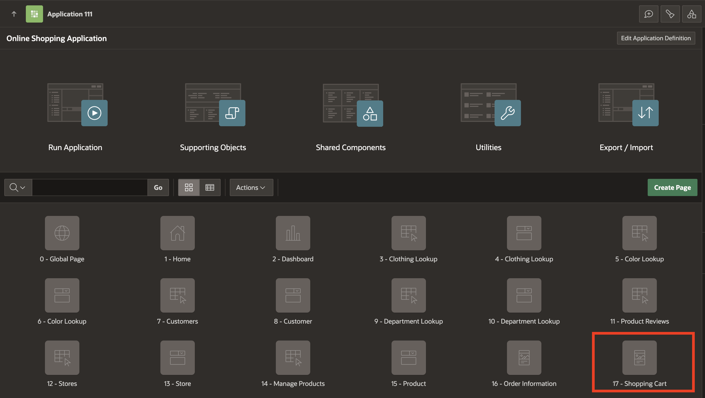
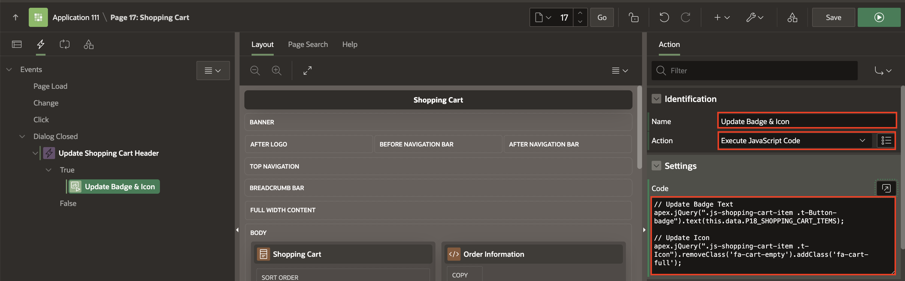
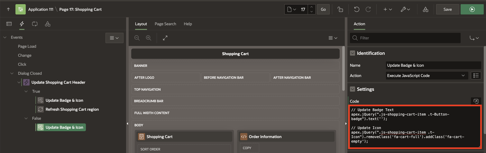
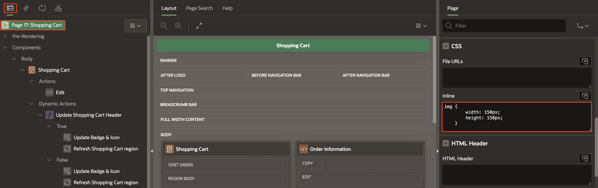
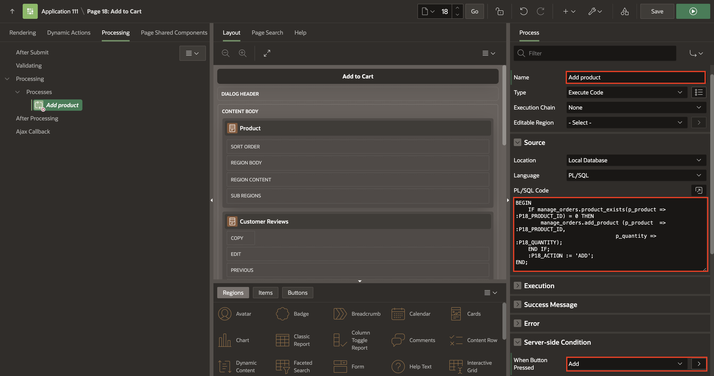

# Add Computations, Dynamic Actions and Processes

## Introduction

The lab focuses on creating dynamic actions, computations, and processes that allow customers to manage their shopping experience efficiently. You will learn to dynamically update the shopping cart interface, refresh relevant regions, and handle various shopping cart operations like adding, editing, and removing items. By the end of this lab, your application will provide a seamless and interactive shopping experience for users.

Estimated Time: 20 minutes

### Objectives

In this lab, you will:

- Create dynamic actions to manage the shopping cart page.

- Update the badge and icon in the navigation bar when a product is added, edited, or removed.

- Refresh the shopping cart region.

- Implement computations to calculate product quantities.

- Create processes for adding, editing, and removing products from the shopping cart.

- Format product images for a uniform appearance.

- Close modal pages after shopping actions are performed.

## Task 1: Add Dynamic Actions

In this Task, you will create a dynamic action to:

- Update the badge and icon in the navigation bar after the customer has added/edited/removed a product from the shopping cart.

- Refresh the shopping cart region.

1. Navigate to **Online Shopping Application** and select **17 -Shopping Cart** page (Page No 17).

     

2. Navigate to the **Dynamic Actions** tab (left pane). Right-click **Dialog Closed** and select **Create Dynamic Action**.

     

3. In the Property Editor, enter/select the following:

    - Identification > Name: **Update Shopping Cart Header**

    - Under Execution:

        - Type: **Debounce**

        - Time: **400**

        - Immediate: **Toggle On**

    - Under When:

        - Selection Type: **Region**

        - Region: **Shopping Cart**

    - Under Client-side Condition:

        - Type: **JavaScript expression**

        - JavaScript Expression: Enter the following:

            ```
            <copy>
            parseInt(this.data.P18_SHOPPING_CART_ITEMS) > 0
            </copy>
            ```

    

4. Navigate to **Refresh** action. In the Property Editor, enter/select the following:

    - Under Identification:

        - Name: **Update Badge & Icon**

        - Action: **Execute JavaScript Code**

    - Settings > Code: Enter the following JavaScript Code:

        ```
        <copy>
        // Update Badge Text
        apex.jQuery(".js-shopping-cart-item .t-Button-badge").text(this.data.P18_SHOPPING_CART_ITEMS);

        // Update Icon
        apex.jQuery(".js-shopping-cart-item .t-Icon").removeClass('fa-cart-empty').addClass('fa-cart-full');
        </copy>
        ```

    

5. Under **Update Shopping Cart Header** Dynamic Action, right-click **True** and select **Create TRUE Action**.

     

6. In the Property Editor, enter/select the following:

    - Under Identification:

        - Name: **Refresh Shopping Cart region**

        - Action: **Refresh**

    - Under Affected Elements:

        - Selection Type: **Region**

        - Region: **Shopping Cart**

    

7. Right-click  **Update Badge & Icon** action and select **Create Opposite Action**.

     

8. Under **Settings**, update **Code** with the following javascript code:

    ```
    <copy>
    // Update Badge Text
        apex.jQuery(".js-shopping-cart-item .t-Button-badge").text('');

    // Update Icon
        apex.jQuery(".js-shopping-cart-item .t-Icon").removeClass('fa-cart-full').addClass('fa-cart-empty');
    </copy>
    ```

    

9. Under **Update Shopping Cart Header**, right-click **False** and select **Create FALSE Action**.

    

10. In the Property Editor, enter the following:

    - Under Identification:

        - Name: **Refresh Shopping Cart region**

        - Action: **Refresh**

    - Under Affected Elements:

        - Selection Type: **Region**

        - Region: **Shopping Cart**

    

11. Click **Save**.

## Task 2: Format Products Image Size

In this task, you will add inline CSS to format the size of product images, ensuring consistent dimensions within the shopping cart.

1. In the **Rendering** tab, click **Page 17: Shopping Cart**.

2. In the Property Editor (right pane), enter the following:

    - CSS > Inline: Copy and paste the following:

        ```
        <copy>
        img {
                width: 150px;
                height: 150px;
            }
        </copy>
        ```

    

3. Click **Save**.

## Task 3: Add Computation to Calculate the Number of Items for a Product

In this task, you will add a computation to calculate and display the number of items for a specific product, enhancing user interaction by showing updated quantities in the shopping cart.

1. Navigate to **Page Finder** and click **File symbol**. In the **Page Finder** dialog, select page **18** .

    

2. Under **Rendering**, navigate to **Pre-Rendering**. Right-click **Before Regions** and select **Create Computation**.

     

3. In the Property Editor, enter/select the following:

    - Identification > Item Name: **P18_QUANTITY**

    - Under Computation:

        - Type: **Function Body**

        - PL/SQL Function Body: Enter the following PL/SQL Code:

        ```
        <copy>
        RETURN manage_orders.product_exists(p_product => :P18_PRODUCT_ID);
        </copy>
        ```

    

4. Click **Save**.

## Task 4: Create a Process to Add Products to the Shopping Cart

In this task, you call the *manage\_orders.add_product* procedure that temporarily adds a product to the APEX collection.

1. Navigate to **Processing** tab, right-click **Processing** and select **Create Process**.

     

2. In the Property Editor, enter/select the following:

    - Identification > Name: **Add product**

    - Source > PL/SQL Code: Copy and paste the following PL/SQL code:

        ```
        <copy>
        BEGIN
            IF manage_orders.product_exists(p_product => :P18_PRODUCT_ID) = 0 THEN
                manage_orders.add_product (p_product  => :P18_PRODUCT_ID,
                                        p_quantity => :P18_QUANTITY);
            END IF;
            :P18_ACTION := 'ADD';
        END;
        </copy>
        ```

    - Server-side Condition > When Button Pressed: **Add**

    

3. Click **Save.**

## Task 5: Create a Process to Edit Products in the Shopping Cart

In this task, you call the *manage\_orders.remove\_product* and *manage\_orders.add\_product* procedures to remove a product from the shopping cart and add it again with the updated quantity.

1. In the **Processing** tab, right-click **Processing** and select **Create Process**.

   

2. In the Property Editor, enter/select the following:

    - Identification > Name: **Edit product**

    - Source > PL/SQL Code: Copy and paste the following PL/SQL code:

        ```
        <copy>
        BEGIN
            IF manage_orders.product_exists(p_product => :P18_PRODUCT_ID) > 0 THEN
                manage_orders.remove_product(p_product => :P18_PRODUCT_ID);
                manage_orders.add_product (p_product  => :P18_PRODUCT_ID,
                                        p_quantity => :P18_QUANTITY);
            END IF;
            :P18_ACTION := 'EDIT';
        END;
        </copy>
        ```

    - Server-side Condition > When Button Pressed: **Edit**

    

3. Click **Save.**

## Task 6: Create a Process to Delete Products from the Shopping Cart

In this task, you call the *manage\_orders.remove\_product* to remove a product from the shopping cart.

1. In the **Processing** tab, right-click **Processing** and select **Create Process**.

    

2. In the Property Editor, enter/select the following:

    - Identification > Name: **Delete product**

    - Source > PL/SQL Code: Copy and paste the following PL/SQL code:

        ```
        <copy>
        BEGIN
            IF manage_orders.product_exists(p_product => :P18_PRODUCT_ID) > 0 THEN
                manage_orders.remove_product(p_product => :P18_PRODUCT_ID);
            END IF;
            :P18_ACTION := 'DELETE';
        END;
        </copy>
        ```

    - Server-side Condition > When Button Pressed: **Delete**

    

3. Click **Save.**

## Task 7: Create a Process to Calculate the Shopping Cart Items

In this Task, you call the *manage\_orders.get\_quantity* to get the total number of products in the shopping cart.

1. In the **Processing** tab, right-click **Processing** and select **Create Process**.

       

2. In the Property Editor, enter/select the following:

    - Identification > Name: **Calculate Shopping Cart Items**

    - Source > PL/SQL Code: Copy and paste the following PL/SQL code:

        ```
        <copy>
        BEGIN
            :P18_SHOPPING_CART_ITEMS := manage_orders.get_quantity;
        END;
        </copy>
        ```

    

3. Click **Save.**

## Task 8: Create a Process to Close the Modal Page

In this task, you will create a process that closes the modal page after the user performs an action (add, edit, delete) in the shopping cart, improving user flow and allowing customers to continue shopping.

1. In the **Processing** tab, right-click **Processing** and select **Create Process**.

     

2. In the Property Editor, enter/select the following:

    - Under Identification:

        - Name: **Close Dialog**

        - Type: **Close Dialog**

    - Settings > Items to Return: **P18\_SHOPPING\_CART\_ITEMS,P18\_PRODUCT\_ID,P18\_ACTION,P18\_QUANTITY**

    

## Task 9: Enhance the Modal Page

In the final task, you will customize the modal page by adjusting its title and dimensions, providing a better user interface for managing the shopping cart.

1. Navigate to the **Rendering** tab, select the root node **Page 18: Add to Cart**

2. In the Property Editor, enter/select the following:

    - Identification > Title: **Manage Your Cart**

    - Under Dialog:

        - Width: **600**

        - Height: **600**

    

3. Click **Save**.

## Summary

In this comprehensive hands-on lab, you master Dynamic Actions for efficient shopping cart management, including real-time badge and icon updates in the navigation bar. The lab also covers how to refresh the shopping cart region, review product details, and manage items in the cart by adding, editing, or removing products, creating a seamless and responsive user experience. You can now add dynamic actions, Computations and Processes to an APEX page. You may now **proceed to the next lab**.

## What's Next

In the next lab, you focus on enhancing the Demo Projects application by customizing the Smart Filters page for tailored user experiences. You also work on improving both the Faceted Search and Cards region for better data interaction. Additionally, integrating Dynamic Actions will add interactivity and efficiency to the page, optimizing the application's functionality.

## Acknowledgements

- **Author** - Roopesh Thokala, Senior Product Manager; Ankita Beri, Product Manager
- **Last Updated By/Date** - Ankita Beri Product Manager, September 2024
