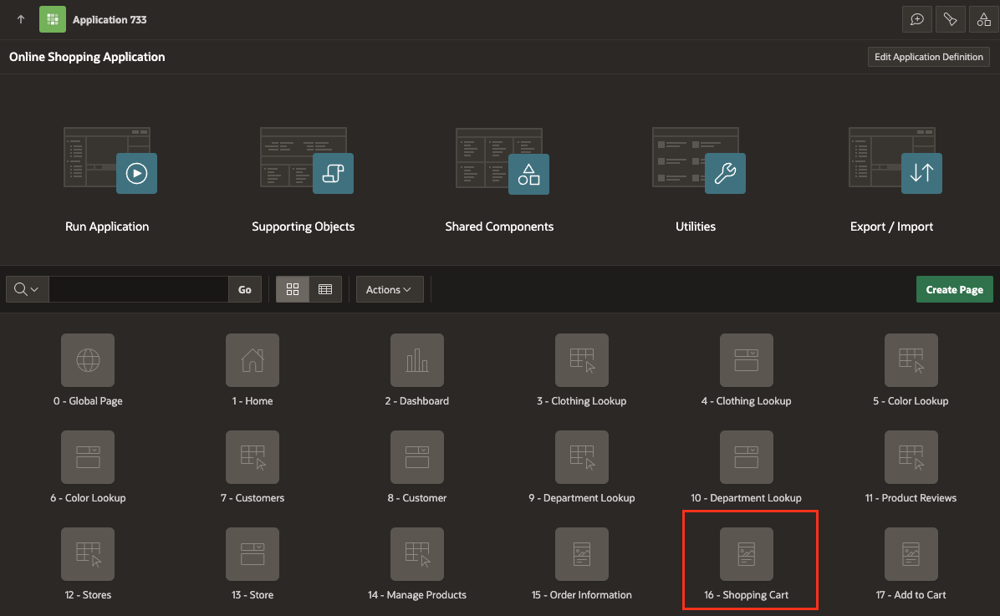
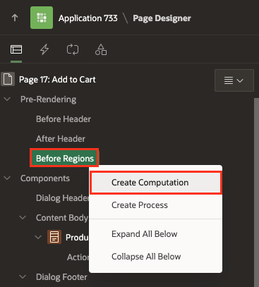
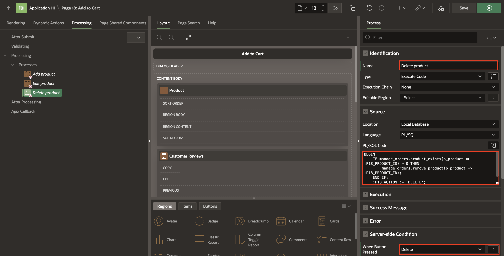

# Add Computations, Dynamic Actions and Processes

This lab is a collection of 9 tasks. After completing this lab, your application will enable customers to:
- Refresh the shopping cart region
- Review the product details
- Review the items added to the Shopping Cart.
- Add, edit, or remove the product from the shopping cart

Estimated Time: 20 minutes

### Objectives
In this lab, you:
- Create Dynamic actions for the Shopping Cart Page.
- Add computations and Page Processes to the Add to Cart page.

### Downloads

- Did you miss out on trying the previous labs? Don't worry! You can download the application from [here](files/hol9.sql) and import it into your workspace. To run the app, please run the steps described in the following workshops:
1. **[Get Started with Oracle APEX](https://apexapps.oracle.com/pls/apex/r/dbpm/livelabs/run-workshop?p210_wid=3509)** 
2. **[Using SQL Workshop](https://apexapps.oracle.com/pls/apex/r/dbpm/livelabs/run-workshop?p210_wid=3524)** 
3. **[Enhancing your application using Computations, Processes and Validations](https://apexapps.oracle.com/pls/apex/dbpm/r/livelabs/view-workshop?wid=3534)**

## Task 1: Add Dynamic Actions
In this task, you create a dynamic action to:
- Update the badge and icon in the navigation bar after the customer has added/edited/removed a product from the shopping cart.
- Refresh the shopping cart region.

1. From your Application homepage, select **Shopping Cart** page (Page No 16) .

     

2. Navigate to the **Dynamic Actions** tab (left pane). Right-click **Dialog Closed** and select **Create Dynamic Action**.

       

3. In the Property Editor, enter/select the following:    
    - Under Identification:
        - Name: **Update Shopping Cart Header**
    - Under When:        
        - Event: **Dialog Closed**
        - Selection Type: **Region**
        - Region: **Shopping Cart**     
    - Under Client-side Condition:
        - Type: **JavaScript expression**
        - JavaScript Expression: enter the following:

            ```
            <copy>
            parseInt(this.data.P17_SHOPPING_CART_ITEMS) > 0
            </copy>
            ```

    

4. Select **Refresh** Action. In the Property Editor, enter/select teh following:
    - Under Identification:
        - Name: **Update Badge & Icon**
        - Action: **Execute JavaScript Code**
    - Under Settings:        
        - Code: enter the following JavaScript Code:

            ```
            <copy>
            // Update Badge Text
            apex.jQuery(".js-shopping-cart-item .t-Button-badge").text(this.data.P17_SHOPPING_CART_ITEMS);

            // Update Icon
            apex.jQuery(".js-shopping-cart-item .t-Icon").removeClass('fa-cart-empty').addClass('fa-cart-full');
            </copy>
            ```

    

5. Create a second action. In the Dynamic Actions tab (left pane), select **Update Shopping Cart Header > True**.

     

6. In the Property Editor, enter/select the following:  
    - Under Identification:
        - Name: **Refresh Shopping Cart region**
        - Action: **Refresh**
    - Under Affected Elements:          
        - Selection Type: **Region**
        - Region: **Shopping Cart**          
7. Create an opposite action. In the Dynamic Actions tab (left pane), right-click  **Update Badge & Icon** action and select **Create Opposite Action**.

     

8. Under False, select **Update Badge & Icon**. In the Property Editor, enter/select the following:
    - Under Identification:
        - Action: **Execute JavaScript Code**
    - Under Settings:        
        - Code: enter the following JavaScript Code:

            ```
            <copy>
            // Update Badge Text
            apex.jQuery(".js-shopping-cart-item .t-Button-badge").text('');

            // Update Icon
            apex.jQuery(".js-shopping-cart-item .t-Icon").removeClass('fa-cart-full').addClass('fa-cart-empty');
            </copy>
            ```

    

9. Create a second action. In the Dynamic Actions tab (left pane), navigate to **Update Shopping Cart Header > False**.

    

10. In the Property Editor, enter/select the following:  
    - Under Identification:
        - Name: **Refresh Shopping Cart region**
        - Action: **Refresh**
    - Under Affected Elements:          
        - Selection Type: **Region**
        - Region: **Shopping Cart**

    

11. Click **Save**.

## Task 2: Format Products Image Size

1. In the Rendering tree (left pane), navigate to **Page 16: Shopping Cart**.
2. In the Property Editor (right pane), enter/select the following:
    - Under CSS:
        - Inline: enter the following:

            ```
            <copy>    
            img {
                width: 150px;
                height: 150px;
            }
            </copy>
            ```

               

3. Click **Save**.


## Task 3: Add Computation to Calculate the Number of Items for a Product
1. Click on the **Page Finder**. Then, in the popup dialog, select **Page 17**.

    

2. In the Rendering tree (left pane), expand **Pre-Rendering**.
3. Right-click **Before Regions** and select **Create Computation**.

       

4. In the Property Editor, enter/select the following:
    - Under Identification:
        - Item Name: **P17_QUANTITY**
    - Under Computation:
        - Type: **Function Body**
        - PL/SQL Function Body: enter the following PL/SQL Code:

        ```
        <copy>
        RETURN manage_orders.product_exists(p_product => :P17_PRODUCT_ID);
        </copy>
        ```

              

## Task 4: Create a Process to Add Products to the Shopping Cart
In this task, you call the *manage\_orders.add\_product* procedure that temporarily adds a product to the APEX collection.

1. In the Rendering tree (left pane), navigate to **Processing** tab.   

2. Right click **Processing** and select **Create Process**.

        

3. In the Property Editor, enter/select the following:
    - Name: **Add product**
    - Type: **Execute Code**
    - PL/SQL Code: enter the following Code:

        ```
        <copy>
        BEGIN
            IF manage_orders.product_exists(p_product => :P17_PRODUCT_ID) = 0 THEN
                manage_orders.add_product (p_product  => :P17_PRODUCT_ID,
                                        p_quantity => :P17_QUANTITY);
            END IF;
            :P17_ACTION := 'ADD';
        END;
        </copy>
        ```

      

    - Under Server-side Condition:
        - When Button Pressed: **Add**

4. Click **Save.**

## Task 5: Create a Process to Edit Products in the Shopping Cart
In this task, you call the *manage\_orders.remove\_product* and *manage\_orders.add\_product* procedures to remove a product from the shopping cart and add it again with the updated quantity.

1. In the **Processing** tab, right-click **Processing** and select **Create Process**.

  

2. In the Property Editor, enter/select the following:
    - Name: **Edit product**
    - Type: **Execute Code**
    - PL/SQL Code: Enter the following PL/SQL code:

        ```
        <copy>
        BEGIN
            IF manage_orders.product_exists(p_product => :P17_PRODUCT_ID) > 0 THEN
                manage_orders.remove_product(p_product => :P17_PRODUCT_ID);
                manage_orders.add_product (p_product  => :P17_PRODUCT_ID,
                                        p_quantity => :P17_QUANTITY);
            END IF;
            :P17_ACTION := 'EDIT';
        END;
        </copy>
        ```

   - Under Server-side Condition:
        - When Button Pressed: **Edit**

    Click **Save.**

  

## Task 6: Create a Process to Delete Products from the Shopping Cart
In this task, you call the *manage\_orders.remove\_product* to remove a product from the shopping cart.

1. In the **Processing** tab, right-click **Processing** and select **Create Process**.

       

2. In the Property Editor, enter/select the following:
    - Name: **Delete product**
    - Type: **Execute Code**
    - PL/SQL Code: Enter the following Code:

        ```
        <copy>
        BEGIN
            IF manage_orders.product_exists(p_product => :P17_PRODUCT_ID) > 0 THEN
                manage_orders.remove_product(p_product => :P17_PRODUCT_ID);
            END IF;
            :P17_ACTION := 'DELETE';
        END;
        </copy>
        ```

    - Under Server-side Condition:
        - When Button Pressed: **Delete**   

    Click **Save.**

  


## Task 7: Create a Process to Calculate the Shopping Cart Items
In this task, you call the *manage\_orders.get\_quantity* to get the total number of products in the shopping cart.

1. In the **Processing** tab, right-click **Processing** and select **Create Process**.

       

2. In the Property Editor, enter/select the following:
    - Name: **Calculate Shopping Cart Items**
    - Type: **Execute Code**
    - PL/SQL Code: Enter the following PL/SQL code:

        ```
        <copy>
        BEGIN
            :P17_SHOPPING_CART_ITEMS := manage_orders.get_quantity;
        END;  
        </copy>
        ```

  Click **Save.**


## Task 8: Create a Process to Close the Modal Page
After the customer has taken Action (add/edit/delete) about the product, the modal page will close and the customer can continue shopping.

1. In the **Processing** tab, right-click **Processing** and click **Create Process**.
       

2. In the Property Editor, enter/select the following:
    - Under Identification:
        - Name: **Close Dialog**
        - Type: **Close Dialog**
    - Under Settings:
        - Items to Return: **P17\_SHOPPING\_CART\_ITEMS, P17\_PRODUCT\_ID, P17\_ACTION, P17\_QUANTITY**

3. Click **Save**.

    

## Task 9: Enhance the Modal Page

1. Navigate to the **Rendering** tab (left pane).

2. In the rendering tree, select the root node in the component tree **Page 17: Add to Cart**.

3. In the Property Editor, enter/select the following:
    - Under Identification:
        - Title: **Manage Your Cart**
    - Under Dialog:
        - Width: **600**
        - Height: **600**

       

4. Click **Save**.

## Summary
In this comprehensive hands-on lab, you mastered Dynamic Actions for efficient shopping cart management, including real-time badge and icon updates in the navigation bar. The lab also covered how to refresh the shopping cart region, review product details, and manage items in the cart by adding, editing, or removing products, creating a seamless and responsive user experience. You now know how to add Dynamic Actions, Computations and Processes to an APEX page. You may now **proceed to the next workshop**.

## What's Next?
In the next workshop, you focus on enhancing the Demo Projects application by customizing the Smart Filters page for tailored user experiences. You also work on improving both the Faceted Search and Cards region for better data interaction. Additionally, integrating Dynamic Actions will add interactivity and efficiency to the page, optimizing the application's functionality.

## Acknowledgements
- **Author** - Roopesh Thokala, Senior Product Manager
- **Contributor** - Ankita Beri, Product Manager
- **Last Updated By/Date** - Roopesh Thokala, Senior Product Manager, January 2024
