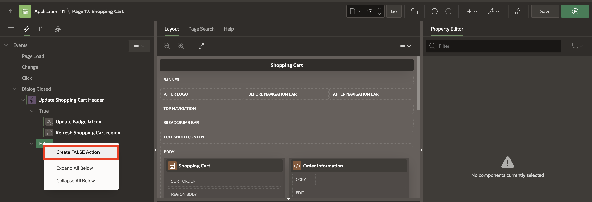
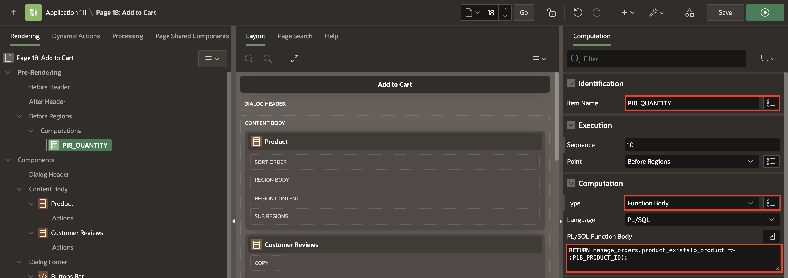
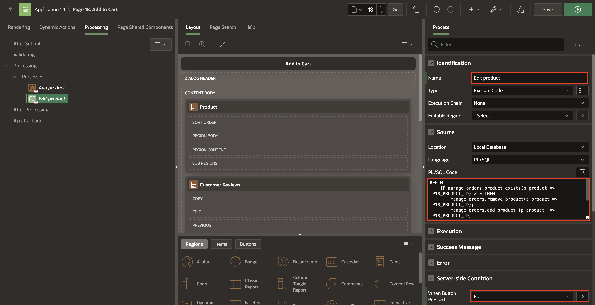
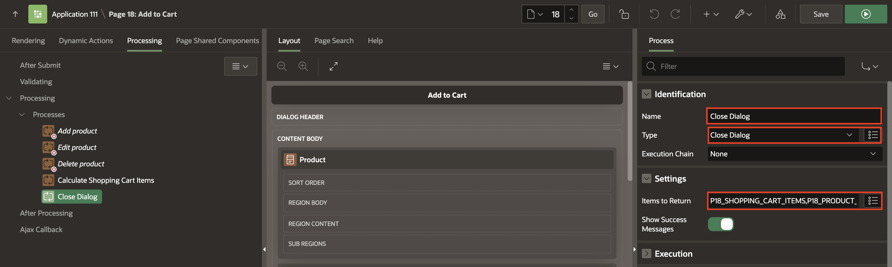

# Adding Computations, Dynamic Actions and Processes.

## Introduction

This Hands-on Lab is a collection of Nine tasks. After completing this lab, your application will enable customers to:

- Dynamic Actions to manage the Shopping Cart
- Review the product details
- Add, edit, or remove the product from the shopping cart
- Read the customer reviews

Estimated Time: 20 minutes

### Objectives
In this lab, you will:
- Create Dynamic actions to the Shopping Carts Page.
- Adding Computations and Page Process to the Add to Cart Page.

### Downloads

- Did you miss out trying the previous labs? Don’t worry! You can download the application from [here](files/online-shopping-cart-4.sql) and import it into your workspace. To run the app, please run the steps described in **[Get Started with Oracle APEX](https://apexapps.oracle.com/pls/apex/r/dbpm/livelabs/run-workshop?p210_wid=3509)**, **[Using SQL Workshop](https://apexapps.oracle.com/pls/apex/r/dbpm/livelabs/run-workshop?p210_wid=3524)** and **Enhancing your application using Computations, Processes and Validations** workshops.

## Task 1: Add Dynamic Actions
In this task, you will create a dynamic actions to:
- Update the badge and icon shown in the navigation bar after the customer has added / edited / removed a product from the shopping cart.
- Refresh the shopping cart region.

1. Navigate to **Dynamic Actions** tab (left pane).

       

2. Right-click **Dialog Closed** and click **Create Dynamic Action**.

       
3. In the Property Editor, enter the following:    
    - Under Identification section:
        - For Name - enter **Update Shopping Cart Header**
    - Under When section:        
        - For Event - select **Dialog Closed**
        - For Selection Type - select **Region**
        - For Region - select **Shopping Cart**     
    - Under Client-side Condition:
        - For Type - select **JavaScript expression**
        - For JavaScript Expression, enter the following:

            ```
            <copy>
            parseInt(this.data.P17_SHOPPING_CART_ITEMS) > 0
            </copy>
            ```

  

4. Navigate to **Refresh** Action.
    - Under Identification section:
        - For Action - select **Execute JavaScript Code**
    - Under Settings section:        
        - For Code - enter the following JavaScript Code:

            ```
            <copy>
            // Update Badge Text
            apex.jQuery(".js-shopping-cart-item .t-Button-badge").text(this.data.P17_SHOPPING_CART_ITEMS);

            // Update Icon
            apex.jQuery(".js-shopping-cart-item .t-Icon").removeClass('fa-cart-empty').addClass('fa-cart-full');
            </copy>
            ```

  

5. Create a second action. In the Dynamic Actions tab (left pane), navigate to **True** under **Update Shopping Cart Header** Dynamic Action.

     
6. In the Property Editor, enter the following:  
    - Under Identification section:
        - For Action - select **Refresh**
    - Under Affected Elements section:          
        - For Selection Type - select **Region**
        - For Region - select **Shopping Cart**          
7. Create an opposite action. In the Dynamic Actions tab (left pane), navigate to **Execute JavaScript Code** action.
8. Right-click  **Execute JavaScript Code** action and click **Create Opposite Action**.

     

9. Navigate to **Execute JavaScript Code** Action under the False heading.
    - Under Identification section:
        - For Action - select **Execute JavaScript Code**
    - Under Settings section:        
        - For Code - enter the following JavaScript Code:

            ```
            <copy>
            // Update Badge Text
            apex.jQuery(".js-shopping-cart-item .t-Button-badge").text('');

            // Update Icon
            apex.jQuery(".js-shopping-cart-item .t-Icon").removeClass('fa-cart-full').addClass('fa-cart-empty');
            </copy>
            ```

    

10. Create a second action. In the Dynamic Actions tab (left pane), navigate to **False** under **Update Shopping Cart Header** Dynamic Action.

    

11. In the Property Editor, enter the following:  
    - Under Identification section:
        - For Action - select **Refresh**
    - Under Affected Elements section:          
        - For Selection Type - select **Region**
        - For Region - select **Shopping Cart**    

## Task 2: Format Products Image Size

1. In the Rendering tree (left pane), navigate to **Page 16: Shopping Cart**.
2. In the Property Editor (right pane), do the following:
    - Under CSS section.
        -   For Inline - enter the following:

            ```
            <copy>    
            img {
                width: 150px;
                height: 150px;
            }
            </copy>
            ```

               

3. Click **Save**.


## Task 3: Add Computation to Calculate the Number of Items for a Product
1. Navigate to **Page Finder** and click on **File symbol**. Then in the popup  **Page Finder**, Select **Page 17**.

    

2. In the Rendering tree (left pane), expand the **Pre-Rendering**.
3. Right-click **Before Regions** and click **Create Computation**.

       

3. In the Property Editor, enter the following:
    - Under Identification section:
        - For Item Name - select **P17_QUANTITY**
    - Under Computation:
        - For Type - select **Function Body**
        - For PL/SQL Function Body - enter the following PL/SQL Code:

        ```
        <copy>
        RETURN manage_orders.product_exists(p_product => :P17_PRODUCT_ID);
        </copy>
        ```

              

## Task 4: Create a Process to Add Products to the Shopping Cart
In this Task, you call the *manage\_orders.add_product* procedure that will add a product temporarily in the APEX collection.

1. In the Rendering tree (left pane), navigate to **Processing** tab.  

         

2. Right click **Processing** and click **Create Process**.

        

3. In the Property Editor, enter the following:
    - For Name - enter **Add product**
    - For Type - select **Execute Code**
    - For PL/SQL Code - enter the following code:

        ```
        <copy>
        BEGIN
            IF manage_orders.product_exists(p_product => :P17_PRODUCT_ID) = 0 THEN
                manage_orders.add_product (p_product  => :P17_PRODUCT_ID,
                                        p_quantity => :P17_QUANTITY);
            END IF;
            :P17_ACTION := 'ADD';
        END;
        </copy>
        ```

    

 - Under Server-side Condition section:
   - For When Button Pressed - select **Add**

  Click **Save.**

## Task 5: Create a Process to Edit Products in the Shopping Cart
In this Task, you call the *manage\_orders.remove\_product* and *manage\_orders.add\_product* procedures to remove a product from the shopping cart and add it again with the updated quantity.

1. In the **Processing** tab.    
2. Right click **Processing** and click **Create Process**.

  

3. In the Property Editor, enter the following:
    - For Name - enter **Edit product**
    - For Type - select **Execute Code**
    - For PL/SQL Code - enter the following PL/SQL code:

        ```
        <copy>
        BEGIN
            IF manage_orders.product_exists(p_product => :P17_PRODUCT_ID) > 0 THEN
                manage_orders.remove_product(p_product => :P17_PRODUCT_ID);
                manage_orders.add_product (p_product  => :P17_PRODUCT_ID,
                                        p_quantity => :P17_QUANTITY);
            END IF;
            :P17_ACTION := 'EDIT';
        END;
        </copy>
        ```

   - Under Server-side Condition section:
    - For When Button Pressed, select **Edit**

    Click **Save.**

  

## Task 6: Create a Process to Delete Products from the Shopping Cart
In this Task, you call the *manage\_orders.remove\_product* to remove a product from the shopping cart.

1. In the **Processing** tab.    
2. Right click **Processing** and click **Create Process**.

       

3. In the Property Editor, enter the following:
    - For Name - enter **Delete product**
    - For Type - select **Execute Code**
    - For PL/SQL Code - enter the following code:

        ```
        <copy>
        BEGIN
            IF manage_orders.product_exists(p_product => :P17_PRODUCT_ID) > 0 THEN
                manage_orders.remove_product(p_product => :P17_PRODUCT_ID);
            END IF;
            :P17_ACTION := 'DELETE';
        END;
        </copy>
        ```

    - Under Server-side Condition section:
        - For When Button Pressed - select **Delete**   

        Click **Save.**

  


## Task 7: Create a Process to Calculate the Shopping Cart Items
In this task, you call the *manage\_orders.get\_quantity* to get the total number of products in the shopping cart.

1. In the **Processing** tab.    
2. Right click **Processing** and click  **Create Process**.
       
3. In the Property Editor, enter the following:
    - For Name - enter **Calculate Shopping Cart Items**
    - For Type - select **Execute Code**
    - For PL/SQL Code - enter the following PL/SQL code:

        ```
        <copy>
        BEGIN
            :P17_SHOPPING_CART_ITEMS := manage_orders.get_quantity;
        END;  
        </copy>
        ```

  Click **Save.**


## Task 8: Create a Process to Close the Modal Page
After the customer has taken an action (add/edit/delete) about the product, the modal page will close and continue the shopping process.

1. In the **Processing** tab.    
2. Right click **Processing** and click **Create Process**.
       
3. In the Property Editor, enter the following:
    - Under Identification section:
        - For Name - enter **Close Dialog**
        - For Type - select **Close Dialog**
    - Under Settings section:
        - For Items to Return - enter **P17\_SHOPPING\_CART\_ITEMS,P17\_PRODUCT\_ID,P17\_ACTION,P17\_QUANTITY**

    Click **Save.**

    

## Task 9: Enhance the Modal Page

1. Navigate to **Rendering** tab (left pane).

       

2.In the rendering tree, select the root node in the component tree **Page 17: Add to Cart**
3. In the Property Editor, do the following changes:
    - Under Identification section:
        For Title, enter **Manage Your Cart**
    - Under Dialog section:
        - For Width, enter **600**
        - For Height, enter **600**

       

4. Click **Save**.


You now know how to customize and enhance the APEX page. You may now **proceed to the next lab**.

## **Acknowledgments**

- **Author** - Roopesh Thokala, Product Manager
- **Last Updated By/Date** - Roopesh Thokala, Product Manager, May 2022
