# Improve the Product Page

## Introduction

This lab focuses on enhancing the Products page of the Online Shopping Application. You’ll learn how to make the page more user-friendly by adding facets to improve search functionality, customizing the cards for better product presentation, and implementing dynamic actions to improve interactivity. By the end of this lab, customers will have an easier time finding products, viewing details, and managing their shopping carts.

*Please note that customers can quickly identify the products already added to the shopping cart.*

Estimated Time: 20 minutes

### Objectives

In this lab, you will:

- Rearrange and enhance search facets to improve usability.

- Customize the product cards to display more relevant information.

- Add dynamic actions to make the page more interactive and responsive.

- Understand how different filter types contribute to an efficient search experience.

## Task 1: Navigate to the Products Page

In this Lab, you will be using an Online Shopping Application. Navigate to **Online Shopping Application**. In the Runtime environment, navigate to **Products**. This is the page where customers can explore the products and select what they wish to buy.

As you can see, it's hard to find the products, and it would be beneficial to see additional details related to the products.

1. From the runtime application, navigate to the **Products** page in **Page Designer**.

    Given that you run this app from the APEX App Builder, you will find the Developer Toolbar at the bottom of the screen.

    > **Note:** End users who log directly into the app will not see this toolbar.

    In the Developer Toolbar, click **Page 19**.

    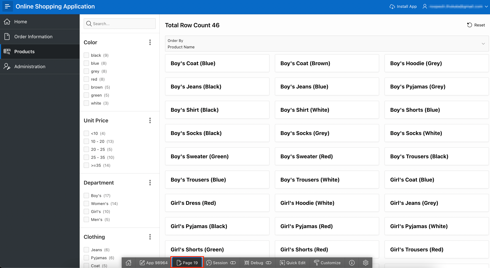

    Alternatively, you can also manually navigate back to the APEX App Builder tab in your browser by selecting the appropriate browser tab or window.
    Once in the App Builder, click **19 - Products**.

    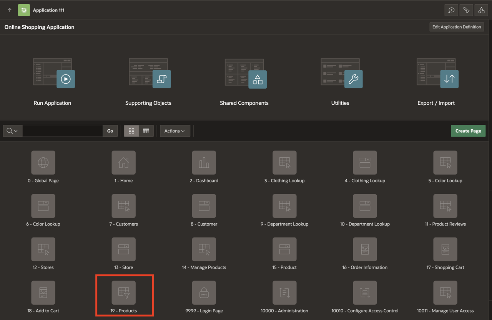

    You should now be in Page Designer with **Page 19: Products** loaded.

## Task 2: Reorder Facets

Unit price is not a standard search criterion, so you want to put this facet at the bottom.

1. In the Rendering tree (left pane), under **Search** region, within Facets, click and hold **P19\_UNIT\_PRICE** and drag it down until it is under **P19\_CLOTHING\_ID**, then release the mouse.

    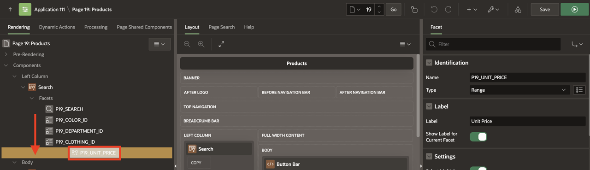

## Task 3: Enhance the Faceted Search

You’ll modify the settings of the faceted search to make it more intuitive for users, such as customizing labels and hiding unnecessary elements like charts.

1. In the **Rendering** tab (left pane), navigate to **Search** region.

2. In the Property Editor (right pane), click **Attributes** and enter/select the following:

    - Under Settings:

        - Total Row Count Label: **Total Products**

        - Show Charts: **No**

    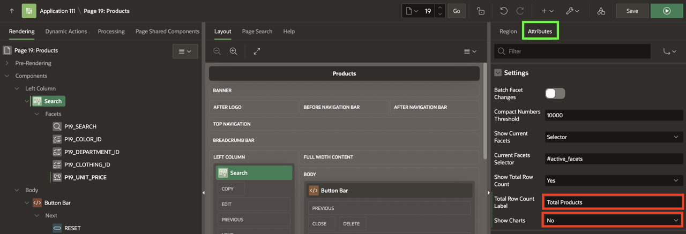

## Task 4: Enhance the Cards Region

This task focuses on updating the design and layout of the cards that display product information, ensuring they’re visually appealing and easy to read.

1. In the **Rendering** tab (left pane), navigate to **Search Results** and in the Property Editor (right pane), update the SQL query:

    ```
    <copy>
        SELECT
            "PRODUCT_ID",
            "PRODUCT_NAME",
            "UNIT_PRICE",
            "PRODUCT_DETAILS",
            "PRODUCT_IMAGE",
            "IMAGE_MIME_TYPE",
            "IMAGE_FILENAME",
            "IMAGE_CHARSET",
            "IMAGE_LAST_UPDATED",
            (
                SELECT
                    L1."COLOR"
                FROM
                    "COLOR_LOOKUP" L1
                WHERE
                    L1."COLOR_ID" = M."COLOR_ID"
            ) "COLOR_ID",
            (
                SELECT
                    L2."DEPARTMENT"
                FROM
                    "DEPARTMENT_LOOKUP" L2
                WHERE
                    L2."DEPARTMENT_ID" = M."DEPARTMENT_ID"
            ) "DEPARTMENT_ID",
            (
                SELECT
                    L3."CLOTHING"
                FROM
                    "CLOTHING_LOOKUP" L3
                WHERE
                    L3."CLOTHING_ID" = M."CLOTHING_ID"
            ) "CLOTHING_ID",
            B.BRAND
        FROM
            "PRODUCTS" M,
            JSON_TABLE ( M.PRODUCT_DETAILS, '$'
                    COLUMNS (
                        BRAND VARCHAR2 ( 4000 ) PATH '$.brand'
                    )
                )
            B;
    </copy>
    ```

    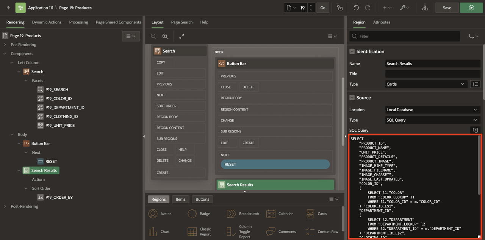

    - Under Appearance > Template Options:

        - Click **Use Template Defaults**.

        - Common > Style: **Style A**

        - Click **OK**

    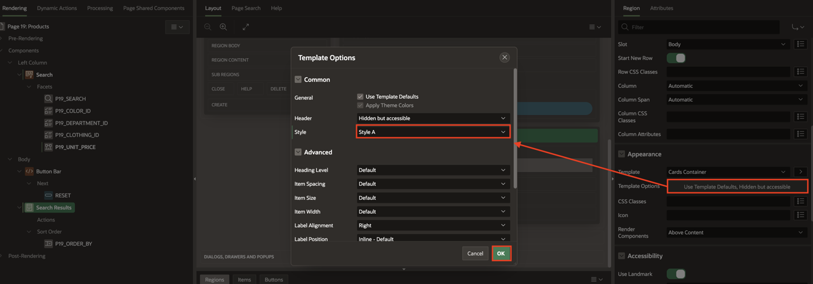

2. In the Property Editor, navigate to **Attributes** and enter/select the following:

    - Under Subtitle:

        - Set Advanced Formatting: **Toggle On**

        - HTML Expression: Enter the following:

        ```
        <copy>
            <small>&BRAND.</small><br />
            <b class="u-success-text u-pullRight" id="message_&PRODUCT_ID.">
            {if QUANTITY/} &QUANTITY. in cart {endif/}
            </b>
            <b>$&UNIT_PRICE.</b>
        </copy>
        ```

    - Under Media:

        - Source: **BLOB Column**

        - BLOB Column: **PRODUCT_IMAGE**

        - Position: **First**

        - Appearance: **Widescreen**

        - Sizing: **Fit**

    - Card > Primary Key Column 1: **PRODUCT_ID**

    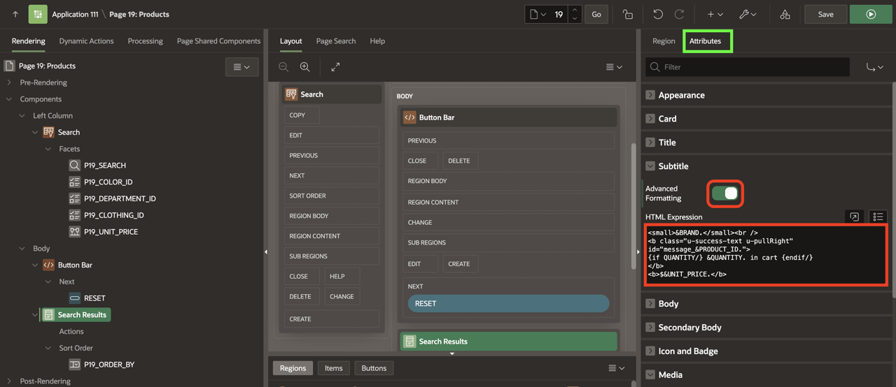

    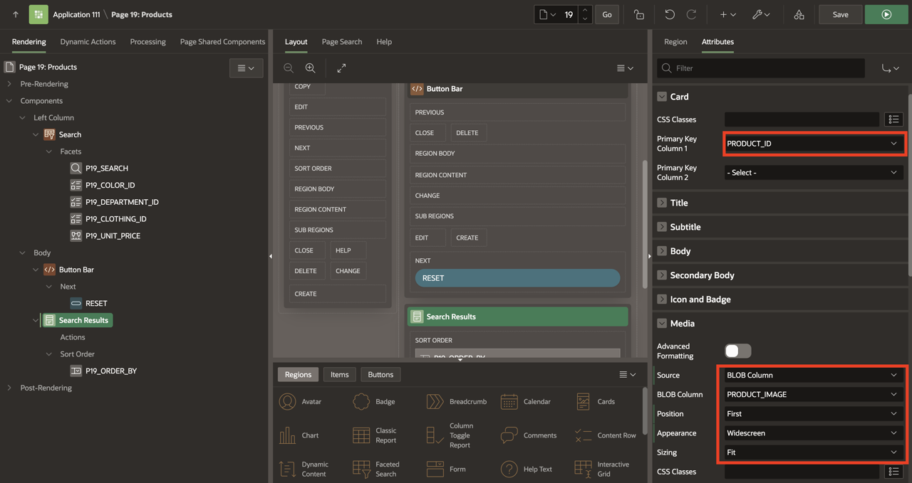

3. Click **Save and Run**.

    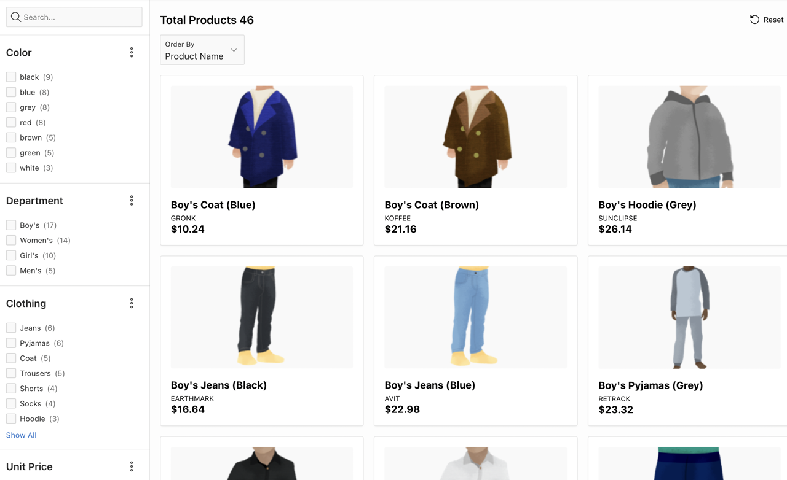

## Task 5: Create Actions

You’ll add interactive actions to the cards, such as linking to detailed product information, to make the page more functional.

1. Navigate to **Search Results** (left pane).

2. Right-click **Actions**, select **Create Action**.

    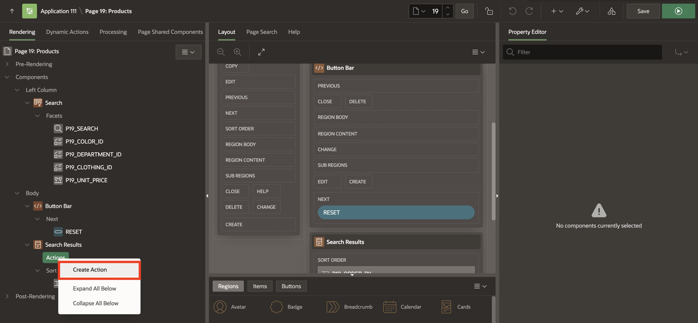

3. In the Property Editor (right pane), enter/select the following:

    - Identification > Type: **Full Card**

    - Link > Target: Click **No Link Defined**

        - Page: **18**

        - Set Items:

            | Name             | Value        |
            | ---------------- | ------------ |
            | P18\_PRODUCT\_ID | &PRODUCT_ID. |

        - Clear Cache: **18**

        - Click **OK**.

    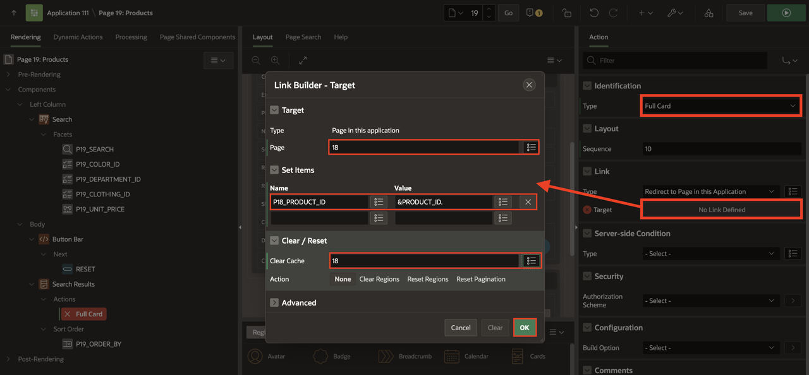

4. Click **Save and Run**.

    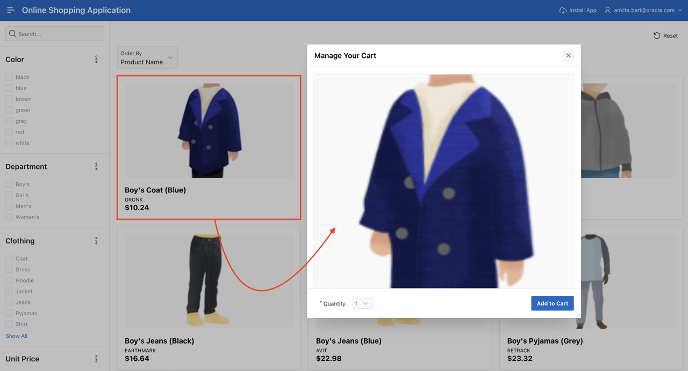

## Task 6: Add Dynamic Actions

In this task, you will create two dynamic actions:

- To show a success message when a product is added/edited/removed from the shopping cart

- To update the badge and icon shown in the navigation bar after the customer has added/edited/removed a product from the shopping cart

1. Navigate to the **Dynamic Actions** tab (left pane).

2. Right-click **Dialog Closed** and select **Create Dynamic Action**.

     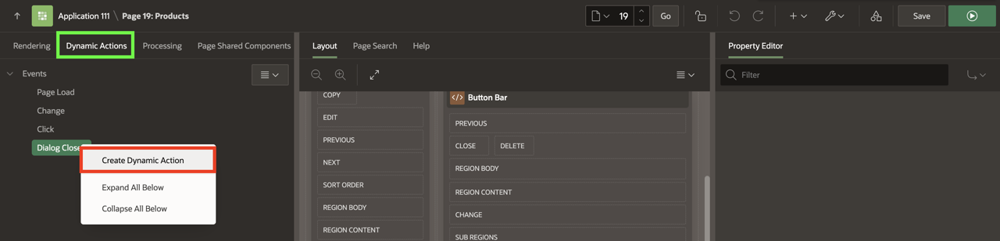

3. In the Property Editor, enter/select the following:

    - Identification > Name: **Show Success Message**

    - Under Execution:

        - Type: **Debounce**

        - Time: **400**

    - Under When:

        - Selection Type: **Region**

        - Region: **Search Results**

      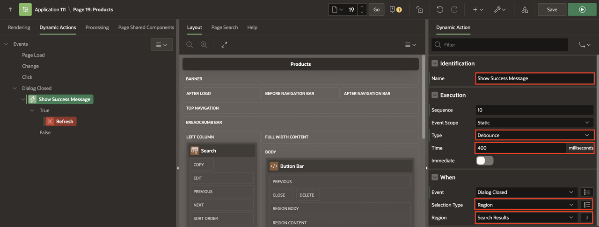

4. Navigate to **Refresh** Action and update the following:

    - Identification > Action: **Execute JavaScript Code**

    - Settings > Code: Enter the following JavaScript Code:

        ```
        <copy>
            var productAction   = this.data.P18_ACTION,
                productQuantity = this.data.P18_QUANTITY,
                productCard$  = apex.jQuery("#message_" + this.data.P17_PRODUCT_ID);

            if (productAction === 'ADD') {
                productCard$.text("Added " + productQuantity + " to cart!");
            } else if (productAction === 'EDIT') {
                productCard$.text("Updated quantity to " + productQuantity + "!");
            } else if (productAction === 'DELETE') {
                productCard$.text("Removed from cart!");
            }
        </copy>
        ```

    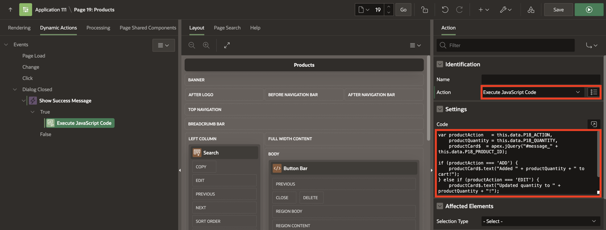

5. Create a second dynamic action. Right-click **Dialog Closed** and select **Create Dynamic Action**.

    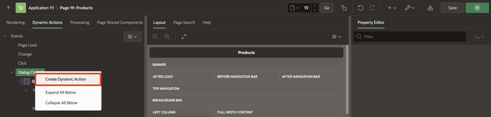

6. In the Property Editor, enter/select the following:

    - Identification > Name: **Update Shopping Cart Header**

    - Under Execution:

        - Type: **Throttle**

        - Time: **400**

    - Under When:

        - Selection Type: **Region**

        - Region: **Search Results**

    - Under Client-side Condition:

        - Type: **JavaScript expression**

        - JavaScript Expression: Enter the following:

            ```
            <copy>
            parseInt(this.data.P18_SHOPPING_CART_ITEMS) > 0
            </copy>
            ```

    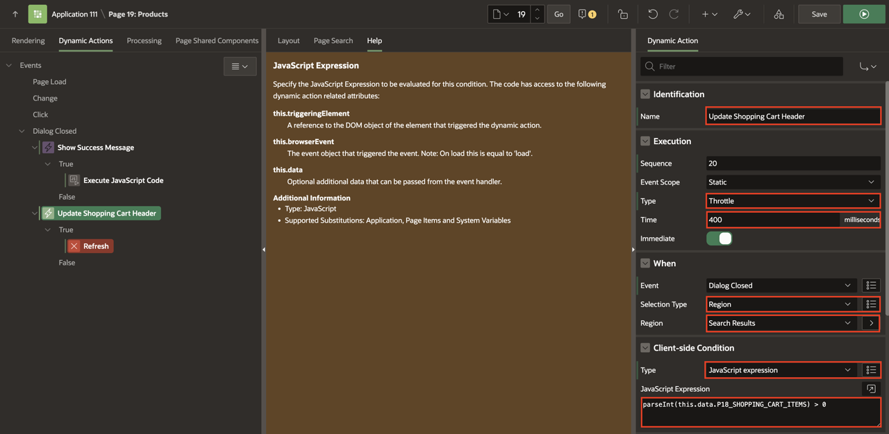

7. Navigate to **Refresh** Action.

    - Identification > Action: **Execute JavaScript Code**

    - Settings > Code: Enter the following JavaScript Code:

        ```
        <copy>
        // Update Badge Text
        apex.jQuery(".js-shopping-cart-item .t-Button-badge").text(this.data.P18_SHOPPING_CART_ITEMS);

        // Update Icon
        apex.jQuery(".js-shopping-cart-item .t-Icon").removeClass('fa-cart-empty').addClass('fa-cart-full');
        </copy>
        ```

    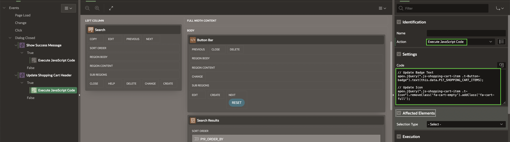

8. Right-click **Execute JavaScript Code** and select **Create Opposite Action**.

     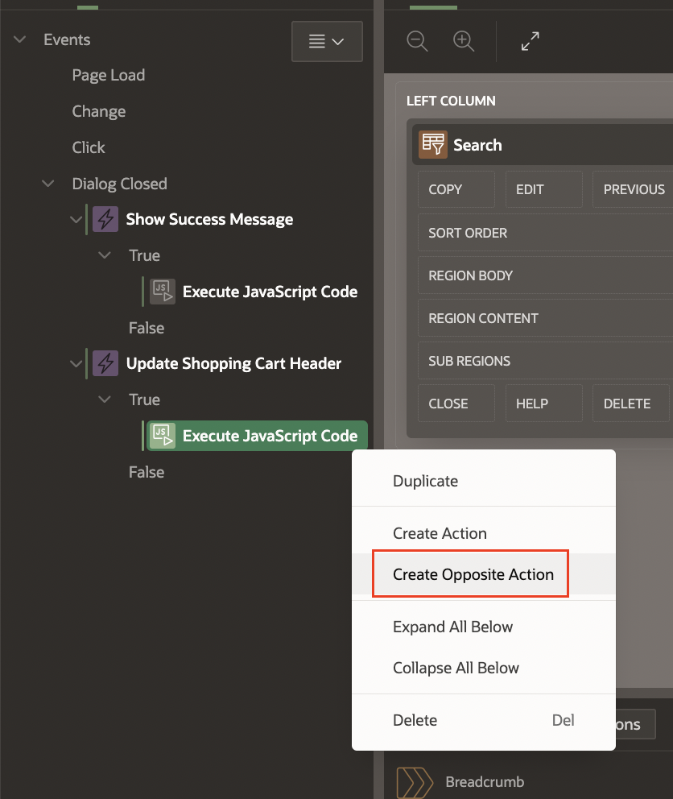

9. In the Property Editor, update the following:
    - Settings > Code: Copy and Replace with the following JavaScript Code:

         ```
        <copy>
        // Update Badge Text
        apex.jQuery(".js-shopping-cart-item .t-Button-badge").text('');

        // Update Icon
        apex.jQuery(".js-shopping-cart-item .t-Icon").removeClass('fa-cart-full').addClass('fa-cart-empty');
        </copy>
        ```

    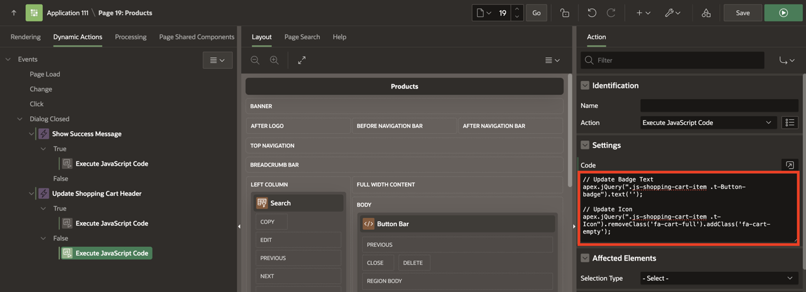

10. Click **Save and Run Page**.

## Task 7: Run the Products Page

Finally, you’ll run the application to test and review all the changes made during the lab.

1. After running the products page, your page will look like the following image:

   

## Summary

By completing this lab, you’ve enhanced the Products page to make it easier for customers to find and manage products. You reordered search facets, improved the appearance of the cards, and added dynamic actions for better interactivity. These changes not only improve the visual appeal of the page but also make it more functional and user-friendly.

You’re now ready to move on to the next lab and continue building on these improvements.

## Acknowledgements

- **Author** - Roopesh Thokala, Senior Product Manager; Ankita Beri, Product Manager
- **Last Updated By/Date** - Ankita Beri, Product Manager, October 2024
