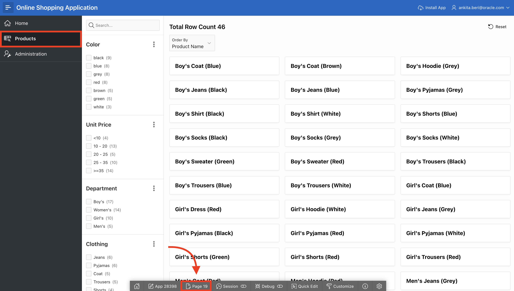
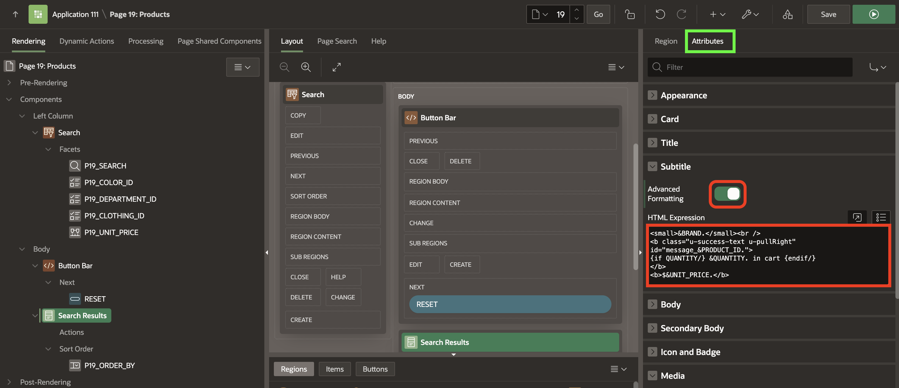
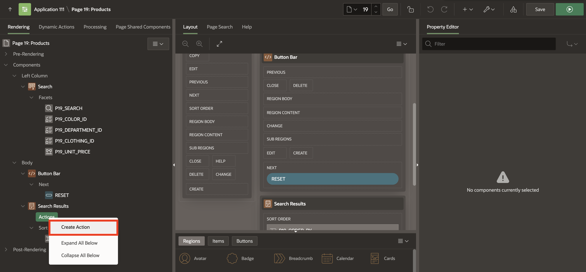
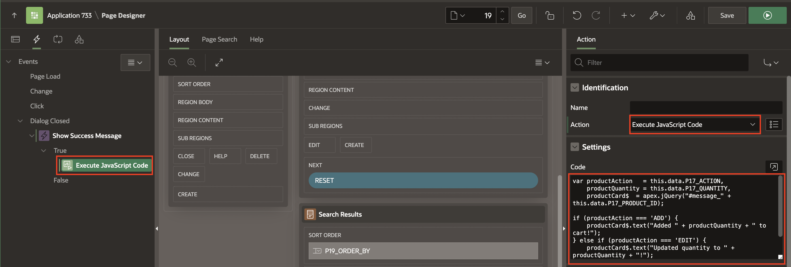
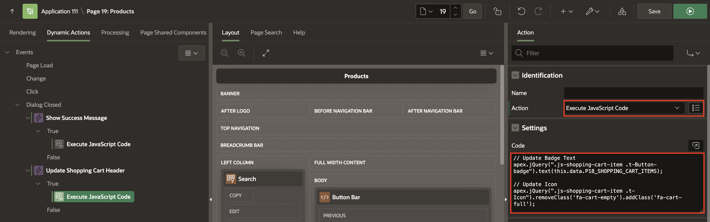
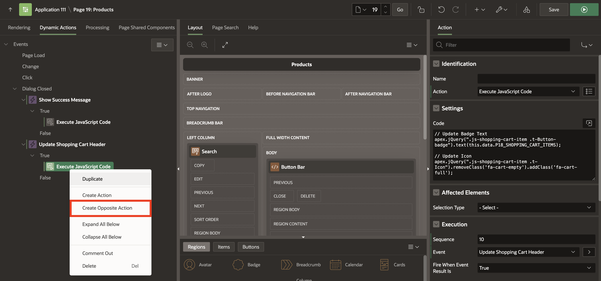
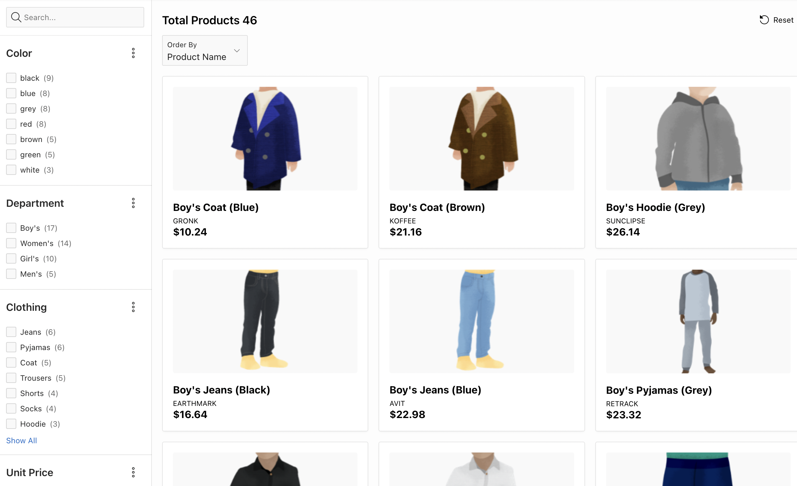

# Improve the product page

## Introduction

In this Lab, you learn how to improve the Products page by adding new facets and customizing the cards.

*Please note that customers can quickly identify the products already added to the shopping cart.*

Estimated Time: 20 minutes

### Objectives
In this Lab, you will:
- Improve both Faceted Search and Cards region
- Add Dynamic Actions to the page

### Downloads

- Did you miss out on trying the previous labs? Don't worry! You can download the application from **[here](files/online-shopping-cart-6.sql)** and import it into your workspace. To run the app, please run the steps described in **[Get Started with Oracle APEX](https://livelabs.oracle.com/pls/apex/r/dbpm/livelabs/run-workshop?p210_wid=3509)** and **[Using SQL Workshop](https://livelabs.oracle.com/pls/apex/r/dbpm/livelabs/run-workshop?p210_wid=3524)** workshops.

## Task 1: Navigate to the Products Page.

In this Lab, you will be using an Online Shopping Application. Navigate to **Online Shopping Application**. In the Runtime environment, navigate to **Products**. This is the page where customers can explore the products and select what they wish to buy.
As you can see, it's hard to find the products, and it would be beneficial to see additional details related to the products.


1. From the runtime application, navigate to the **Products** page in **Page Designer**.

    Given that you run this app from the APEX App Builder, you will find the Developer Toolbar at the bottom of the screen.
    *{Note: End users who log directly into the app will not see this toolbar.}*

    In the Developer Toolbar, click **Page 19**.

    

    Alternatively, you can also manually navigate back to the APEX App Builder tab in your browser by selecting the appropriate browser tab or window.   
    Once in the App Builder, click **19 - Products**.

    

    You should now be in Page Designer with **Page 19: Products** loaded.


## Task 2: Reorder Facets
Unit price is not a standard search criterion, so you want to put this facet at the bottom.

1. In the Rendering tree (left pane), under Search, within Facets, click and hold **P19\_UNIT\_PRICE** and drag it down until it is under **P19\_CLOTHING\_ID**, then release the mouse.

    


## Task 3: Enhance the Faceted Search

1. In the Rendering tree (left pane), navigate to **Search**.
2. In the Property Editor (right pane), click **Attributes** and do the following:
    -   For Total Row Count Label - enter **Total Products**
    -   For Show Charts - select **No**


      

## Task 4: Enhance the Cards Region

1. In the Rendering tree (left pane), navigate to **Search Results** and in the Property Editor (right pane), do the following:
    - For SQL Query - enter the following SQL code:
        ```
        <copy>
        SELECT "PRODUCT_ID",
            "PRODUCT_NAME",
            "UNIT_PRICE",
            "PRODUCT_DETAILS",
            "PRODUCT_IMAGE",
            "IMAGE_MIME_TYPE",
            "IMAGE_FILENAME",
            "IMAGE_CHARSET",
            "IMAGE_LAST_UPDATED",
            "COLOR_ID",
            (
                    SELECT l1."COLOR"
                    FROM   "COLOR_LOOKUP" l1
                    WHERE  l1."COLOR_ID" = m." COLOR_ID") "COLOR_ID_L$1",
            "DEPARTMENT_ID",
            (
                    SELECT l2."DEPARTMENT"
                    FROM   "DEPARTMENT_LOOKUP" l2
                    WHERE  l2."DEPARTMENT_ID" = m." DEPARTMENT_ID") "DEPARTMENT_ID_L$2",
            "CLOTHING_ID",
            (
                    SELECT l3."CLOTHING"
                    FROM   "CLOTHING_LOOKUP" l3
                    WHERE  l3."CLOTHING_ID" = m." CLOTHING_ID") "CLOTHING_ID_L$3",
            b.brand
        FROM "PRODUCTS" m,
            json_table (m.product_details, '$' columns ( brand varchar2(4000) path '$.brand') ) b
        </copy>
        ```

        

    - Under the Appearance section:
        - Click **Template Options**. For Style - select **Style A**

        
        - Click **Ok**

2. Click **Attributes** and apply the following changes:

    - Under Subtitle section:
        - Set Advanced Formatting to **On**
        - For HTML Expression - enter the following:

            ```
            <copy>
            <small>&BRAND.</small><br />
            <b class="u-success-text u-pullRight" id="message_&PRODUCT_ID.">
            {if QUANTITY/} &QUANTITY. in cart {endif/}
            </b>
            <b>$&UNIT_PRICE.</b>
            </copy>
            ```

    - Under Media section:
        -   For Source - select **BLOB Column**
        -   For BLOB Column - select **PRODUCT_IMAGE**
        -   For Position - select **First**
        -   For Appearance - select **Widescreen**
        -   For Sizing - select **Fit**

    - Under Card section:
        -   For Primary Key Column 1 - select **PRODUCT_ID**

      Click **Save.**

            

## Task 5: Create Actions
Customers need a way to shop for products, so in this task, you will add an action to allow customers to learn more about the product.

1. Navigate to **Search Results** (left pane).
2. On Actions, right-click **Create Action**.

    

3. In the Property Editor (right pane), enter the following:
    -   For Type - select **Full Card**
    -   For Target - Click **No Link Defined** and do the following:
        - For Page - enter **17**.
        - For Set Items, enter:

            | Name             | Value        |
            | ---------------- | ------------ |
            | P17\_PRODUCT\_ID | &PRODUCT_ID. |

        - For Clear Cache, enter **17**
        - Click **Ok**.

    

## Task 6: Add Dynamic Actions
In this task, you will create two dynamic actions:
- To show a success message when a product is added/edited/removed from the shopping cart
- To update the badge and icon shown in the navigation bar after the customer has added/edited/removed a product from the shopping cart

1. Navigate to the **Dynamic Actions** tab (left pane).

2. Right-click **Dialog Closed** and click **Create Dynamic Action**.

       
3. In the Property Editor, enter the following:
    - Under the Identification section:
        - For Name - enter **Show Success Message**
    - Under When section:
        - For Event - select **Dialog Closed**
        - For Selection Type - select **Region**
        - For Region - select **Search Results**

      

4. Navigate to **Refresh** Action.
    - Under the Identification section:
        - For Action - select **Execute JavaScript Code**
    - Under Settings section:        
        - For Code - enter the following JavaScript Code:

            ```
            <copy>    
            var productAction   = this.data.P17_ACTION,
                productQuantity = this.data.P17_QUANTITY,
                productCard$  = apex.jQuery("#message_" + this.data.P17_PRODUCT_ID);

            if (productAction === 'ADD') {
                productCard$.text("Added " + productQuantity + " to cart!");
            } else if (productAction === 'EDIT') {
                productCard$.text("Updated quantity to " + productQuantity + "!");
            } else if (productAction === 'DELETE') {
                productCard$.text("Removed from cart!");
            }
            </copy>
            ```
            

5. Create a second dynamic action. Right-click **Dialog Closed** and click **Create Dynamic Action**.  

     
6. In the Property Editor, enter the following:    
    - Under the Identification section:
        - For Name - enter **Update Shopping Cart Header**

    - Under When section:        
        - For Event - select **Dialog Closed**
        - For Selection Type - select **Region**
        - For Region - select **Search Results**

    - Under Client-side Condition:
        - For Type - select **JavaScript expression**
        - For JavaScript Expression, enter the following:

            ```
            <copy>
            parseInt(this.data.P17_SHOPPING_CART_ITEMS) > 0
            </copy>
            ```
            

7. Navigate to **Refresh** Action.
    - Under the Identification section:
        - For Action - select **Execute JavaScript Code**
    - Under Settings section:        
        - For Code - enter the following JavaScript Code:

            ```
            <copy>
            // Update Badge Text
            apex.jQuery(".js-shopping-cart-item .t-Button-badge").text(this.data.P17_SHOPPING_CART_ITEMS);

            // Update Icon
            apex.jQuery(".js-shopping-cart-item .t-Icon").removeClass('fa-cart-empty').addClass('fa-cart-full');
            </copy>
            ```
            

8. Create an opposite action. In the Dynamic Actions tab (left pane), navigate to the newly dynamic Action.
9. Right-click **Execute JavaScript Code** and click **Create Opposite Action**.

     

10. Navigate to **Execute JavaScript Code** Action.
    - Under the Identification section:
        - For Action - select **Execute JavaScript Code**
    - Under Settings section:        
        - For Code - enter the following JavaScript Code:

            ```
            <copy>
            // Update Badge Text
            apex.jQuery(".js-shopping-cart-item .t-Button-badge").text('');

            // Update Icon
            apex.jQuery(".js-shopping-cart-item .t-Icon").removeClass('fa-cart-full').addClass('fa-cart-empty');
            </copy>
            ```
            

11. Click **Save and Run Page**.

## Task 7: Run the Products Page

1. After running the products page, your page will look like the following image:

   

## Summary
You now know how to enhance faceted search and cards region. You may now **proceed to the next Lab**.

## What's next
In the next Lab, you learn how to Create and Customize a Form and then link the form to an Interactive Report. This process involves designing a user-friendly data entry form and connecting it to a dynamic, interactive report that displays data from a database table.

## Acknowledgements
- **Author** - Roopesh Thokala, Senior Product Manager
- **Contributor** - Ankita Beri, Product Manager
- **Last Updated By/Date** - Ankita Beri, Product Manager, January 2024
