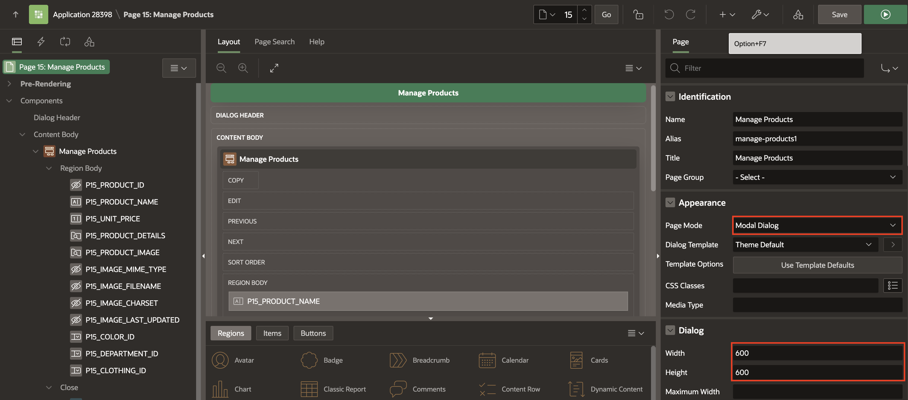
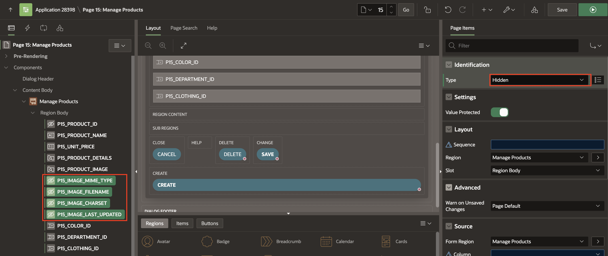
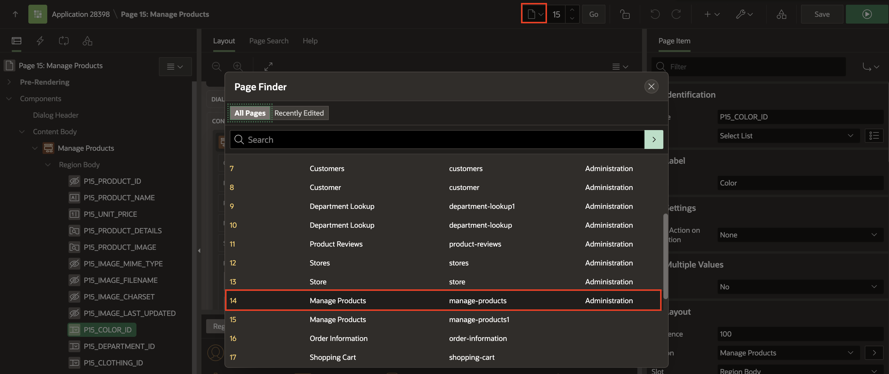
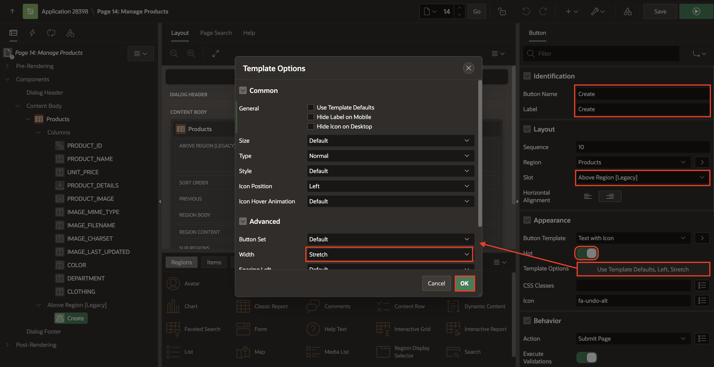

# Improve Classic Report

## Introduction

This lab focuses on enhancing a Classic Report in an Oracle APEX application. Classic Reports are a highly flexible way to present structured data, and customizing them allows you to provide a more intuitive and engaging user experience. In this lab, you’ll modify a Classic Report on the Manage Products page within the Online Shopping Application. You will improve the report's functionality by incorporating features like links, dynamic buttons, and displaying images directly in the report. Additionally, you’ll learn to create a form page for managing products and implement a Download BLOB feature for seamless file downloads.

Estimated Time: 15 minutes

### Objectives

In this lab, you will:

- Customize the Classic Report for enhanced data presentation and usability.

- Configure links and buttons for navigation and interactivity.

- Add a Download BLOB feature to enable file downloads directly from the report.

- Display product images directly in the report for better visualization.

- Create a modal form page to manage products efficiently.

### Downloads

- Did you miss out on trying the previous labs? Don’t worry! You can download the application from **[here](files/hol10.sql)** and import it into your workspace. To run the app, please run the steps described in **[Get Started with Oracle APEX](https://livelabs.oracle.com/pls/apex/r/dbpm/livelabs/run-workshop?p210_wid=3509)** and **[Using SQL Workshop](https://livelabs.oracle.com/pls/apex/r/dbpm/livelabs/run-workshop?p210_wid=3524)** workshops.

## Task 1: Enhance Classic Report

1. On **Online Shopping Application**, navigate to **14 - Manage Products** page.

      

2. In the left pane, navigate to **Products** region and update the following:

    - Identification > Type: **Classic Report**

    - Source > SQL Query: Copy and replace the following SQL Query:

    ```
    <copy>
    SELECT
        "PRODUCT_ID",
        "PRODUCT_NAME",
        "UNIT_PRICE",
         DBMS_LOB.GETLENGTH("PRODUCT_DETAILS") AS PRODUCT_DETAILS,
         DBMS_LOB.GETLENGTH("PRODUCT_IMAGE") AS PRODUCT_IMAGE,
        "IMAGE_MIME_TYPE",
        "IMAGE_FILENAME",
        "IMAGE_CHARSET",
        "IMAGE_LAST_UPDATED",
        (
            SELECT
                L1."COLOR"
            FROM
                "COLOR_LOOKUP" L1
            WHERE
                L1."COLOR_ID" = M."COLOR_ID"
        ) COLOR,
        (
            SELECT
                L2."DEPARTMENT"
            FROM
                "DEPARTMENT_LOOKUP" L2
            WHERE
                L2."DEPARTMENT_ID" = M."DEPARTMENT_ID"
        ) DEPARTMENT,
        (
            SELECT
                L3."CLOTHING"
            FROM
                "CLOTHING_LOOKUP" L3
            WHERE
                L3."CLOTHING_ID" = M."CLOTHING_ID"
        ) CLOTHING
    FROM
        "PRODUCTS" M
    </copy>
    ```

    

3. Under **Products** region, expand columns and select **PRODUCT\_ID** column. In the Property Editor, enter/select the following:

    - Identification > Type: **Link**

    - Link > Target: Click **No Link Defined**

        - Page: **15**

        - Set Items > Name: **P15\_PRODUCT\_ID**, Value: **#PRODUCT\_ID#**

        - Clear Cache: **15**

        - Click **OK**.

    - Link > Link Text: **fa-edit**

    

    

4. Click **Save**.

## Task 2: Create Form to Manage Products

1. In the Page Designer toolbar, navigate to **+ V** icon and select **Page**.

    

2. Select **Form**.

    

3. In **Create Form** dialog, enter/select the following:

    - Under Page Definition:

        - Page Number: **15**

        - Name: **Manage Products**

    - Data Source > Table / View Name: **PRODUCTS**

    - Under Navigation:

        - Use Breadcrumb: Toggle **OFF**

        - Use Navigation:  Toggle **OFF**

    Click **Next**.

    

4. Enter/ select the following:

    - Under Branch Pages:

        - Branch Here on Submit: **14**

        - Cancel and Go To Page: **14**

    Click **Create Page**.

    

5. Navigate to Property Editor (right pane), update the following:

    - Appearance > Page Mode: **Modal Dialog**

    - Under Dialog:

        - Width: **600**

        - Height: **600**

    

6. Now, navigate to **Manage Products** region (left pane). Select **P15\_IMAGE\_MIME\_TYPE** page item and hold until **P15\_IMAGE\_LAST\_UPDATED** and change type to **Hidden**.

    

7. Remove **Id** from the label of page items: **P15\_COLOR\_ID , P15\_DEPARTMENT\_ID , P15\_CLOTHING\_ID**.

    

8. From the page designer toolbar, navigate to **Page Finder** and select **14**.

    

9. Under **Products** region, select **PRODUCT\_DETAILS** column and enter/select the following:

    - Identification > Type: **DOWNLOAD BLOB**

    - Under BLOB Attributes:

        - Table Name: **PRODUCTS**

        - BLOB Column: **PRODUCT_DETAILS**

        - Primary Key Column 1: **PRODUCT_ID**

     

10. Select **PRODUCT_IMAGE** column and enter/select the following:

    - Identification > Type: **Display Image**

    - Under BLOB Attributes:

        - Table Name: **PRODUCTS**

        - BLOB Column: **PRODUCT_IMAGE**

        - Primary Key Column 1: **PRODUCT_ID**

    

11. Navigate to **RESET_REPORT** button and update the following:

    - Under Identification:

        - Button Name: **Create**

        - Label: **Create**

    - Layout > Slot: **Above Region [Legacy]**

    - Under Appearance:

        - Hot: **Toggle On**

        - Template Options: Click **Use Template Defaults**

            - Advanced > Width: **Stretch**

            Click **OK**.

    - Under Behavior:

        - Action: **Redirect to Page in this Application**

        - Target: Click **No Link Defined**

            - Target > Page: **15**

            - Set Items > Name: **P15\_PRODUCT\_ID** , Value: **#PRODUCT_ID#**

            - Clear Cache: **15**

            Click **OK**.

    

    

12. Click **Save**.

## Task 3: Run the Manage Products page

1. Run **Online Shopping Application**.

2. Navigate to **Administration** in the application menu. Select **Manage Products**.

    

3. On the **Manage Products** page, a Classic Report is displayed.

    - Perform the following actions:

        - Edit Rows: Click the **Edit** pencil icon to modify an existing product.

        - Add New Row: Click the **Create** button to add a new product.

    

4. When you click either the Edit pencil icon or the Create button:

    - The Form dialog you built in the previous lab will open, allowing you to enter or edit product details.

    

## Summary

In this lab, you’ve learned how to:

- Enhance a Classic Report by modifying its attributes and customizing its design.

- Implement a Download BLOB feature and display product images directly in the report.

- Create a modal form for managing products, providing an interactive and efficient way for users to add or edit product data.

These improvements ensure a more seamless and user-friendly experience in the Manage Products page of your Online Shopping Application. You’re now ready to move on to the next lab.

## What's next

In the next Lab, you learn how to create and customize a Form and then link the form to an Interactive Report. This process involves designing a user-friendly data entry form and connecting it to a dynamic, interactive report that displays data from a database table.

## Acknowledgements

- **Author** - Ankita Beri, Product Manager
- **Last Updated By/Date** - Ankita Beri, Product Manager, October 2024
