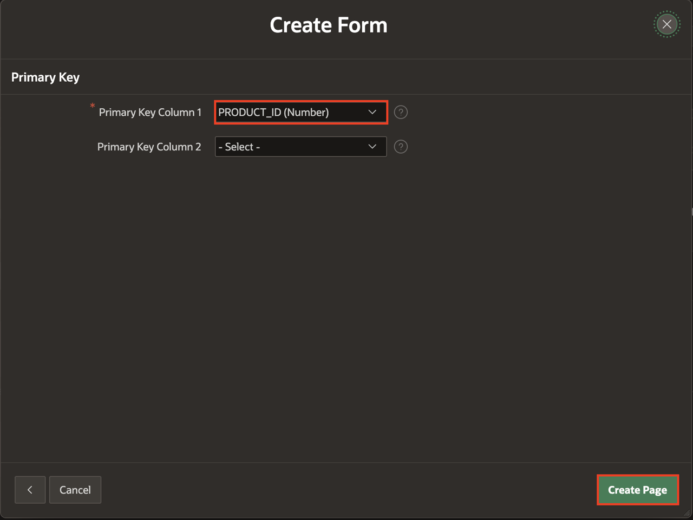
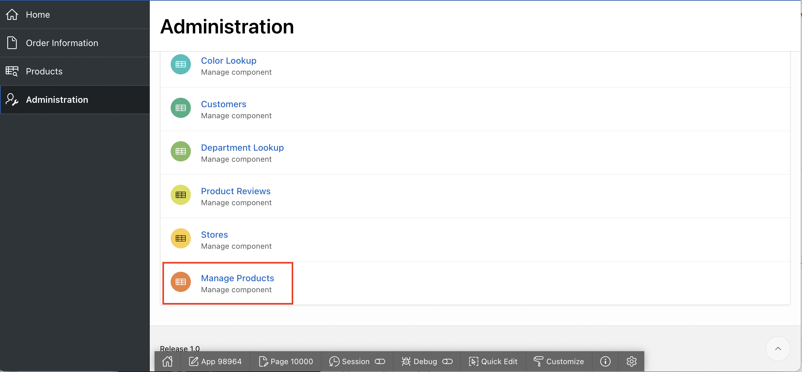
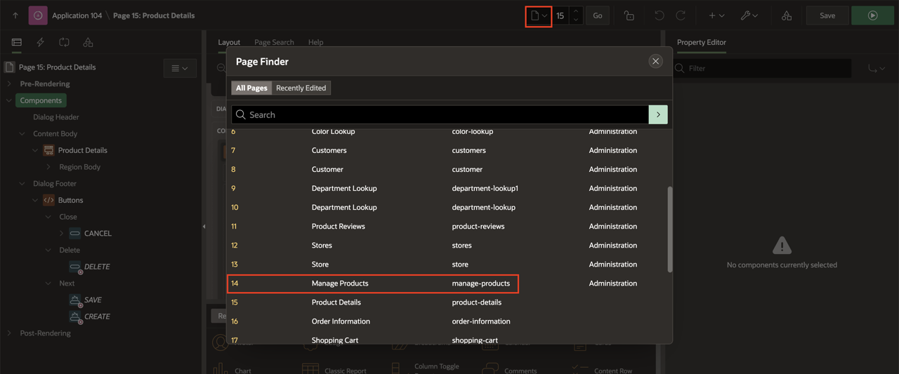
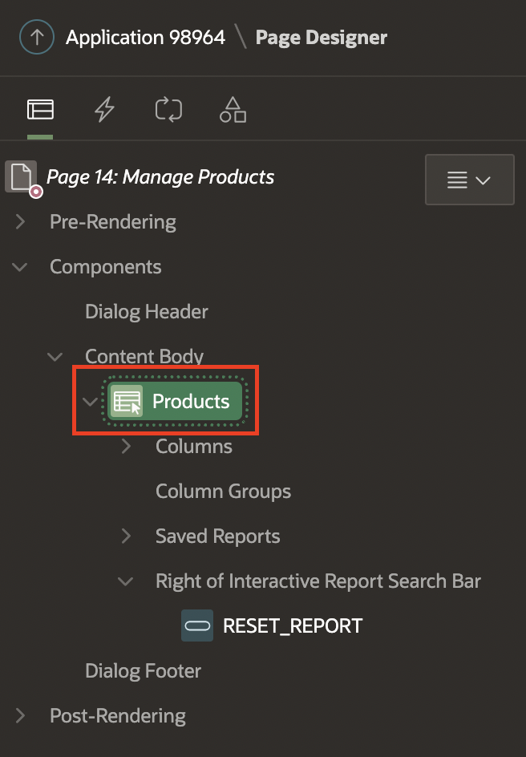
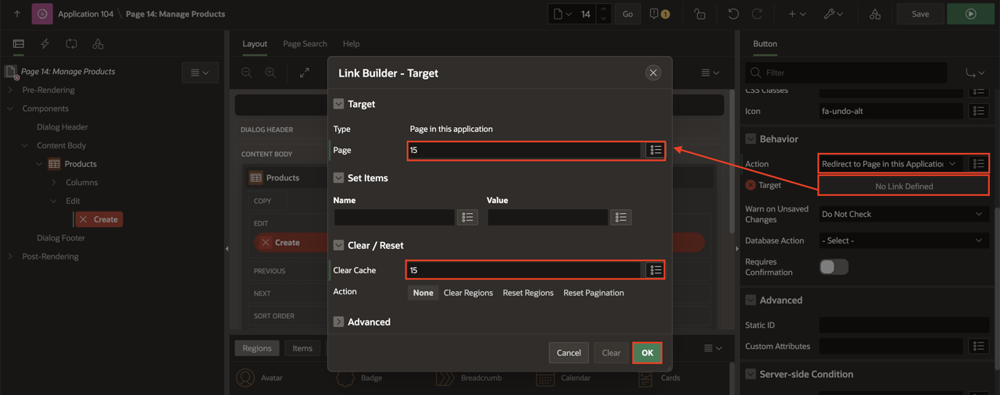
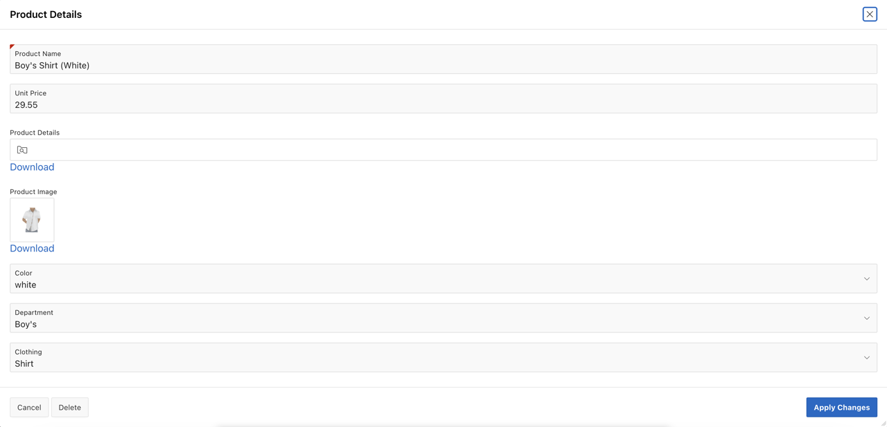
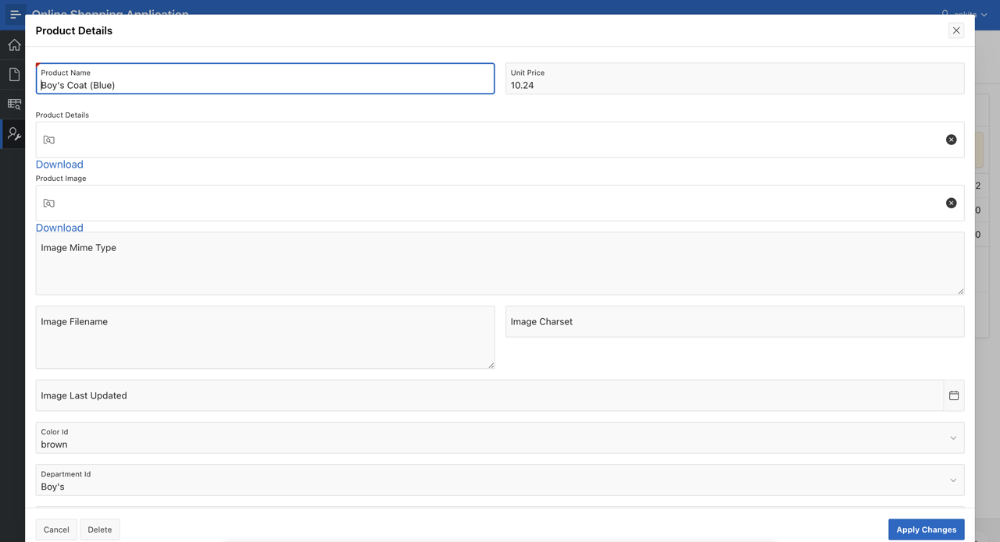

# Improving the Report and Form

## Introduction
In this lab, you will learn how to Create and Customize a Form and then you will link the form to an Interactive Report

Estimated Time: 20 minutes

### Downloads

- Did you miss out trying the previous labs? Don’t worry! You can download the application from **[here](files/online-shopping-cart-6.sql)** and import it into your workspace. To run the app, please run the steps described in **[Get Started with Oracle APEX](https://apexapps.oracle.com/pls/apex/r/dbpm/livelabs/run-workshop?p210_wid=3509)** and **[Using SQL Workshop](https://apexapps.oracle.com/pls/apex/r/dbpm/livelabs/run-workshop?p210_wid=3524)** workshops.

## Task 1: Creating a Product Details Form

1. Navigate to the **App Builder**. Then Click on **Online Shopping Application**.

    

    

2. Now, click Create Page.

    

3. For Create a Page: Select Page Type - Select **Component** and then select **Form**.

    

4. For Page Attributes, enter the following:
  Under **Page Definition**:
    - For Page Number, enter **21**.
    - For Page Name, enter **Product Details**
    - For Page Mode, select **Modal Dialog**

  Under **Data Source**:
    - For **Table/View Name**, Select **PRODUCTS**.

  Click **Next.**

  

5. Under Primary key, for Primary Key Column1 - Ensure the **PRODUCT_ID** is selected as the primary key. Then click **Create Page**.

  

## Task 2: Linking a Report to a Form

1. Navigate to the **App Builder**. Then Click on **Online Shopping Application** and run **Application**. From the runtime application, navigate to the **Manage Products** page in **Page Designer**.

    Given that you run this app from the APEX App Builder, you will find the Developer Toolbar at the bottom of the screen.
    *{Note: End users who log directly into the app will not see this toolbar.}*

    In the Developer Toolbar click **Page 14**.

    

    

2. In the Rendering tree (left pane), navigate to **Products**.

    

3. In the Property Editor (right pane), click **Attributes** and do the following:

    - Under **Link**:
      -   For Link Column - select **Link to a Custom Target**
      -   Click **No Link Defined** Button and do the following in the popup  
        - For Page - enter **21**.  
        - For Set Items, enter:

                | Name | Value |
                | --- | --- |
                | P21_PRODUCT_ID | #PRODUCT_ID# |    

        - For Clear Cache, enter **21**  
        - Click **Ok**.

    Click **Save.**      

    

4. Click **Save** and then reload the **Manage Products** page in the runtime environment.

5. Now, In the **Manage Products** page, click **Pencil Icon** on the first row. Verify the **Product Details** model dialog page.

  

  

## Task 3: Enhancing the Form

1.  Navigate to the **Page 21** in the **App Builder**. Then Click on **P21\_PRODUCT\_NAME** in the Rendering Tree. Now, change the Identification Type to **Text Field** in the Property Editor.

    

2. Items can readily be moved using drag-and-drop within Layout. If required you can also drag new components like regions, items, and buttons into the Layout pane from the Gallery, located directly below it.

  In Page Designer, with **Page 21** loaded, within Layout (middle pane), click **P21\_UNIT\_PRICE** and continue to hold the mouse down. Drag the item up and to the right, until it is directly after **P21\_PRODUCT\_NAME**, and a dark yellow box is displayed. Release the mouse to drop the item in the new location.

 

3. As an alternative to using drag-and-drop you can also reposition items using attributes in the Property Editor.

  In Page Designer, within Layout (or the Rendering tree in the left pane), select **P21\_IMAGE\_CHARSET**. In the Property Editor (right pane), **deselect Layout > Start New Row**.

  

4. You now need to Focus on **First item on Page**.  In **Page Rendering**(Left Pane), Select **Page 21: Product Details**. Then, In the **Property Editor**, Scroll down to Navigation and for **Cursor Focus**, select **First item on page**. Then, click **Save**.

  

5. Now that you have customized the Form. You can reload **Manage Products** page in the runtime environment. Click on **Edit** to view the Form Page.

  

## **Acknowledgements**

 - **Author/Contributors** -  Roopesh Thokala, Product Manager
 - **Last Updated By/Date** - Roopesh Thokala, Product Manager, April 2022
