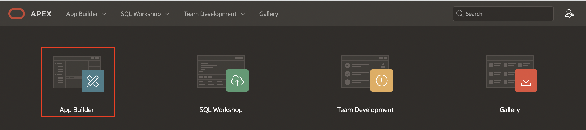
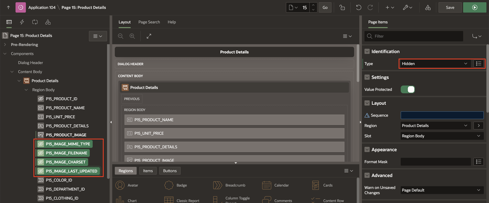
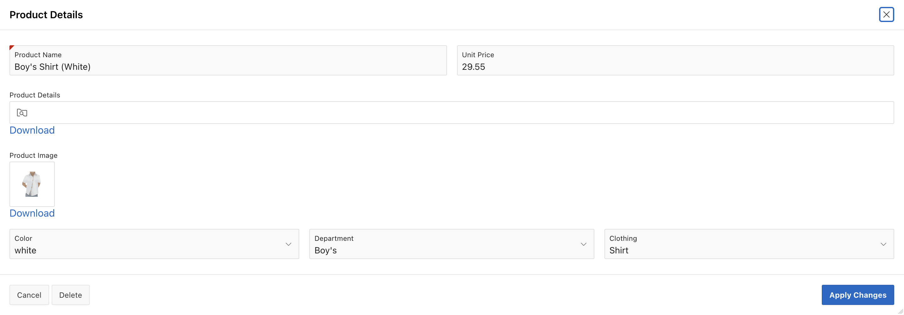

# Create and Use Forms

## Introduction

In this lab, you will learn how to create and customize Forms in Oracle APEX and then link the forms to a Classic Report. This will help you enhance your applications' user experience and functionality by allowing users to interact with data more effectively.

Estimated Time: 5 minutes

### Downloads

- Did you miss out on trying the previous labs? Don't worry! You can download the Demo application from **[here](files/hol11-lab1.sql)** , Online shopping Application from **[here](files/hol11-lab2.sql)**and import it into your workspace. To run the app, please run the steps described in **[Get Started with Oracle APEX](https://livelabs.oracle.com/pls/apex/r/dbpm/livelabs/run-workshop?p210_wid=3509)** and **[Using SQL Workshop](https://livelabs.oracle.com/pls/apex/r/dbpm/livelabs/run-workshop?p210_wid=3524)** workshops.

## Task 1: Create a Product Details Form

In this task, you will create a form that displays product details. This Form will be based on the PRODUCTS table and added as a modal dialog page for your application.

1. Navigate to the **App Builder**. Click **Online Shopping Application**.

    

    

2. Now, click **Create Page**.

    

3. Select **Form**.

    

4. For page attributes, enter/select the following:

    - Under Page Definition:

        - Page Number: **15**.

        - Name: **Product Details**

        - Page Mode: **Modal Dialog**

    - Data Source > Table/View Name: **PRODUCTS**.

    Click **Next.**

    

5. For **Primary Key Column1**, ensure the **PRODUCT_ID** is selected and click **Create Page**.

    

## Task 2: Link a Report to a Form

Once the product form is created, you need to link it to an existing interactive report. This allows users to easily edit product details directly from the report page.

1. From **Page Designer** toolbar, navigate to page finder and select **Page 14**

    

2. In the **Rendering** tab (left pane), navigate to **Products**. Click **Attributes** and update the following:

    - Under **Link**:

        - Link Column: **Link to a Custom Target**

        - Click **No Link Defined** and enter/select the following:

            - Page: **15**.

            - Set Items:

           | Name             | Value        |
           | ---------------- | ------------ |
           | P15\_PRODUCT\_ID | #PRODUCT_ID# |

            - Clear Cache: **15**

            - Click **OK**.

    

3. Click **Save** and run the application. Navigate to **Administration** > **Manage Products** page in the runtime environment.

4. Now, in the **Manage Products** page, click **Pencil Icon** on the first row. Verify the **Product Details** model dialog page.

    

    

## Task 3: Enhance the Form

After linking the Form to the report, it's time to enhance its usability and appearance. In this task, you will rearrange the form layout, hide unnecessary items, and make the Form more intuitive for users.

1. Navigate to the **Page 15** in the **Page Designer**.

    

2. Items can readily be moved using drag-and-drop within the layout. You can also drag new components like regions, items, and buttons from the Gallery into the Layout pane directly below it.

    In Page Designer, with **Page 15** loaded, within the layout (middle pane), click **P15\_UNIT\_PRICE** and continue to hold the mouse down. Drag the item to the right until it is directly after **P15\_PRODUCT\_NAME**, and a dark yellow box is displayed. Release the mouse to drop the item in the new location.

    

3. As an alternative to drag-and-drop, you can also reposition items using attributes in the Property Editor.

    In Page Designer, within layout (or the Rendering tab in the left pane), select **P15\_DEPARTMENT\_ID** and **P15\_CLOTHING\_ID** In the Property Editor (right pane); under layout, toggle off **Start New Row**.

    

4. Select **P15\_IMAGE\_MIME\_TYPE, P15\_IMAGE\_FILENAME, P15\_IMAGE\_CHARSET and P15\_IMAGE\_LAST\_UPDATED** and update **Type** to **Hidden**

    

5. Now, select **P15\_COLOR\_ID, P15\_DEPARTMENT\_ID and P15\_CLOTHING\_ID** and update **Name** as following:

    | Page Item | Name |
    |-----------|------|
    | P15\_COLOR\_ID | Color |
    | P15\_DEPARTMENT\_ID | Department |
    | P15\_CLOTHING\_ID | Clothing |
    {: title="Page Items"}

    

6. You now need to focus on **First item on Page**. In **Page Rendering**(Left Pane), select **Page 15: Product Details**. In the **Property Editor**, update the following:

    - Navigation Menu > Cursor Focus: **First item on page**.

    Click **Save**.

    

7. Now that you have customized the Form. You can reload the **Manage Products** page in the runtime environment. Click on **Edit** to view the Form Page.

    

## Summary

By completing this lab, you have successfully created a product details form, linked it to a Classic Report, and enhanced its layout and usability. You now have the foundational skills to create and manage forms in Oracle APEX, improving the overall interactivity of your applications. You may now **proceed to the next lab**.

## What's next

In the next lab, you learn how to make some pages publicly accessible, allowing users to access specific pages in your application without requiring them to log in.

## Acknowledgements

- **Author/Contributors** -  Roopesh Thokala, Senior Product Manager; Ankita Beri, Product Manager
- **Last Updated By/Date** - Ankita Beri, Product Manager, September 2024
