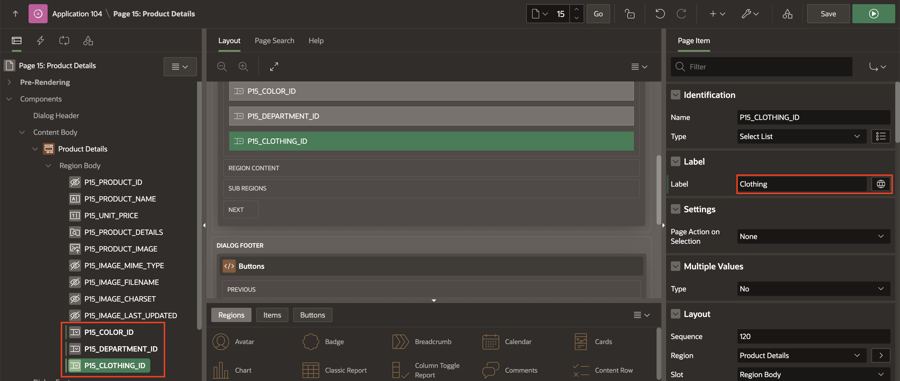
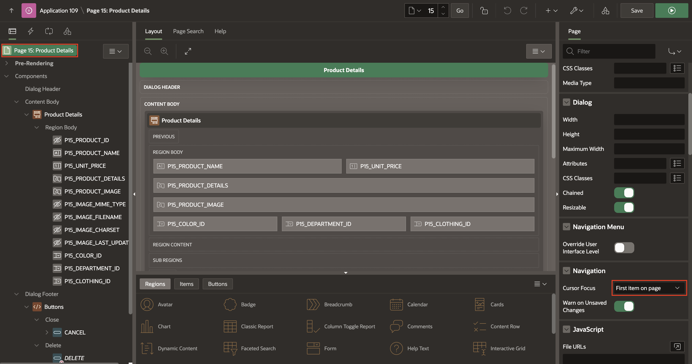

# Create and Use Forms

## Introduction

In this lab, you will learn how to create and customize forms in Oracle APEX and link them to a Classic report. Forms enable users to view, add, and edit data effectively, enhancing the overall functionality and usability of your application. You will create a Product Details form, integrate it with a Classic Report, and enhance its layout and usability for a seamless user experience.

Estimated Time: 10 minutes

### Objectives

By completing this lab, you will:

- Create a modal dialog form to display and manage product details.

- Link the form to an interactive report for seamless data editing and creation.

- Enhance the form layout by organizing fields, hiding unnecessary items, and improving user interface elements.

## Task 1: Create a Product Details Form

In this task, you will create a form that displays product details. This Form will be based on the PRODUCTS table and added as a modal dialog page for your application.

1. Navigate to the **App Builder**. Click **Online Shopping Application**.

    

    

2. Now, click **Create Page**.

    

3. Select **Form**.

    

4. For page attributes, enter/select the following:

    - Under Page Definition:

        - Page Number: **15**

        - Name: **Product Details**

        - Page Mode: **Modal Dialog**

    - Data Source > Table/View Name: **PRODUCTS**

    Click **Next.**

    

5. For **Primary Key Column 1**, ensure the **PRODUCT_ID** is selected. Click **Create Page**.

    

## Task 2: Enhance the Form

After linking the Form to the report, it's time to enhance its usability and appearance. In this task, you will rearrange the form layout, hide unnecessary items, and make the Form more intuitive for users.

1. Navigate to the **Page 15** in the **Page Designer**.

    

2. Under **Products** region, select **PRODUCT_DETAILS** column and enter/select the following:

    - Identification > Type: **DOWNLOAD BLOB**

    - Under BLOB Attributes:

        - Table Name: **PRODUCTS**

        - BLOB Column: **PRODUCT_DETAILS**

        - Primary Key Column 1: **PRODUCT_ID**

    

3. Select **PRODUCT_IMAGE** column and enter/select the following:

    - Identification > Type: **Display Image**

    - Under BLOB Attributes:

        - Table Name: **PRODUCTS**

        - BLOB Column: **PRODUCT_IMAGE**

        - Primary Key Column 1: **PRODUCT_ID**

    

4. Select **P15\_IMAGE\_MIME\_TYPE, P15\_IMAGE\_FILENAME, P15\_IMAGE\_CHARSET and P15\_IMAGE\_LAST\_UPDATED** and update **Type** to **Hidden**

    

5. Now, select **P15\_COLOR\_ID, P15\_DEPARTMENT\_ID and P15\_CLOTHING\_ID** and update **Name** as following one after the other:

    | Page Item | Name |
    |-----------|------|
    | P15\_COLOR\_ID | Color |
    | P15\_DEPARTMENT\_ID | Department |
    | P15\_CLOTHING\_ID | Clothing |
    {: title="Page Items"}

    

6. Items can readily be moved using drag-and-drop within the layout. You can also drag new components like regions, items, and buttons from the Gallery into the Layout pane directly below it.

    In Page Designer, with **Page 15** loaded, within the layout (middle pane), click **P15\_UNIT\_PRICE** and continue to hold the mouse down. Drag the item to the right until it is directly after **P15\_PRODUCT\_NAME**, and a dark yellow box is displayed. Release the mouse to drop the item in the new location.

    

7. As an alternative to drag-and-drop, you can also reposition items using attributes in the Property Editor.

    In Page Designer, within layout (or the Rendering tab in the left pane), select **P15\_DEPARTMENT\_ID** and **P15\_CLOTHING\_ID** In the Property Editor (right pane); under layout, toggle off **Start New Row**.

    

8. You now need to focus on **First item on Page**. In **Page Rendering**(Left Pane), select **Page 15: Product Details**. In the **Property Editor**, update the following:

    - Navigation > Cursor Focus: **First item on page**.

    

9. Click **Save**.

## Task 3: Run the Manage Products page

In this final task, you will run the application to test the integration and functionality of the Manage Products page. You will navigate to the page, test editing and adding data through the form, and validate its usability in the runtime environment.

1. Run Online Shopping Application.

2. Navigate to **Administration** in the application menu. Select **Manage Products**.

    

3. On the **Manage Products** page, a Classic Report is displayed.

    - Perform the following actions:

        - Edit Rows: Click the Edit pencil icon to modify an existing product.

        - Add New Row: Click the Create button to add a new product.

    

4. When you click either the Edit pencil icon or the Create button:

    - The Form dialog you built in the previous lab will open, allowing you to enter or edit product details.

    

## Summary

By completing this lab, you have successfully created a product details form, linked it to a Classic Report, and enhanced its layout and usability. You now have the foundational skills to create and manage forms in Oracle APEX, improving the overall interactivity of your applications. You may now **proceed to the next lab**.

## What's next

In the next lab, you learn how to make some pages publicly accessible, allowing users to access specific pages in your application without requiring them to log in.

## Acknowledgements

- **Author/Contributors** -  Roopesh Thokala, Senior Product Manager; Ankita Beri, Product Manager
- **Last Updated By/Date** - Ankita Beri, Product Manager, September 2024
