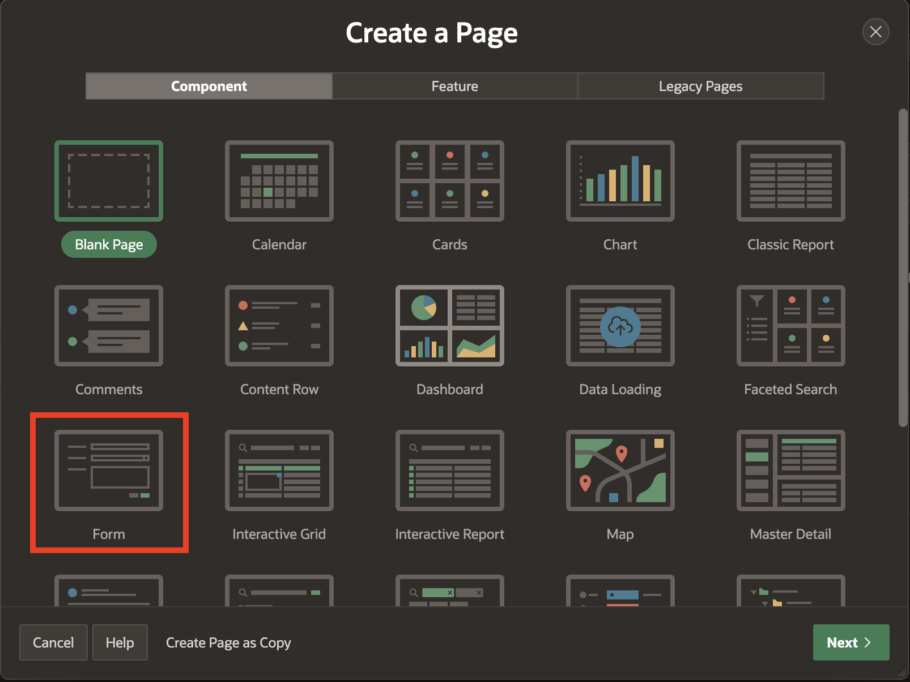
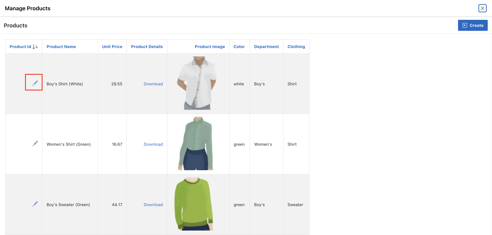

# Create and Use Forms

## Introduction
In this lab, you learn how to Create and Customize a Form, and then you link the Form to an Interactive Report.

Estimated Time: 20 minutes

### Downloads

- Did you miss out on trying the previous labs? Don't worry! You can download the Demo application from **[here](files/hol11-lab1.sql)** , Online shopping Application from **[here](files/hol11-lab2.sql)**and import it into your workspace. To run the app, please run the steps described in **[Get Started with Oracle APEX](https://livelabs.oracle.com/pls/apex/r/dbpm/livelabs/run-workshop?p210_wid=3509)** and **[Using SQL Workshop](https://livelabs.oracle.com/pls/apex/r/dbpm/livelabs/run-workshop?p210_wid=3524)** workshops.

## Task 1: Create a Product Details Form

1. Navigate to the **App Builder**. Then Click on **Online Shopping Application**.

    

    

2. Now, click Create Page.

    

3. For Create a Page: Select Page Type - Select **Component** and then select **Form**.

    

4. For Page Attributes, enter the following:
  Under **Page Definition**:
    - For Page Number, enter **21**.
    - For Page Name, enter **Product Details**
    - For Page Mode, select **Modal Dialog**

  Under **Data Source**:
    - For **Table/View Name**, Select **PRODUCTS**.

  Click **Next.**

  

5. Under Primary key, for Primary Key Column1 - Ensure the **PRODUCT_ID** is selected as the primary key. Then click **Create Page**.

  

## Task 2: Link a Report to a Form

1. Navigate to the **Page Designer**. Then, Click **Page 14**

    

2. In the Rendering tree (left pane), navigate to **Products**. Click **Attributes** and do the following:

    - Under **Link**:
      -   For Link Column - select **Link to a Custom Target**
      -   Click **No Link Defined** Button and do the following in the popup  
        - For Page - enter **21**.  
        - For Set Items, enter:

            | Name             | Value        |
            | ---------------- | ------------ |
            | P21\_PRODUCT\_ID | #PRODUCT_ID# |

        - For Clear Cache, enter **21**  
        - Click **Ok**.

    Click **Save.**      

    

3. Click **Save** and then run the application. Navigate to **Administration** > **Manage Products** page in the runtime environment.

4. Now, In the **Manage Products** page, click **Pencil Icon** on the first row. Verify the **Product Details** model dialog page.

  

  

## Task 3: Enhance the Form

1.  Navigate to the **Page 21** in the **Page Designer**.

    

2. Items can readily be moved using drag-and-drop within Layout. You can also drag new components like regions, items, and buttons into the Layout pane from the Gallery, located directly below it.

  In Page Designer, with **Page 21** loaded, within Layout (middle pane), click **P21\_UNIT\_PRICE** and continue to hold the mouse down. Drag the item to the right until it is directly after **P21\_PRODUCT\_NAME**, and a dark yellow box is displayed. Release the mouse to drop the item in the new location.

 

3. As an alternative to drag-and-drop, you can also reposition items using attributes in the Property Editor.

  In Page Designer, within Layout (or the Rendering tree in the left pane), select **P21\_IMAGE\_CHARSET**. In the Property Editor (right pane), **Under Layout > Start New Row**.

  

4. You now need to Focus on **First item on Page**. In **Page Rendering**(Left Pane), Select **Page 21: Product Details**. Then, In the **Property Editor**, Scroll down to the Navigation Menu and for **Cursor Focus**, select **First item on page**. Then, click **Save**.

  

5. Now that you have customized the Form. You can reload the **Manage Products** page in the runtime environment. Click on **Edit** to view the Form Page.

  

## Summary
You now know how to Create and Customize a Form and then link the Form to an Interactive Report. You may now **proceed to the next lab**.

## What's next
In the next lab, you learn how to make some pages publicly accessible, allowing users to access specific pages in your application without requiring them to log in.

## Acknowledgements
 - **Author/Contributors** -  Roopesh Thokala, Senior Product Manager
 - **Contributor** - Ankita Beri, Product Manager
 - **Last Updated By/Date** - Ankita Beri, Product Manager, January 2024
