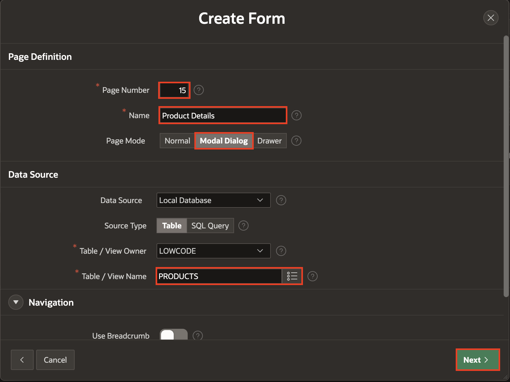
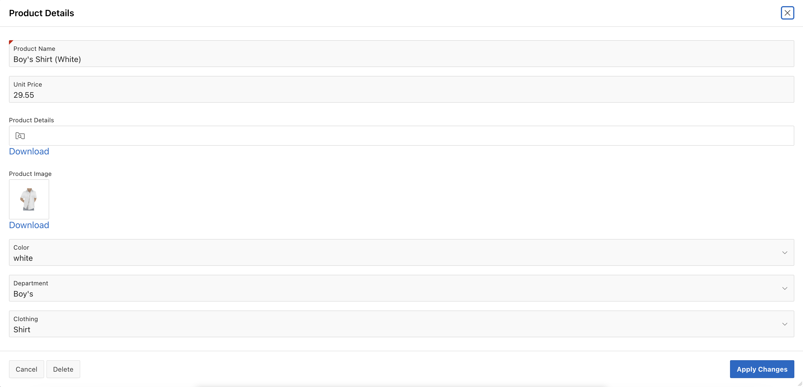

# Create and Use Forms

## Introduction

In this lab, you learn how to Create and Customize a Form, and then you link the Form to an Interactive Report.

Estimated Time: 5 minutes

### Downloads

- Did you miss out on trying the previous labs? Don't worry! You can download the Demo application from **[here](files/hol11-lab1.sql)** , Online shopping Application from **[here](files/hol11-lab2.sql)**and import it into your workspace. To run the app, please run the steps described in **[Get Started with Oracle APEX](https://livelabs.oracle.com/pls/apex/r/dbpm/livelabs/run-workshop?p210_wid=3509)** and **[Using SQL Workshop](https://livelabs.oracle.com/pls/apex/r/dbpm/livelabs/run-workshop?p210_wid=3524)** workshops.

## Task 1: Create a Product Details Form

1. Navigate to the **App Builder**. Click **Online Shopping Application**.

    

    

2. Now, click **Create Page**.

    

3. select **Form**.

    

4. For page attributes, enter/select the following:

    - Under Page Definition:

        - Page Number: **15**.

        - Name: **Product Details**

        - Page Mode: **Modal Dialog**

    - Data Source > Table/View Name: **PRODUCTS**.

    Click **Next.**

    

5. For **Primary Key Column1**, ensure the **PRODUCT_ID** is selected and click **Create Page**.

    

## Task 2: Link a Report to a Form

1. From **Page Designer** toolbar, navigate to page finder and select **Page 14**

    

2. In the **Rendering** tab (left pane), navigate to **Products**. Click **Attributes** and update the following:

    - Under **Link**:

        - Link Column: **Link to a Custom Target**

        - Click **No Link Defined** and enter/select the following:

            - Page: **15**.

            - Set Items:

            | Name             | Value        |
            | ---------------- | ------------ |
            | P15\_PRODUCT\_ID | #PRODUCT_ID# |

            - Clear Cache: **15**

            - Click **OK**.

    

3. Click **Save** and run the application. Navigate to **Administration** > **Manage Products** page in the runtime environment.

4. Now, in the **Manage Products** page, click **Pencil Icon** on the first row. Verify the **Product Details** model dialog page.

    

    

## Task 3: Enhance the Form

1. Navigate to the **Page 15** in the **Page Designer**.

    

2. Items can readily be moved using drag-and-drop within Layout. You can also drag new components like regions, items, and buttons into the Layout pane from the Gallery, located directly below it.

    In Page Designer, with **Page 15** loaded, within Layout (middle pane), click **P15\_UNIT\_PRICE** and continue to hold the mouse down. Drag the item to the right until it is directly after **P15\_PRODUCT\_NAME**, and a dark yellow box is displayed. Release the mouse to drop the item in the new location.

    

3. As an alternative to drag-and-drop, you can also reposition items using attributes in the Property Editor.

    In Page Designer, within Layout (or the Rendering tab in the left pane), select **P15\_DEPARTMENT\_ID** and **P15\_CLOTHING\_ID** In the Property Editor (right pane), Under Layout, toggle off **Start New Row**.

    

4. Select **P15\_COLOR\_ID, P15\_DEPARTMENT\_ID and P15\_CLOTHING\_ID** and update **Name** as following:

5. You now need to Focus on **First item on Page**. In **Page Rendering**(Left Pane), Select **Page 15: Product Details**. Then, In the **Property Editor**, Scroll down to the Navigation Menu and for **Cursor Focus**, select **First item on page**. Then, click **Save**.

   

6. Now that you have customized the Form. You can reload the **Manage Products** page in the runtime environment. Click on **Edit** to view the Form Page.

   

## Summary

You now know how to Create and Customize a Form and then link the Form to an Interactive Report. You may now **proceed to the next lab**.

## What's next

In the next lab, you learn how to make some pages publicly accessible, allowing users to access specific pages in your application without requiring them to log in.

## Acknowledgements

- **Author/Contributors** -  Roopesh Thokala, Senior Product Manager; Ankita Beri, Product Manager
- **Last Updated By/Date** - Ankita Beri, Product Manager, September 2024
