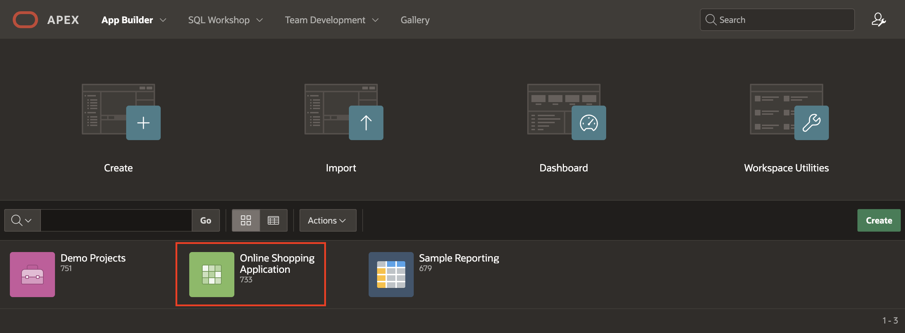
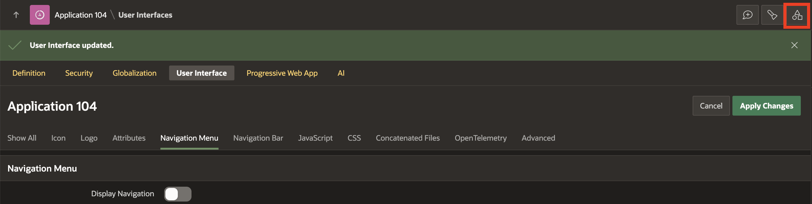
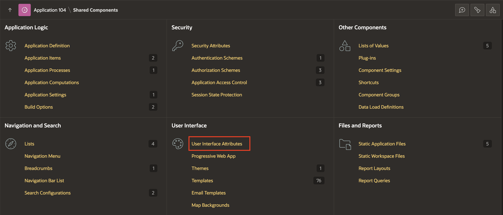
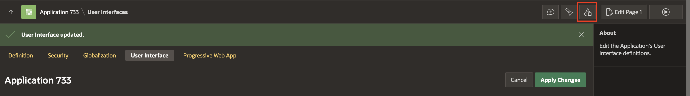
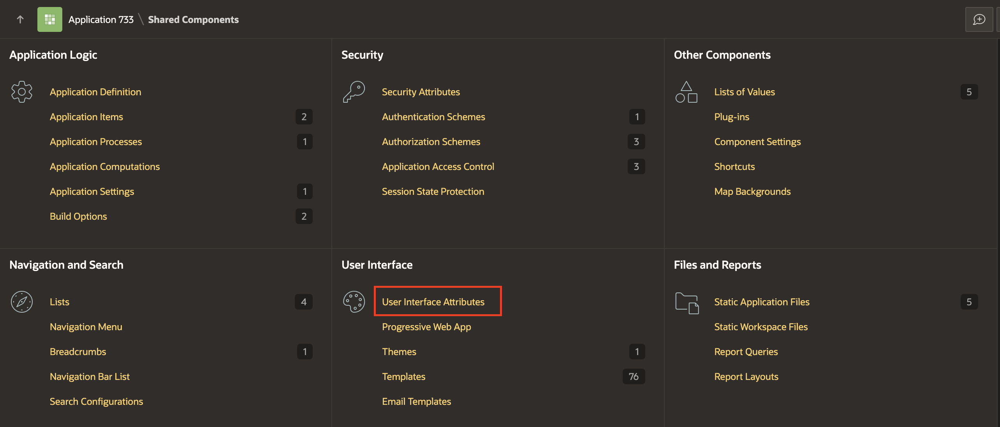
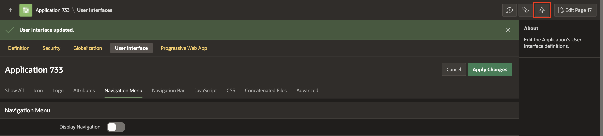
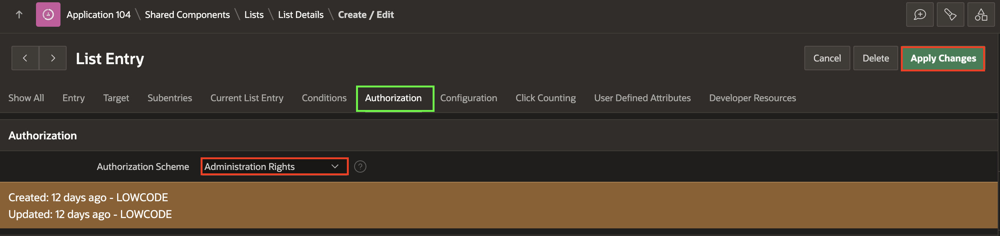
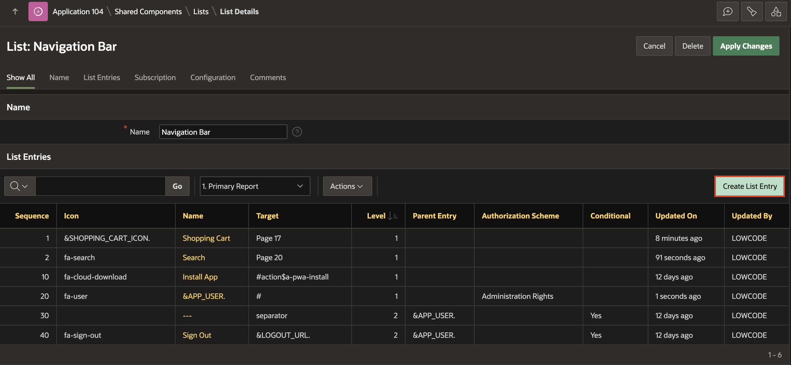

# Implement Navigation in your Application

## Introduction

In this lab, you will learn how to make some pages publicly accessible.

<!--
Watch the video below for a quick walkthrough of the lab.

-->

Estimated Time: 15 minutes

### Objectives
In this lab, you will:
- Set the following pages as public pages:
    - Products
    - Shopping Cart
    - Order Information

- Disable the Navigation Menu

- Enhance the Navigation Bar

### Downloads

- Did you miss out on trying the previous labs? Don't worry! You can download the application from **[here](files/hol12-.sql)** and import it into your workspace. To run the app, please run the steps described in **[Get Started with Oracle APEX](https://livelabs.oracle.com/pls/apex/r/dbpm/livelabs/run-workshop?p210_wid=3509)** and **[Using SQL Workshop](https://livelabs.oracle.com/pls/apex/r/dbpm/livelabs/run-workshop?p210_wid=3524)** workshops.

## Task 1: Set the Products page as the Home Page.

In this task, you will set the products page as  Homepage, then remove the **Home** page under the Navigation Menu.

1. Navigate to the **App Builder**. Then Click on **Online Shopping Application**.

    

    

2. Now, select **Shared Components**.

    

3. Under User Interface, click **User Interface Attributes**.

    

4. Now, Under **Attributes**, Select **≡** next to **Home URL**. Then, in the popup window, select **19 PRODUCTS** and click **Apply Changes**.

    

5. Since you have changed the **Home Page** to **Products** page. You must now remove the **Home** Page under the Navigation Menu.  
Navigate to **Shared Components**.

    

6. Under **Navigation and Search**, Select **Navigation Menu**.

    

7. Select **Navigation Menu**, then select **Pencil Icon** before **Home**.

    

    

8. In the **List Entry** page, Click **Delete** button and then Confirm Delete by clicking **OK**.

  

## Task 2: Set Pages to Public
Your customers don't need to log in to the app to shop for the products, so let's set the following pages as public:
- Page 19: Products
- Page 15: Order Information
- Page 16: Shopping Cart
- Page 17: Add to Cart
- Page 18: Search Customer Order Product Details

Follow these steps for the four listed pages:

1. From the runtime application, navigate to the **Products** page.

    In the Developer Toolbar, click **Edit Page 19**.

    

2. Within Page Designer, in the Rendering tree (left pane), navigate to  **Page 19: Products**.

    In the Property Editor (right pane), apply the following change:
    - Under the Security section:
        - For Authentication - select **Page Is Public**  

      

3. Click **Save**.

4. Navigate to Page Finder and select **Page 15** from the Dialog Page. Repeat steps 2-3.

    

5. Similarly, repeat steps 2-3 for **Page 16: Shopping Cart**, **Page 17: Add to Cart** and **Page 18: Search Customer Order Product Details**.

## Task 3: Remove the Navigation Menu
Since the home page is the Products page and this is a public access page, we do not need a navigation menu.
In this task, you will turn off displaying the navigation menu.

1. Within Page Designer, click the Shared Components icon at the top right.

    

   Alternatively, if you are in the App Builder, click Shared Components.

   

2. Under User Interface, click **User Interface Attributes**.

    

3. Click **Navigation Menu**.

4. Set Display Navigation to **Off**.

    

5. Click **Apply Changes**.

## Task 4: Enhance the Navigation Bar List

Add a new navigation bar entry to allow:
- Customers to go directly to the Shopping Cart
- Administrators to log in and access the administration page

1. Click the Shared Components icon at the top right.

    
2. Under Navigation, click **Navigation Bar List**.

    

3. Click **Navigation Bar**.

    

4. Click **Create Entry**.

    

5. In the **List Entry** page, enter the following:

    - For Sequence - enter **1**

    - For Image/Class - **&SHOPPING\_CART\_ICON.**

    - For List Entry Label - **Shopping Cart**

    - For Page - select **16**

    - For Clear cache - enter **16**

    

6. Scroll under **User Defined Attributes** and enter the following:

    - For 1. Badge Value - enter  **&SHOPPING\_CART\_ITEMS.**
    - For 2. List Item CSS Classes - enter **js-shopping-cart-item**

    

7. Click **Create List Entry**.

8. Click **Create Entry** again.

9. In the **List Entry** page, enter the following:

    - For Sequence - enter **2**

    - For Image/Class - **fa-search**

    - For List Entry Label - **Search**

    - For Page - select **18**

    - For Clear cache - enter **18**

10. Click **Create List Entry**.

11. Click the **Pencil Icon** before **&APP_USER.**

    

12. Under Authorization, for Authorization Scheme, select **Administration Rights**.

13. Click **Apply Changes**.

    

14. Click **Create Entry**  and enter the following:

     - For Sequence - enter **5**
     - For Image/Class - enter **fa-wrench**
     - For List Entry Label - enter **Administration**
     - For Page - select **10000**

    
    
15. Click **Create List Entry**.

    

<!--
You now know how to enhance and maintain the Navigation menu and Navigation bar. You may now **proceed to the next lab**.-->

## Summary
You now know how to set a page as public and manage the Navigation bar and Navigation menu. You may now **proceed to the next lab**.

## What's Next
In the upcoming hands-on lab, you will learn to Use a Theme roller to save a new Theme Style and how to import/export the theme styles.

## Acknowledgements
- **Author** - Roopesh Thokala, Product Manager
- **Contributor** - Ankita Beri, Product Manager
- **Last Updated By/Date** - Ankita Beri,  Senior Product Manager, January 2024
