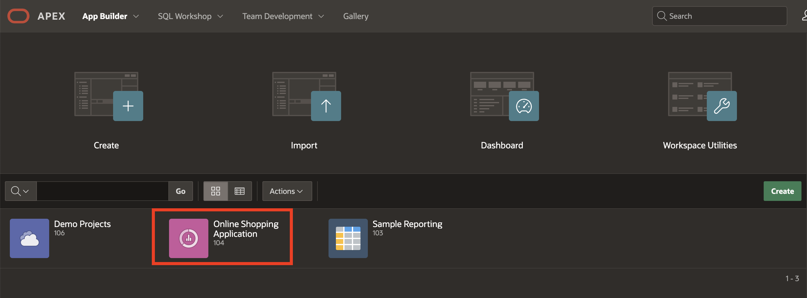
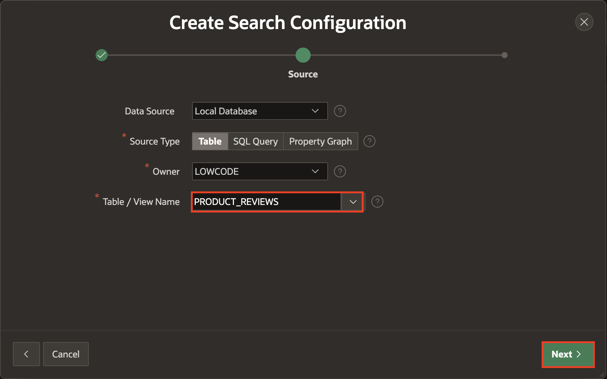

# Create Standard Search Configurations

## Introduction
In this lab, you will create two Standard search configurations based on two separate tables.

A search configuration contains information about a searchable data source. In this lab, you create two search configurations and then a search page using the Create Page Wizard. The first search configuration maps to the CUSTOMER_ORDER_PRODUCTS table. The second search configuration maps to the PRODUCT_REVIEWS table.

Estimated Time: 15 minutes

### Objectives
In this lab, you will:
- Implement two Search Configurations based on two different tables.
- Create a Search Page using the Create Page Wizard.

### Downloads

- Did you miss out on trying the previous labs? Don't worry! You can download the application from **[here](files/online-shopping-cart-8.sql)** and import it into your workspace. To run the app, please run the steps described in **[Get Started with Oracle APEX](https://livelabs.oracle.com/pls/apex/r/dbpm/livelabs/run-workshop?p210_wid=3509)** and **[Using SQL Workshop](https://livelabs.oracle.com/pls/apex/r/dbpm/livelabs/run-workshop?p210_wid=3524)** workshops.

## Task 1: Implement Standard Search Configurations

1. Click the **App Builder** icon on the Workspace home page.

2. Select an **Online Shopping application**.

    

3. On the Application home page, click **Shared Components**.

       

4. Under Navigation and Search, click **Search Configurations**.

    

5. Create the first search configuration that maps to the **CUSTOMER\_ORDER\_PRODUCTS** table: On the Search Configurations page, click **Create**.

    

6. On the Create Search Configuration modal dialog page, Enter the following details:

    - For Name: Enter **Search Order Details**.

    - For Search Type: Select **Standard**

    Click **Next**.

   

7. For Table/View Name: Select **CUSTOMER\_ORDER\_PRODUCTS** and Click **Next**.

   

8. Column Mapping:

     - For Primary Key Column: Select **ORDER\_ID**

     - For Title Column: Select **FULL\_NAME**

     - For Description Column: Select **ORDER\_STATUS**

    Click **Create Search Configuration**.

    

9. Under Column Mapping:

     - For Subtitle Column: Select **ITEMS**

   Click **Apply Changes**.

   

10. Create a second search configuration that maps to the **PRODUCT_REVIEWS** table:

    Click **Create** on the Search Configurations page.

11. On the Create Search Configuration modal dialog page, Enter the following details:

     - For Name: Enter **Search Product Reviews**.

     - For Search Type: Select **Standard**

    Click **Next**.

   

12. For Table/View Name: Select **PRODUCT_REVIEWS** and click **Next**.

   

13. Column Mapping:

     - For Primary Key Column: Select **PRODUCT\_NAME**

     - For Title Column: Select **PRODUCT\_NAME**

     - For Description Column: Select **REVIEW**

   Click **Create Search Configuration**.

   

## Task 2: Create a Standard Search Page
A Search page features a Search field and a Search Results region. Page Designer's Search Results region contains Search Sources, which map to the search configurations defined in Shared Components.

To create a search page by running the Create Page Wizard:

1. Navigate to the Application ID.

    

2. On the Application home page, click Create Page.

    

3. Under Component, select **Search Page**.

    

4. Under Page Definition, Enter the following:
     - For Page Number: Enter *18*
     - For Name: Enter **Search Customer Order Product Details**
     - For Search Configurations: Select the search configurations to be used by this page - **Search Customer Order Products and Search Product Reviews**

    Click **Create Page**.

    

    > **Note:** _Note: In the Rendering tab, notice the page item, P18\_SEARCH and the Search Results region. P18\_SEARCH is the search field which enables users to submit search terms. The Search Results region contains the search results and two Search Sources, which map to search configurations maintained in Shared Components. You can further refine and control the search display and behavior by editing attributes in the Property Editor._

5. Click Save and Run Page.

    

## Summary
You now know how to create a Standard Search Page and Search Configurations. You may now **proceed to the next lab**.

## Acknowledgements
- **Author** - Ankita Beri, Product Manager
- **Last Updated By/Date** - Ankita Beri, Product Manager, January 2024
