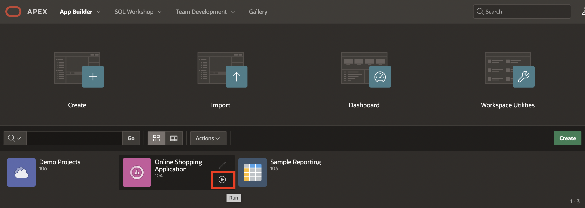

# Import and Export Theme Styles

## Introduction

In this lab, you use the Theme Roller to save a new Theme Style. Then, you enable end users to apply this style while running the application.

Estimated Time: 5 minutes

## Task 1: Use Themes and Theme Styles

In this task, you save a Theme Style by using the Theme Roller. Then, you enable end users to apply this style while running the application.

1. Navigate to **App Builder** and then run the **Online Shopping Application**. In the Developer Toolbar, click **Customize** and then select **Theme Roller**.

    

    

2. The current Theme Style is **Vita (Current)**. Under **Global Colors**, click the color swatch to select new colors.
    To edit a specific component, expand a group and select new colors or styling of the component you wish to edit.

    Modify the look by specifying colors of your choice and preview the changes. Once you are done, click **Save As** and **Save**.

    

3. Close the **Theme Roller** by clicking **X**. Click **App < n >** in the Developer Toolbar.

    

4. On the application home page, click **Shared Components**. Under User Interface, click **User Interface Attributes**.

    

    

5. Under **Attributes**, click **Enable End Users to Choose Theme Style**. Make sure this attribute is set to **On**.
Notice that the new Theme Style you saved is displayed under the Theme Style list. Click **Apply Changes**.

    

6. Now, run the application. At the bottom of the page, click the **Customize** link.

    

7. Users can specify their Theme Style while running the application using the customize dialogue. Select the Theme Style **Vita** and click **Apply Changes**.

    

8. The Theme Style is applied, and you see a message that says Preferences changed for user < username >.

    

## Task 2: Import and Export Theme Styles

The Theme Roller dialog appears, displaying the styles for your application. You can export and import style changes directly from Theme Roller by selecting the following options from the additional options menu: Import, Export, and Reset.

1. To import theme styles:
     - Select **Customize** from the Developer toolbar and then click **Theme Roller**.
     - From the Additional Options menu, select **Import**. A File Browser appears.

     You can download the theme-style JSON file from [**here**](files/vita-new.json) and import it into your application.

     

     - Navigate to the downloaded file to set the custom CSS code, variable style changes, add classes, and LESS compilation configuration to be applied to the current theme style.

     

     

2. To export theme styles:
   From the Additional Options menu, select **Export**. This option exports the current style configuration into a JSON file.

     

3. To reset theme styles:
   From the Additional Options menu, select **Reset**.
   This option reverts any unsaved theme style changes.

     

## Summary

In this lab, you applied a new theme style and created a custom "Hero" plug-in as a template component, enhancing the appearance and interactivity of your Oracle APEX application. Testing the application confirmed that the component integrated smoothly, giving you experience designing and deploying custom UI components. You may now proceed to the next lab.

## Acknowledgements

- **Author** - Roopesh Thokala, Senior Product Manager; Ankita Beri, Product Manager
- **Last Updated By/Date** - Ankita Beri, Product Manager, October 2024