# Create a Template Component Plug-in

## Introduction

In this lab, you start using the Theme Roller to set a new theme style, enhancing the application's appearance with a fresh layout and color scheme. After that, you'll create a plug-in as a template component called "Hero." This custom plug-in will be a visual and interactive component, allowing dynamic headers, descriptions, and search features to be integrated within an application page.

Estimated Time: 10 minutes

### Objectives

- Apply a new theme style to the application.

- Create and configure a plug-in as a template component.

- Customize the plug-in with attributes and slots.

- Integrate the plug-in within a page region to test its functionality.

## Task 1: Use Themes and Theme Styles

In the first task, you use the Theme Roller to apply a new theme style. This change will give your application a consistent look and feel, setting a strong visual foundation for the components you will add later.

1. Navigate to **App Builder** and then run the **Demo Projects**. In the Developer Toolbar, click **Customize** and then select **Theme Roller**.

    

    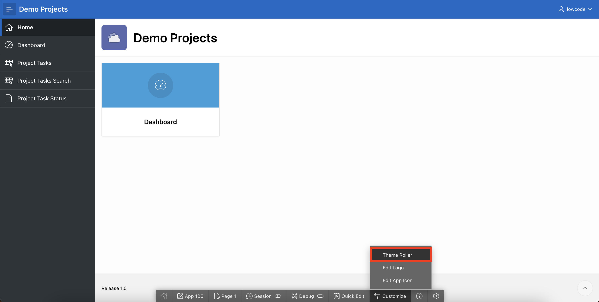

2. Under **Theme Roller**, enter/select the following:

    - Select Theme: **Redwood Light**

    - Redwood Options > Layout: **Floating**

    - Under **Appearance**:

        - Header: **Dark**

        - Body Header: **Dark**

        - Body Background: **Dark**

3. Click **Save As**.

    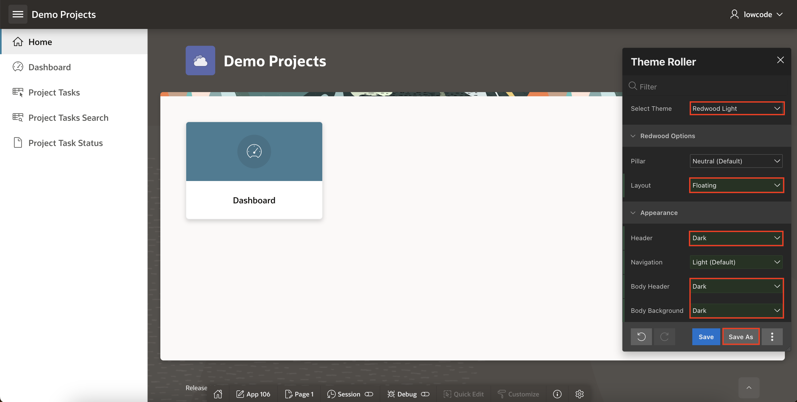

4. Click **Save**.

    

## Task 2: Create Plug-in

In this task, you will create a plug-in named "Hero." This plug-in will be a template component that can dynamically display headers, descriptions, and search fields, adding interactive elements to the application.

1. In **Demo Projects** application, navigate to **Shared Components**.

    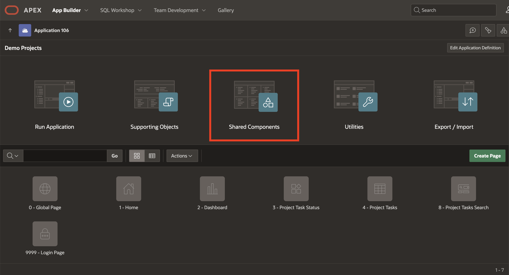

2. Under **Other Components**, select **Plug-ins**.

    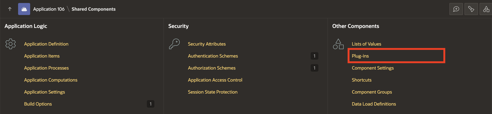

3. Click **Create**.

    

4. Under **Create Plug-in**, click **Next**.

    

5. Enter/select the following:

    - Under Name:

        - Name: **Hero**

        - Type: **Template Component**

    - Under Templates:

        - Available As: Check **Region Only**

        - Partial: Copy and paste the following:

        ```
        <copy>
        <div class="c-Hero #APEX$COMPONENT_CSS_CLASSES#" id="#APEX$DOM_ID#">
        <div class="c-Hero-body">
        {if OVERLINE/}<div class="c-Hero-overline">#OVERLINE#</div>{endif/}
        <h1 class="c-Hero-title">#APEX$TITLE#</h1>
        {if DESCRIPTION/}<div class="c-Hero-description">#DESCRIPTION#</div>{endif/}
        {if SEARCH/}
        <div class="c-HeroSearch" role="search">
        <div class="c-HeroSearch-input">#SEARCH#</div>
        {if CATEGORY/}<div class="c-HeroSearch-category">#CATEGORY#</div>{endif/}
        <div class="c-HeroSearch-checkbox">#SELECT_ALL#</div>
        {if ACTION/}<div class="c-HeroSearch-action">#ACTION#</div>{endif/}
        </div>
        {endif/}
        </div>
        </div>
       ```
       </copy>

6. Click **Create Plug-in**.

    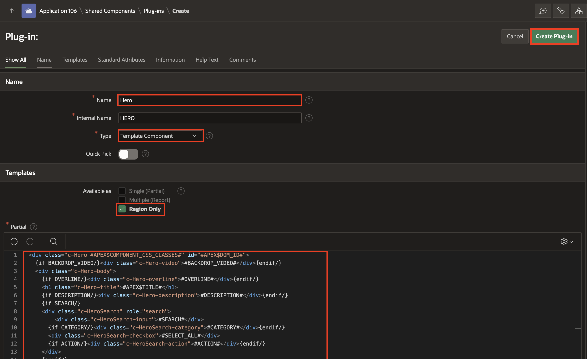

## Task 3: Enhance Template Component

In this task, you will customize the "Hero" plug-in by adding attributes. These attributes, like overline and description, will allow more dynamic control over how content appears in the component.

1. Navigate to **Hero** plug-in, under **Custom Attributes** , delete all the attributes one after the other.

    

2. First, select **Action** and click **Delete** and  confirm by clicking **OK**.

    

    

3. Now, delete all the attributes. After deleting, click **Add Attribute**.

    

4. Enter/select the following:

    - Name > Static ID: **OVERLINE**

    - Settings > Type: **Text**

    Click **Create and Create Another**.

    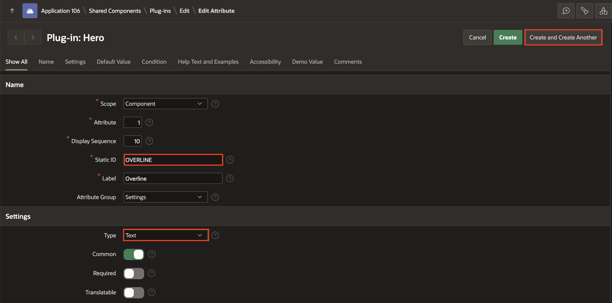

5. Enter/select the following:

    - Name > Static ID: **DESCRIPTION**

    - Settings > Type: **Textarea**

    Click **Create**.

    

## Task 4: Add Slots in Template Component

To make the "Hero" plug-in interactive, you will define slots at the Template Component level. This will allow developers to nest components inside Template Components in Page Designer.

1. Navigate to **Hero** plug-in, under **Slots** tab, click **Add Slot**.

    

2. Add the following four slots one after the other:

    | Name | Static Identifier | Items | Supported Items | Buttons |
    |------|------------------ | ----- | --------------- | --------|
    | Action | ACTION |    |      |  Check |
    | Category | CATEGORY | Check |  Select List |    |
    | Search | SEARCH | Check | Text Field |     |
    | Select All | SELECT_ALL | Check | Checkbox |    |

3. Click **Apply Changes**.

    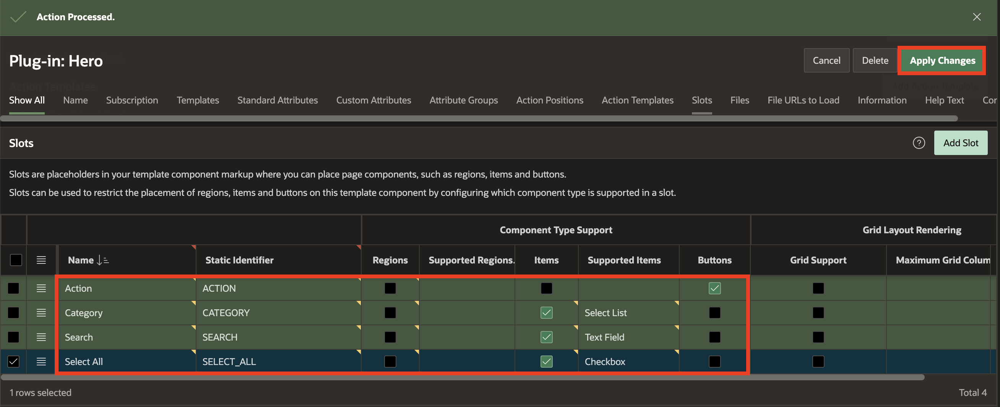

4. Navigate to **Hero** plug-in. Under **Default Slots**, for **Buttons**, select **Action**.

5. Under **File URLs to Load**, for **Cascading Style Sheet** enter **#PLUGIN_FILES#hero#MIN#.css**.

6. Click **Apply Changes**.

    

## Task 5: Add Template Component Region

With the plug-in configured, you will add it to the Project Task Status page as a region. This will allow you to test the component's behavior and appearance within an application page.

1. Navigate to **Application ID** and select **3 - Tasks Status**.

    

2. Right-click **Body** and select **Create Region**.

    

3. In the Property Editor, enter/select the following:

    - Under Identification:

        - Name: **Project Task**

        - Type: **Hero**

    

4. Drag **Project Task** hero region above **Selection Support** region.

    

5. In the Property Editor, navigate to **Attributes** tab and enter/select the following:

    - Appearance > CSS Classes: **color-us-5**

    - Under Settings:

        - Overline: **Get Started**

        - Description: **Organize, prioritize, and complete tasks seamlessly!**

    

6. Right-click **Project Task** region and select **Create Page Item**.

    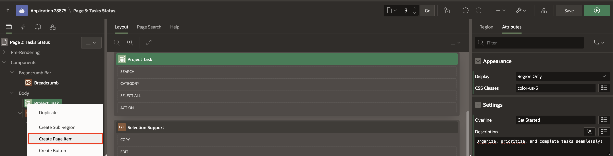

7. In the Property Editor, enter/select the following:

    - Identification > Name: **P3_SEARCH**

    - Label > Label: **Search**

    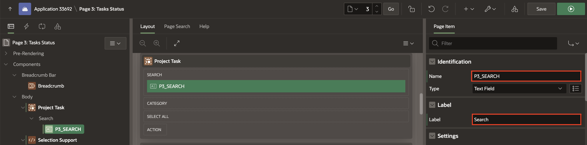

8. Now, drag **P3_STATUS** under **Project Task** region and in the Property Editor, update **Label** to **Update Status to**.

    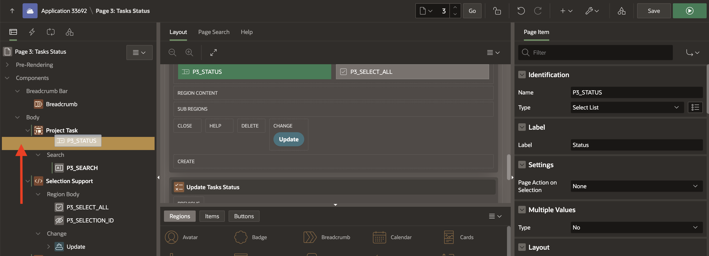

    

9. Also, drag **P3\_SELECT\_ALL** and **Update** button under **Project Task** region.

    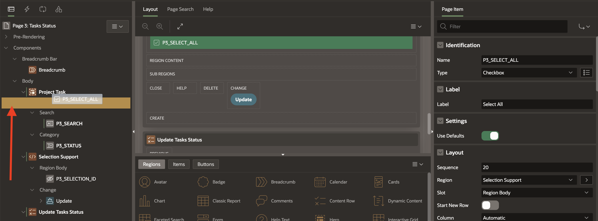

    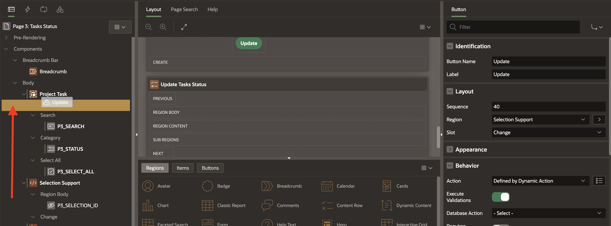

10. Select **P3\_SELECTION\_ID** and drag it under the **Update Tasks Status** region.

    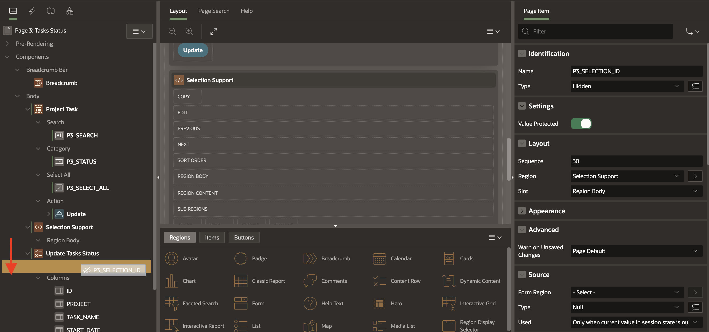

11. Right-click **Selection Support** region and select **Delete**.

    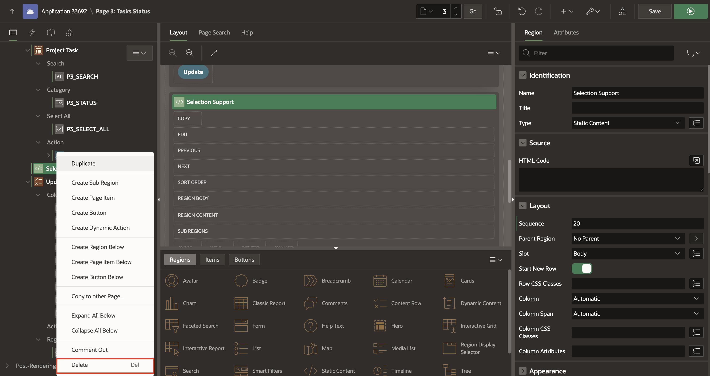

12. Select **Update Task Status** region and in the Property Editor, enter/select the following:

    - Under Source:

        - Type: **SQL query**

        - SQL Query: Copy and replace with the following code:

        ```
        <copy>
        SELECT
            ID,
            PROJECT,
            TASK_NAME,
            START_DATE,
            END_DATE,
            STATUS,
            ASSIGNED_TO,
            COST,
            BUDGET
            FROM
        DEMO_PROJECTS
        WHERE
        ( UPPER(TASK_NAME) LIKE '%'
                            || UPPER(:P3_SEARCH)
                            || '%'
        OR UPPER(PROJECT) LIKE '%'
                             || UPPER(:P3_SEARCH)
                             || '%'
        OR ( TASK_NAME IS NULL
           AND PROJECT IS NULL ) );
        </copy>
        ```

    

13. Right-click **Breadcrumb** and select **Delete**.

    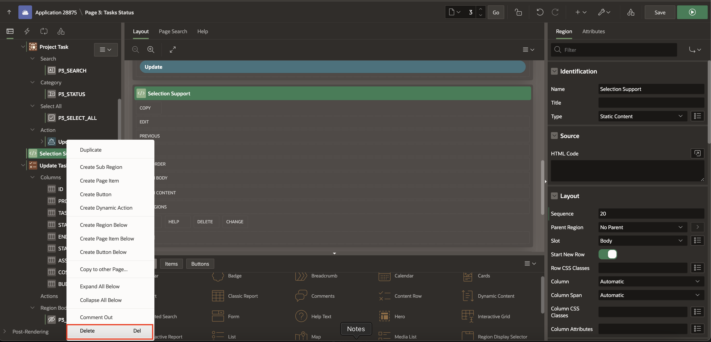

14. Select **P3_SEARCH**, in the Property Editor, and update the following:

    - Appearance > Value Placeholder: **Search Project, Task Name**

    

15. Click **Save and Run**.

## Task 6: Run the Application

Finally, you'll test the "Hero" plug-in and its functionality by running the application. This will help verify that the component displays correctly and that interactive elements like search and update work as expected.

1. Log in to the application and navigate to **Task Status**.

2. On **Search** textfield type **system**, for **Update Status to**, select **Open**. Check the rows you want to update status as **Open**, or you can also check the **Check All** checkbox to update all the rows. Lastly, press **Enter** and click **Update** to update the status of checked rows.

    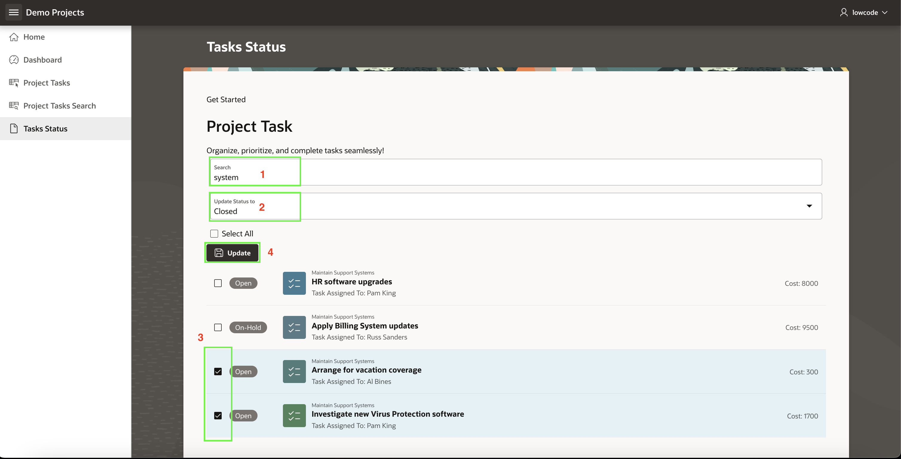

3. Wohla, now you can see the updated status for checked rows.

    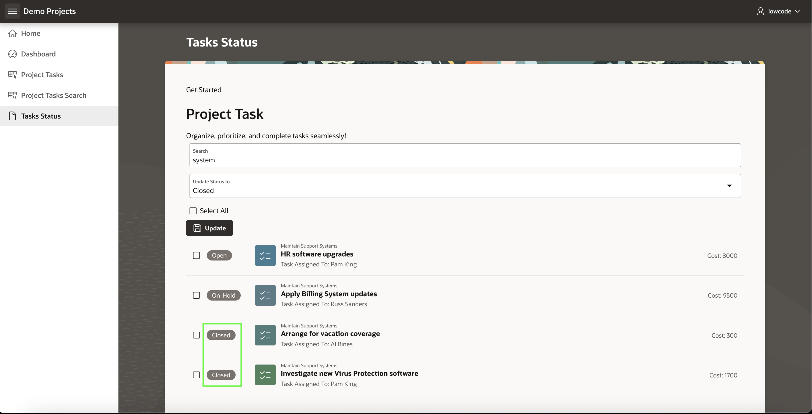

## Summary

In this lab, you applied a new theme style and created a custom "Hero" plug-in as a template component, enhancing the appearance and interactivity of your Oracle APEX application. Testing the application confirmed that the component integrated smoothly, giving you experience designing and deploying custom UI components. You may now proceed to the next lab.

## Acknowledgements

- **Author** - Roopesh Thokala, Senior Product Manager; Ankita Beri, Product Manager
- **Last Updated By/Date** - Ankita Beri, Product Manager, October 2024
