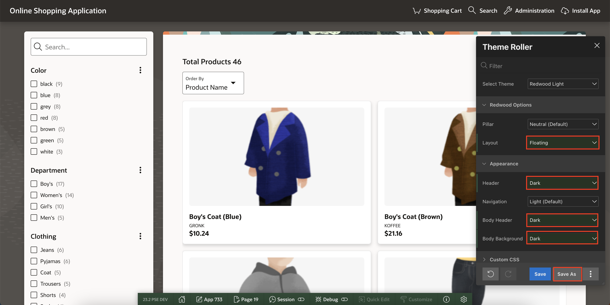
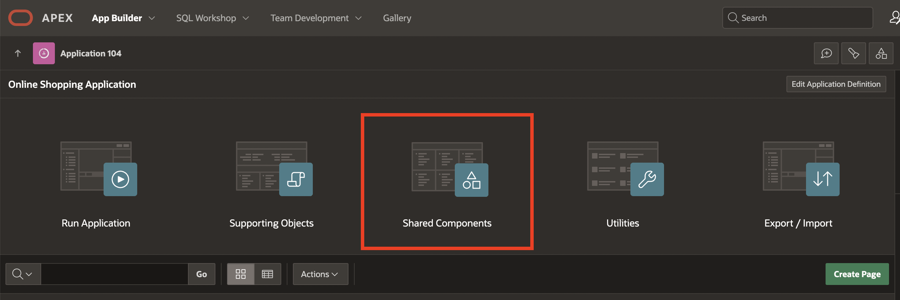
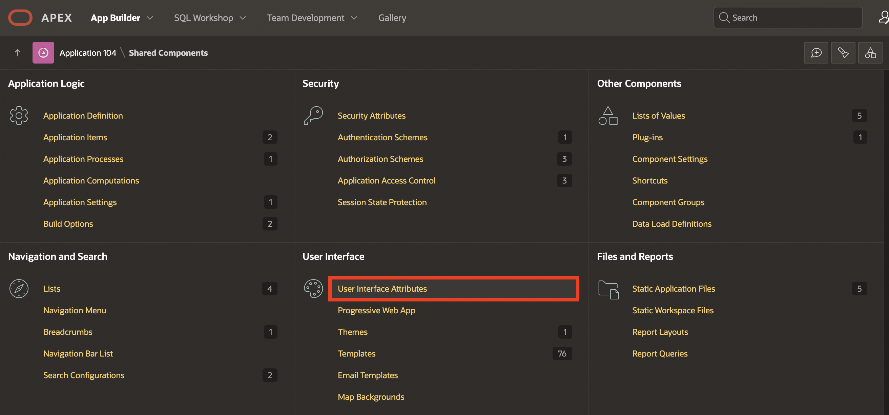
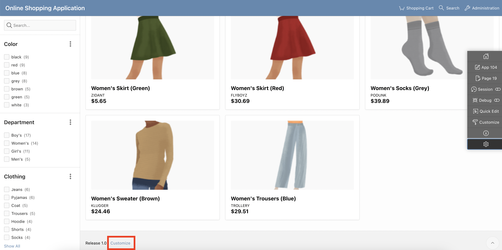
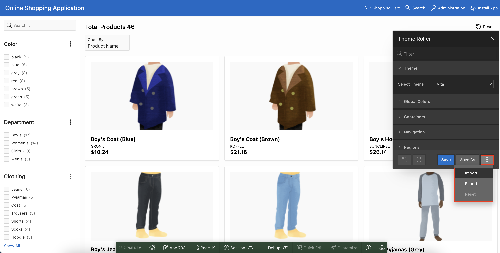
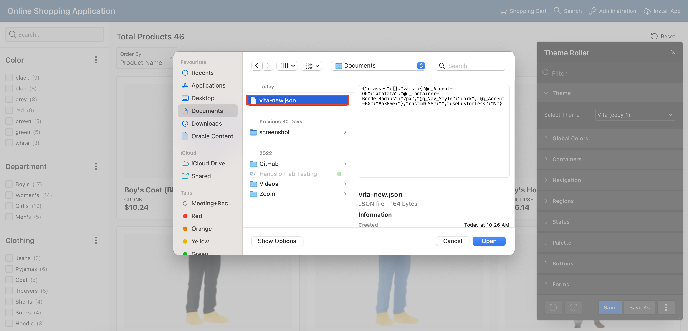
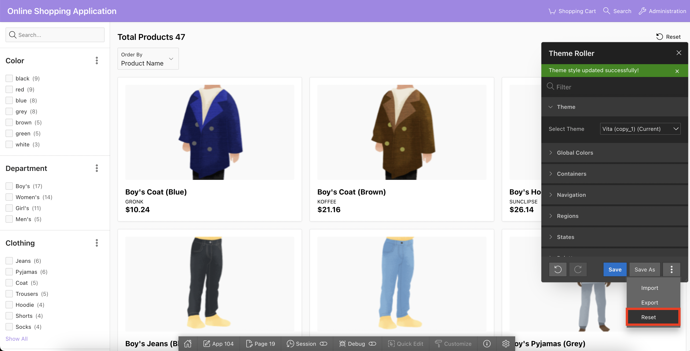

# Use Themes and Theme Styles

## Introduction

In this lab, you use the Theme Roller to save a new Theme Style. Then, you enable end users to apply this style while running the application.

Estimated Time: 10 minutes

<!--
Watch the video below for a quick walk through of the lab.

### Objectives
In this lab, you will:
- Set the following pages as public pages:
    - Products
    - Shopping Cart
    - Order Information

- Disable the Navigation Menu

- Enhance the Navigation Bar -->

### Downloads

- Did you miss out trying the previous labs? Don’t worry! You can download the application from **[here](files/online-shopping-cart-9.sql)** and import it into your workspace. To run the app, please run the steps described in **[Get Started with Oracle APEX](https://apexapps.oracle.com/pls/apex/r/dbpm/livelabs/run-workshop?p210_wid=3509)** and **[Using SQL Workshop](https://apexapps.oracle.com/pls/apex/r/dbpm/livelabs/run-workshop?p210_wid=3524)** workshops.  

## Task 1: Use Themes and Theme Styles

In this hands-on lab, you use the Theme Roller to save a Theme Style. Then, you enable end users to apply this style while running the application.

1. Navigate to **App Builder** and then run the **Online Shopping Application**. In the Developer Toolbar, click **Customize** and then select **Theme Roller**.

  

2. The current Theme Style is **Vita**. Under **Global Colors**, click the color swatch to select new colors.
To edit a specific component, expand a group and select new colors or styling of the component you wish to edit.

  Modify the look by specifying colors of your choice and preview the changes. Once you are done, click **Save As** and **Save**

  

3. Under **Theme**, change the **Select Theme** to **Redwood Light**

  

4. For Theme Attributes, enter the following:  
    Under **Redwood Options**:
    - For Layout, select **Floating**.  
    Under **Appearance**:
    - For Header, Select **Dark**.
    - For Body Header, Select **Dark**.
    - For Body Background, Select **Dark**.  
    click **Save As**.

    

5. In the Save As dialog, enter **Redwood Light (Copy_1)** for Style Name and click **Save**.

    

6. Close the **Theme Roller** by clicking **X**. Click **App < n >** in the Developer Toolbar.

    

7. In the application home page, click **Shared Components**. Under User Interface, click **User Interface Attributes**.

    

    

8. Under **Attributes**, click **Enable End Users to Choose Theme Style**. Make sure this attribute is set to **On**.
Notice that the new Theme Style you saved is displayed under Theme Style list. Click **Apply Changes**.

    

9. Now, run the application. At the bottom of the page, click the **Customize** link.

    

10. Using the Customize dialog, users can specify their Theme Style while running the application. Select the Theme Style that you saved in step 3 above and click Apply Changes.

    

11. The Theme Style is applied, and you see a message that says Preferences changed for user < username >.

    

## Task 2: Import and Export Theme Styles
The Theme Roller dialog appears displaying the styles for your application. You can export and import style changes directly from Theme Roller by selecting the following options from the Additional Options menu: Import, Export, and Reset.

1. To import theme styles:
     - From the Additional Options menu, select Import. A File Browser appears.

     You can download the theme style json file from **[here](files/vita-new.json)** and import it into your application.

     

     - Navigate to the downloaded file to set to set the custom CSS code, variable style changes, add classes and LESS compilation configuration to be applied to the current theme style.

     

     

2. To export theme styles:
   From the Additional Options menu, select Export.This option exports the current style configuration into a JSON file.

     

3. To reset theme styles:
   From the Additional Options menu, select Reset.
   This option reverts any unsaved theme style changes.

     

## Summary
You now know how to use the Theme Roller to save a new Theme Style. You may now **proceed to the next lab**.

## Acknowledgements
- **Author** - Roopesh Thokala, Senior Product Manager
- **Contributor** - Ankita Beri, Product Manager
- **Last Updated By/Date** - Ankita Beri, Product Manager, January 2024
