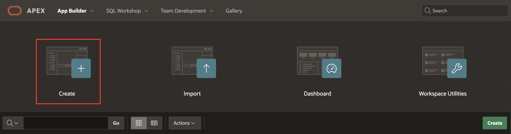
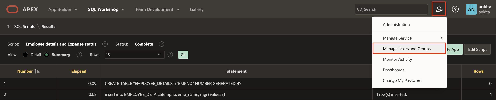
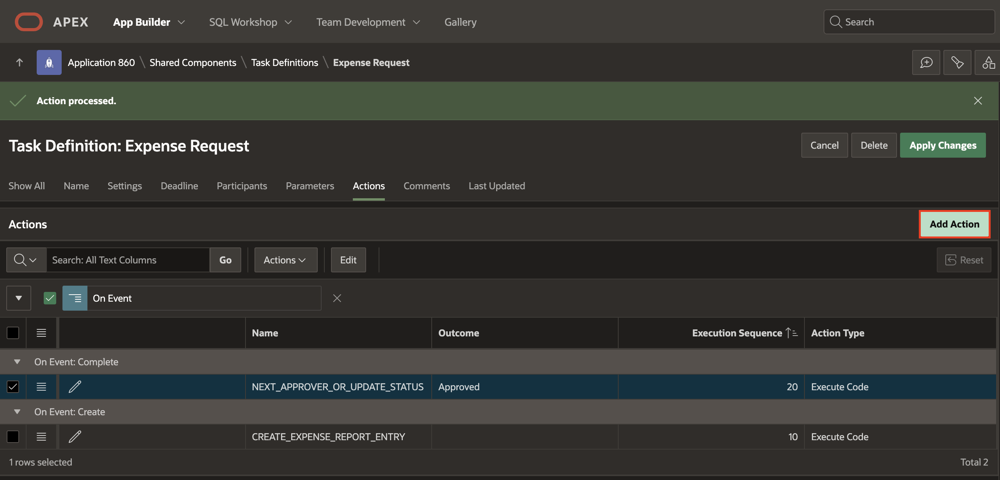
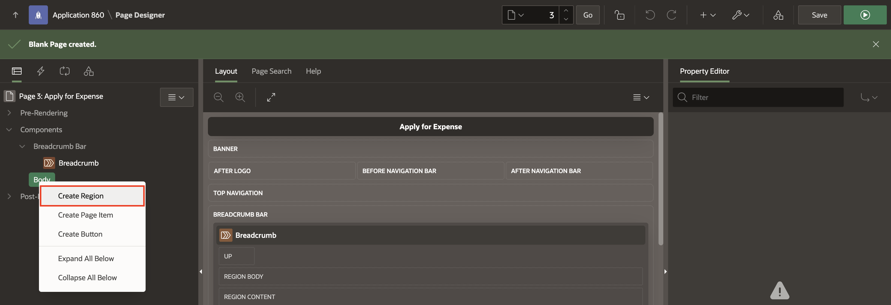
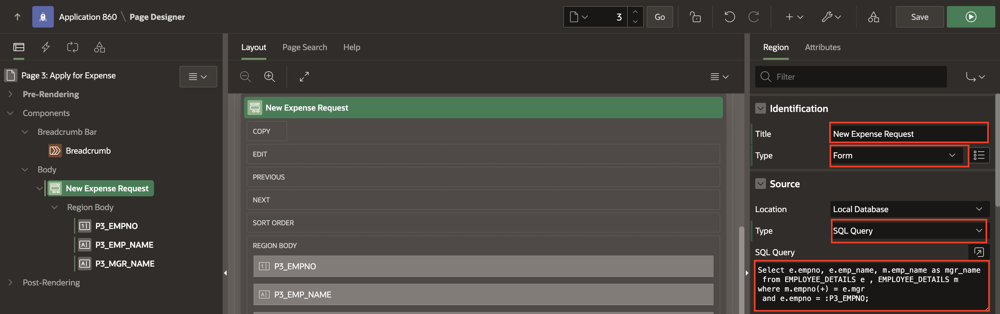
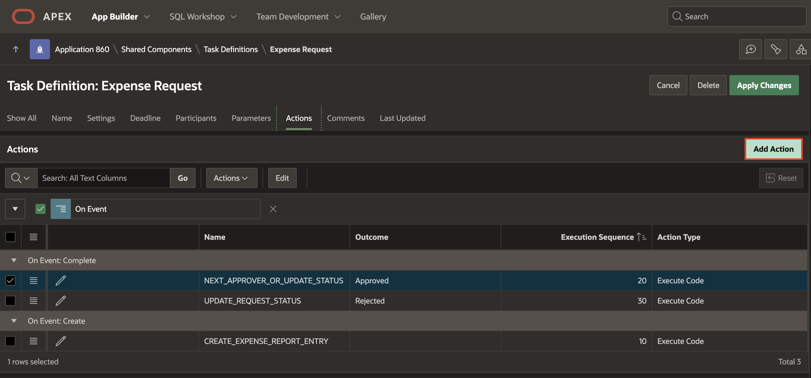
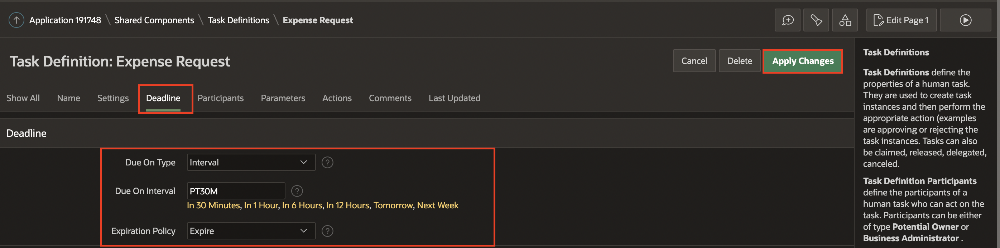
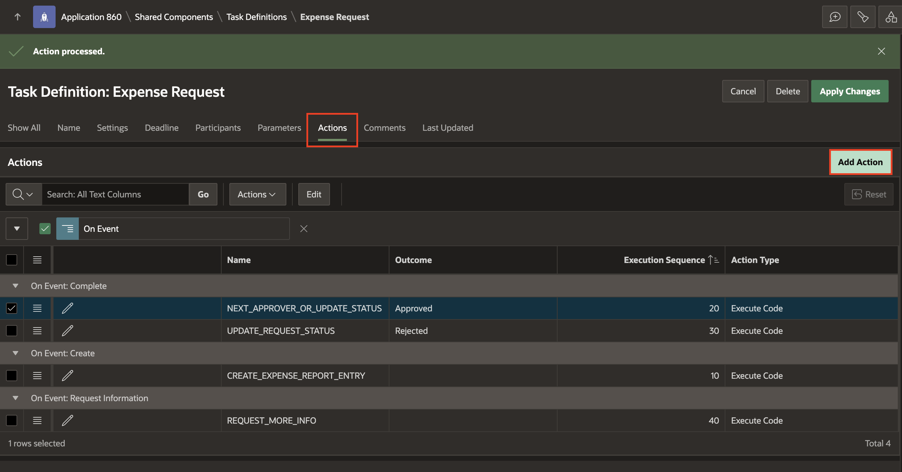

#  Extend Application Capabilities

## Introduction

In this workshop, you will create an application that allows you to manage expenses using the approvals component. To explain the concepts and terms associated with Approval Management in APEX, we take the example of the Expense Tracker Application.

To apply for an expense, an employee logs into the application and submits an expense request filling in the Type (Accommodation/Conference/Internet/ Miscellaneous Expenses) and total Expenses. The task could be assigned to multiple potential owners, and then they can perform possible actions (Request information/Delegate/Release/Change Priority).

If the expense cost is more than 50000, then the Expense request, once approved by the immediate manager, will go to the next manager and so on, depending on the Expense amount. This is a typical use case for a multi-level approval.

Also, Deadlines and Expiration are set for a task. The potential owner will get an Email before 5 mins of task expiration. If the task is not approved or rejected before the expiry, then the task could be tagged as Expired.

Estimated Time: 1 hour

### Objectives
In this lab, you will:
- Obtain a free development environment
- Learn how to create a SQL Script
- Learn how to create a Task definition
- Learn how to create a Page to submit Expense
- Learn how to create a Unified Task List
- Learn how to create Users
- Learn how to create an Email Template
- Learn how to Request Information/ Delegate/ Release
- Learn how to set deadlines and expiration

## Task 1: Create the Application
In this lab, you create a new application named Expense Tracker.

1. If you have not already logged into your Oracle APEX workspace, sign in using the workspace name, email, and password you signed up with.

    

2. At the top left of your workspace, click App Builder.

    

3. On the App Builder page, click the Create button.

    

4. Click New Application.

    

5. In the Create an Application wizard, set Name to Expense Tracker.

6. Click Create Application to create your app and go to the application home page.

    

## Task 2: Create a SQL Script
In this lab, you create database objects using SQL Script.

1. At the top of the application home page, click SQL Workshop and then SQL Scripts. The SQL Scripts page appears.

    

2. Click the Create Button. The Script Editor appears.

    

3. In the Script Name, enter a name for the script - Employee details and Expense status.

4. Enter the SQL statements.

 Copy the code below and paste it into  the code editor:
  ```
  <copy>
  CREATE TABLE "EMPLOYEE_DETAILS"
  ("EMPNO" NUMBER GENERATED BY DEFAULT ON NULL
  AS IDENTITY MINVALUE 1 MAXVALUE 9999999999999999999999999999
  INCREMENT BY 1 START WITH 8000 CACHE 20 NOORDER  NOCYCLE  NOKEEP  NOT NULL ENABLE,
  "EMP_NAME" VARCHAR2(10),
  "MGR" NUMBER(4,0),
  CONSTRAINT "EMP_PK" PRIMARY KEY ("EMPNO"));
  insert into EMPLOYEE_DETAILS(empno, emp_name, mgr) values (10, 'JOHN', 30);
  insert into EMPLOYEE_DETAILS(empno, emp_name, mgr) values (20, 'CLARA',30);
  insert into EMPLOYEE_DETAILS(empno, emp_name, mgr) values (30, 'JANE', 40);
  insert into EMPLOYEE_DETAILS(empno, emp_name, mgr) values (40, 'MATT', null);
  commit;
  CREATE TABLE "EMP_EXPENSE_REQUEST"
  ("REQ_ID" NUMBER GENERATED BY DEFAULT ON NULL
  AS IDENTITY MINVALUE 1 MAXVALUE 9999999999999999999999999999
  INCREMENT BY 1 START WITH 8000 CACHE 20 NOORDER NOCYCLE NOKEEP NOT NULL ENABLE,
  "EMP_NO" VARCHAR2(10),
  "EXPENSE_TYPE" VARCHAR2(25),
  "ESTIMATED_COST" NUMBER(8,0),
  "UPDATED_BY" VARCHAR2(100),
  "STATUS" VARCHAR2(20),
  CONSTRAINT "EMP_EXPENSE_REQUEST_PK" PRIMARY KEY ("REQ_ID"));  
  </copy>
  ```

5. Click Run and Run Now. Now you can see that SQL statements run successfully.

  

  

  

## Task 3: Add Users
   In this lab, you create users for multi-level management.

  1. Navigate to the Administration icon beside search and select **Manage Users and Group** from the dropdown list.

     

  2. Click **Create Multiple Users**

     

  3. Specify the following attributes:

     - For a List of Email Addresses: Type MATT@oracle.com, JANE@oracle.com, CLARA@oracle.com, JOHN@oracle.com

     - For Usernames : Select **Exclude @ domain as part of the username**

     - For password and Confirm Password: Enter a password of your wish

  4. Click **Next** and **Create Valid Users**


  

## Task 4: Create a Task Definition

Create a task definition to configure task parameters, participants, actions, and due dates for an expense request

To create a task definition:

1. In the App Builder, navigate to Expense Tracker and select shared components.

 

2. Under Workflows and Automations, select Task Definitions.

    

3. Click **Create**.

   

4. Specify the task definition name and define the metadata.

   - For Name - Enter **Expense Request**

   - For Subject - Enter &EXPENSE_TYPE. Expense request for &EMP_NAME.

   - For Static ID - Enter **EXPENSE_REQUEST**

   - For Priority - Select 2-High

   Leave Business Administrator and Potential owner blank for now.

5. Click **Create**.

   


6. Under **Settings** Section:

    - For Task details Page Number - Click on **Create Task Details Page** button then click **OK**

    - For Actions Source - Select SQL Query.

    - For Actions SQL query - Copy the code below and paste it into  the code editor:  
    ```
    <copy>
   select EMP_NAME from employee_details where EMPNO =(select MGR from employee_details where EMPNO=(select EMPNO from employee_details where EMP_NAME=:APP_USER))
   </copy>
   ```

  

7. **Under Participants** Section - Select Participants to assign additional people to the Task Definition.
   - Click Add Row.

   - For Participant Type - Select **Potential Owner**

   - For Value Type - Select **SQL Query**

   - For Value - Copy the code below and paste it into  the code editor

   ```
   <copy>
     select EMP_NAME from employee_details where EMPNO =(select MGR from employee_details where EMPNO=(select EMPNO from employee_details where EMP_NAME=:APP_USER))
   </copy>
   ```

   - Click **Apply Changes** to save all existing changes.

   

8. Click on the task definition - **Expense Request** to continue editing.

   

9. **Under Parameters** Section - Select Add Row and fill in the 4 parameter fields listed below:

     | Static ID |  Label  | Data Type
     | --- |  --- | --- |
     | ESTIMATED_COST | Estimated Cost | String |
     | EXPENSE_STATUS | Expense Status | String |
     | EXPENSE_TYPE | Expense Type | String |
     | EXPENSE_TYPE | Req Id | String |

     

9. Under **Actions** Section, Click **Add Action** button

   

   Specify the following:

    - For Name - Enter **CREATE_EXPENSE_REPORT_ENTRY**

    - For Type - Select Execute Code

    - On Event - Select Create

    - For Code: Copy the code below and paste it into  the code editor:

    ```
    <copy>
         declare
           l_req_id number;
    begin
    if :APP_USER = :EMP_NAME then --this is the original initiator
        l_req_id := :APEX$TASK_ID;
        -- create a new record in the Employee Expense Request table EMP_EXPENSE_REQUEST
        insert into EMP_EXPENSE_REQUEST values
        (to_number(l_req_id),
        :EMPNO,
        :EXPENSE_TYPE,
        :ESTIMATED_COST,
        '',
       'PENDING');
    end if;
    end;
    </copy>
    ```
    - Click **Create** to save Create Event Action.

  

10. To Add the next action, Click **Add Action** button.

   

    Specify the following:

      - For Name - Enter **NEXT_APPROVER_OR_UPDATE_STATUS**

      - For Type - Select Execute Code

      - On Event - Select Complete

      - For Outcome : Select Approved

      - For Code: Copy the code below and paste it into  the code editor:

```
    <copy>
    declare
    l_mgr number;
    l_task_id number;
    l_request_id number;
    l_req_status varchar2(10) :='PENDING';
 Begin
    if :APP_USER = :MGR_NAME then --this is the first approver
       -- set the request id to be the id of the task created when the request was submitted
       l_request_id := :APEX$TASK_ID;
    else
       -- this is an intermediate approver. Set the request-id from the corresponding task parameter value
       l_request_id := :REQ_ID;
    end if;
    if  :ESTIMATED_COST < 50000 then -- the approval is complete

        update EMP_EXPENSE_REQUEST set status = 'APPROVED', updated_by=updated_by||'->'||:APP_USER
         where req_id = l_request_id and emp_no=:APEX$TASK_PK;

        l_req_status := 'APPROVED';
    else -- the request needs to go through another level of Approval
        -- updated the request record with details of the current approver in the chain of approvers
        update EMP_EXPENSE_REQUEST set updated_by = updated_by||'->'||:APEX$TASK_OWNER
         where req_id = l_request_id
           and emp_no=:APEX$TASK_PK;
  -- create a new task assigned to the manager of the current approver
        l_task_id := apex_approval.create_task(
            p_application_id => :APP_ID,
            p_task_def_static_id => 'EXPENSE_REQUEST',
            p_initiator => :EMP_NAME, -- ensure initiator is the original requestor and not the current task owner
            p_parameters => apex_approval.t_task_parameters(
                1 => apex_approval.t_task_parameter(static_id => 'EXPENSE_TYPE', string_value => :EXPENSE_TYPE),
                2 => apex_approval.t_task_parameter(static_id => 'ESTIMATED_COST', string_value => :ESTIMATED_COST),
                3 => apex_approval.t_task_parameter(static_id => 'REQ_ID',      string_value => l_request_id),
                4 => apex_approval.t_task_parameter(static_id => 'STATUS',      string_value => l_req_status)
        ),
        p_detail_pk => :APEX$TASK_PK
    );
    end if;
end;
</copy>
```

  Click **Create** to add action.

  

  

11. Again, Click  **Add Actions** button.
   

   Specify the following:

    - For Name - Enter **UPDATE_REQUEST_STATUS**

    - For Type - Select Execute Code

    - On Event - Select Complete

    - For Outcome  - Select Rejected

    - For Code: Copy the code below and paste it into  the code editor:
    
  ```
  <copy>
  declare
    l_mgr number;
    l_task_id number;
    l_request_id number;
    l_req_status varchar2(10) := 'PENDING';
begin
    select mgr into l_mgr from employee_details where emp_name=:APP_USER;
    if :APP_USER = :MGR_NAME then --this is the first approver
        l_request_id := :APEX$TASK_ID;
    else
        l_request_id := :REQ_ID;
end if;-- the request is complete and rejected.
update EMP_EXPENSE_REQUEST set status = 'REJECTED', updated_by=updated_by||'->'||:APP_USER
 where req_id = l_request_id and emp_no=:APEX$TASK_PK;
end;
</copy>
```

  - Click **Create** and **Apply Changes**

   

   

   


## Task 5: Create a Page to Apply for Expense
Add a page to Submit an Expense request.

1. Click Application ID, Application home page appears.

   

2. Click Create Button, create page wizard appears.

    

3. Select **Blank page** under component and click **Next**

    

4. Specify Blank Page Attributes.

   Under **Page Definition** Section:

   - For Page Number - Type 3

   - For Name        - Enter Apply for Expense

   - For Page Mode   - Select Normal   

   Under **Navigation** Section:

   - For Use Breadcrumb - Select On

   - For Breadcrumb Parent Entry - Select Home(Page 1)

   - For Use Navigation - Select On

   - For Navigation Preference - Select Create a new Entry

   - For Icon  - Enter 'fa-file-o'

   Click **Create Page**.

 

5. Now, In the left pane, select the Rendering tab. Right-click an existing container to display the context menu. From the context menu, select **Create Region**.

 

6. In the Property Editor, edit the appropriate attributes:

   Under **Identification** section:

    - For Title: Enter New Expense Request

    - For Type: Select Form

  Under **Source** section:

     - For Type: Select SQL Query

     - For SQL query: Copy the code below and paste it into  the code editor:
```
     <copy>
    Select e.empno, e.emp_name, m.emp_name as mgr_name
      from EMPLOYEE_DETAILS e , EMPLOYEE_DETAILS m
     where m.empno(+) = e.mgr
      and e.empno = :P3_EMPNO;
    </copy>
```    


7. Now, right-click the region (**New Expense Request**) and select Create Page Item.

  - For Name - Enter P3_EXPENSE_TYPE

  - For Type - Select, Select List

  Under **List of Values** section:

   - For Type - Select Static values

   - For Static Values - Enter below list and click OK
| Display Value |  Return Value  |
| --- |  --- |
| Internet/Broadband Charges | Internet/Broadband Charges |
| Accommodation | Accommodation |
| Conference | Conference |
| Misc. Expenses | Misc. Expenses |

   - For Null Display Value - Enter text ' --Select Expense Type--'

   

8. Right-click region (**New Expense Request**) and select Create Page Item.

    - For Name - Enter P3_ESTIMATED_COST

    - For Type - Select Number Field

9. Select the **P3_EMPNO** page item and enable the primary key.

  

    Click **Save** to apply changes.

10. On the Rendering tab (left pane). Under Pre-Rendering, Right-click **Before Header** and click **Create Process**.

 

  In the Property Editor, enter the following:

     - For Name - Type Fetch Employee Details for User

     - For Type - Select Execute code

     - For PL/SQL Code - Enter the following PL/SQL code:

  ```
   <copy>
  select empno into :P3_EMPNO
    from employee_details
  where emp_name=:APP_USER;
  </copy>
  ```
  

     - For Sequence - Enter 5

  

11. Click **Save**.

12. Now add a process on the **Processing tab** to submit a request. Right-click Processing and click **Create Process**.

 

   In the Property Editor, enter the following:

   - For Name - Type Submit Expense request

   - For Type - Select Human Task - Create

  Under **Settings** Section:

   - For Definition - Select Expense request

   - For Details Primary key Element: Select P3_EMPNO

   - For Success Message: Type Expense Request submitted successfully.

 

13. Under Parameters for Submit Expense request process:

    - For  Estimated Cost, enter the following:

      - For Type - Select ITEM

      - For Value - Select **P3_ESTIMATED_COST**

    

    -  For  Expense Status, enter the following:

     - For Type - Select Static Value

     - For Value - Type **PENDING**

     

  - For  Expense Type, enter the following:

     - For Type - Select ITEM

     - For Value - Select **P3_EXPENSE_TYPE**

     

 - For  Request ID, enter the following:

     - For Type - Select NULL

 

  14. Click **Save**

  15. On Rendering tab, Right-click Body and select **Create Button**.

 

 In the Property Editor, enter the following:

   - For Button Name - Type **SUBMIT_REQUEST**

   - For Hot - Select On

 

 16. Navigate to Processing tab, Select Process **Submit Expense Request**.

     Under **Server-Side Condition** Section:

        - For When Button Pressed : Select **SUBMIT_REQUEST**        

 

 17. Click **Save**.

## Task 6: Create Unified Task Lists
Add a Unified Task list page to see the submitted expense request list by a requestor and the Approval list approved or rejected by the approver.

1. Click Application ID on the right-above corner of the page designer. Application Home page appears.

 

2. Click **Create** button. Create Application wizard appears.

 

3. Under Components, Select Unified Task List.

 

4. Specify the following page attributes:

   - For Page Number - Type 4

   - For Name - Type **My Approvals**

   - For Report Context - Select **My Tasks**

   Click **Create Page**. A unified Task List page was created.

      

5. To create another Unified Task list page, Again, Click Application ID on the right-above corner of the page designer. Application Home page appears.

 

6. Click **Create** button. Create Application wizard appears.

 

7. Under Components, Select Unified Task List.

  

8. Specify the following page attributes:

   - For Page Number - Type 6

   - For Name - Type **My Expense Requests**

   - For Report Context - Select **Initiated by Me**

   Click **Create Page**. A unified Task List page was created.

   


## Task 7: Create an Email Template  
Add an Email Template to add for before expiry action in the task definition.

To define an email template:

1. Navigate to the Shared Components page:
    - On the Workspace home page, click App Builder.

    - Select an Expense Tracker application.

    - On the Application home page, click Shared Components.
      The Shared Components page appears.

2. Under User Interface Components, select Email Templates.

   

3. On the Email Templates page, click Create Email Template.
   The Details page appears.

   

4. Under **Identification**:
   - For Template Name - Enter BEFORE EXPENSE EXPIRY EMAIL.

   - For Email Subject - Enter the Text
      ```
   <copy>
   Expense Request FOR #APEX_TASK_SUBJECT# Requires your review
   </copy>
     ```
    *Note: For substitution strings with the #STRING_NAME# format. You can pass in values for these strings using the Placeholder Values dialog for the Process in Page Designer or the APEX_MAIL API.

5. Under **HTML Format**:

  - For Header - Copy the text below and paste it into the Header:
```
  <copy>
  <b style="font-size: 24px;">My Approvals</b>
  </copy>
  ```
  - For Body - Copy the text below and paste it into the Body:
```
<copy>
  <strong>Hello #APEX_TASK_OWNER#</strong>,<br>
  <br>Please check your "My Approvals" inbox. The expense request for #EMP_NAME# requires your timely review manner.<br>
  <br>Thanks for your kind attention to this matter.<br>
  <br>Need to make a change to your Approvals? <a href="#APPROVAL_URL#">Manage your Approvals here.</a>
</copy>
  ```
 - For Plain Text Format - Copy the text below and paste it into Plain text format:
```
<copy>
  Hello #APEX_TASK_OWNER#,
  Please check your "My Approvals" inbox. The expense request for #EMP_NAME# requires your timely review manner.
  Thanks for your kind attention to this matter.
  Need to make a change to your Approval? Manage your Approval here: #APPROVAL_URL#
</copy>
  ```
  - (Optional) Comments - Enter comments that describe this template.  

  

  

7. Click Create Email Template.

## Task 8: Updating Table Employee Details

1. Navigate to SQL Workshop and click SQL Commands

2. Copy and Paste the commands below into the Script Editor to update the Employee Details Table. Paste the command and run it one by one.  

  Note: The steps to create and populate the table EMPLOYEE_DETAIL are shared in TASK 2. Ensure that you have that table created and populated before running the commands below.  

  Add a new column HR_MGR (HR Manager) to the existing Employee table EMPLOYEE_DETAILS and update the existing Employee records as shown below:

  ```
  <copy>
  alter table "EMPLOYEE_DETAILS" add "HR_MGR" VARCHAR2(10);

  update EMPLOYEE_DETAILS set HR_MGR = 'SOPHIE'
  where EMPNO in  (10,20);  

  update EMPLOYEE_DETAILS set HR_MGR = 'ROBIN'
  where EMPNO in  (30,40);

  </copy>
  ```  

  

  NOTE: Don't forget to create 2 Users, SOPHIE and ROBIN, using the  Manage Users And Groups menu option under Workspace Administration as done in TASK 6.

## Task 9: Updating Expense Request Task Definition
We will further extend the Expense Tracker Application to see how tasks could be assigned to multiple potential owners and then explore possible actions(Request Information / Delegate / Release) that these potential owners perform on the task.

1. Navigate to App Builder, Select Expense Tracker application. Click Shared Components→ Workflows and Automations→ Task Definitions and select the Expense Request Task Definition.

 

 
2. Under **Actions** - Edit NEXT_APPROVER_OR_UPDATE_STATUS

 Copy the code below and  replace it into the code editor:

 ```
<copy>
declare
l_mgr number;
l_task_id number;
l_request_id number;
l_req_status varchar2(10) :='PENDING';
l_hr_mgr Varchar2(10);
begin
select mgr into l_mgr from EMPLOYEE_DETAILS where emp_name=:APP_USER;
if :APP_USER = :MGR_NAME then --this is the first approver
   -- set the request id to be the id of the task created when the request was submitted
   l_request_id := :APEX$TASK_ID;
else
   -- this is an intermediate approver. Set the request-id from the corresponding task parameter value
   l_request_id := :REQ_ID;
end if;
if l_mgr is null or :ESTIMATED_COST < 50000 then -- the approval is complete

    update EMP_EXPENSE_REQUEST set status = 'APPROVED', updated_by=updated_by||'->'||:APP_USER
     where req_id = l_request_id and emp_no=:APEX$TASK_PK;

    l_req_status := 'APPROVED';
else -- the request needs to go through another level of Approval
    -- updated the request record with details of the current approver in the chain of approvers
    update EMP_EXPENSE_REQUEST set updated_by = updated_by||'->'||:APEX$TASK_OWNER
     where req_id = l_request_id
       and emp_no=:APEX$TASK_PK;  

       -- create a new task assigned to the manager of the current approver
    l_task_id := apex_approval.create_task(
        p_application_id => :APP_ID,
        p_task_def_static_id => 'EXPENSE_REQUEST',
        p_initiator => :EMP_NAME, -- ensure initiator is the original requestor and not the current task owner
        p_parameters => apex_approval.t_task_parameters(
            1 => apex_approval.t_task_parameter(static_id => 'EXPENSE_TYPE', string_value => :EXPENSE_TYPE),
            2 => apex_approval.t_task_parameter(static_id => 'ESTIMATED_COST', string_value => :ESTIMATED_COST),
            3 => apex_approval.t_task_parameter(static_id => 'REQ_ID',      string_value => l_request_id),
            4 => apex_approval.t_task_parameter(static_id => 'STATUS',      string_value => l_req_status)
    ),
    p_detail_pk => :APEX$TASK_PK
);
end if;
end;
</copy>
```
Click **Apply Changes**

3. **Under Participants** - Click Add Row

    - For Participant Type - Select Potential Owner

    - For Value Type - Select SQL Query

    - For Value -  Copy the code below and  paste it into the code editor:

```
 <copy>
   select HR_MGR from EMPLOYEE_DETAILS where EMPNO = :APEX$TASK_PK
 </copy>
   ```
  

 

 Click **Apply Changes** to save the updated Participants.

 Adding the new Participant entry implies that for each employee, the approver of the Expense is either the manager he/she reports to or his/her HR Manager. In this example, if Clara was applying for an expense, the task could be approved by either her manager Jane or her HR Manager Sophie.

5. We now essentially have a scenario where there can be more than one potential owner of an expense request task. This will help us to demonstrate the operations like Claim, Release, and Delegate that can be performed on tasks with  >1 potential owner(s).

 Under **Actions** Section:

 - Click **Add Actions**

 - For Name - Enter **DELEGATE_EXPENSE_REQUEST**

 - For Type - Select Execute Code

 - For Execution Sequence - 40

 - On Event - Select Delegate

 - For Success Message - Enter 'Request Delegated Successfully'

 - For location: Select Local Database

 - For Language: Select PL/SQL

 - For Code: Copy the code below and paste it into  the code editor:

  ```
<copy>
begin
apex_approval.add_to_history ('Request Delegated by '|| :APEX$TASK_OWNER);
end;
</copy>
```
- Click **Create** to add action.

 

 

Again click **Add Actions** to request information.

For Name - Enter **REQUEST_MORE_INFO**

- For Type - Select Execute Code

- For Execution Sequence - 50

- On Event - Select **Request Information**

- For Success Message - Enter 'Information Requested Successfully'

- For location: Select Local Database

- For Language: Select PL/SQL

- For Code: Copy the code below and paste it into  the code editor:

 ```
<copy>
begin
apex_approval.add_to_history ('Information Requested From '|| :APEX$TASK_OWNER);
end;
</copy>
```
Click **Create** to add action.

  

  

## Task 10: Add Deadline and Expiration for an Expense Request
Add deadline and expiration events in actions for expense requests.

1. Under **Deadline** Section:

 - For Due on type - Select interval

 - For Due on the interval - Type PT30M

 - For Expiration Policy - Select Expire

 Click **Apply Changes**

 

 

2. Select **Expense Request**

   Under the **Actions** Section - click **Add Actions**

   Specify the following attributes:

     - For Name - Enter **BEFORE_EXPIRY**

     - For Type - Select Send Email

     - On Event - Select **Before Expire**

     - For Before Expire Interval - Enter **PT25M**

     - For Success Message - Enter **Task will expire in 5 minutes**

  Under **Send Email Settings** Section:

     - For From - Enter the Email address of your wish

     - For To - Enter the Email address of your wish

     - For Email Template - Select **BEFORE EXPENSE EXPIRY EMAIL**

     - For Subject - Enter

  

  

  Click the **Set Placeholder Values** button beside the email template.

  Add a Column or Value for mentioned Placeholders.

  | Placeholder|  Column or Value  |
| --- |  --- |
| APEX_TASK_SUBJECT | &APEX$TASK_SUBJECT. |
| APEX_TASK_OWNER | &APEX$TASK_OWNER. |
| EMP_NAME | &EMP_NAME. |
| APPROVAL_URL | Paste the Login URL of your Expense Tracker Application |

  Click **Save** to add placeholders.

  

  Click **Create** to save an action.

  

4. To add Expire event, click on **Add Actions** again and specify the following attributes:

  - For Name - Enter **TASK_EXPIRED**

  - For Type - Select Execute Code

  - For Execution Sequence - 70

  - On Event - Select **Expire**

  - For Success Message - Enter 'Task Expired Successfully'

  - For location: Select Local Database

  - For Language: Select PL/SQL

  - For Code: Copy the code below and paste it into  the code editor:

 ```
<copy>
begin
apex_approval.add_to_history( 'Task ' || :APEX$TASK_SUBJECT || ' Expired');
end;
</copy>
```
Click **Create** to add action.

  

  Note: In order to expire a task manually. Create a button on a region on any unified task list page and a process under the processing tab with the below PLSQL code:

  ```
<copy>
begin
BEGIN
    apex_approval.handle_task_deadlines;
END;
end;
</copy>
```


## **Acknowledgments**

- **Author** - Roopesh Thokala, Ankita Beri
- **Last Updated By/Date** - Roopesh Thokala / Ankita Beri, Product Manager, December 2022
