# Extending Application Capabilities

## Introduction

This lab focuses on extending the functionality of your application by integrating advanced features such as email notifications, feedback collection, and automated workflows. Through practical exercises, you will enhance the Online Shopping Application, creating a seamless and user-friendly experience for customers. The lab will provide you with hands-on experience in configuring processes, sending automated emails, and designing feedback mechanisms, ultimately improving application efficiency and usability.

Estimated Time: 15 mins

### Objectives

In this lab, you will:

- Configure and send automated emails from your application.

- Design a feedback collection page for user input.

- Create and implement email templates for consistent communication.

- Automate application workflows using scheduled actions

## Task 1: Send E - Mail from an application

In this task, you will learn how to configure a process to send automated email notifications. These notifications will enhance user engagement by providing updates on order status and enabling access to relevant information via embedded links.

1. Navigate to **Online Shopping Application**.

    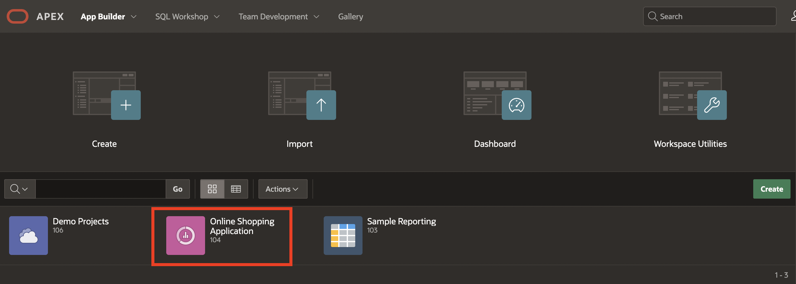

2. Select **17 - Shopping Cart**

    

3. In the left pane, right-click **Order Information** region and select **Create Page Item**.

    

4. In the Property Editor, enter/select the following:

    - Under Identification:

        - Name: **P17\_APP\_ITEM\_URL**

        - Type: **Hidden**

    

5. Navigate to **Processing** tab, right-click **Processing** and select **Create Process**.

    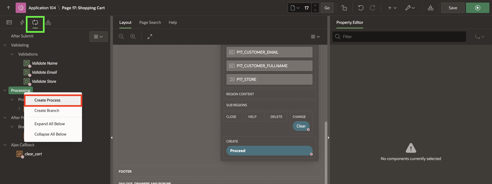

6. In the Property Editor, enter/select the following:

    - Identification > Name: **Prepare URL**

    - Source > PL/SQL Code: Copy and Paste the below code:

    ```
    <copy>
    BEGIN
    :P17_APP_ITEM_URL := 'http://' || OWA_UTIL.get_cgi_env('HTTP_HOST') ||APEX_UTIL.PREPARE_URL(
        p_url => 'f?p=' || :APP_ID || ':16:'||:APP_SESSION||'::NO::P16_ORDER:&P17_ORDER_ID.',
        p_checksum_type => 'SESSION');
    END;
    </copy>
    ```

    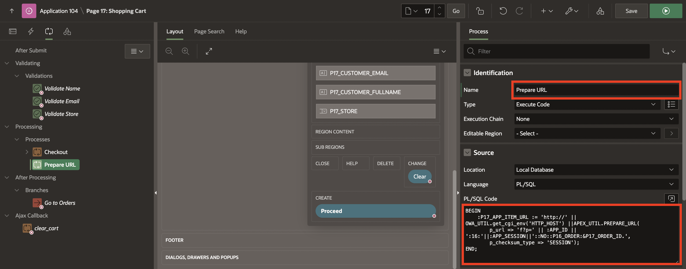

7. Right-click **Processing**, select **Create Process**.

    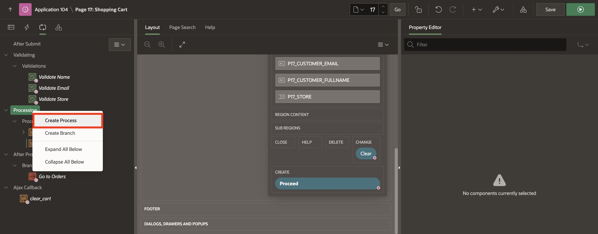

8. In the Property Editor, enter/select the following:

    - Under Identification:

        - Name: **Send E-Mail**

        - Type: **Send E-Mail**

    - Under Settings:

        - From: **&APP_EMAIL.**

        - To: **&P17\_CUSTOMER\_EMAIL.**

        - Subject: **Your Order Confirmation : &P17\_ORDER\_ID.**

        - Body Plain Text: Copy and paste the below text:

        ```
        <copy>
        Hello &P17_CUSTOMER_FULLNAME.,
        We're getting your order ready to be shipped. We will notify you when it has been sent.
        <a href="&P17_APP_ITEM_URL." target="_blank">View your order</a>
        If you have any questions contact us at noreply@oracle.com
        </copy>
        ```

        - Body HTML:Copy and paste the below text:

        ```
        <copy>
        <html>
        <body>
        <p>Hello &P17_CUSTOMER_FULLNAME.,</p><br>
        <p>We're getting your order ready to be shipped. We will notify you when it has been sent.</p><br>
        <p><a href="&P17_APP_ITEM_URL." target="_blank">View your order</a></p><br>
        <p>If you have any questions contact us at noreply@oracle.com</p><br>
        </body>
        </html>
        </copy>
        ```

    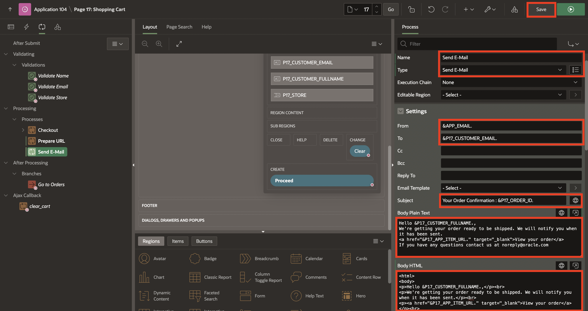

9. Click **Save**.

## Task 2: Create Feedback Page

This task focuses on capturing customer feedback after an order is placed. By adding interactive elements like a star rating and feedback text box, you will create a mechanism to gather valuable insights from users about their shopping experience.

1. Navigate to **SQL Workshop**, click **Object Browser**.

    

2. Under **Tables**, select **Orders** and click **Add Column**.

    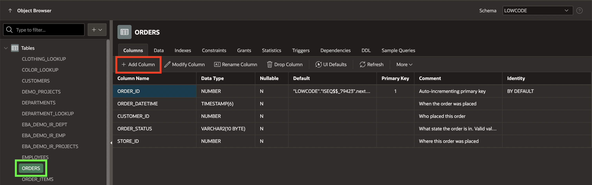

3. Add the following three columns into the **Orders** table and click **Apply**.

    | Column | Data Type | Length | Default |
    | ------ | --------- | ------ | ------- |
    | STAR_RATING | NUMBER |      |         |
    | FEEDBACK   | VARCHAR2 | 2000 |        |
    | EMAIL_FLAGGED | VARCHAR2 | 1  | 'N' |

    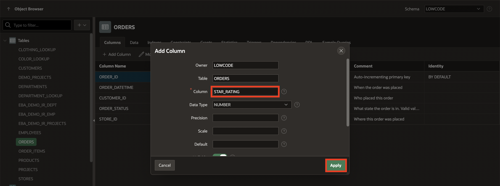

    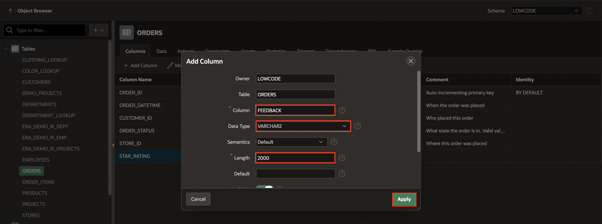

    

4. Navigate to **App Builder**.

    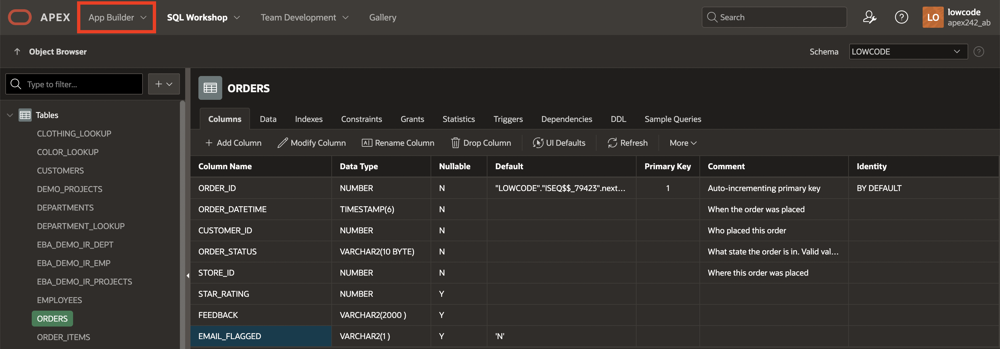

5. Select **Online Shopping Application**.

    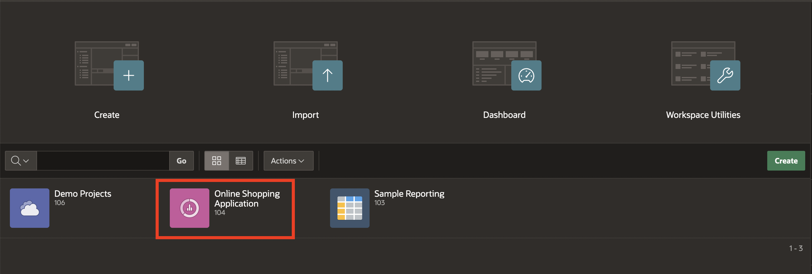

6. Click **16 - Order Information**.

    

7. In the left pane, right-click **Thank you for your order!** region and select **Create Sub Region**.

    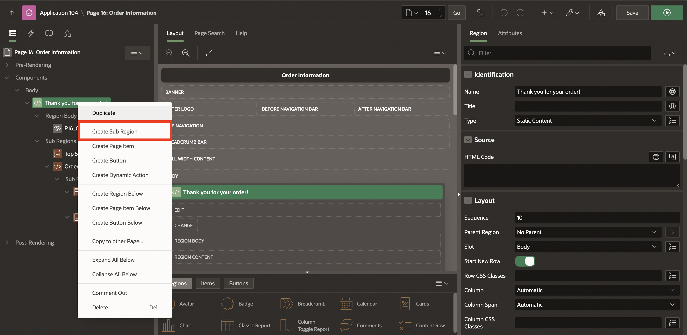

8. In the Property Editor, enter/select the following:

    - Identification > Name: **Rate your shopping experience**

    - Layout > Start New Row: **Toggle Off**

    

9. Right-click **Rate your shopping experience** region and select **Create Page Item**.

    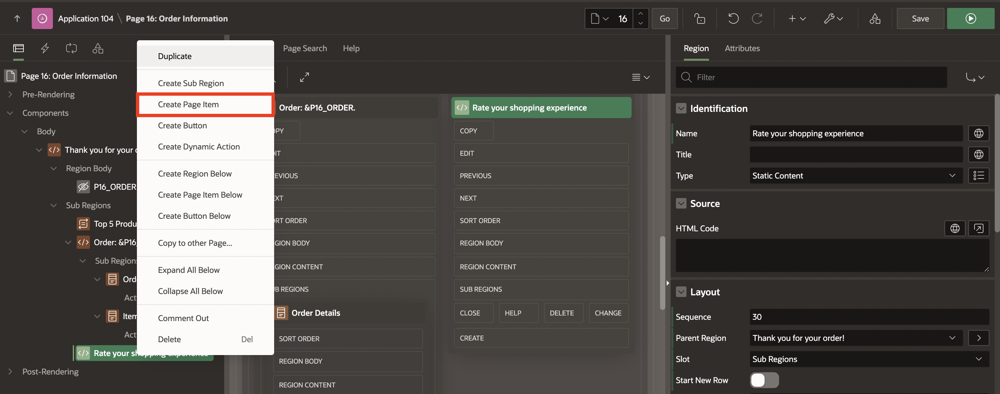

10. Create the following two page items one after the other:

    | Name | Type | Label |
    | ---- | ---- | ----- |
    | P16_REVIEW | Star Rating | Review |
    | P16_FEEDBACK | Textarea | Feedback |

    

    

11. Right-click **Rate your shopping experience** region and select **Create Button**.

    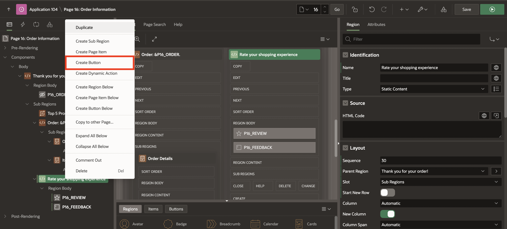

12. In the Property Editor, enter/select the following:

    - Under Identification:

        - Button Name: **Submit**

        - Label: **Submit**

    - Layout > Slot: **Copy**

    - Appearance > Hot: **Toggle On**

    - Under Server-side Condition:

        - Type: **Item is NULL**

        - Item: **P16_REVIEW**

    

    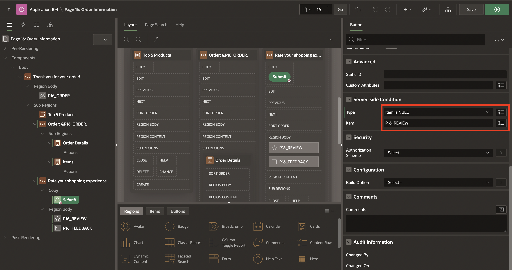

13. Navigate to **Processing** tab, right-click **Processing** and select **Create Process**.

    

14. In the Property Editor, enter/select the following:

    - Identification > Name: **Submit Review**

    - Source > PL/SQL Code: Copy and paste the below code:

    ```
    <copy>
        UPDATE ORDERS
        SET STAR_RATING = :P16_REVIEW,
            FEEDBACK = :P16_FEEDBACK
        where order_id = :P16_ORDER;
    </copy>
    ```

    - Success Message > Success Message: **Thank you for your feedback!**

    - Server-side Condition > When Button Pressed: **Submit**

     

15. Click **Save**.

## Task 3: Create an Email Template

Email templates simplify the process of sending structured, professional messages to users. In this task, you will design a reusable template for sending product review reminders, ensuring consistent branding and communication.

1. Click the **Shared Components** icon on the top right corner.

   

2. Under **User Interface**, select **Email Templates**.

   

3. Click **Create Email Template**.

   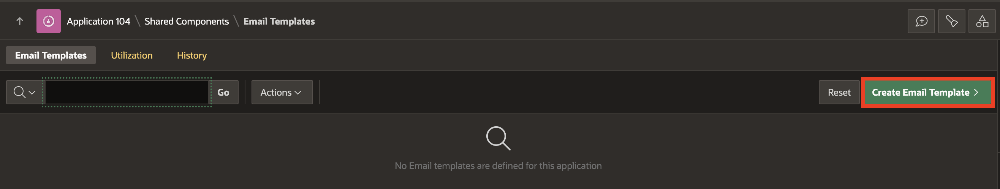

4. Enter/select the following:

    - Under **Identification**:

        - Template Name: **Product Review Reminder**

        - Static Identifier: **PRODUCT\_REVIEW\_REMINDER**

        - Email Subject: **How Was Your Experience? Let Us Know!**

    - HTML Format > Body: Copy and paste the below HTML

    ```
    <copy>
    <html>
     <body>
       <p>Dear #CUSTOMER_NAME#,</p>
       <p>Thank you for purchasing !</p>
       <p>We hope you're enjoying it. Could you take a moment to rate your experience?</p>
       <p>
          <a href="#RATING_LINK#">Click here to rate this product</a>
       </p>
       <p>Thank you for your feedback!</p>
       <p>Best regards,</p>
       <p>Online Shopping Application</p>
     </body>
    </html>
    </copy>
    ```

    

    - **Plain Text Format**: Copy the text below and paste it into plain text format:
    ```
    <copy>
    Dear #CUSTOMER_NAME#,
    Thank you for purchasing [Product Name]!
    We hope you're enjoying it. Could you take a moment to rate your experience? Your feedback helps us improve and serve you better.
    Click the link below to rate your product: #RATING_LINK#
    Thank you for your time and input!
    Best regards,
    The Online Shopping App
    </copy>
    ```

    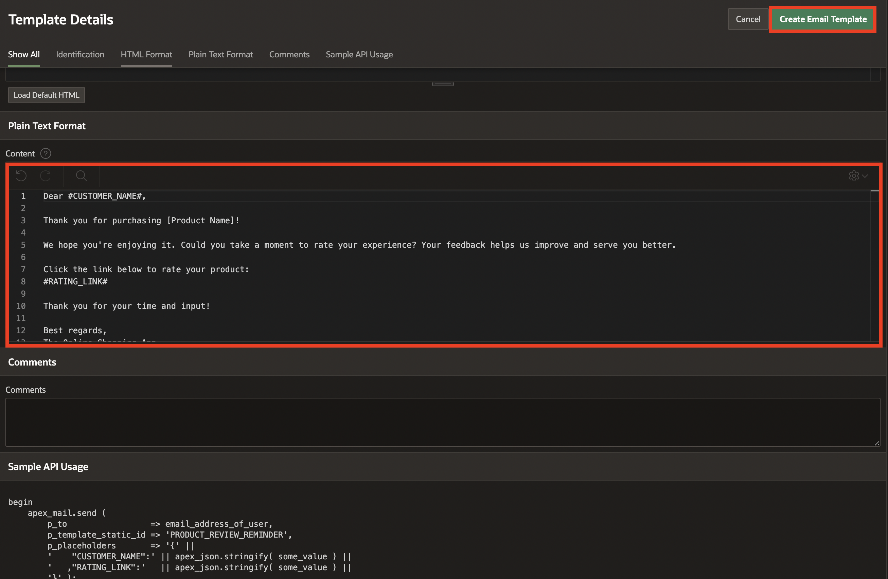

5. Click **Create Email Template**

## Task 4: Create an Automation

Automation is key to improving application efficiency and reducing manual effort. In this task, you will set up an automation to send product review reminders to customers based on specific criteria, leveraging the email template created in Task 3.

1. Navigate to **Shared Components**.

    

2. Under **Workflows and Automations**, select **Automations**.

    

3. Click **Create**.

    

4. Under **Create Automation**, enter/select the following:

    - Name: **Product Review Reminder**

    - Type: **Scheduled**

    - Actions initiated on: **Query**

    - Execution Schedule: **Daily at Midnight**

    Click **Next**.

    - Source Type: **Table**

    - Table/View Name: **ORDERS (table)**

    Click **Create**.

    

    

5. Enter/select the following:

    - Settings > Schedule Status: **Active**

    - Source > Where Clause: Copy and paste the below code:

    ```
    <copy>
        TO_DATE(TO_CHAR(order_datetime, 'MM/DD/YYYY'), 'MM/DD/YYYY') = SYSDATE - 1
        AND EMAIL_FLAGGED = 'N'
        AND STAR_RATING IS NULL
    </copy>
    ```

6. Click **Save Changes**.

    

7. Click **Product Review Reminder**.

    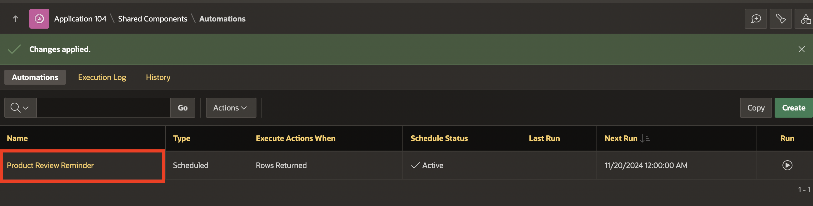

8. Navigate to **Actions** tab and edit **New Action**.

    

9. Enter/select the following:

    - Action > Name: **Send E-Mail**

    - Code > Code: Copy and paste the below code:

    ```
    <copy>
        DECLARE
        l_url CLOB;
    BEGIN
        FOR x IN (SELECT c.full_name,
                     c.email_address,
                     o.order_id,
                     To_date(To_char(o.order_datetime, 'MM/DD/YYYY'),
                     'MM/DD/YYYY')
                     AS
                              order_datetime
              FROM   customers c
                     join orders o
                       ON c.customer_id = o.customer_id
              WHERE  To_date(To_char(o.order_datetime, 'MM/DD/YYYY'),
                     'MM/DD/YYYY')
                     = SYSDATE
                     AND o.email_flagged = 'N') LOOP
        l_url := 'http://'
                 || owa_util.Get_cgi_env('HTTP_HOST')
                 ||apex_util.Prepare_url(p_url => 'f?p='
                                                  || :APP_ID
                                                  || ':16:'
                                                  ||:APP_SESSION
                                                  ||'::NO::P16_ORDER:'
                                                  ||apex_json.Stringify(
                                                    x.order_id),
                     p_checksum_type => 'SESSION');

        apex_mail.Send (p_to => apex_json.Stringify(x.email_address),
        p_template_static_id => 'PRODUCT_REVIEW_REMINDER',
        p_placeholders => '{'
                          || '    "CUSTOMER_FULLNAME":'
                          || apex_json.Stringify(x.full_name)
                          || '   ,"RATE_URL":'
                          || apex_json.Stringify(apex_mail.get_instance_url
                                                 || apex_page.Get_url(16))
                          || '}');

            UPDATE orders
            SET    email_flagged = 'Y'
            WHERE  order_id = x.order_id;
        END LOOP;
    END; 
    </copy>
    ```

    

10. Click **Apply Changes**.

## Summary

In this lab, you extended the capabilities of your application by implementing email processes, designing feedback pages, and automating workflows. These features enhance user interaction, streamline communication, and improve operational efficiency. You may now **proceed to the next lab**.

## What's Next

During the upcoming hands-on session, you will learn to enable a Remote Database schema. The lab will guide you through creating an application and integrating application data from a REST Data Source. Additionally, you will learn the Process of synchronizing data from REST Data Sources.

## Acknowledgements

- **Author** - Ankita Beri, Product Manager
- **Last Updated By/Date** - Ankita Beri, Product Manager, November 2024
