#  Extend Application Capabilities

## Introduction

In this session, you will develop an expense management application utilizing the approvals component. The concepts and terms associated with Approval Management in APEX will be elucidated through the example of the Expense Tracker Application.

When employees apply for an expense, they log into the application and submit a request, specifying the Type (Accommodation/Conference/Internet/Miscellaneous Expenses) and Estimated Expenses. The task may be assigned to multiple potential owners who can take various actions (Request information/Delegate/Release/Change Priority).

For expenses exceeding 50000, once approved by the immediate manager, the request progresses to the next manager, forming a multi-level approval based on the expense amount. This scenario represents a common use case for multi-level approvals.

Additionally, Deadlines and Expiration are configured for each task. The potential owner receives an email notification 5 minutes before the task expires. If the task is neither approved nor rejected by the expiry time, it is marked as Expired.

Estimated Time: 1 hour

### Objectives
In this lab, you will:
- Obtain a free development environment
- Learn how to create a SQL Script
- Learn how to create a Task definition
- Learn how to create a Page to submit Expense
- Learn how to create a Unified Task List
- Learn how to create Users
- Learn how to create an Email Template
- Learn how to Request Information/ Delegate/ Release
- Learn how to set deadlines and expiration

### Downloads

**[Click Here](files/hol15.sql)** to download the completed application.


## Task 1: Create the Application
In this lab, you create a new application named **Expense Tracker**.

1. If you still need to log into your Oracle APEX workspace, sign in using the workspace name, email, and password you signed up with.

    

2. At the top left of your workspace, click **App Builder**.

    

3. On the App Builder page, click **Create**.

    

4. For Name: Enter **Expense Tracker** and Click **Create Application**

    

## Task 2: Create a SQL Script
In this lab, you create database objects using SQL Scripts.

1. At the top of the application home page, click **SQL Workshop** and then Select **SQL Scripts**.

    

2. Click **Create**.

    

3. For Script Name: Enter **Employee details and Expense status**

4. Copy and Paste the code below into the code editor and Click **Run**.

      ```
      <copy>
      CREATE TABLE "EMPLOYEE_DETAILS"
      ("EMPNO" NUMBER GENERATED BY DEFAULT ON NULL
      AS IDENTITY MINVALUE 1 MAXVALUE 9999999999999999999999999999
      INCREMENT BY 1 START WITH 8000 CACHE 20 NOORDER  NOCYCLE  NOKEEP  NOT NULL ENABLE,
      "EMP_NAME" VARCHAR2(100),
      "MGR" NUMBER(4,0),
      CONSTRAINT "EMP_PK" PRIMARY KEY ("EMPNO"));
      insert into EMPLOYEE_DETAILS(empno, emp_name, mgr) values (10, 'JOHN', 20);
      insert into EMPLOYEE_DETAILS(empno, emp_name, mgr) values (20, 'CLARA',30);
      insert into EMPLOYEE_DETAILS(empno, emp_name, mgr) values (30, 'JANE', 40);
      insert into EMPLOYEE_DETAILS(empno, emp_name, mgr) values (40, 'MATT', null);
     commit;
      CREATE TABLE "EMP_EXPENSE_REQUEST"
      ("REQ_ID" NUMBER GENERATED BY DEFAULT ON NULL
      AS IDENTITY MINVALUE 1 MAXVALUE 9999999999999999999999999999
      INCREMENT BY 1 START WITH 8000 CACHE 20 NOORDER NOCYCLE NOKEEP NOT NULL ENABLE,
      "EMP_NO" VARCHAR2(10),
      "EXPENSE_TYPE" VARCHAR2(100),
      "ESTIMATED_COST" NUMBER(8,0),
      "UPDATED_BY" VARCHAR2(100),
      "STATUS" VARCHAR2(20),
      CONSTRAINT "EMP_EXPENSE_REQUEST_PK" PRIMARY KEY ("REQ_ID"));  
      </copy>
      ```

     

5. On the Run Script page, click Run Now.

     

6. The Script Results page will be displayed, listing the statements processed, successful, and with errors.

     

## Task 3: Add Users
   In this lab, you create users for multi-level management.

1. Navigate to the Administration icon on the Application home page and select **Manage Users and Group** from the dropdown list.

     

2. Click **Create Multiple Users**

     

3. Enter the following attributes:

    - For List of Email Addresses: Enter **MATT@email.com, JANE@email.com, CLARA@email.com, JOHN@email.com**

    - For Usernames: Select **Exclude @ domain as part of the username**

    - For password and Confirm Password: Enter a password of your choice.

4. Click **Next** and **Create Valid Users**.

   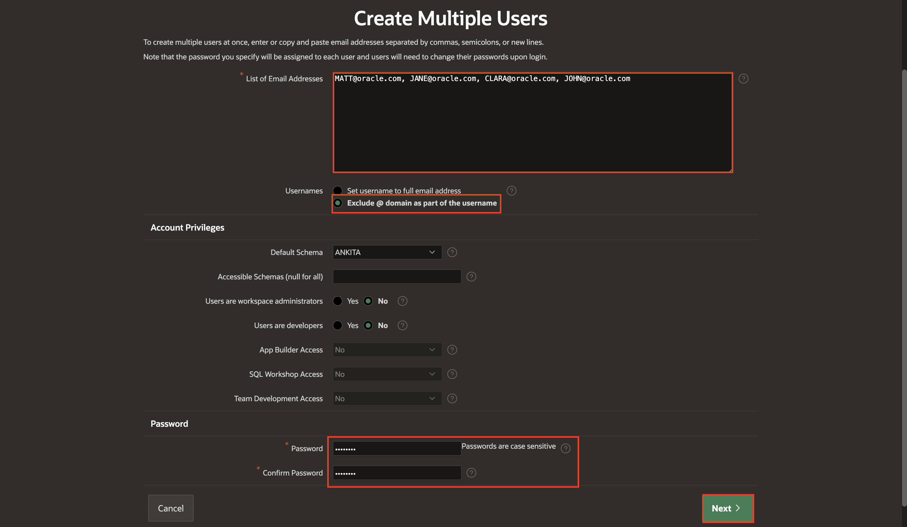

   

## Task 4: Create a Task Definition

In this task, you create a task definition to configure task parameters, participants, actions, and due dates for an expense request.

1. Navigate to **App Builder**.

   

2. Select **Expense Tracker** application.

   

3. Select **Shared Components**.

   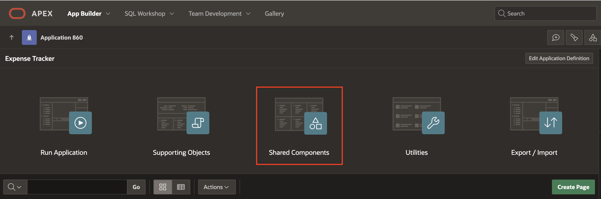

4. Under Workflows and Automations, Select **Task Definitions**.

   

5. Click **Create**.

   

6. Specify the task definition attributes and Click **Create**.

    - For Name: Enter **Expense Request**

    - For Type: Select **Approval Task**

    - For Subject: Enter **&EXPENSE\_TYPE. Expense request for &EMP\_NAME.**

    - For Priority: Select **2-High**

    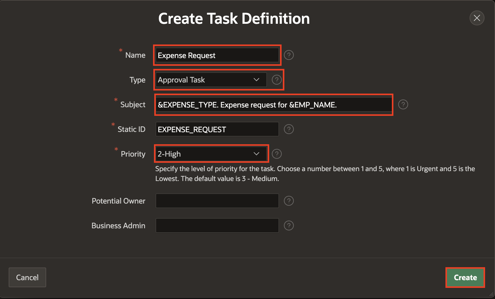

7. Under **Settings** Section:

    - For Task details Page Number - Click on **Create Task Details Page** button and Click **OK**

    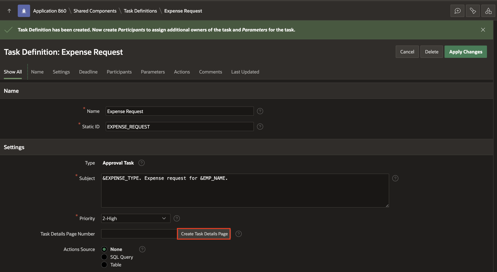

    

8. Click on the task definition - **Expense Request** to continue editing.

     

    Under Settings, Specify the following:

    - For Actions Source: Select **SQL Query**.

    - For Actions SQL query: Copy the code below and paste it into  the code editor:

    ```
    <copy>
    select e.empno, e.emp_name, m.emp_name as mgr_name from EMPLOYEE_DETAILS e, EMPLOYEE_DETAILS m
    where m.empno(+)=e.mgr and e.empno= :APEX$TASK_PK
    </copy>
    ```

    

9. Under **Deadline** Section, Enter the following:

    - For Due On Type: Select **Interval**

    - For Due On Interval: Enter **PT30M**

    - For Expiration Policy: Select **Expire**

    

10. **Under Participants** Section - Select Participants to assign additional people to the Task Definition.

    - Click Add Row.

    - For Participant Type: Select **Potential Owner**

    - For Value Type: Select **SQL Query**

    - For Value: Copy the code below and paste it into  the code editor

    ```
    <copy>
    select EMP_NAME from employee_details where EMPNO =(select MGR from employee_details where EMPNO=(select EMPNO from employee_details where EMP_NAME=:APP_USER))
    </copy>
    ```

    - Click **Apply Changes** to save all existing changes.

    

11. Click on the task definition - **Expense Request** to continue editing.

    

12. **Under Parameters** Section - Select Add Row and fill in the four parameter fields listed below:

     | Static ID |  Label  | Data Type
     | --- |  --- | --- |
     | ESTIMATED\_COST | Estimated Cost | String |
     | EXPENSE\_STATUS | Expense Status | String |
     | EXPENSE\_TYPE | Expense Type | String |
     | REQ\_ID | Req Id | String |

     - Click **Apply Changes**.

     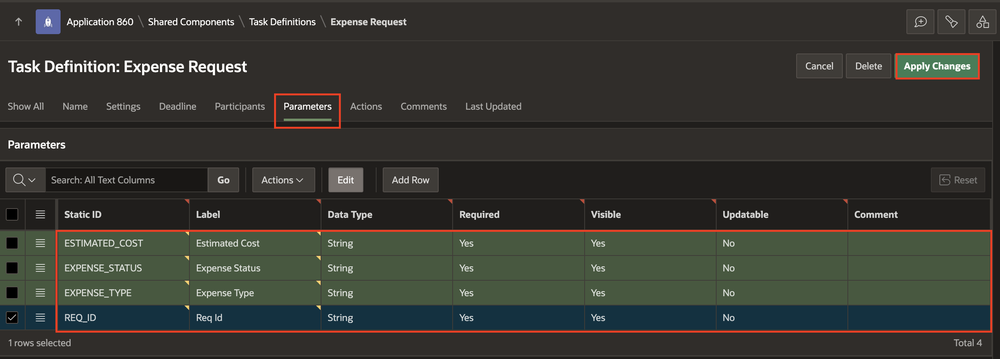

13. Click on the task definition - **Expense Request** to continue editing.

     

14. Under **Actions** Section, Click **Add Action**.

    Specify the following:

     - For Name: Enter **CREATE\_EXPENSE\_REPORT\_ENTRY**

     - For Type: Select Execute Code

     - On Event: Select Create

     - For Code: Copy the code below and paste it into  the code editor:

    ```
        <copy>
         declare
           l_req_id number;
        begin
          if :APP_USER = :EMP_NAME then --this is the original initiator
           l_req_id := :APEX$TASK_ID;
        -- Create a new record in the Employee Expense Request table EMP_EXPENSE_REQUEST
        insert into EMP_EXPENSE_REQUEST values
        (to_number(l_req_id),
        :EMPNO,
        :EXPENSE_TYPE,
        :ESTIMATED_COST,
        '',
       'PENDING');
    end if;
    end;
    </copy>
    ```
     - Click **Create** to save Create Event Action.

      

      

15. To Add the next action, Under **Actions** Section, Click **Add Action**.

    Specify the following:

     - Name: Enter **NEXT\_APPROVER\_OR\_UPDATE\_STATUS**

     - Type:  Select **Execute Code**

     - On Event: Select **Complete**

     - Outcome: Select **Approved**

     - For Code: Copy the code below and paste it into the code editor:

      ```
      <copy>
        declare
        l_mgr number;
        l_task_id number;
        l_request_id number;
        l_req_status varchar2(10) :='PENDING';
        Begin
           if :APP_USER = :MGR_NAME then --this is the first approver
       -- Set the request ID to be the ID of the task created when the request was submitted
          l_request_id := :APEX$TASK_ID;
        else
       -- this is an intermediate approver. Set the request-id from the corresponding task parameter value
       l_request_id := :REQ_ID;
       end if;
       if  :ESTIMATED_COST < 50000 then -- the approval is complete

        update EMP_EXPENSE_REQUEST set status = 'APPROVED', updated_by=updated_by||'->'||:APP_USER
         where req_id = l_request_id and emp_no=:APEX$TASK_PK;

        l_req_status := 'APPROVED';
       else -- the request needs to go through another level of Approval
        -- updated the request record with details of the current approver in the chain of approvers
        update EMP_EXPENSE_REQUEST set updated_by = updated_by||'->'||:APEX$TASK_OWNER
         where req_id = l_request_id
           and emp_no=:APEX$TASK_PK;
       -- Create a new task assigned to the manager of the current approver
        l_task_id := apex_approval.create_task(
            p_application_id => :APP_ID,
            p_task_def_static_id => 'EXPENSE_REQUEST',
            p_initiator => :EMP_NAME, -- ensure initiator is the original requestor and not the current task owner
            p_parameters => apex_approval.t_task_parameters(
                1 => apex_approval.t_task_parameter(static_id => 'EXPENSE_TYPE', string_value => :EXPENSE_TYPE),
                2 => apex_approval.t_task_parameter(static_id => 'ESTIMATED_COST', string_value => :ESTIMATED_COST),
                3 => apex_approval.t_task_parameter(static_id => 'REQ_ID',      string_value => l_request_id),
                4 => apex_approval.t_task_parameter(static_id => 'STATUS',      string_value => l_req_status)
             ),
            p_detail_pk => :APEX$TASK_PK
            );
            end if;
          end;
      </copy>
      ```

    - Click **Create** to add action.

       

       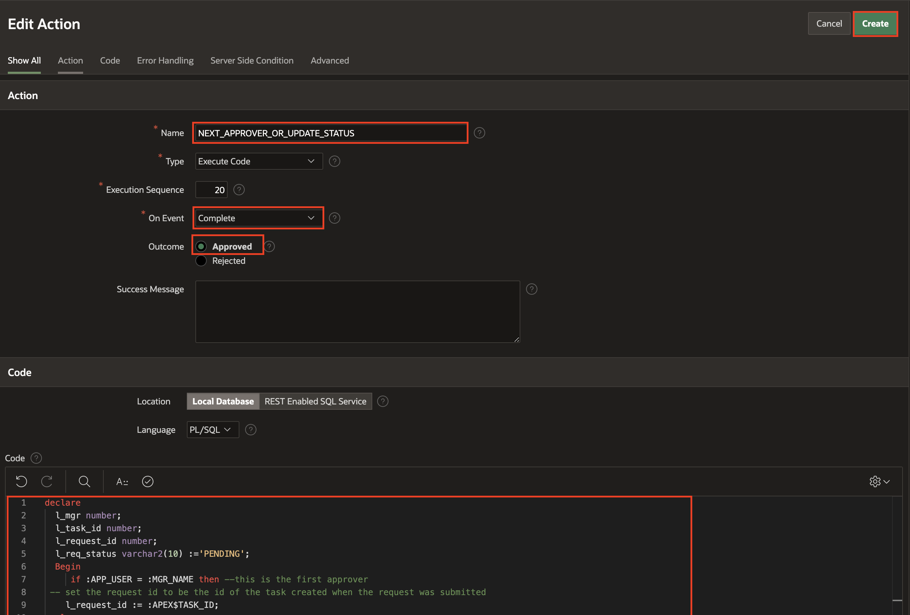

16. Again, Under **Actions** Section, Click **Add Actions**.

    Specify the following:

    - For Name: Enter **UPDATE\_REQUEST\_STATUS**

    - For Type: Select Execute Code

    - On Event: Select **Complete**

    - For Outcome: Select **Rejected**

    - For Code: Copy the code below and paste it into  the code editor:

    ```
    <copy>
      declare
        l_mgr number;
        l_task_id number;
        l_request_id number;
        l_req_status varchar2(10) := 'PENDING';
      begin
        select mgr into l_mgr from employee_details where emp_name=:APP_USER;
      if :APP_USER = :MGR_NAME then --this is the first approver
        l_request_id := :APEX$TASK_ID;
      else
        l_request_id := :REQ_ID;
      end if;-- the request is complete and rejected.
      update EMP_EXPENSE_REQUEST set status = 'REJECTED', updated_by=updated_by||'->'||:APP_USER
      where req_id = l_request_id and emp_no=:APEX$TASK_PK;
      end;
    </copy>
    ```

    - Click **Create** and **Apply Changes**

     

     

     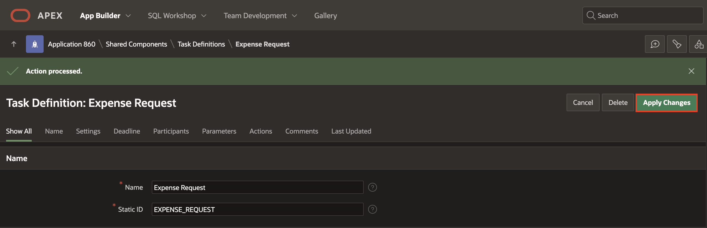


## Task 5: Create a Page to Apply for Expense

Add a page to Submit an Expense request.

1. Click **Application ID**.

   

2. Click **Create Page**.

    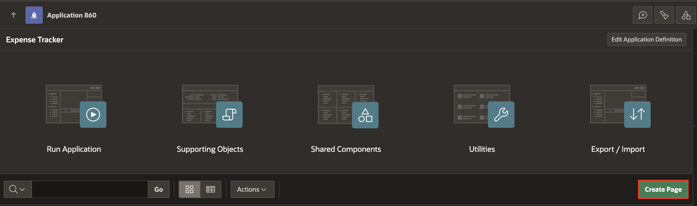

3. Select **Blank page** under component.

    

4. Specify Blank Page Attributes.

   Under **Page Definition** Section:

    - For Page Number: Enter **3**

    - For Name: Enter **Apply for Expense**

   Under **Navigation** Section:

    - For Breadcrumb Parent Entry: Select **Home(Page 1)**

   Click **Create Page**.

   

5. In the left pane, select the Rendering tab. Right-click **Body**and select **Create Region**.

   

6. In the Property Editor, edit the appropriate attributes:

   Under **Identification** section:

    - For Title: Enter **New Expense Request**

    - For Type: Select **Form**

   Under **Source** section:

    - For Type: Select **SQL Query**

    - For SQL query: Copy the code below and paste it into the code editor:

    ```
     <copy>
    Select e.empno, e.emp_name, m.emp_name as mgr_name
      from EMPLOYEE_DETAILS e , EMPLOYEE_DETAILS m
     where m.empno(+) = e.mgr
      and e.empno = :P3_EMPNO;
    </copy>
    ```
    

7. Now, right-click the region (**New Expense Request**) and select **Create Page Item**.

  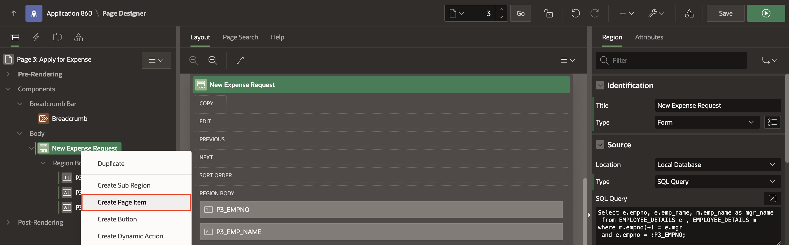

     - For Name: Enter **P3\_EXPENSE\_TYPE**

     - For Type: Select, **Select List**

    Under **List of Values** section:

     - For Type: Select **Static values**

     - For Static Values: Enter the below List and click **OK**

    | Display Value |  Return Value  |
    | --- |  --- |
    | Internet/Broadband Charges | Internet/Broadband Charges |
    | Accommodation | Accommodation |
    | Conference | Conference |
    | Misc. Expenses | Misc. Expenses |

     - For Null Display Value: Enter **--Select Expense Type--**

   

8. Right-click region (**New Expense Request**) and Select **Create Page Item**.

     - For Name: Enter **P3\_ESTIMATED\_COST**

     - For Type: Select **Number Field**

    

    

9. Select the **P3\_EMPNO** page item and enable the primary key under **Source** section and click **Save** to apply changes.

    

10. On the Rendering tab, under Pre-Rendering, right-click **Before Header** and click **Create Process**.

    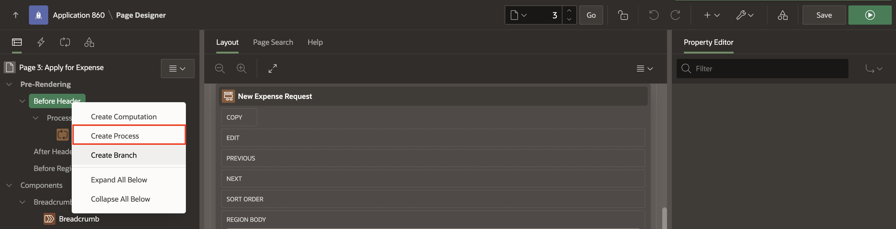

    In the Property Editor, enter the following:

     - For Name: **Fetch Employee Details for User**

     - For Type: **Execute code**

     - For PL/SQL Code: Enter the following PL/SQL code:

        ```
        <copy>
         select empno into :P3_EMPNO from employee_details where emp_name=:APP_USER;
        </copy>
        ```
     - Sequence: Enter '1'

    

11. Click **Save**.

12. Now add a process on the **Processing tab** to submit a request. Right-click Processing and click **Create Process**.

    

    In the Property Editor, enter the following:

      - For Name: Enter **Submit Expense request**

      - For Type: Select **Human Task - Create**

    Under **Settings** Section:

      - For Definition: Select **Expense request**

      - For Details Primary key Element: Select **P3\_EMPNO**

    Under **Success Message** Section:

      - For Success Message: Type **Expense Request submitted successfully**

    

13. Under Parameters for Submit Expense request process:

    a) For  Estimated Cost, enter the following:

       - For Type: Select ITEM

       - For Value: Select **P3\_ESTIMATED\_COST**

    

    b) For  Expense Status, enter the following:

       - For Type: Select Static Value

       - For Value: Type **PENDING**

     

    c) For  Expense Type, enter the following:

       - For Type: Select ITEM

       - For Value: Select **P3\_EXPENSE\_TYPE**

     

    d) For  Request ID, enter the following:

       - For Type: Select Null

    

14. Click **Save**

15. On Rendering tab, Right-click **New Expense Request** Region and select **Create Button**.

    

    In the Property Editor, enter the following:

       - For Button Name: Enter **SUBMIT_REQUEST**

       - For Position: Select **Edit**

       - For Hot: **Enable**

    

16. Navigate to the Processing tab and select Process **Submit Expense Request**.

    Under **Server-Side Condition** Section:

       - For When Button Pressed: Select **SUBMIT_REQUEST**

    

17. Click **Save**.

## Task 6: Create Unified Task Lists
Add a Unified Task list page to see a requestor's submitted expense request list and the approver's approved or rejected list.

1. Click Application ID on the right-above corner of the page designer. Application Home page appears.

  

2. Click **Create Page**.

   

3. Under Components, Select Unified Task List.

   

4. Specify the following page attributes:

     - For Page Number: Enter **4**

     - For Name: Enter **My Approvals**

     - For Report Context: Select **My Tasks**

    Click **Create Page**.

    

5. To create another Unified Task list page, click on the Application ID on the right-above corner of the page designer.

    

6. Click **Create Page**.

    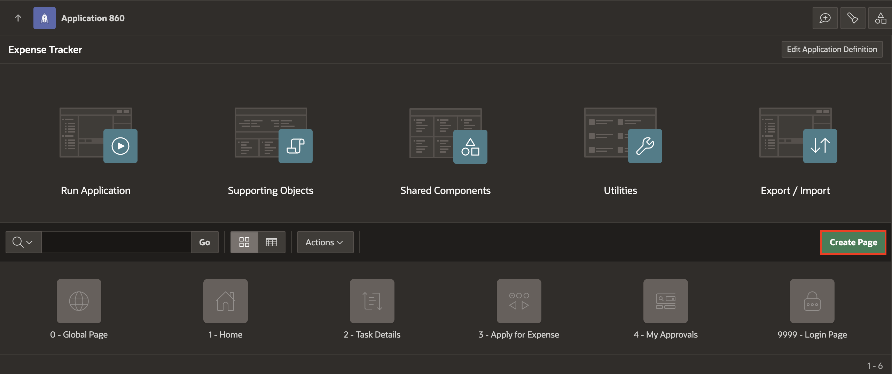

7. Under Components, Select **Unified Task List**.

    

8. Specify the following page attributes:

     - For Page Number: Enter **6**

     - For Name: Enter **My Expense Requests**

     - For Report Context: Select **Initiated by Me**

    Click **Create Page**.

    

## Task 7: Create an Email Template  
Add an email template for the before-expiry Action in the task definition.

To define an email template:

1. Click the Shared Components icon on the top right corner.

   

2. Under User Interface, Select **Email Templates**.

   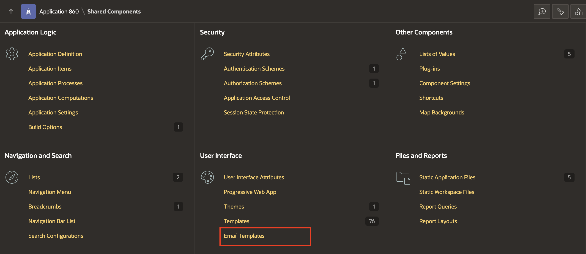

3. click **Create Email Template**on the Email Templates page.

   

4. Under **Identification**:

    - For Template Name: Enter **BEFORE EXPENSE EXPIRY EMAIL**

    - For Email Subject: Copy and Paste the below Text

     ```
     <copy>
     Expense Request FOR #APEX_TASK_SUBJECT# Requires your review
     </copy>
     ```

    > **Note:** _For substitution strings with the #STRING\_NAME# format. You can pass in values for these strings using the Placeholder Values dialog for the Process in Page Designer or the APEX_MAIL API._

5. Under **HTML Format**:

    - For **Header**: Copy the text below and paste it into the Header:
    ```
    <copy>
    <b style="font-size: 24px;">My Approvals</b>
    </copy>
    ```
    - For **Body**: Copy the text below and paste it into the Body:
    ```
     <copy>
    <strong>Hello #APEX_TASK_OWNER#</strong>,<br>
    <br>Please check your "My Approvals" inbox. The expense request for #EMP_NAME# requires your timely review manner.<br>
    <br>Thanks for your kind attention to this matter.<br>
    <br>Need to make a change to your Approvals? <a href="#APPROVAL_URL#">Manage your Approvals here.</a>
    </copy>
     ```
    - For **Plain Text Format**: Copy the text below and paste it into Plain text format:
    ```
    <copy>
    Hello #APEX_TASK_OWNER#,
    Please check your "My Approvals" inbox. The expense request for #EMP_NAME# requires your timely review manner.
    Thanks for your kind attention to this matter.
    Need to make a change to your Approval? Manage your Approval here: #APPROVAL_URL#
    </copy>
    ```

    

    

6. Click **Create Email Template**

## Task 8: Update Table Employee Details

1. Navigate to SQL Workshop and click SQL Commands

      

2. Copy and Paste the below commands into the Script Editor and run them one by one to update the **EMPLOYEE\_DETAILS** table

   > **Note:** _The steps to create and populate the table EMPLOYEE\_DETAILS are shared in TASK 2. Ensure you have that table created and populated before running the commands below._  

   Add a new column HR\_MGR (HR Manager) to the existing Employee table EMPLOYEE\_DETAILS and update the existing Employee records as shown below:
    ```
    <copy>
    insert into EMPLOYEE_DETAILS(empno, emp_name) values (50, 'SOPHIE');

    insert into EMPLOYEE_DETAILS(empno, emp_name) values (60, 'ROBIN');

    Alter table "EMPLOYEE_DETAILS" add "HR_MGR" VARCHAR2(10);

    Update EMPLOYEE_DETAILS set HR_MGR = 'SOPHIE' where EMPNO in  (10,20);

    Update EMPLOYEE_DETAILS set HR_MGR = 'ROBIN' where EMPNO in  (30,40);
    </copy>
    ```  

    

    > **Note:** _ Don't forget to create two new Users, SOPHIE (SOPHIE@email.com) and ROBIN (ROBIN@email.com), using the Manage Users And Groups menu option under Workspace Administration as done in Lab 1: Task 3._

    

## Task 9: Update Task Definition
We will further extend the Expense Tracker Application to see how tasks could be assigned to multiple potential owners and then explore possible actions(Request Information / Delegate / Release) that these potential owners perform on the task.

1. Navigate to App Builder.

    

2. Select **Expense Tracker** application.

    

3. Select **Shared Components**

      

4. Under Workflows and Automations, Select **Task Definitions**.

      

5. Select **Expense Request** Task Definition.

    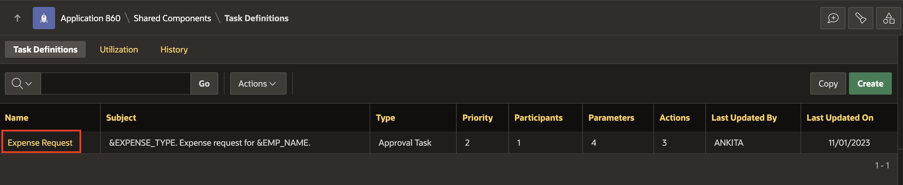  

6. Under **Actions** - Edit **NEXT\_APPROVER\_OR\_UPDATE\_STATUS**

    

    Copy the code below and  replace it with the code editor:

    ```
    <copy>
    declare
    l_mgr number;
    l_task_id number;
    l_request_id number;
    l_req_status varchar2(10) :='PENDING';
    begin
       select mgr into l_mgr from employee_details where emp_name=:APP_USER;
    if :APP_USER = :MGR_NAME then --this is the first approver
       -- Set the request id to be the id of the task created when the request was submitted
       l_request_id := :APEX$TASK_ID;
    else
       -- This is an intermediate approver; set the request id from the corresponding task parameter value
       l_request_id := :REQ_ID;
    end if;
    if l_mgr is null or :ESTIMATED_COST < 50000 then -- the approval is complete

        update EMP_EXPENSE_REQUEST set status = 'APPROVED', updated_by=updated_by||'->'||:APP_USER
         where req_id = l_request_id and emp_no=:APEX$TASK_PK;
         l_req_status := 'APPROVED';
    else -- the request needs to go through another level of Approval
        -- updated the request record with details of the current approver in the chain of approvers
        update EMP_EXPENSE_REQUEST set updated_by = updated_by||'->'||:APEX$TASK_OWNER
         where req_id = l_request_id
           and emp_no=:APEX$TASK_PK;
        -- Create a new task assigned to the manager of the current approver
        l_task_id := apex_approval.create_task(
            p_application_id => :APP_ID,
            p_task_def_static_id => 'EXPENSE_REQUEST',
            p_initiator => :EMP_NAME, -- ensure initiator is the original requestor and not the current task owner
            p_parameters => apex_approval.t_task_parameters(
                1 => apex_approval.t_task_parameter(static_id => 'EXPENSE_TYPE', string_value => :EXPENSE_TYPE),
                2 => apex_approval.t_task_parameter(static_id => 'ESTIMATED_COST', string_value => :ESTIMATED_COST),
                3 => apex_approval.t_task_parameter(static_id => 'REQ_ID',      string_value => l_request_id),
                4 => apex_approval.t_task_parameter(static_id => 'STATUS',      string_value => l_req_status)
        ),
        p_detail_pk => :APEX$TASK_PK
    );
    end if;
    end;
    </copy>
    ```
    Click **Apply Changes**

    

7. **Under Participants** Section - Click Add Row

    - For Participant Type: Select **Potential Owner**

    - For Value Type: Select **SQL Query**

    - For Value: Copy the code below and  paste it into the code editor:

    ```
    <copy>
    select HR_MGR from EMPLOYEE_DETAILS where EMPNO = :APEX$TASK_PK
    </copy>
    ```

    Click **Apply Changes**

      

    > **Note:** _Adding the new Participant entry implies that for each employee, the approver of the Expense is either the manager they report to or their HR Manager. In this example, if Clara was applying for an expense, the task could be approved by either her manager, Jane or her HR Manager, Sophie._

## Task 10: Add Delegate, Request Info and Expire Events for an Expense Request   

You now have a scenario where there can be more than one potential owner of an expense request task. This will help us to demonstrate the operations like Claim, Release, and Delegate that can be performed on tasks with  >1 potential owner(s).

1. Click **Expense Tracker** to continue editing. Under **Actions** Section: Click **Add Action**

    - For Name: Enter **DELEGATE\_EXPENSE\_REQUEST**

    - For Type: Select Execute Code

    - On Event: Select **Delegate**

    - For Success Message: Enter **Request Delegated Successfully**

    - For Code: Copy the code below and paste it into  the code editor:

    ```
    <copy>
    begin
    apex_approval.add_to_history ('Request Delegated by '|| :APEX$TASK_OWNER);
    end;
    </copy>
    ```
    - Click **Create** to add action.

    

    

2. Again, Under the Actions Section, click **Add Action** to request information.

    - For Name: Enter **REQUEST\_MORE\_INFO**

    - For Type: Select Execute Code

    - On Event: Select **Request Information**

    - For Success Message: Enter **Information Requested Successfully**

    - For Code: Copy the code below and paste it into  the code editor:
    ```
    <copy>
    begin
    apex_approval.add_to_history ('Information Requested From '|| :APEX$TASK_OWNER);
    end;
    </copy>
    ```
    - Click **Create** to add action.

  

  

3. Under the **Actions** Section - click **Add Actions**

   Specify the following attributes:

    - For Name: Enter **BEFORE\_EXPIRY**

    - For Type: Select **Send Email**

    - On Event: Select **Before Expire**

    - For Before Expire Interval: Enter **PT25M**

    - For Success Message: Enter **Task will expire in 5 minutes**

   Under **Send Email Settings** Section:

    - For From: Enter the Email address of your wish

    - For To: Enter the Email address of your wish

    - For Email Template: Select **BEFORE EXPENSE EXPIRY EMAIL**

    

4. Click the **Set Placeholder Values** button beside the email template.

   Add a Column or Value for mentioned Placeholders and Click **Save** to add placeholders.

   | Placeholder|  Column or Value  |
   | --- |  --- |
   | APEX\_TASK\_SUBJECT | &APEX$TASK\_SUBJECT. |
   | APEX\_TASK\_OWNER | &APEX$TASK\_OWNER. |
   | EMP\_NAME | &EMP_NAME. |
   | APPROVAL\_URL | Paste the Login URL of your Expense Tracker Application |

5. Click **Create** to save an action.

   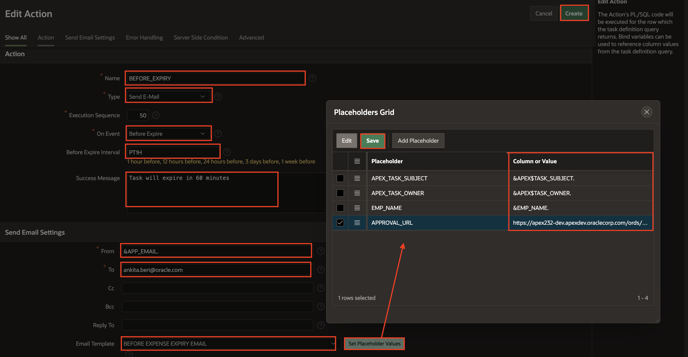

6. To add an Expire event, Under the Actions Section, Click **Add Action** and specify the following attributes:

    - For Name: Enter **TASK_EXPIRED**

    - For Type: Select Execute Code

    - For Execution Sequence: 70

    - On Event - Select **Expire**

    - For Success Message: Enter **Task Expired**

    - For Code: Copy the code below and paste it into  the code editor:

    ```
    <copy>
    begin
    apex_approval.add_to_history( 'Task ' || :APEX$TASK_SUBJECT || ' Expired');
    end;
    </copy>
    ```
    - Click **Create** to add action.

  

  7. Click **Apply Changes**

## Task 11: Run and Explore the new app  

In this task, you run and explore the Expense Tracker application. You submit a use case of a multi-level approval with an expense cost of more than 50000; an approved expense request will progress through a sequence of managers, starting with JOHN, then CLARA, then JANE, and finally MATT.

1. Click Run. This will open the runtime application in a new browser tab, allowing you to see how end users will view the app.

     

2. Login with username - JOHN

     

3. Navigate to **Apply for Expense** and submit the request.

     

4. Navigate to **My Expense Requests** to see John's expense request.

     

5. Now, log in with the username - CLARA. Then, Navigate to **My Approvals** to Approve John's request. Click **Claim** then **Approve**.

     

6. Login with username - JANE. Then, Navigate to **My Approvals** to Approve John's request. Click **Claim** then **Approve**.

     

7. Login with username - MATT. Then, Navigate to **My Approvals** to Approve John's request. Click **Claim** then **Approve**.

     

8. Again, log in with username - JOHN to see the completed request.

     


## Summary
You now know how to manage Approval Components. You may now **proceed to the next lab**.

## What's Next
During the upcoming hands-on session, you will learn to enable a Remote Database schema. The lab will guide you through creating an application and integrating application data from a REST Data Source. Additionally, you will learn the Process of synchronizing data from REST Data Sources.

## Acknowledgements
- **Author** - Ankita Beri, Product Manager
- **Contributor** - Roopesh Thokala, Senior Product Manager
- **Last Updated By/Date** - Ankita Beri, Product Manager, January 2024
