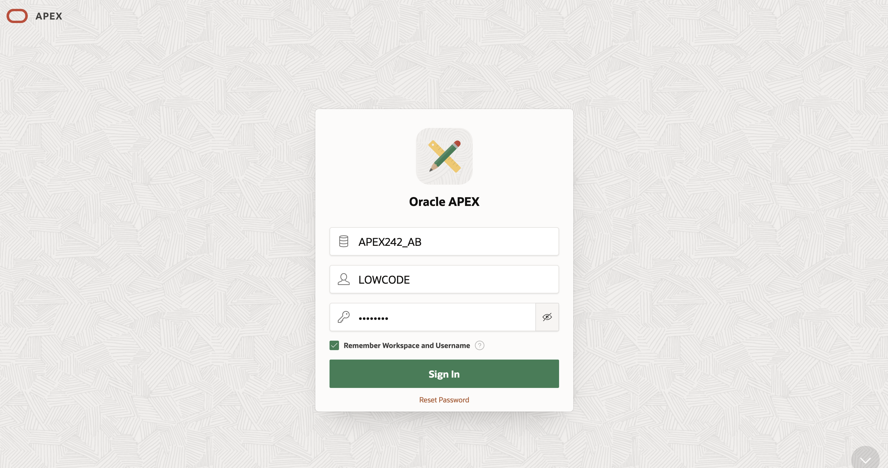
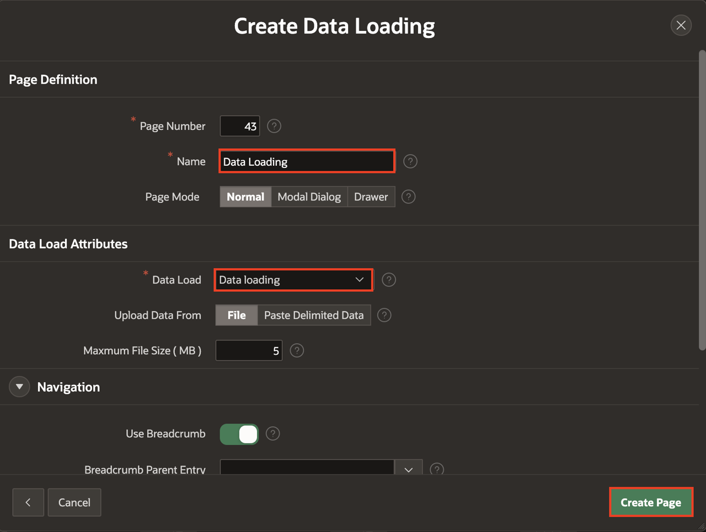

# Manage REST data

## Introduction

Oracle APEX allows you to build robust, feature-rich applications against remote, web, and REST data sources. In this lab, you log into a remote database, create a database table and then **Register a schema with RESTful Services**. You will then create a **New Application** and consume the **REST Data Source** we created. Then, you will **Synchronize** the Data from the REST Data Source to the Local Database table using **REST Data Synchronization**.

Estimated Time: 20 minutes

## Task 1: Enable Remote Database schema to Oracle REST Data Services.

Before starting this lab, you must provide a new **APEX instance** or **Workspace**.

In this hands-on lab, you will log in to the New Remote APEX workspace, create a Table and then **Register Schema with ORDS**.

1. log in to the new Workspace you created.

    

2. Under **SQL Workshop**, select **SQL Commands**.

    

3. Now, copy the statements below and execute them individually.
    ```
    <copy>
    CREATE TABLE "EMP_1"
   (    "EMPNO" NUMBER GENERATED BY DEFAULT ON NULL
     AS IDENTITY MINVALUE 1 MAXVALUE 9999999999999999999999999999
     INCREMENT BY 1 START WITH 8000 CACHE 20 NOORDER  NOCYCLE  NOKEEP  NOT NULL ENABLE,
    "EMP_NAME" VARCHAR2(10),
    "MGR" NUMBER(4,0),
    CONSTRAINT "EMP_1_PK" PRIMARY KEY ("EMPNO"));

    Begin
    insert into emp_1(empno, emp_name, mgr) values (10, 'JOHN', 30);
    insert into emp_1(empno, emp_name, mgr) values (20, 'CLARA',30);
    insert into emp_1(empno, emp_name, mgr) values (30, 'JANE', 40);
    insert into emp_1(empno, emp_name, mgr) values (40, 'MATT', null);
    commit;
    end;

    </copy>
    ```
    

      

4. Select **RESTful Services** under **SQL Workshop**.

    

5. Click **Register Schema with ORDS**.

    

6. In the next window, leave the Attributes to default and click **Save Schema Attributes**.

    

7. Now, click **Enabled Objects** in the left Navigation Menu and then select **Create AutoREST Object**.

  

8. Under **AutoREST Enable Object**, select the following and click **Create**.  

    - Set **Object Type** to **TABLE**.

    - Select **EMP_1** for **Object**

    - Copy the **Full URL** and paste it into your Note pad.

    Then Click **Create**.

      

    

## Task 2: Integrate Application Data from REST Data Source

In this task, you will consume the **REST Data Source** we created in the previous task. Then, you will **Synchronise** the Data from REST Data Source to the Local Database table using **REST Data Synchronisation**.

1. Log in to the first Workspace, where we have already created multiple applications.

    

2. Select **Sample Reporting** Application.

3. Navigate to **Shared Components** and then Select **REST Data Sources**.

    

    

4. Under **REST Data Sources**, Click **Create**.

    

5. Under **Create REST Data Source - Method**, Leave the settings to default and Click **Next**.

    

6.  Under **Create REST Data Source**, Enter the following and click **Next**.

       - For **REST Data Source Type** : select **Oracle REST Data Services**

       - For Name: Enter **Employee Details API**

       - For URL Endpoint: Enter the URI you **copied** in **Task 1**

    

7. Now, Under **Create REST Data Source - Remote Server** leave all fields to **Default** and Click **Next**.

    

8. For Authentication, Set **Authentication Required** to **No**. Click **Discover**.

    

9. Click **Create REST Data Source**.

    

## Task 3: Synchronise Data from REST Data Sources to a Local Table.

In this task, you **Synchronise data** from the **REST Data source** you created in Task 2 to a **Local table**.

**Data Synchronisation** feature enables developers to automatically sync the contents of a local table with the data from an external REST service. APEX invokes the REST Service defined in the REST Data Source, downloads all data and synchronizes to a local table.

1. Now that you have created a **REST Data Source**, Under **REST Data Sources** Select **No** under **Synchronised** column for **Employee Details API**.

    

2. **Synchronization** is not configured yet. In this step, you provide the name of a new or existing table.

   Select **New Table** for Synchronise To and Select **EMP_1** for Table Name and Click **Save**.

    

3. Under Table Status, click **Create Table**. The table EMP_1 is now ready for synchronization.

    

4. You will define a **synchronization schedule** now. In the Synchronisation Schedule field, you can use the Database Scheduler calendaring syntax to define repeating synchronization schedules, such as "every Tuesday and Friday at 4:00 p.m." or "the second Wednesday of every month." This calendaring syntax can be provided manually. Click the **Schedule Builder Button** next to **Synchronisation Schedule**.

    

5. The Interval Builder dialog displays.

     - For Frequency: Select **Minutely**

     - For Interval: Enter **10**  

    Click **Set Execution Interval**.

    

6. You are ready to test the data synchronization. Click **Save and Run**.

    

7. You can see that **the data synchronisation is triggered**.

    

## Task 4: Load Data using Data loading Definitions

A Data Load Definition comprises a Data Load Definition, Data Profile, and Data Profile Columns. The Data can be loaded to an existing table in your schema or a collection. For each data profile column, you can define SQL Expression, SQL Query, Lookups, or Transformation Rules. These definitions are used in the Native Data Loading page process type.

In this task, you Create a Data Load Definition in Shared Components and then Create a Data Loading Page Using the Create Page Wizard in the **Sample Reporting** application.

1. Navigate to Shared Components.

    

2. Under Data Sources, Select **Data Load Definitions**.

    

3. Select **Create**.

    

4. In Create Data Load - Method, Click **Next**.

    

5. In **Create Data Load**, Enter the following:

      - For Name: Enter **Data loading**

      - For Table Name: Select **EBA_DEMO_IR_EMP**

   Click **Next**.

    

6. Download the .xlsx  file from **[here](files/emp.xlsx)** and Upload it then Click **Next**.

    

7. Click **Create Data Load**

    

8. Navigate to **SQL Workshop** and Select **Object Browser**.

    

9. Under Tables, Select Table **EMP\_DEMO\_IR\_EMP** and Click **Data** to view the loaded data using .xlxs file.

    

10. Now, Navigate to **App Builder** and Select **Sample Reporting** application.

    

11. Click **Create Page**.

    

12. Select **Data Loading**.

    

13. For Page Definition:

    -  Name :**Data Loading**

    For Data Load Attributes:

    - Data Load: Select **Data Loading**

    Click **Create Page**.

    

14. Click **Save and Run Page**.

    

15. The new Data Load page appears.

    

16. Upload a sample file. Drag and Drop a file or click Choose File. A Preview page appears.

    

17. Click Load Data. The sample data is loaded into the target table with the Merge loading method.

## Summary
You now know how to log in to a remote database, create a database table, and then **Register a schema with RESTful Services**. You learned how to consume the **REST Data Source**and **Synchronise** the Data from REST Data Source to the Local Database table using **REST Data Synchronisation**. Also, you learned how to create data load definitions in shared components, along with creating a data loading page.

You may now **proceed to the next lab**.

## What's Next
In the upcoming hands-on lab, you will learn to Implement Social sign-in (Google) in the online shopping application.

## Acknowledgements

- **Author** - Roopesh Thokala, Senior Product Manager
- **Contributor** - Ankita Beri, Product Manager
- **Last Updated By/Date** - Ankita Beri, Product Manager, January 2024
